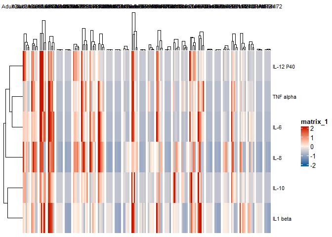
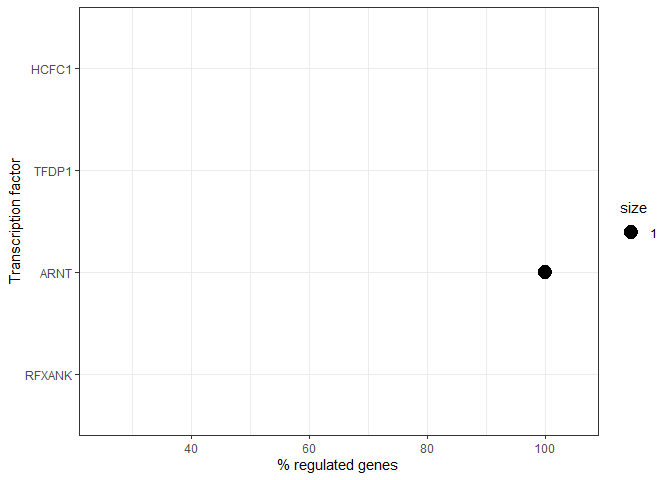

Markdown_Analysis_trained_immunity
================
Michael Eigenschink, MD
2024-08-17


# Analysis of clinical data

## Import data and data wrangling

``` r
#import data
metadata_prems <- rio::import(here::here("data", "PB_patient_metadata.xlsx"))
cytokine_prems <- rio::import(here::here("data", "cyto_pb_corr.csv"))

#wrangling metadata
metadata_prems <- metadata_prems %>% dplyr::select(pb_id, gender, GW, BW, IUGR, Gebmodus, Apg5, Apg10, CSI, EOS, cLOS, BPD, NEC, ROP, PDA, culture_pos_EOS, culture_pos_LOS, Brain_dmg)

#wrangling cytokine_data
cytokine_prems <- cytokine_prems %>% drop_na()
cytokine_prems = data.frame(sapply(cytokine_prems, function(x) gsub(",", ".", x)))
cytokine_prems <- cytokine_prems %>% mutate_at(c(3:17), as.numeric)
cytokine_prems <- cytokine_prems %>% mutate_at(c(1,2), as.factor)
cytokine_prems <- cytokine_prems %>% mutate(pb_id = gsub("P", "PB", Patient))
cytokine_prems <- cytokine_prems %>% dplyr::select(-Patient)
cytokine_prems <- cytokine_prems %>% left_join(metadata_prems, by = "pb_id")
cytokine_prems <- cytokine_prems %>% drop_na()
cytokine_prems <- cytokine_prems %>% filter(IUGR == 0 & Apg5 >7 & Apg10 >7 & NEC == 0 & Gebmodus == "Sectio" & culture_pos_LOS == "none")
cytokine_prems <- cytokine_prems %>% mutate_at(c(17:18, 21:22, 25:34), as.factor)
cytokine_prems <- cytokine_prems %>% pivot_longer(cols = 2:16, values_to = "expression", names_to = "cytokine_stim")
cytokine_prems <- cytokine_prems %>% mutate(cytokine = case_when(cytokine_stim == "CA_IL1" ~ "IL-1beta", 
                                                                 cytokine_stim == "CA_IL6" ~ "IL-6", 
                                                                 cytokine_stim == "CA_IL8" ~ "IL-8", 
                                                                 cytokine_stim == "CA_TNF" ~ "TNF-a", 
                                                                 cytokine_stim == "CA_IL12P40" ~ "IL12P40",
                                                                 cytokine_stim == "EC_IL1" ~ "IL-1beta", 
                                                                 cytokine_stim == "EC_IL6" ~ "IL-6", 
                                                                 cytokine_stim == "EC_IL8" ~ "IL-8", 
                                                                 cytokine_stim == "EC_TNF" ~ "TNF-a", 
                                                                 cytokine_stim == "EC_IL12P40" ~ "IL12P40",
                                                                 cytokine_stim == "SA_IL1" ~ "IL-1beta", 
                                                                 cytokine_stim == "SA_IL6" ~ "IL-6", 
                                                                 cytokine_stim == "SA_IL8" ~ "IL-8", 
                                                                 cytokine_stim == "SA_TNF" ~ "TNF-a", 
                                                                 cytokine_stim == "SA_IL12P40" ~ "IL12P40"))

cytokine_prems <- cytokine_prems %>% mutate(stimulation = case_when(grepl("CA", cytokine_stim) ~ "Candida", 
                                                                       grepl("SA", cytokine_stim) ~"S.aureus", 
                                                                       grepl("EC", cytokine_stim) ~"E.coli"))
cytokine_prems <- cytokine_prems %>% group_by(timepoint, CSI, cytokine, cytokine_stim) %>% mutate(mean = mean(expression), sd = sd(expression))


#Table 1
cytokine_prems_table1 <- cytokine_prems %>% group_by(pb_id) %>% slice(1L) %>% select(c(2:19))
cytokine_prems_CSI_table1 <- cytokine_prems_table1 %>% filter(CSI == "1") %>% select(pb_id) %>% ungroup()
cytokine_prems_nonCSI_table1 <- cytokine_prems_table1 %>% filter(CSI == "0") %>% select(pb_id) %>% ungroup()

metadata_prems_table <- rio::import(here::here("data", "PB_patient_metadata.xlsx"))

#CSI_data
cytokine_prems_CSI_table1 <- cytokine_prems_CSI_table1 %>% left_join(metadata_prems_table, by = "pb_id") %>% select(c(1, 7, 9:13, 15:20, 27:35, 42))
cytokine_prems_CSI_table1<- cytokine_prems_CSI_table1 %>% mutate_at(c(1,2,7,11,16:23), as.factor)
cytokine_prems_CSI_table1<- cytokine_prems_CSI_table1 %>% mutate_at(c(3:10, 12:15), as.numeric)

#non_CSI_data
cytokine_prems_nonCSI_table1 <- cytokine_prems_nonCSI_table1 %>% left_join(metadata_prems_table, by = "pb_id") %>% select(c(1, 7, 9:13, 15:20, 27:35, 42))
cytokine_prems_nonCSI_table1<- cytokine_prems_nonCSI_table1 %>% mutate_at(c(1,2,7,11,16:23), as.factor)
cytokine_prems_nonCSI_table1<- cytokine_prems_nonCSI_table1 %>% mutate_at(c(3:10, 12:15), as.numeric)

summary(cytokine_prems_CSI_table1)
```

    ##   pb_id   gender       GW              BW              BL             HC      
    ##  PB06:1   m:2    Min.   :24.00   Min.   :630.0   Min.   :30.5   Min.   :21.5  
    ##  PB09:1   w:5    1st Qu.:24.50   1st Qu.:696.5   1st Qu.:32.5   1st Qu.:22.0  
    ##  PB15:1          Median :25.00   Median :780.0   Median :34.0   Median :23.0  
    ##  PB17:1          Mean   :25.43   Mean   :766.1   Mean   :33.5   Mean   :23.0  
    ##  PB19:1          3rd Qu.:26.50   3rd Qu.:805.0   3rd Qu.:34.5   3rd Qu.:24.0  
    ##  PB27:1          Max.   :27.00   Max.   :950.0   Max.   :36.0   Max.   :24.5  
    ##  PB36:1                                                                       
    ##       twin             DW             DL            DHC       IUGR 
    ##  Min.   :1.000   Min.   :2084   Min.   :40.0   Min.   :30.5   0:7  
    ##  1st Qu.:1.000   1st Qu.:2350   1st Qu.:41.0   1st Qu.:31.5        
    ##  Median :1.000   Median :2599   Median :44.5   Median :32.0        
    ##  Mean   :1.429   Mean   :2679   Mean   :43.7   Mean   :32.4        
    ##  3rd Qu.:2.000   3rd Qu.:3040   3rd Qu.:45.0   3rd Qu.:33.0        
    ##  Max.   :2.000   Max.   :3340   Max.   :48.0   Max.   :35.0        
    ##                  NA's   :1      NA's   :2      NA's   :2           
    ##        G               P              Apg5           Apg10       CSI   EOS  
    ##  Min.   :1.000   Min.   :1.000   Min.   :8.000   Min.   :8.000   1:7   0:7  
    ##  1st Qu.:1.500   1st Qu.:1.000   1st Qu.:9.000   1st Qu.:9.000              
    ##  Median :2.000   Median :1.000   Median :9.000   Median :9.000              
    ##  Mean   :1.857   Mean   :1.429   Mean   :8.857   Mean   :8.857              
    ##  3rd Qu.:2.000   3rd Qu.:1.500   3rd Qu.:9.000   3rd Qu.:9.000              
    ##  Max.   :3.000   Max.   :3.000   Max.   :9.000   Max.   :9.000              
    ##                                                                             
    ##  cLOS  BPD   NEC   ROP   PDA   Brain_dmg
    ##  0:7   0:6   0:7   0:3   0:3   0:6      
    ##        1:1         1:4   1:4   1:1      
    ##                                         
    ##                                         
    ##                                         
    ##                                         
    ## 

``` r
pb_id_vector_CSI <- cytokine_prems_CSI_table1 %>% dplyr::select(pb_id)
pb_id_vector_CSI$type <- c("CSI")

IQR(cytokine_prems_CSI_table1$GW)
```

    ## [1] 2

``` r
IQR(cytokine_prems_CSI_table1$BW)
```

    ## [1] 108.5

``` r
IQR(cytokine_prems_CSI_table1$BL)
```

    ## [1] 2

``` r
IQR(cytokine_prems_CSI_table1$HC)
```

    ## [1] 2

``` r
IQR(cytokine_prems_CSI_table1$DW, na.rm=TRUE)
```

    ## [1] 691

``` r
IQR(cytokine_prems_CSI_table1$DL, na.rm=TRUE)
```

    ## [1] 4

``` r
IQR(cytokine_prems_CSI_table1$DHC,na.rm=TRUE)
```

    ## [1] 1.5

``` r
summary(cytokine_prems_nonCSI_table1)
```

    ##      pb_id   gender       GW              BW              BL       
    ##  PB02   :1   m:4    Min.   :23.00   Min.   :500.0   Min.   :28.00  
    ##  PB05   :1   w:5    1st Qu.:25.00   1st Qu.:680.0   1st Qu.:31.50  
    ##  PB11   :1          Median :26.00   Median :770.0   Median :33.50  
    ##  PB12   :1          Mean   :25.44   Mean   :756.7   Mean   :32.61  
    ##  PB20   :1          3rd Qu.:26.00   3rd Qu.:850.0   3rd Qu.:34.00  
    ##  PB22   :1          Max.   :27.00   Max.   :960.0   Max.   :36.00  
    ##  (Other):3                                                         
    ##        HC             twin             DW             DL             DHC       
    ##  Min.   :20.00   Min.   :1.000   Min.   :2087   Min.   :43.00   Min.   :30.50  
    ##  1st Qu.:23.00   1st Qu.:1.000   1st Qu.:2534   1st Qu.:44.00   1st Qu.:31.50  
    ##  Median :23.50   Median :1.000   Median :2645   Median :46.00   Median :32.00  
    ##  Mean   :23.22   Mean   :1.222   Mean   :2770   Mean   :46.78   Mean   :32.84  
    ##  3rd Qu.:24.00   3rd Qu.:1.000   3rd Qu.:3034   3rd Qu.:49.00   3rd Qu.:33.80  
    ##  Max.   :25.00   Max.   :2.000   Max.   :3652   Max.   :51.00   Max.   :37.00  
    ##                                                                                
    ##  IUGR        G               P              Apg5           Apg10       CSI  
    ##  0:9   Min.   :1.000   Min.   :1.000   Min.   :8.000   Min.   :8.000   0:9  
    ##        1st Qu.:1.000   1st Qu.:1.000   1st Qu.:8.000   1st Qu.:9.000        
    ##        Median :2.000   Median :1.000   Median :9.000   Median :9.000        
    ##        Mean   :2.111   Mean   :1.333   Mean   :8.667   Mean   :8.889        
    ##        3rd Qu.:2.000   3rd Qu.:2.000   3rd Qu.:9.000   3rd Qu.:9.000        
    ##        Max.   :5.000   Max.   :2.000   Max.   :9.000   Max.   :9.000        
    ##                                                                             
    ##  EOS   cLOS  BPD   NEC   ROP   PDA   Brain_dmg
    ##  0:9   0:4   0:7   0:9   0:5   0:6   0:7      
    ##        1:5   1:2         1:4   1:3   1:2      
    ##                                               
    ##                                               
    ##                                               
    ##                                               
    ## 

``` r
IQR(cytokine_prems_nonCSI_table1$GW)
```

    ## [1] 1

``` r
IQR(cytokine_prems_nonCSI_table1$BW)
```

    ## [1] 170

``` r
IQR(cytokine_prems_nonCSI_table1$BL)
```

    ## [1] 2.5

``` r
IQR(cytokine_prems_nonCSI_table1$HC)
```

    ## [1] 1

``` r
IQR(cytokine_prems_nonCSI_table1$DW, na.rm=TRUE)
```

    ## [1] 500

``` r
IQR(cytokine_prems_nonCSI_table1$DL, na.rm=TRUE)
```

    ## [1] 5

``` r
IQR(cytokine_prems_nonCSI_table1$DHC,na.rm=TRUE)
```

    ## [1] 2.3

``` r
pb_id_vector_non_CSI <- cytokine_prems_nonCSI_table1 %>% dplyr::select(pb_id)
pb_id_vector_non_CSI$type <- c("non_CSI")

vector_CSI_peak_later <- rbind(pb_id_vector_CSI, pb_id_vector_non_CSI)
```

## Figure 1B & 1C: Comparison of cytokine responses between CSI and non-CSI ELBW-infants

``` r
#plot data
cytokine_prems_CSI <- cytokine_prems %>% mutate(timepoint = factor(timepoint, levels = c("d3", "d7", "d28", "w32", "term"))) %>% 
  #filter(timepoint != "term") %>% 
  filter(cytokine == "IL-1beta" | cytokine == "IL-6" | cytokine == "TNF-a") %>% 
  ggplot(aes(x=timepoint, y=log(expression))) + 
  geom_point(aes(color = interaction(CSI, cytokine))) + 
  geom_point(aes(x= timepoint, y = log(mean))) + 
  geom_line(aes(x= timepoint, y = log(mean), group = interaction(CSI, cytokine), col = interaction(CSI, cytokine))) + 
  ylim(c(-1,12)) + theme_bw() + 
  scale_color_manual(values=c("#C8AD8B", "#C24A47", "#C8AD8B", "#C24A47", "#C8AD8B", "#C24A47", "#C8AD8B", "#C24A47", "#C8AD8B", "#C24A47")) +
  facet_wrap(~stimulation + cytokine, scales = "fixed")

print(cytokine_prems_CSI)
```

<!-- -->

``` r
#save as SVG
graph2svg(cytokine_prems_CSI, file = here::here("plots", "cytokine_prems_CSI"), width = 6.3, height = 4.2) 
```

    ## Exported graph as C:/Users/Michi/Documents/Trained_Immunity_GIT/Trained_immunity_GIT/plots/cytokine_prems_CSI.svg

``` r
#plot data
cytokine_prems_CSI_boxplot <- cytokine_prems %>% mutate(timepoint = factor(timepoint, levels = c("d3", "d7", "d28", "w32", "term"))) %>% 
  mutate(cytokine = factor(cytokine, levels = c("TNF-a", "IL-1beta", "IL-6", "IL-8", "IL12P40"))) %>% 
  filter(cytokine == "IL-1beta" | cytokine == "IL-6" | cytokine == "TNF-a") %>% 
  filter(timepoint == "term") %>%
  ggplot(aes(x=cytokine, y=log(expression), fill = CSI)) + 
  geom_boxplot() + 
  geom_point(aes(x = cytokine, y = log(expression), group = interaction(CSI, cytokine), color = (CSI), alpha = 0.7)) +
  ylim(c(-1,12))+ theme_bw() + 
  scale_color_manual(values=c("#C8AD8B", "#C24A47")) + 
  scale_fill_manual(values=c("#C8AD8B", "#C24A47")) +
  facet_wrap(~ stimulation, scales = "free")

print(cytokine_prems_CSI_boxplot)
```

<!-- -->

``` r
#save as SVG
graph2svg(cytokine_prems_CSI_boxplot, file = here::here("plots", "cytokine_prems_CSI_boxplot"), width = 5.1, height = 1.8) 
```

    ## Exported graph as C:/Users/Michi/Documents/Trained_Immunity_GIT/Trained_immunity_GIT/plots/cytokine_prems_CSI_boxplot.svg

``` r
#supplementary figure
#plot data
cytokine_prems_CSI_suppl <- cytokine_prems %>% mutate(timepoint = factor(timepoint, levels = c("d3", "d7", "d28", "w32", "term"))) %>% 
  #filter(timepoint != "term") %>% 
  filter(cytokine == "IL12P40" | cytokine == "IL-8") %>% 
  ggplot(aes(x=timepoint, y=log(expression))) + 
  geom_point(aes(color = interaction(CSI, cytokine))) + 
  geom_point(aes(x= timepoint, y = log(mean))) + 
  geom_line(aes(x= timepoint, y = log(mean), group = interaction(CSI, cytokine), col = interaction(CSI, cytokine))) + 
  ylim(c(-1,12)) + theme_bw() + 
  scale_color_manual(values=c("#C8AD8B", "#C24A47", "#C8AD8B", "#C24A47", "#C8AD8B", "#C24A47", "#C8AD8B", "#C24A47", "#C8AD8B", "#C24A47")) +
  facet_wrap(~stimulation + cytokine, scales = "fixed")

print(cytokine_prems_CSI_suppl)
```

<!-- -->

``` r
graph2svg(cytokine_prems_CSI_suppl, file = here::here("plots", "cytokine_prems_CSI_suppl"), width = 6.5, height = 3.5) 
```

    ## Exported graph as C:/Users/Michi/Documents/Trained_Immunity_GIT/Trained_immunity_GIT/plots/cytokine_prems_CSI_suppl.svg

``` r
#supplementary figure
#plot data
cytokine_prems_CSI_boxplot_supl <- cytokine_prems %>% mutate(timepoint = factor(timepoint, levels = c("d3", "d7", "d28", "w32", "term"))) %>% 
  mutate(cytokine = factor(cytokine, levels = c("TNF-a", "IL-1beta", "IL-6", "IL-8", "IL12P40"))) %>% 
  filter(cytokine == "IL12P40" | cytokine == "IL-8") %>% 
  filter(timepoint == "term") %>%
  ggplot(aes(x=cytokine, y=log(expression), fill = CSI)) + 
  geom_boxplot() + 
  geom_point(aes(x = cytokine, y = log(expression), group = interaction(CSI, cytokine), color = (CSI), alpha = 0.7)) +
  ylim(c(-1,12))+ theme_bw() + 
  scale_color_manual(values=c("#C8AD8B", "#C24A47")) + 
  scale_fill_manual(values=c("#C8AD8B", "#C24A47")) +
  facet_wrap(~ stimulation, scales = "free")

print(cytokine_prems_CSI_boxplot_supl)
```

<!-- -->

``` r
#save as SVG
graph2svg(cytokine_prems_CSI_boxplot_supl, file = here::here("plots","cytokine_prems_CSI_boxplot_supl"), width = 5.1, height = 1.8) 
```

    ## Exported graph as C:/Users/Michi/Documents/Trained_Immunity_GIT/Trained_immunity_GIT/plots/cytokine_prems_CSI_boxplot_supl.svg

### Statistics: Figure 1B

``` r
#run mixed effects model for longitudinal data
cytokine_prems_mixed <- cytokine_prems %>% mutate(time = case_when(timepoint == "term" ~ "37", 
                                                timepoint == "d3" ~ "0.42", 
                                                timepoint == "d7" ~ "1", 
                                                timepoint == "d28" ~ "4", 
                                                timepoint == "w32" ~ "32"))
cytokine_prems_mixed$time <- as.numeric(cytokine_prems_mixed$time)
cytokine_prems_mixed <- cytokine_prems_mixed %>% mutate(time_days = case_when(timepoint == "term" ~ (37*7),
                                                                              timepoint == "d3" ~ (GW*7+3),
                                                                              timepoint == "d7" ~ (GW*7+7),
                                                                              timepoint == "d28" ~ (GW*7+28),
                                                                              timepoint == "w32" ~ (32*7)))


cytokine_prems_mixed <- cytokine_prems_mixed %>% mutate(CSI = case_when(CSI == "1" ~ "suspected_infection",
                                                                        CSI == "0" ~ "healthy"))
cytokine_prems_mixed$CSI <- as.factor(cytokine_prems_mixed$CSI)

cytokine_prems_mixed <- cytokine_prems_mixed %>% mutate(log_expression = log10(expression))
cytokine_prems_term <- cytokine_prems_mixed %>% dplyr::filter(timepoint == "term")
cytokine_prems_mixed <- cytokine_prems_mixed %>% dplyr::filter(timepoint != "term")

data_TNF_ecoli <- cytokine_prems_mixed %>% filter(cytokine_stim == "EC_TNF")
data_IL6_ecoli <- cytokine_prems_mixed %>% filter(cytokine_stim == "EC_IL6")
data_IL1_ecoli <- cytokine_prems_mixed %>% filter(cytokine_stim == "EC_IL1")

data_TNF_staph <- cytokine_prems_mixed %>% filter(cytokine_stim == "SA_TNF")
data_IL6_staph <- cytokine_prems_mixed %>% filter(cytokine_stim == "SA_IL6")
data_IL1_staph <- cytokine_prems_mixed %>% filter(cytokine_stim == "SA_IL1")

data_TNF_cand <- cytokine_prems_mixed %>% filter(cytokine_stim == "CA_TNF")
data_IL6_cand <- cytokine_prems_mixed %>% filter(cytokine_stim == "CA_IL6")
data_IL1_cand <- cytokine_prems_mixed %>% filter(cytokine_stim == "CA_IL1")

list_data_cytokines <- list("TNF_ec" = data_TNF_ecoli, "IL6_ec" = data_IL6_ecoli, "IL1_ec" = data_IL1_ecoli,
                        "TNF_sa" = data_TNF_staph, "IL6_sa" = data_IL6_staph, "IL1_sa" = data_IL1_staph,
                        "TNF_can" = data_TNF_cand, "IL6_can" = data_IL6_cand, "IL1_can" = data_IL1_cand)

list_lmer_results <- list()
for (i in 1:9) {
mod <- lmerTest::lmer(log_expression ~ timepoint*CSI + (1|pb_id), data=list_data_cytokines[[i]])
list_lmer_results[[i]] <- mod
}
```

    ## boundary (singular) fit: see help('isSingular')
    ## boundary (singular) fit: see help('isSingular')

``` r
for (i in 1:9) {
print(summary(list_lmer_results[[i]]))
}
```

    ## Linear mixed model fit by REML. t-tests use Satterthwaite's method [
    ## lmerModLmerTest]
    ## Formula: log_expression ~ timepoint * CSI + (1 | pb_id)
    ##    Data: list_data_cytokines[[i]]
    ## 
    ## REML criterion at convergence: 86.6
    ## 
    ## Scaled residuals: 
    ##      Min       1Q   Median       3Q      Max 
    ## -2.74297 -0.34851  0.06174  0.45654  1.78281 
    ## 
    ## Random effects:
    ##  Groups   Name        Variance Std.Dev.
    ##  pb_id    (Intercept) 0.05596  0.2366  
    ##  Residual             0.31011  0.5569  
    ## Number of obs: 48, groups:  pb_id, 16
    ## 
    ## Fixed effects:
    ##                                     Estimate Std. Error       df t value
    ## (Intercept)                          3.01729    0.21345 38.47329  14.136
    ## timepointd3                          0.14862    0.30641 29.76649   0.485
    ## timepointd7                         -0.05391    0.30345 27.26815  -0.178
    ## timepointw32                        -0.11421    0.29203 28.42221  -0.391
    ## CSIsuspected_infection               0.25795    0.34345 39.04754   0.751
    ## timepointd3:CSIsuspected_infection  -0.55985    0.46034 29.89725  -1.216
    ## timepointd7:CSIsuspected_infection  -0.03298    0.45499 26.77305  -0.072
    ## timepointw32:CSIsuspected_infection  0.19993    0.48033 29.41152   0.416
    ##                                     Pr(>|t|)    
    ## (Intercept)                           <2e-16 ***
    ## timepointd3                            0.631    
    ## timepointd7                            0.860    
    ## timepointw32                           0.699    
    ## CSIsuspected_infection                 0.457    
    ## timepointd3:CSIsuspected_infection     0.233    
    ## timepointd7:CSIsuspected_infection     0.943    
    ## timepointw32:CSIsuspected_infection    0.680    
    ## ---
    ## Signif. codes:  0 '***' 0.001 '**' 0.01 '*' 0.05 '.' 0.1 ' ' 1
    ## 
    ## Correlation of Fixed Effects:
    ##             (Intr) tmpnt3 tmpnt7 tmpn32 CSIss_ t3:CSI t7:CSI
    ## timepointd3 -0.607                                          
    ## timepointd7 -0.598  0.420                                   
    ## timepontw32 -0.634  0.449  0.431                            
    ## CSIsspctd_n -0.621  0.377  0.372  0.394                     
    ## tmpnt3:CSI_  0.404 -0.666 -0.279 -0.299 -0.661              
    ## tmpnt7:CSI_  0.399 -0.280 -0.667 -0.288 -0.653  0.490       
    ## tmpn32:CSI_  0.386 -0.273 -0.262 -0.608 -0.628  0.478  0.468
    ## Linear mixed model fit by REML. t-tests use Satterthwaite's method [
    ## lmerModLmerTest]
    ## Formula: log_expression ~ timepoint * CSI + (1 | pb_id)
    ##    Data: list_data_cytokines[[i]]
    ## 
    ## REML criterion at convergence: 81.8
    ## 
    ## Scaled residuals: 
    ##     Min      1Q  Median      3Q     Max 
    ## -3.2825 -0.4639  0.1309  0.7852  1.4280 
    ## 
    ## Random effects:
    ##  Groups   Name        Variance Std.Dev.
    ##  pb_id    (Intercept) 0.0000   0.0000  
    ##  Residual             0.3178   0.5637  
    ## Number of obs: 48, groups:  pb_id, 16
    ## 
    ## Fixed effects:
    ##                                     Estimate Std. Error       df t value
    ## (Intercept)                          4.06290    0.19930 40.00000  20.385
    ## timepointd3                          0.07273    0.30444 40.00000   0.239
    ## timepointd7                          0.03732    0.30444 40.00000   0.123
    ## timepointw32                        -0.71873    0.29175 40.00000  -2.464
    ## CSIsuspected_infection              -0.10261    0.32137 40.00000  -0.319
    ## timepointd3:CSIsuspected_infection  -0.62873    0.45739 40.00000  -1.375
    ## timepointd7:CSIsuspected_infection  -0.28672    0.45739 40.00000  -0.627
    ## timepointw32:CSIsuspected_infection  0.51290    0.47762 40.00000   1.074
    ##                                     Pr(>|t|)    
    ## (Intercept)                           <2e-16 ***
    ## timepointd3                           0.8124    
    ## timepointd7                           0.9030    
    ## timepointw32                          0.0182 *  
    ## CSIsuspected_infection                0.7512    
    ## timepointd3:CSIsuspected_infection    0.1769    
    ## timepointd7:CSIsuspected_infection    0.5343    
    ## timepointw32:CSIsuspected_infection   0.2893    
    ## ---
    ## Signif. codes:  0 '***' 0.001 '**' 0.01 '*' 0.05 '.' 0.1 ' ' 1
    ## 
    ## Correlation of Fixed Effects:
    ##             (Intr) tmpnt3 tmpnt7 tmpn32 CSIss_ t3:CSI t7:CSI
    ## timepointd3 -0.655                                          
    ## timepointd7 -0.655  0.429                                   
    ## timepontw32 -0.683  0.447  0.447                            
    ## CSIsspctd_n -0.620  0.406  0.406  0.424                     
    ## tmpnt3:CSI_  0.436 -0.666 -0.285 -0.298 -0.703              
    ## tmpnt7:CSI_  0.436 -0.285 -0.666 -0.298 -0.703  0.494       
    ## tmpn32:CSI_  0.417 -0.273 -0.273 -0.611 -0.673  0.473  0.473
    ## optimizer (nloptwrap) convergence code: 0 (OK)
    ## boundary (singular) fit: see help('isSingular')
    ## 
    ## Linear mixed model fit by REML. t-tests use Satterthwaite's method [
    ## lmerModLmerTest]
    ## Formula: log_expression ~ timepoint * CSI + (1 | pb_id)
    ##    Data: list_data_cytokines[[i]]
    ## 
    ## REML criterion at convergence: 87.3
    ## 
    ## Scaled residuals: 
    ##     Min      1Q  Median      3Q     Max 
    ## -2.3750 -0.4477  0.1188  0.4723  1.9602 
    ## 
    ## Random effects:
    ##  Groups   Name        Variance Std.Dev.
    ##  pb_id    (Intercept) 0.1151   0.3392  
    ##  Residual             0.2792   0.5284  
    ## Number of obs: 48, groups:  pb_id, 16
    ## 
    ## Fixed effects:
    ##                                      Estimate Std. Error        df t value
    ## (Intercept)                          2.774864   0.220417 34.461765  12.589
    ## timepointd3                          0.056023   0.294520 27.872484   0.190
    ## timepointd7                         -0.068846   0.289589 25.714565  -0.238
    ## timepointw32                        -0.040346   0.279659 26.790097  -0.144
    ## CSIsuspected_infection               0.145066   0.353034 36.142850   0.411
    ## timepointd3:CSIsuspected_infection  -0.459514   0.442792 28.217332  -1.038
    ## timepointd7:CSIsuspected_infection   0.006719   0.433592 25.293018   0.015
    ## timepointw32:CSIsuspected_infection  0.214801   0.461101 27.413724   0.466
    ##                                     Pr(>|t|)    
    ## (Intercept)                          1.9e-14 ***
    ## timepointd3                            0.851    
    ## timepointd7                            0.814    
    ## timepointw32                           0.886    
    ## CSIsuspected_infection                 0.684    
    ## timepointd3:CSIsuspected_infection     0.308    
    ## timepointd7:CSIsuspected_infection     0.988    
    ## timepointw32:CSIsuspected_infection    0.645    
    ## ---
    ## Signif. codes:  0 '***' 0.001 '**' 0.01 '*' 0.05 '.' 0.1 ' ' 1
    ## 
    ## Correlation of Fixed Effects:
    ##             (Intr) tmpnt3 tmpnt7 tmpn32 CSIss_ t3:CSI t7:CSI
    ## timepointd3 -0.560                                          
    ## timepointd7 -0.547  0.414                                   
    ## timepontw32 -0.586  0.452  0.420                            
    ## CSIsspctd_n -0.624  0.350  0.341  0.366                     
    ## tmpnt3:CSI_  0.372 -0.665 -0.275 -0.300 -0.619              
    ## tmpnt7:CSI_  0.365 -0.276 -0.668 -0.281 -0.604  0.486       
    ## tmpn32:CSI_  0.355 -0.274 -0.255 -0.607 -0.583  0.481  0.464
    ## Linear mixed model fit by REML. t-tests use Satterthwaite's method [
    ## lmerModLmerTest]
    ## Formula: log_expression ~ timepoint * CSI + (1 | pb_id)
    ##    Data: list_data_cytokines[[i]]
    ## 
    ## REML criterion at convergence: 72.4
    ## 
    ## Scaled residuals: 
    ##     Min      1Q  Median      3Q     Max 
    ## -3.8316 -0.3477  0.1490  0.5615  1.5582 
    ## 
    ## Random effects:
    ##  Groups   Name        Variance Std.Dev.
    ##  pb_id    (Intercept) 0.01931  0.1389  
    ##  Residual             0.23327  0.4830  
    ## Number of obs: 48, groups:  pb_id, 16
    ## 
    ## Fixed effects:
    ##                                     Estimate Std. Error       df t value
    ## (Intercept)                          3.18174    0.17758 39.58129  17.917
    ## timepointd3                          0.17649    0.26347 29.97977   0.670
    ## timepointd7                          0.27217    0.26212 27.23518   1.038
    ## timepointw32                        -0.22357    0.25174 28.42522  -0.888
    ## CSIsuspected_infection               0.13831    0.28617 39.75475   0.483
    ## timepointd3:CSIsuspected_infection  -0.08876    0.39578 29.97725  -0.224
    ## timepointd7:CSIsuspected_infection  -0.15066    0.39340 26.69071  -0.383
    ## timepointw32:CSIsuspected_infection  0.12771    0.41323 29.73874   0.309
    ##                                     Pr(>|t|)    
    ## (Intercept)                           <2e-16 ***
    ## timepointd3                            0.508    
    ## timepointd7                            0.308    
    ## timepointw32                           0.382    
    ## CSIsuspected_infection                 0.632    
    ## timepointd3:CSIsuspected_infection     0.824    
    ## timepointd7:CSIsuspected_infection     0.705    
    ## timepointw32:CSIsuspected_infection    0.759    
    ## ---
    ## Signif. codes:  0 '***' 0.001 '**' 0.01 '*' 0.05 '.' 0.1 ' ' 1
    ## 
    ## Correlation of Fixed Effects:
    ##             (Intr) tmpnt3 tmpnt7 tmpn32 CSIss_ t3:CSI t7:CSI
    ## timepointd3 -0.631                                          
    ## timepointd7 -0.626  0.424                                   
    ## timepontw32 -0.659  0.448  0.439                            
    ## CSIsspctd_n -0.621  0.391  0.389  0.409                     
    ## tmpnt3:CSI_  0.420 -0.666 -0.282 -0.298 -0.682              
    ## tmpnt7:CSI_  0.417 -0.282 -0.666 -0.292 -0.678  0.492       
    ## tmpn32:CSI_  0.401 -0.273 -0.267 -0.609 -0.650  0.475  0.470
    ## Linear mixed model fit by REML. t-tests use Satterthwaite's method [
    ## lmerModLmerTest]
    ## Formula: log_expression ~ timepoint * CSI + (1 | pb_id)
    ##    Data: list_data_cytokines[[i]]
    ## 
    ## REML criterion at convergence: 92.7
    ## 
    ## Scaled residuals: 
    ##     Min      1Q  Median      3Q     Max 
    ## -3.7756 -0.3576  0.1523  0.4973  1.8900 
    ## 
    ## Random effects:
    ##  Groups   Name        Variance Std.Dev.
    ##  pb_id    (Intercept) 0.0000   0.0000  
    ##  Residual             0.4164   0.6453  
    ## Number of obs: 48, groups:  pb_id, 16
    ## 
    ## Fixed effects:
    ##                                     Estimate Std. Error       df t value
    ## (Intercept)                          3.36064    0.22814 40.00000  14.731
    ## timepointd3                          0.63326    0.34848 40.00000   1.817
    ## timepointd7                          0.59811    0.34848 40.00000   1.716
    ## timepointw32                        -0.06431    0.33396 40.00000  -0.193
    ## CSIsuspected_infection               0.24881    0.36786 40.00000   0.676
    ## timepointd3:CSIsuspected_infection  -0.94637    0.52355 40.00000  -1.808
    ## timepointd7:CSIsuspected_infection  -0.77277    0.52355 40.00000  -1.476
    ## timepointw32:CSIsuspected_infection  0.07246    0.54671 40.00000   0.133
    ##                                     Pr(>|t|)    
    ## (Intercept)                           <2e-16 ***
    ## timepointd3                           0.0767 .  
    ## timepointd7                           0.0938 .  
    ## timepointw32                          0.8483    
    ## CSIsuspected_infection                0.5027    
    ## timepointd3:CSIsuspected_infection    0.0782 .  
    ## timepointd7:CSIsuspected_infection    0.1478    
    ## timepointw32:CSIsuspected_infection   0.8952    
    ## ---
    ## Signif. codes:  0 '***' 0.001 '**' 0.01 '*' 0.05 '.' 0.1 ' ' 1
    ## 
    ## Correlation of Fixed Effects:
    ##             (Intr) tmpnt3 tmpnt7 tmpn32 CSIss_ t3:CSI t7:CSI
    ## timepointd3 -0.655                                          
    ## timepointd7 -0.655  0.429                                   
    ## timepontw32 -0.683  0.447  0.447                            
    ## CSIsspctd_n -0.620  0.406  0.406  0.424                     
    ## tmpnt3:CSI_  0.436 -0.666 -0.285 -0.298 -0.703              
    ## tmpnt7:CSI_  0.436 -0.285 -0.666 -0.298 -0.703  0.494       
    ## tmpn32:CSI_  0.417 -0.273 -0.273 -0.611 -0.673  0.473  0.473
    ## optimizer (nloptwrap) convergence code: 0 (OK)
    ## boundary (singular) fit: see help('isSingular')
    ## 
    ## Linear mixed model fit by REML. t-tests use Satterthwaite's method [
    ## lmerModLmerTest]
    ## Formula: log_expression ~ timepoint * CSI + (1 | pb_id)
    ##    Data: list_data_cytokines[[i]]
    ## 
    ## REML criterion at convergence: 75.7
    ## 
    ## Scaled residuals: 
    ##     Min      1Q  Median      3Q     Max 
    ## -3.6652 -0.3576  0.0792  0.5242  1.3515 
    ## 
    ## Random effects:
    ##  Groups   Name        Variance Std.Dev.
    ##  pb_id    (Intercept) 0.0135   0.1162  
    ##  Residual             0.2594   0.5093  
    ## Number of obs: 48, groups:  pb_id, 16
    ## 
    ## Fixed effects:
    ##                                     Estimate Std. Error      df t value
    ## (Intercept)                           3.0797     0.1847 39.8829  16.678
    ## timepointd3                           0.3287     0.2769 32.9581   1.187
    ## timepointd7                           0.2506     0.2760 30.7055   0.908
    ## timepointw32                         -0.2009     0.2648 31.6710  -0.759
    ## CSIsuspected_infection                0.1205     0.2977 39.9330   0.405
    ## timepointd3:CSIsuspected_infection   -0.2636     0.4160 32.9166  -0.634
    ## timepointd7:CSIsuspected_infection   -0.1385     0.4143 30.2433  -0.334
    ## timepointw32:CSIsuspected_infection   0.1048     0.4344 32.8162   0.241
    ##                                     Pr(>|t|)    
    ## (Intercept)                           <2e-16 ***
    ## timepointd3                            0.244    
    ## timepointd7                            0.371    
    ## timepointw32                           0.454    
    ## CSIsuspected_infection                 0.688    
    ## timepointd3:CSIsuspected_infection     0.531    
    ## timepointd7:CSIsuspected_infection     0.741    
    ## timepointw32:CSIsuspected_infection    0.811    
    ## ---
    ## Signif. codes:  0 '***' 0.001 '**' 0.01 '*' 0.05 '.' 0.1 ' ' 1
    ## 
    ## Correlation of Fixed Effects:
    ##             (Intr) tmpnt3 tmpnt7 tmpn32 CSIss_ t3:CSI t7:CSI
    ## timepointd3 -0.639                                          
    ## timepointd7 -0.636  0.425                                   
    ## timepontw32 -0.668  0.448  0.442                            
    ## CSIsspctd_n -0.620  0.397  0.395  0.414                     
    ## tmpnt3:CSI_  0.426 -0.666 -0.283 -0.298 -0.690              
    ## tmpnt7:CSI_  0.424 -0.283 -0.666 -0.294 -0.687  0.492       
    ## tmpn32:CSI_  0.407 -0.273 -0.269 -0.610 -0.658  0.474  0.471
    ## Linear mixed model fit by REML. t-tests use Satterthwaite's method [
    ## lmerModLmerTest]
    ## Formula: log_expression ~ timepoint * CSI + (1 | pb_id)
    ##    Data: list_data_cytokines[[i]]
    ## 
    ## REML criterion at convergence: 92.7
    ## 
    ## Scaled residuals: 
    ##      Min       1Q   Median       3Q      Max 
    ## -2.08507 -0.52443  0.06954  0.53161  1.38160 
    ## 
    ## Random effects:
    ##  Groups   Name        Variance Std.Dev.
    ##  pb_id    (Intercept) 0.1776   0.4214  
    ##  Residual             0.2965   0.5445  
    ## Number of obs: 48, groups:  pb_id, 16
    ## 
    ## Fixed effects:
    ##                                     Estimate Std. Error       df t value
    ## (Intercept)                          2.45387    0.24075 31.84529  10.193
    ## timepointd3                         -0.30729    0.30549 27.65489  -1.006
    ## timepointd7                         -0.08987    0.29927 25.80848  -0.300
    ## timepointw32                         0.04648    0.28955 26.76290   0.161
    ## CSIsuspected_infection               0.10823    0.38417 33.98315   0.282
    ## timepointd3:CSIsuspected_infection  -0.17958    0.45960 28.07731  -0.391
    ## timepointd7:CSIsuspected_infection   0.01524    0.44776 25.44782   0.034
    ## timepointw32:CSIsuspected_infection  0.21461    0.47788 27.20883   0.449
    ##                                     Pr(>|t|)    
    ## (Intercept)                          1.5e-11 ***
    ## timepointd3                            0.323    
    ## timepointd7                            0.766    
    ## timepointw32                           0.874    
    ## CSIsuspected_infection                 0.780    
    ## timepointd3:CSIsuspected_infection     0.699    
    ## timepointd7:CSIsuspected_infection     0.973    
    ## timepointw32:CSIsuspected_infection    0.657    
    ## ---
    ## Signif. codes:  0 '***' 0.001 '**' 0.01 '*' 0.05 '.' 0.1 ' ' 1
    ## 
    ## Correlation of Fixed Effects:
    ##             (Intr) tmpnt3 tmpnt7 tmpn32 CSIss_ t3:CSI t7:CSI
    ## timepointd3 -0.530                                          
    ## timepointd7 -0.514  0.411                                   
    ## timepontw32 -0.554  0.453  0.415                            
    ## CSIsspctd_n -0.627  0.332  0.322  0.347                     
    ## tmpnt3:CSI_  0.352 -0.665 -0.273 -0.301 -0.591              
    ## tmpnt7:CSI_  0.344 -0.275 -0.668 -0.277 -0.573  0.484       
    ## tmpn32:CSI_  0.336 -0.275 -0.251 -0.606 -0.554  0.483  0.462
    ## Linear mixed model fit by REML. t-tests use Satterthwaite's method [
    ## lmerModLmerTest]
    ## Formula: log_expression ~ timepoint * CSI + (1 | pb_id)
    ##    Data: list_data_cytokines[[i]]
    ## 
    ## REML criterion at convergence: 113.8
    ## 
    ## Scaled residuals: 
    ##     Min      1Q  Median      3Q     Max 
    ## -3.0873 -0.3881  0.1772  0.5525  1.7498 
    ## 
    ## Random effects:
    ##  Groups   Name        Variance Std.Dev.
    ##  pb_id    (Intercept) 0.04429  0.2104  
    ##  Residual             0.66420  0.8150  
    ## Number of obs: 48, groups:  pb_id, 16
    ## 
    ## Fixed effects:
    ##                                       Estimate Std. Error         df t value
    ## (Intercept)                          3.0903721  0.2974752 39.7417244  10.389
    ## timepointd3                         -0.2946101  0.4438273 30.7378292  -0.664
    ## timepointd7                          0.0004444  0.4419441 28.0735627   0.001
    ## timepointw32                        -0.3616870  0.4242708 29.2173429  -0.852
    ## CSIsuspected_infection              -0.3260924  0.4794719 39.8505803  -0.680
    ## timepointd3:CSIsuspected_infection  -0.0870212  0.6667093 30.7106424  -0.131
    ## timepointd7:CSIsuspected_infection   0.3201638  0.6633961 27.5406897   0.483
    ## timepointw32:CSIsuspected_infection  0.9763485  0.6961528 30.5361648   1.402
    ##                                     Pr(>|t|)    
    ## (Intercept)                         6.87e-13 ***
    ## timepointd3                            0.512    
    ## timepointd7                            0.999    
    ## timepointw32                           0.401    
    ## CSIsuspected_infection                 0.500    
    ## timepointd3:CSIsuspected_infection     0.897    
    ## timepointd7:CSIsuspected_infection     0.633    
    ## timepointw32:CSIsuspected_infection    0.171    
    ## ---
    ## Signif. codes:  0 '***' 0.001 '**' 0.01 '*' 0.05 '.' 0.1 ' ' 1
    ## 
    ## Correlation of Fixed Effects:
    ##             (Intr) tmpnt3 tmpnt7 tmpn32 CSIss_ t3:CSI t7:CSI
    ## timepointd3 -0.635                                          
    ## timepointd7 -0.632  0.425                                   
    ## timepontw32 -0.663  0.448  0.440                            
    ## CSIsspctd_n -0.620  0.394  0.392  0.412                     
    ## tmpnt3:CSI_  0.423 -0.666 -0.283 -0.298 -0.686              
    ## tmpnt7:CSI_  0.421 -0.283 -0.666 -0.293 -0.683  0.492       
    ## tmpn32:CSI_  0.404 -0.273 -0.268 -0.609 -0.655  0.475  0.470
    ## Linear mixed model fit by REML. t-tests use Satterthwaite's method [
    ## lmerModLmerTest]
    ## Formula: log_expression ~ timepoint * CSI + (1 | pb_id)
    ##    Data: list_data_cytokines[[i]]
    ## 
    ## REML criterion at convergence: 86.4
    ## 
    ## Scaled residuals: 
    ##     Min      1Q  Median      3Q     Max 
    ## -2.1636 -0.5064  0.1015  0.3557  1.8597 
    ## 
    ## Random effects:
    ##  Groups   Name        Variance Std.Dev.
    ##  pb_id    (Intercept) 0.1344   0.3667  
    ##  Residual             0.2613   0.5111  
    ## Number of obs: 48, groups:  pb_id, 16
    ## 
    ## Fixed effects:
    ##                                     Estimate Std. Error       df t value
    ## (Intercept)                          2.12823    0.22033 33.94366   9.659
    ## timepointd3                         -0.24901    0.28601 29.20985  -0.871
    ## timepointd7                          0.03238    0.28061 27.36214   0.115
    ## timepointw32                        -0.10051    0.27129 28.30745  -0.370
    ## CSIsuspected_infection              -0.08151    0.35217 35.67234  -0.231
    ## timepointd3:CSIsuspected_infection   0.17954    0.43016 29.57423   0.417
    ## timepointd7:CSIsuspected_infection   0.13648    0.41996 26.99749   0.325
    ## timepointw32:CSIsuspected_infection  0.57046    0.44756 28.78727   1.275
    ##                                     Pr(>|t|)    
    ## (Intercept)                         2.86e-11 ***
    ## timepointd3                            0.391    
    ## timepointd7                            0.909    
    ## timepointw32                           0.714    
    ## CSIsuspected_infection                 0.818    
    ## timepointd3:CSIsuspected_infection     0.679    
    ## timepointd7:CSIsuspected_infection     0.748    
    ## timepointw32:CSIsuspected_infection    0.213    
    ## ---
    ## Signif. codes:  0 '***' 0.001 '**' 0.01 '*' 0.05 '.' 0.1 ' ' 1
    ## 
    ## Correlation of Fixed Effects:
    ##             (Intr) tmpnt3 tmpnt7 tmpn32 CSIss_ t3:CSI t7:CSI
    ## timepointd3 -0.543                                          
    ## timepointd7 -0.528  0.412                                   
    ## timepontw32 -0.568  0.453  0.417                            
    ## CSIsspctd_n -0.626  0.340  0.330  0.355                     
    ## tmpnt3:CSI_  0.361 -0.665 -0.274 -0.301 -0.603              
    ## tmpnt7:CSI_  0.353 -0.275 -0.668 -0.279 -0.587  0.485       
    ## tmpn32:CSI_  0.344 -0.274 -0.253 -0.606 -0.567  0.482  0.463

``` r
tab_model(list_lmer_results[[1]],list_lmer_results[[2]], 
          list_lmer_results[[3]], list_lmer_results[[4]],
          list_lmer_results[[5]], list_lmer_results[[6]], 
          list_lmer_results[[7]], list_lmer_results[[8]],
          list_lmer_results[[9]], file = here::here("stats","table.html"))
```

<table style="border-collapse:collapse; border:none;">
<tr>
<th style="border-top: double; text-align:center; font-style:normal; font-weight:bold; padding:0.2cm;  text-align:left; ">
 
</th>
<th colspan="3" style="border-top: double; text-align:center; font-style:normal; font-weight:bold; padding:0.2cm; ">
log_expression
</th>
<th colspan="3" style="border-top: double; text-align:center; font-style:normal; font-weight:bold; padding:0.2cm; ">
log_expression
</th>
<th colspan="3" style="border-top: double; text-align:center; font-style:normal; font-weight:bold; padding:0.2cm; ">
log_expression
</th>
<th colspan="3" style="border-top: double; text-align:center; font-style:normal; font-weight:bold; padding:0.2cm; ">
log_expression
</th>
<th colspan="3" style="border-top: double; text-align:center; font-style:normal; font-weight:bold; padding:0.2cm; ">
log_expression
</th>
<th colspan="3" style="border-top: double; text-align:center; font-style:normal; font-weight:bold; padding:0.2cm; ">
log_expression
</th>
<th colspan="3" style="border-top: double; text-align:center; font-style:normal; font-weight:bold; padding:0.2cm; ">
log_expression
</th>
<th colspan="3" style="border-top: double; text-align:center; font-style:normal; font-weight:bold; padding:0.2cm; ">
log_expression
</th>
<th colspan="3" style="border-top: double; text-align:center; font-style:normal; font-weight:bold; padding:0.2cm; ">
log_expression
</th>
</tr>
<tr>
<td style=" text-align:center; border-bottom:1px solid; font-style:italic; font-weight:normal;  text-align:left; ">
Predictors
</td>
<td style=" text-align:center; border-bottom:1px solid; font-style:italic; font-weight:normal;  ">
Estimates
</td>
<td style=" text-align:center; border-bottom:1px solid; font-style:italic; font-weight:normal;  ">
CI
</td>
<td style=" text-align:center; border-bottom:1px solid; font-style:italic; font-weight:normal;  ">
p
</td>
<td style=" text-align:center; border-bottom:1px solid; font-style:italic; font-weight:normal;  ">
Estimates
</td>
<td style=" text-align:center; border-bottom:1px solid; font-style:italic; font-weight:normal;  ">
CI
</td>
<td style=" text-align:center; border-bottom:1px solid; font-style:italic; font-weight:normal;  col7">
p
</td>
<td style=" text-align:center; border-bottom:1px solid; font-style:italic; font-weight:normal;  col8">
Estimates
</td>
<td style=" text-align:center; border-bottom:1px solid; font-style:italic; font-weight:normal;  col9">
CI
</td>
<td style=" text-align:center; border-bottom:1px solid; font-style:italic; font-weight:normal;  0">
p
</td>
<td style=" text-align:center; border-bottom:1px solid; font-style:italic; font-weight:normal;  1">
Estimates
</td>
<td style=" text-align:center; border-bottom:1px solid; font-style:italic; font-weight:normal;  2">
CI
</td>
<td style=" text-align:center; border-bottom:1px solid; font-style:italic; font-weight:normal;  3">
p
</td>
<td style=" text-align:center; border-bottom:1px solid; font-style:italic; font-weight:normal;  4">
Estimates
</td>
<td style=" text-align:center; border-bottom:1px solid; font-style:italic; font-weight:normal;  5">
CI
</td>
<td style=" text-align:center; border-bottom:1px solid; font-style:italic; font-weight:normal;  6">
p
</td>
<td style=" text-align:center; border-bottom:1px solid; font-style:italic; font-weight:normal;  7">
Estimates
</td>
<td style=" text-align:center; border-bottom:1px solid; font-style:italic; font-weight:normal;  8">
CI
</td>
<td style=" text-align:center; border-bottom:1px solid; font-style:italic; font-weight:normal;  9">
p
</td>
<td style=" text-align:center; border-bottom:1px solid; font-style:italic; font-weight:normal;  0">
Estimates
</td>
<td style=" text-align:center; border-bottom:1px solid; font-style:italic; font-weight:normal;  1">
CI
</td>
<td style=" text-align:center; border-bottom:1px solid; font-style:italic; font-weight:normal;  2">
p
</td>
<td style=" text-align:center; border-bottom:1px solid; font-style:italic; font-weight:normal;  3">
Estimates
</td>
<td style=" text-align:center; border-bottom:1px solid; font-style:italic; font-weight:normal;  4">
CI
</td>
<td style=" text-align:center; border-bottom:1px solid; font-style:italic; font-weight:normal;  5">
p
</td>
<td style=" text-align:center; border-bottom:1px solid; font-style:italic; font-weight:normal;  6">
Estimates
</td>
<td style=" text-align:center; border-bottom:1px solid; font-style:italic; font-weight:normal;  7">
CI
</td>
<td style=" text-align:center; border-bottom:1px solid; font-style:italic; font-weight:normal;  8">
p
</td>
</tr>
<tr>
<td style=" padding:0.2cm; text-align:left; vertical-align:top; text-align:left; ">
(Intercept)
</td>
<td style=" padding:0.2cm; text-align:left; vertical-align:top; text-align:center;  ">
3.02
</td>
<td style=" padding:0.2cm; text-align:left; vertical-align:top; text-align:center;  ">
2.59 – 3.45
</td>
<td style=" padding:0.2cm; text-align:left; vertical-align:top; text-align:center;  ">
<strong>\<0.001</strong>
</td>
<td style=" padding:0.2cm; text-align:left; vertical-align:top; text-align:center;  ">
4.06
</td>
<td style=" padding:0.2cm; text-align:left; vertical-align:top; text-align:center;  ">
3.66 – 4.47
</td>
<td style=" padding:0.2cm; text-align:left; vertical-align:top; text-align:center;  col7">
<strong>\<0.001</strong>
</td>
<td style=" padding:0.2cm; text-align:left; vertical-align:top; text-align:center;  col8">
2.77
</td>
<td style=" padding:0.2cm; text-align:left; vertical-align:top; text-align:center;  col9">
2.33 – 3.22
</td>
<td style=" padding:0.2cm; text-align:left; vertical-align:top; text-align:center;  0">
<strong>\<0.001</strong>
</td>
<td style=" padding:0.2cm; text-align:left; vertical-align:top; text-align:center;  1">
3.18
</td>
<td style=" padding:0.2cm; text-align:left; vertical-align:top; text-align:center;  2">
2.82 – 3.54
</td>
<td style=" padding:0.2cm; text-align:left; vertical-align:top; text-align:center;  3">
<strong>\<0.001</strong>
</td>
<td style=" padding:0.2cm; text-align:left; vertical-align:top; text-align:center;  4">
3.36
</td>
<td style=" padding:0.2cm; text-align:left; vertical-align:top; text-align:center;  5">
2.90 – 3.82
</td>
<td style=" padding:0.2cm; text-align:left; vertical-align:top; text-align:center;  6">
<strong>\<0.001</strong>
</td>
<td style=" padding:0.2cm; text-align:left; vertical-align:top; text-align:center;  7">
3.08
</td>
<td style=" padding:0.2cm; text-align:left; vertical-align:top; text-align:center;  8">
2.71 – 3.45
</td>
<td style=" padding:0.2cm; text-align:left; vertical-align:top; text-align:center;  9">
<strong>\<0.001</strong>
</td>
<td style=" padding:0.2cm; text-align:left; vertical-align:top; text-align:center;  0">
2.45
</td>
<td style=" padding:0.2cm; text-align:left; vertical-align:top; text-align:center;  1">
1.97 – 2.94
</td>
<td style=" padding:0.2cm; text-align:left; vertical-align:top; text-align:center;  2">
<strong>\<0.001</strong>
</td>
<td style=" padding:0.2cm; text-align:left; vertical-align:top; text-align:center; modelcolumn8 3">
3.09
</td>
<td style=" padding:0.2cm; text-align:left; vertical-align:top; text-align:center; modelcolumn8 4">
2.49 – 3.69
</td>
<td style=" padding:0.2cm; text-align:left; vertical-align:top; text-align:center; modelcolumn8 5">
<strong>\<0.001</strong>
</td>
<td style=" padding:0.2cm; text-align:left; vertical-align:top; text-align:center; modelcolumn9 6">
2.13
</td>
<td style=" padding:0.2cm; text-align:left; vertical-align:top; text-align:center; modelcolumn9 7">
1.68 – 2.57
</td>
<td style=" padding:0.2cm; text-align:left; vertical-align:top; text-align:center; modelcolumn9 8">
<strong>\<0.001</strong>
</td>
</tr>
<tr>
<td style=" padding:0.2cm; text-align:left; vertical-align:top; text-align:left; ">
timepoint \[d3\]
</td>
<td style=" padding:0.2cm; text-align:left; vertical-align:top; text-align:center;  ">
0.15
</td>
<td style=" padding:0.2cm; text-align:left; vertical-align:top; text-align:center;  ">
-0.47 – 0.77
</td>
<td style=" padding:0.2cm; text-align:left; vertical-align:top; text-align:center;  ">
0.630
</td>
<td style=" padding:0.2cm; text-align:left; vertical-align:top; text-align:center;  ">
0.07
</td>
<td style=" padding:0.2cm; text-align:left; vertical-align:top; text-align:center;  ">
-0.54 – 0.69
</td>
<td style=" padding:0.2cm; text-align:left; vertical-align:top; text-align:center;  col7">
0.812
</td>
<td style=" padding:0.2cm; text-align:left; vertical-align:top; text-align:center;  col8">
0.06
</td>
<td style=" padding:0.2cm; text-align:left; vertical-align:top; text-align:center;  col9">
-0.54 – 0.65
</td>
<td style=" padding:0.2cm; text-align:left; vertical-align:top; text-align:center;  0">
0.850
</td>
<td style=" padding:0.2cm; text-align:left; vertical-align:top; text-align:center;  1">
0.18
</td>
<td style=" padding:0.2cm; text-align:left; vertical-align:top; text-align:center;  2">
-0.36 – 0.71
</td>
<td style=" padding:0.2cm; text-align:left; vertical-align:top; text-align:center;  3">
0.507
</td>
<td style=" padding:0.2cm; text-align:left; vertical-align:top; text-align:center;  4">
0.63
</td>
<td style=" padding:0.2cm; text-align:left; vertical-align:top; text-align:center;  5">
-0.07 – 1.34
</td>
<td style=" padding:0.2cm; text-align:left; vertical-align:top; text-align:center;  6">
0.077
</td>
<td style=" padding:0.2cm; text-align:left; vertical-align:top; text-align:center;  7">
0.33
</td>
<td style=" padding:0.2cm; text-align:left; vertical-align:top; text-align:center;  8">
-0.23 – 0.89
</td>
<td style=" padding:0.2cm; text-align:left; vertical-align:top; text-align:center;  9">
0.243
</td>
<td style=" padding:0.2cm; text-align:left; vertical-align:top; text-align:center;  0">
-0.31
</td>
<td style=" padding:0.2cm; text-align:left; vertical-align:top; text-align:center;  1">
-0.93 – 0.31
</td>
<td style=" padding:0.2cm; text-align:left; vertical-align:top; text-align:center;  2">
0.321
</td>
<td style=" padding:0.2cm; text-align:left; vertical-align:top; text-align:center; modelcolumn8 3">
-0.29
</td>
<td style=" padding:0.2cm; text-align:left; vertical-align:top; text-align:center; modelcolumn8 4">
-1.19 – 0.60
</td>
<td style=" padding:0.2cm; text-align:left; vertical-align:top; text-align:center; modelcolumn8 5">
0.511
</td>
<td style=" padding:0.2cm; text-align:left; vertical-align:top; text-align:center; modelcolumn9 6">
-0.25
</td>
<td style=" padding:0.2cm; text-align:left; vertical-align:top; text-align:center; modelcolumn9 7">
-0.83 – 0.33
</td>
<td style=" padding:0.2cm; text-align:left; vertical-align:top; text-align:center; modelcolumn9 8">
0.389
</td>
</tr>
<tr>
<td style=" padding:0.2cm; text-align:left; vertical-align:top; text-align:left; ">
timepoint \[d7\]
</td>
<td style=" padding:0.2cm; text-align:left; vertical-align:top; text-align:center;  ">
-0.05
</td>
<td style=" padding:0.2cm; text-align:left; vertical-align:top; text-align:center;  ">
-0.67 – 0.56
</td>
<td style=" padding:0.2cm; text-align:left; vertical-align:top; text-align:center;  ">
0.860
</td>
<td style=" padding:0.2cm; text-align:left; vertical-align:top; text-align:center;  ">
0.04
</td>
<td style=" padding:0.2cm; text-align:left; vertical-align:top; text-align:center;  ">
-0.58 – 0.65
</td>
<td style=" padding:0.2cm; text-align:left; vertical-align:top; text-align:center;  col7">
0.903
</td>
<td style=" padding:0.2cm; text-align:left; vertical-align:top; text-align:center;  col8">
-0.07
</td>
<td style=" padding:0.2cm; text-align:left; vertical-align:top; text-align:center;  col9">
-0.66 – 0.52
</td>
<td style=" padding:0.2cm; text-align:left; vertical-align:top; text-align:center;  0">
0.813
</td>
<td style=" padding:0.2cm; text-align:left; vertical-align:top; text-align:center;  1">
0.27
</td>
<td style=" padding:0.2cm; text-align:left; vertical-align:top; text-align:center;  2">
-0.26 – 0.80
</td>
<td style=" padding:0.2cm; text-align:left; vertical-align:top; text-align:center;  3">
0.306
</td>
<td style=" padding:0.2cm; text-align:left; vertical-align:top; text-align:center;  4">
0.60
</td>
<td style=" padding:0.2cm; text-align:left; vertical-align:top; text-align:center;  5">
-0.11 – 1.30
</td>
<td style=" padding:0.2cm; text-align:left; vertical-align:top; text-align:center;  6">
0.094
</td>
<td style=" padding:0.2cm; text-align:left; vertical-align:top; text-align:center;  7">
0.25
</td>
<td style=" padding:0.2cm; text-align:left; vertical-align:top; text-align:center;  8">
-0.31 – 0.81
</td>
<td style=" padding:0.2cm; text-align:left; vertical-align:top; text-align:center;  9">
0.370
</td>
<td style=" padding:0.2cm; text-align:left; vertical-align:top; text-align:center;  0">
-0.09
</td>
<td style=" padding:0.2cm; text-align:left; vertical-align:top; text-align:center;  1">
-0.70 – 0.52
</td>
<td style=" padding:0.2cm; text-align:left; vertical-align:top; text-align:center;  2">
0.766
</td>
<td style=" padding:0.2cm; text-align:left; vertical-align:top; text-align:center; modelcolumn8 3">
0.00
</td>
<td style=" padding:0.2cm; text-align:left; vertical-align:top; text-align:center; modelcolumn8 4">
-0.89 – 0.90
</td>
<td style=" padding:0.2cm; text-align:left; vertical-align:top; text-align:center; modelcolumn8 5">
0.999
</td>
<td style=" padding:0.2cm; text-align:left; vertical-align:top; text-align:center; modelcolumn9 6">
0.03
</td>
<td style=" padding:0.2cm; text-align:left; vertical-align:top; text-align:center; modelcolumn9 7">
-0.54 – 0.60
</td>
<td style=" padding:0.2cm; text-align:left; vertical-align:top; text-align:center; modelcolumn9 8">
0.909
</td>
</tr>
<tr>
<td style=" padding:0.2cm; text-align:left; vertical-align:top; text-align:left; ">
timepoint \[w32\]
</td>
<td style=" padding:0.2cm; text-align:left; vertical-align:top; text-align:center;  ">
-0.11
</td>
<td style=" padding:0.2cm; text-align:left; vertical-align:top; text-align:center;  ">
-0.71 – 0.48
</td>
<td style=" padding:0.2cm; text-align:left; vertical-align:top; text-align:center;  ">
0.698
</td>
<td style=" padding:0.2cm; text-align:left; vertical-align:top; text-align:center;  ">
-0.72
</td>
<td style=" padding:0.2cm; text-align:left; vertical-align:top; text-align:center;  ">
-1.31 – -0.13
</td>
<td style=" padding:0.2cm; text-align:left; vertical-align:top; text-align:center;  col7">
<strong>0.018</strong>
</td>
<td style=" padding:0.2cm; text-align:left; vertical-align:top; text-align:center;  col8">
-0.04
</td>
<td style=" padding:0.2cm; text-align:left; vertical-align:top; text-align:center;  col9">
-0.61 – 0.53
</td>
<td style=" padding:0.2cm; text-align:left; vertical-align:top; text-align:center;  0">
0.886
</td>
<td style=" padding:0.2cm; text-align:left; vertical-align:top; text-align:center;  1">
-0.22
</td>
<td style=" padding:0.2cm; text-align:left; vertical-align:top; text-align:center;  2">
-0.73 – 0.29
</td>
<td style=" padding:0.2cm; text-align:left; vertical-align:top; text-align:center;  3">
0.380
</td>
<td style=" padding:0.2cm; text-align:left; vertical-align:top; text-align:center;  4">
-0.06
</td>
<td style=" padding:0.2cm; text-align:left; vertical-align:top; text-align:center;  5">
-0.74 – 0.61
</td>
<td style=" padding:0.2cm; text-align:left; vertical-align:top; text-align:center;  6">
0.848
</td>
<td style=" padding:0.2cm; text-align:left; vertical-align:top; text-align:center;  7">
-0.20
</td>
<td style=" padding:0.2cm; text-align:left; vertical-align:top; text-align:center;  8">
-0.74 – 0.34
</td>
<td style=" padding:0.2cm; text-align:left; vertical-align:top; text-align:center;  9">
0.453
</td>
<td style=" padding:0.2cm; text-align:left; vertical-align:top; text-align:center;  0">
0.05
</td>
<td style=" padding:0.2cm; text-align:left; vertical-align:top; text-align:center;  1">
-0.54 – 0.63
</td>
<td style=" padding:0.2cm; text-align:left; vertical-align:top; text-align:center;  2">
0.873
</td>
<td style=" padding:0.2cm; text-align:left; vertical-align:top; text-align:center; modelcolumn8 3">
-0.36
</td>
<td style=" padding:0.2cm; text-align:left; vertical-align:top; text-align:center; modelcolumn8 4">
-1.22 – 0.50
</td>
<td style=" padding:0.2cm; text-align:left; vertical-align:top; text-align:center; modelcolumn8 5">
0.399
</td>
<td style=" padding:0.2cm; text-align:left; vertical-align:top; text-align:center; modelcolumn9 6">
-0.10
</td>
<td style=" padding:0.2cm; text-align:left; vertical-align:top; text-align:center; modelcolumn9 7">
-0.65 – 0.45
</td>
<td style=" padding:0.2cm; text-align:left; vertical-align:top; text-align:center; modelcolumn9 8">
0.713
</td>
</tr>
<tr>
<td style=" padding:0.2cm; text-align:left; vertical-align:top; text-align:left; ">
CSI \[suspected_infection\]
</td>
<td style=" padding:0.2cm; text-align:left; vertical-align:top; text-align:center;  ">
0.26
</td>
<td style=" padding:0.2cm; text-align:left; vertical-align:top; text-align:center;  ">
-0.44 – 0.95
</td>
<td style=" padding:0.2cm; text-align:left; vertical-align:top; text-align:center;  ">
0.457
</td>
<td style=" padding:0.2cm; text-align:left; vertical-align:top; text-align:center;  ">
-0.10
</td>
<td style=" padding:0.2cm; text-align:left; vertical-align:top; text-align:center;  ">
-0.75 – 0.55
</td>
<td style=" padding:0.2cm; text-align:left; vertical-align:top; text-align:center;  col7">
0.751
</td>
<td style=" padding:0.2cm; text-align:left; vertical-align:top; text-align:center;  col8">
0.15
</td>
<td style=" padding:0.2cm; text-align:left; vertical-align:top; text-align:center;  col9">
-0.57 – 0.86
</td>
<td style=" padding:0.2cm; text-align:left; vertical-align:top; text-align:center;  0">
0.683
</td>
<td style=" padding:0.2cm; text-align:left; vertical-align:top; text-align:center;  1">
0.14
</td>
<td style=" padding:0.2cm; text-align:left; vertical-align:top; text-align:center;  2">
-0.44 – 0.72
</td>
<td style=" padding:0.2cm; text-align:left; vertical-align:top; text-align:center;  3">
0.632
</td>
<td style=" padding:0.2cm; text-align:left; vertical-align:top; text-align:center;  4">
0.25
</td>
<td style=" padding:0.2cm; text-align:left; vertical-align:top; text-align:center;  5">
-0.50 – 0.99
</td>
<td style=" padding:0.2cm; text-align:left; vertical-align:top; text-align:center;  6">
0.503
</td>
<td style=" padding:0.2cm; text-align:left; vertical-align:top; text-align:center;  7">
0.12
</td>
<td style=" padding:0.2cm; text-align:left; vertical-align:top; text-align:center;  8">
-0.48 – 0.72
</td>
<td style=" padding:0.2cm; text-align:left; vertical-align:top; text-align:center;  9">
0.688
</td>
<td style=" padding:0.2cm; text-align:left; vertical-align:top; text-align:center;  0">
0.11
</td>
<td style=" padding:0.2cm; text-align:left; vertical-align:top; text-align:center;  1">
-0.67 – 0.89
</td>
<td style=" padding:0.2cm; text-align:left; vertical-align:top; text-align:center;  2">
0.780
</td>
<td style=" padding:0.2cm; text-align:left; vertical-align:top; text-align:center; modelcolumn8 3">
-0.33
</td>
<td style=" padding:0.2cm; text-align:left; vertical-align:top; text-align:center; modelcolumn8 4">
-1.30 – 0.64
</td>
<td style=" padding:0.2cm; text-align:left; vertical-align:top; text-align:center; modelcolumn8 5">
0.501
</td>
<td style=" padding:0.2cm; text-align:left; vertical-align:top; text-align:center; modelcolumn9 6">
-0.08
</td>
<td style=" padding:0.2cm; text-align:left; vertical-align:top; text-align:center; modelcolumn9 7">
-0.79 – 0.63
</td>
<td style=" padding:0.2cm; text-align:left; vertical-align:top; text-align:center; modelcolumn9 8">
0.818
</td>
</tr>
<tr>
<td style=" padding:0.2cm; text-align:left; vertical-align:top; text-align:left; ">
timepoint \[d3\] × CSI<br>\[suspected_infection\]
</td>
<td style=" padding:0.2cm; text-align:left; vertical-align:top; text-align:center;  ">
-0.56
</td>
<td style=" padding:0.2cm; text-align:left; vertical-align:top; text-align:center;  ">
-1.49 – 0.37
</td>
<td style=" padding:0.2cm; text-align:left; vertical-align:top; text-align:center;  ">
0.231
</td>
<td style=" padding:0.2cm; text-align:left; vertical-align:top; text-align:center;  ">
-0.63
</td>
<td style=" padding:0.2cm; text-align:left; vertical-align:top; text-align:center;  ">
-1.55 – 0.30
</td>
<td style=" padding:0.2cm; text-align:left; vertical-align:top; text-align:center;  col7">
0.177
</td>
<td style=" padding:0.2cm; text-align:left; vertical-align:top; text-align:center;  col8">
-0.46
</td>
<td style=" padding:0.2cm; text-align:left; vertical-align:top; text-align:center;  col9">
-1.36 – 0.44
</td>
<td style=" padding:0.2cm; text-align:left; vertical-align:top; text-align:center;  0">
0.306
</td>
<td style=" padding:0.2cm; text-align:left; vertical-align:top; text-align:center;  1">
-0.09
</td>
<td style=" padding:0.2cm; text-align:left; vertical-align:top; text-align:center;  2">
-0.89 – 0.71
</td>
<td style=" padding:0.2cm; text-align:left; vertical-align:top; text-align:center;  3">
0.824
</td>
<td style=" padding:0.2cm; text-align:left; vertical-align:top; text-align:center;  4">
-0.95
</td>
<td style=" padding:0.2cm; text-align:left; vertical-align:top; text-align:center;  5">
-2.01 – 0.11
</td>
<td style=" padding:0.2cm; text-align:left; vertical-align:top; text-align:center;  6">
0.079
</td>
<td style=" padding:0.2cm; text-align:left; vertical-align:top; text-align:center;  7">
-0.26
</td>
<td style=" padding:0.2cm; text-align:left; vertical-align:top; text-align:center;  8">
-1.11 – 0.58
</td>
<td style=" padding:0.2cm; text-align:left; vertical-align:top; text-align:center;  9">
0.530
</td>
<td style=" padding:0.2cm; text-align:left; vertical-align:top; text-align:center;  0">
-0.18
</td>
<td style=" padding:0.2cm; text-align:left; vertical-align:top; text-align:center;  1">
-1.11 – 0.75
</td>
<td style=" padding:0.2cm; text-align:left; vertical-align:top; text-align:center;  2">
0.698
</td>
<td style=" padding:0.2cm; text-align:left; vertical-align:top; text-align:center; modelcolumn8 3">
-0.09
</td>
<td style=" padding:0.2cm; text-align:left; vertical-align:top; text-align:center; modelcolumn8 4">
-1.44 – 1.26
</td>
<td style=" padding:0.2cm; text-align:left; vertical-align:top; text-align:center; modelcolumn8 5">
0.897
</td>
<td style=" padding:0.2cm; text-align:left; vertical-align:top; text-align:center; modelcolumn9 6">
0.18
</td>
<td style=" padding:0.2cm; text-align:left; vertical-align:top; text-align:center; modelcolumn9 7">
-0.69 – 1.05
</td>
<td style=" padding:0.2cm; text-align:left; vertical-align:top; text-align:center; modelcolumn9 8">
0.679
</td>
</tr>
<tr>
<td style=" padding:0.2cm; text-align:left; vertical-align:top; text-align:left; ">
timepoint \[d7\] × CSI<br>\[suspected_infection\]
</td>
<td style=" padding:0.2cm; text-align:left; vertical-align:top; text-align:center;  ">
-0.03
</td>
<td style=" padding:0.2cm; text-align:left; vertical-align:top; text-align:center;  ">
-0.95 – 0.89
</td>
<td style=" padding:0.2cm; text-align:left; vertical-align:top; text-align:center;  ">
0.943
</td>
<td style=" padding:0.2cm; text-align:left; vertical-align:top; text-align:center;  ">
-0.29
</td>
<td style=" padding:0.2cm; text-align:left; vertical-align:top; text-align:center;  ">
-1.21 – 0.64
</td>
<td style=" padding:0.2cm; text-align:left; vertical-align:top; text-align:center;  col7">
0.534
</td>
<td style=" padding:0.2cm; text-align:left; vertical-align:top; text-align:center;  col8">
0.01
</td>
<td style=" padding:0.2cm; text-align:left; vertical-align:top; text-align:center;  col9">
-0.87 – 0.88
</td>
<td style=" padding:0.2cm; text-align:left; vertical-align:top; text-align:center;  0">
0.988
</td>
<td style=" padding:0.2cm; text-align:left; vertical-align:top; text-align:center;  1">
-0.15
</td>
<td style=" padding:0.2cm; text-align:left; vertical-align:top; text-align:center;  2">
-0.95 – 0.65
</td>
<td style=" padding:0.2cm; text-align:left; vertical-align:top; text-align:center;  3">
0.704
</td>
<td style=" padding:0.2cm; text-align:left; vertical-align:top; text-align:center;  4">
-0.77
</td>
<td style=" padding:0.2cm; text-align:left; vertical-align:top; text-align:center;  5">
-1.83 – 0.29
</td>
<td style=" padding:0.2cm; text-align:left; vertical-align:top; text-align:center;  6">
0.148
</td>
<td style=" padding:0.2cm; text-align:left; vertical-align:top; text-align:center;  7">
-0.14
</td>
<td style=" padding:0.2cm; text-align:left; vertical-align:top; text-align:center;  8">
-0.98 – 0.70
</td>
<td style=" padding:0.2cm; text-align:left; vertical-align:top; text-align:center;  9">
0.740
</td>
<td style=" padding:0.2cm; text-align:left; vertical-align:top; text-align:center;  0">
0.02
</td>
<td style=" padding:0.2cm; text-align:left; vertical-align:top; text-align:center;  1">
-0.89 – 0.92
</td>
<td style=" padding:0.2cm; text-align:left; vertical-align:top; text-align:center;  2">
0.973
</td>
<td style=" padding:0.2cm; text-align:left; vertical-align:top; text-align:center; modelcolumn8 3">
0.32
</td>
<td style=" padding:0.2cm; text-align:left; vertical-align:top; text-align:center; modelcolumn8 4">
-1.02 – 1.66
</td>
<td style=" padding:0.2cm; text-align:left; vertical-align:top; text-align:center; modelcolumn8 5">
0.632
</td>
<td style=" padding:0.2cm; text-align:left; vertical-align:top; text-align:center; modelcolumn9 6">
0.14
</td>
<td style=" padding:0.2cm; text-align:left; vertical-align:top; text-align:center; modelcolumn9 7">
-0.71 – 0.99
</td>
<td style=" padding:0.2cm; text-align:left; vertical-align:top; text-align:center; modelcolumn9 8">
0.747
</td>
</tr>
<tr>
<td style=" padding:0.2cm; text-align:left; vertical-align:top; text-align:left; ">
timepoint \[w32\] × CSI<br>\[suspected_infection\]
</td>
<td style=" padding:0.2cm; text-align:left; vertical-align:top; text-align:center;  ">
0.20
</td>
<td style=" padding:0.2cm; text-align:left; vertical-align:top; text-align:center;  ">
-0.77 – 1.17
</td>
<td style=" padding:0.2cm; text-align:left; vertical-align:top; text-align:center;  ">
0.680
</td>
<td style=" padding:0.2cm; text-align:left; vertical-align:top; text-align:center;  ">
0.51
</td>
<td style=" padding:0.2cm; text-align:left; vertical-align:top; text-align:center;  ">
-0.45 – 1.48
</td>
<td style=" padding:0.2cm; text-align:left; vertical-align:top; text-align:center;  col7">
0.290
</td>
<td style=" padding:0.2cm; text-align:left; vertical-align:top; text-align:center;  col8">
0.21
</td>
<td style=" padding:0.2cm; text-align:left; vertical-align:top; text-align:center;  col9">
-0.72 – 1.15
</td>
<td style=" padding:0.2cm; text-align:left; vertical-align:top; text-align:center;  0">
0.644
</td>
<td style=" padding:0.2cm; text-align:left; vertical-align:top; text-align:center;  1">
0.13
</td>
<td style=" padding:0.2cm; text-align:left; vertical-align:top; text-align:center;  2">
-0.71 – 0.96
</td>
<td style=" padding:0.2cm; text-align:left; vertical-align:top; text-align:center;  3">
0.759
</td>
<td style=" padding:0.2cm; text-align:left; vertical-align:top; text-align:center;  4">
0.07
</td>
<td style=" padding:0.2cm; text-align:left; vertical-align:top; text-align:center;  5">
-1.03 – 1.18
</td>
<td style=" padding:0.2cm; text-align:left; vertical-align:top; text-align:center;  6">
0.895
</td>
<td style=" padding:0.2cm; text-align:left; vertical-align:top; text-align:center;  7">
0.10
</td>
<td style=" padding:0.2cm; text-align:left; vertical-align:top; text-align:center;  8">
-0.77 – 0.98
</td>
<td style=" padding:0.2cm; text-align:left; vertical-align:top; text-align:center;  9">
0.811
</td>
<td style=" padding:0.2cm; text-align:left; vertical-align:top; text-align:center;  0">
0.21
</td>
<td style=" padding:0.2cm; text-align:left; vertical-align:top; text-align:center;  1">
-0.75 – 1.18
</td>
<td style=" padding:0.2cm; text-align:left; vertical-align:top; text-align:center;  2">
0.656
</td>
<td style=" padding:0.2cm; text-align:left; vertical-align:top; text-align:center; modelcolumn8 3">
0.98
</td>
<td style=" padding:0.2cm; text-align:left; vertical-align:top; text-align:center; modelcolumn8 4">
-0.43 – 2.39
</td>
<td style=" padding:0.2cm; text-align:left; vertical-align:top; text-align:center; modelcolumn8 5">
0.169
</td>
<td style=" padding:0.2cm; text-align:left; vertical-align:top; text-align:center; modelcolumn9 6">
0.57
</td>
<td style=" padding:0.2cm; text-align:left; vertical-align:top; text-align:center; modelcolumn9 7">
-0.34 – 1.48
</td>
<td style=" padding:0.2cm; text-align:left; vertical-align:top; text-align:center; modelcolumn9 8">
0.210
</td>
</tr>
<tr>
<td colspan="28" style="font-weight:bold; text-align:left; padding-top:.8em;">
Random Effects
</td>
</tr>
<tr>
<td style=" padding:0.2cm; text-align:left; vertical-align:top; text-align:left; padding-top:0.1cm; padding-bottom:0.1cm;">
σ<sup>2</sup>
</td>
<td style=" padding:0.2cm; text-align:left; vertical-align:top; padding-top:0.1cm; padding-bottom:0.1cm; text-align:left;" colspan="3">
0.31
</td>
<td style=" padding:0.2cm; text-align:left; vertical-align:top; padding-top:0.1cm; padding-bottom:0.1cm; text-align:left;" colspan="3">
0.32
</td>
<td style=" padding:0.2cm; text-align:left; vertical-align:top; padding-top:0.1cm; padding-bottom:0.1cm; text-align:left;" colspan="3">
0.28
</td>
<td style=" padding:0.2cm; text-align:left; vertical-align:top; padding-top:0.1cm; padding-bottom:0.1cm; text-align:left;" colspan="3">
0.23
</td>
<td style=" padding:0.2cm; text-align:left; vertical-align:top; padding-top:0.1cm; padding-bottom:0.1cm; text-align:left;" colspan="3">
0.42
</td>
<td style=" padding:0.2cm; text-align:left; vertical-align:top; padding-top:0.1cm; padding-bottom:0.1cm; text-align:left;" colspan="3">
0.26
</td>
<td style=" padding:0.2cm; text-align:left; vertical-align:top; padding-top:0.1cm; padding-bottom:0.1cm; text-align:left;" colspan="3">
0.30
</td>
<td style=" padding:0.2cm; text-align:left; vertical-align:top; padding-top:0.1cm; padding-bottom:0.1cm; text-align:left;" colspan="3">
0.66
</td>
<td style=" padding:0.2cm; text-align:left; vertical-align:top; padding-top:0.1cm; padding-bottom:0.1cm; text-align:left;" colspan="3">
0.26
</td>
</tr>
<tr>
<td style=" padding:0.2cm; text-align:left; vertical-align:top; text-align:left; padding-top:0.1cm; padding-bottom:0.1cm;">
τ<sub>00</sub>
</td>
<td style=" padding:0.2cm; text-align:left; vertical-align:top; padding-top:0.1cm; padding-bottom:0.1cm; text-align:left;" colspan="3">
0.06 <sub>pb_id</sub>
</td>
<td style=" padding:0.2cm; text-align:left; vertical-align:top; padding-top:0.1cm; padding-bottom:0.1cm; text-align:left;" colspan="3">
0.00 <sub>pb_id</sub>
</td>
<td style=" padding:0.2cm; text-align:left; vertical-align:top; padding-top:0.1cm; padding-bottom:0.1cm; text-align:left;" colspan="3">
0.12 <sub>pb_id</sub>
</td>
<td style=" padding:0.2cm; text-align:left; vertical-align:top; padding-top:0.1cm; padding-bottom:0.1cm; text-align:left;" colspan="3">
0.02 <sub>pb_id</sub>
</td>
<td style=" padding:0.2cm; text-align:left; vertical-align:top; padding-top:0.1cm; padding-bottom:0.1cm; text-align:left;" colspan="3">
0.00 <sub>pb_id</sub>
</td>
<td style=" padding:0.2cm; text-align:left; vertical-align:top; padding-top:0.1cm; padding-bottom:0.1cm; text-align:left;" colspan="3">
0.01 <sub>pb_id</sub>
</td>
<td style=" padding:0.2cm; text-align:left; vertical-align:top; padding-top:0.1cm; padding-bottom:0.1cm; text-align:left;" colspan="3">
0.18 <sub>pb_id</sub>
</td>
<td style=" padding:0.2cm; text-align:left; vertical-align:top; padding-top:0.1cm; padding-bottom:0.1cm; text-align:left;" colspan="3">
0.04 <sub>pb_id</sub>
</td>
<td style=" padding:0.2cm; text-align:left; vertical-align:top; padding-top:0.1cm; padding-bottom:0.1cm; text-align:left;" colspan="3">
0.13 <sub>pb_id</sub>
</td>
<tr>
<td style=" padding:0.2cm; text-align:left; vertical-align:top; text-align:left; padding-top:0.1cm; padding-bottom:0.1cm;">
ICC
</td>
<td style=" padding:0.2cm; text-align:left; vertical-align:top; padding-top:0.1cm; padding-bottom:0.1cm; text-align:left;" colspan="3">
0.15
</td>
<td style=" padding:0.2cm; text-align:left; vertical-align:top; padding-top:0.1cm; padding-bottom:0.1cm; text-align:left;" colspan="3">
 
</td>
<td style=" padding:0.2cm; text-align:left; vertical-align:top; padding-top:0.1cm; padding-bottom:0.1cm; text-align:left;" colspan="3">
0.29
</td>
<td style=" padding:0.2cm; text-align:left; vertical-align:top; padding-top:0.1cm; padding-bottom:0.1cm; text-align:left;" colspan="3">
0.08
</td>
<td style=" padding:0.2cm; text-align:left; vertical-align:top; padding-top:0.1cm; padding-bottom:0.1cm; text-align:left;" colspan="3">
 
</td>
<td style=" padding:0.2cm; text-align:left; vertical-align:top; padding-top:0.1cm; padding-bottom:0.1cm; text-align:left;" colspan="3">
0.05
</td>
<td style=" padding:0.2cm; text-align:left; vertical-align:top; padding-top:0.1cm; padding-bottom:0.1cm; text-align:left;" colspan="3">
0.37
</td>
<td style=" padding:0.2cm; text-align:left; vertical-align:top; padding-top:0.1cm; padding-bottom:0.1cm; text-align:left;" colspan="3">
0.06
</td>
<td style=" padding:0.2cm; text-align:left; vertical-align:top; padding-top:0.1cm; padding-bottom:0.1cm; text-align:left;" colspan="3">
0.34
</td>
<tr>
<td style=" padding:0.2cm; text-align:left; vertical-align:top; text-align:left; padding-top:0.1cm; padding-bottom:0.1cm;">
N
</td>
<td style=" padding:0.2cm; text-align:left; vertical-align:top; padding-top:0.1cm; padding-bottom:0.1cm; text-align:left;" colspan="3">
16 <sub>pb_id</sub>
</td>
<td style=" padding:0.2cm; text-align:left; vertical-align:top; padding-top:0.1cm; padding-bottom:0.1cm; text-align:left;" colspan="3">
16 <sub>pb_id</sub>
</td>
<td style=" padding:0.2cm; text-align:left; vertical-align:top; padding-top:0.1cm; padding-bottom:0.1cm; text-align:left;" colspan="3">
16 <sub>pb_id</sub>
</td>
<td style=" padding:0.2cm; text-align:left; vertical-align:top; padding-top:0.1cm; padding-bottom:0.1cm; text-align:left;" colspan="3">
16 <sub>pb_id</sub>
</td>
<td style=" padding:0.2cm; text-align:left; vertical-align:top; padding-top:0.1cm; padding-bottom:0.1cm; text-align:left;" colspan="3">
16 <sub>pb_id</sub>
</td>
<td style=" padding:0.2cm; text-align:left; vertical-align:top; padding-top:0.1cm; padding-bottom:0.1cm; text-align:left;" colspan="3">
16 <sub>pb_id</sub>
</td>
<td style=" padding:0.2cm; text-align:left; vertical-align:top; padding-top:0.1cm; padding-bottom:0.1cm; text-align:left;" colspan="3">
16 <sub>pb_id</sub>
</td>
<td style=" padding:0.2cm; text-align:left; vertical-align:top; padding-top:0.1cm; padding-bottom:0.1cm; text-align:left;" colspan="3">
16 <sub>pb_id</sub>
</td>
<td style=" padding:0.2cm; text-align:left; vertical-align:top; padding-top:0.1cm; padding-bottom:0.1cm; text-align:left;" colspan="3">
16 <sub>pb_id</sub>
</td>
<tr>
<td style=" padding:0.2cm; text-align:left; vertical-align:top; text-align:left; padding-top:0.1cm; padding-bottom:0.1cm; border-top:1px solid;">
Observations
</td>
<td style=" padding:0.2cm; text-align:left; vertical-align:top; padding-top:0.1cm; padding-bottom:0.1cm; text-align:left; border-top:1px solid;" colspan="3">
48
</td>
<td style=" padding:0.2cm; text-align:left; vertical-align:top; padding-top:0.1cm; padding-bottom:0.1cm; text-align:left; border-top:1px solid;" colspan="3">
48
</td>
<td style=" padding:0.2cm; text-align:left; vertical-align:top; padding-top:0.1cm; padding-bottom:0.1cm; text-align:left; border-top:1px solid;" colspan="3">
48
</td>
<td style=" padding:0.2cm; text-align:left; vertical-align:top; padding-top:0.1cm; padding-bottom:0.1cm; text-align:left; border-top:1px solid;" colspan="3">
48
</td>
<td style=" padding:0.2cm; text-align:left; vertical-align:top; padding-top:0.1cm; padding-bottom:0.1cm; text-align:left; border-top:1px solid;" colspan="3">
48
</td>
<td style=" padding:0.2cm; text-align:left; vertical-align:top; padding-top:0.1cm; padding-bottom:0.1cm; text-align:left; border-top:1px solid;" colspan="3">
48
</td>
<td style=" padding:0.2cm; text-align:left; vertical-align:top; padding-top:0.1cm; padding-bottom:0.1cm; text-align:left; border-top:1px solid;" colspan="3">
48
</td>
<td style=" padding:0.2cm; text-align:left; vertical-align:top; padding-top:0.1cm; padding-bottom:0.1cm; text-align:left; border-top:1px solid;" colspan="3">
48
</td>
<td style=" padding:0.2cm; text-align:left; vertical-align:top; padding-top:0.1cm; padding-bottom:0.1cm; text-align:left; border-top:1px solid;" colspan="3">
48
</td>
</tr>
<tr>
<td style=" padding:0.2cm; text-align:left; vertical-align:top; text-align:left; padding-top:0.1cm; padding-bottom:0.1cm;">
Marginal R<sup>2</sup> / Conditional R<sup>2</sup>
</td>
<td style=" padding:0.2cm; text-align:left; vertical-align:top; padding-top:0.1cm; padding-bottom:0.1cm; text-align:left;" colspan="3">
0.067 / 0.209
</td>
<td style=" padding:0.2cm; text-align:left; vertical-align:top; padding-top:0.1cm; padding-bottom:0.1cm; text-align:left;" colspan="3">
0.225 / NA
</td>
<td style=" padding:0.2cm; text-align:left; vertical-align:top; padding-top:0.1cm; padding-bottom:0.1cm; text-align:left;" colspan="3">
0.052 / 0.328
</td>
<td style=" padding:0.2cm; text-align:left; vertical-align:top; padding-top:0.1cm; padding-bottom:0.1cm; text-align:left;" colspan="3">
0.098 / 0.167
</td>
<td style=" padding:0.2cm; text-align:left; vertical-align:top; padding-top:0.1cm; padding-bottom:0.1cm; text-align:left;" colspan="3">
0.149 / NA
</td>
<td style=" padding:0.2cm; text-align:left; vertical-align:top; padding-top:0.1cm; padding-bottom:0.1cm; text-align:left;" colspan="3">
0.094 / 0.139
</td>
<td style=" padding:0.2cm; text-align:left; vertical-align:top; padding-top:0.1cm; padding-bottom:0.1cm; text-align:left;" colspan="3">
0.083 / 0.426
</td>
<td style=" padding:0.2cm; text-align:left; vertical-align:top; padding-top:0.1cm; padding-bottom:0.1cm; text-align:left;" colspan="3">
0.098 / 0.154
</td>
<td style=" padding:0.2cm; text-align:left; vertical-align:top; padding-top:0.1cm; padding-bottom:0.1cm; text-align:left;" colspan="3">
0.062 / 0.381
</td>
</tr>
</table>

``` r
#no significant interaction that would survive p. value adjustement was visible between time and CSI


#now t-test for the term timepoint
data_TNF_ecoli <- cytokine_prems_term %>% filter(cytokine_stim == "EC_TNF")
data_IL6_ecoli <- cytokine_prems_term %>% filter(cytokine_stim == "EC_IL6")
data_IL1_ecoli <- cytokine_prems_term %>% filter(cytokine_stim == "EC_IL1")

data_TNF_staph <- cytokine_prems_term %>% filter(cytokine_stim == "SA_TNF")
data_IL6_staph <- cytokine_prems_term %>% filter(cytokine_stim == "SA_IL6")
data_IL1_staph <- cytokine_prems_term %>% filter(cytokine_stim == "SA_IL1")

data_TNF_cand <- cytokine_prems_term %>% filter(cytokine_stim == "CA_TNF")
data_IL6_cand <- cytokine_prems_term %>% filter(cytokine_stim == "CA_IL6")
data_IL1_cand <- cytokine_prems_term %>% filter(cytokine_stim == "CA_IL1")

list_data_ttest <- list("TNF_ec" = data_TNF_ecoli, "IL6_ec" = data_IL6_ecoli, "IL1_ec" = data_IL1_ecoli,
                            "TNF_sa" = data_TNF_staph, "IL6_sa" = data_IL6_staph, "IL1_sa" = data_IL1_staph,
                            "TNF_can" = data_TNF_cand, "IL6_can" = data_IL6_cand, "IL1_can" = data_IL1_cand)


shapiro <- list()
for (i in 1:9) {
shap <- list_data_ttest[[i]] %>% 
  group_by(CSI) %>%
  shapiro_test(log_expression)
  shapiro[[i]] <- shap
  print(shapiro[[i]])
}
```

    ## # A tibble: 2 × 4
    ##   CSI                 variable       statistic      p
    ##   <fct>               <chr>              <dbl>  <dbl>
    ## 1 healthy             log_expression     0.798 0.0561
    ## 2 suspected_infection log_expression     0.975 0.906 
    ## # A tibble: 2 × 4
    ##   CSI                 variable       statistic     p
    ##   <fct>               <chr>              <dbl> <dbl>
    ## 1 healthy             log_expression     0.967 0.871
    ## 2 suspected_infection log_expression     0.966 0.848
    ## # A tibble: 2 × 4
    ##   CSI                 variable       statistic     p
    ##   <fct>               <chr>              <dbl> <dbl>
    ## 1 healthy             log_expression     0.873 0.240
    ## 2 suspected_infection log_expression     0.964 0.834
    ## # A tibble: 2 × 4
    ##   CSI                 variable       statistic     p
    ##   <fct>               <chr>              <dbl> <dbl>
    ## 1 healthy             log_expression     0.870 0.227
    ## 2 suspected_infection log_expression     0.899 0.405
    ## # A tibble: 2 × 4
    ##   CSI                 variable       statistic     p
    ##   <fct>               <chr>              <dbl> <dbl>
    ## 1 healthy             log_expression     0.974 0.921
    ## 2 suspected_infection log_expression     0.956 0.778
    ## # A tibble: 2 × 4
    ##   CSI                 variable       statistic     p
    ##   <fct>               <chr>              <dbl> <dbl>
    ## 1 healthy             log_expression     0.885 0.294
    ## 2 suspected_infection log_expression     0.911 0.474
    ## # A tibble: 2 × 4
    ##   CSI                 variable       statistic     p
    ##   <fct>               <chr>              <dbl> <dbl>
    ## 1 healthy             log_expression     0.839 0.128
    ## 2 suspected_infection log_expression     0.952 0.750
    ## # A tibble: 2 × 4
    ##   CSI                 variable       statistic     p
    ##   <fct>               <chr>              <dbl> <dbl>
    ## 1 healthy             log_expression     0.900 0.374
    ## 2 suspected_infection log_expression     0.971 0.881
    ## # A tibble: 2 × 4
    ##   CSI                 variable       statistic     p
    ##   <fct>               <chr>              <dbl> <dbl>
    ## 1 healthy             log_expression     0.914 0.466
    ## 2 suspected_infection log_expression     0.934 0.625

``` r
#no non-normally distributed samples

ttest <- list()
for (i in 1:9) {
  ttest[[i]] <- t.test(log_expression ~ CSI , data = list_data_ttest[[i]])
  print(ttest[[i]])
}
```

    ## 
    ##  Welch Two Sample t-test
    ## 
    ## data:  log_expression by CSI
    ## t = 0.70961, df = 5.92, p-value = 0.5049
    ## alternative hypothesis: true difference in means between group healthy and group suspected_infection is not equal to 0
    ## 95 percent confidence interval:
    ##  -0.7371666  1.3365907
    ## sample estimates:
    ##             mean in group healthy mean in group suspected_infection 
    ##                          3.177091                          2.877379 
    ## 
    ## 
    ##  Welch Two Sample t-test
    ## 
    ## data:  log_expression by CSI
    ## t = 3.5425, df = 8.6035, p-value = 0.006755
    ## alternative hypothesis: true difference in means between group healthy and group suspected_infection is not equal to 0
    ## 95 percent confidence interval:
    ##  0.2177377 1.0023669
    ## sample estimates:
    ##             mean in group healthy mean in group suspected_infection 
    ##                          4.206035                          3.595983 
    ## 
    ## 
    ##  Welch Two Sample t-test
    ## 
    ## data:  log_expression by CSI
    ## t = 0.62032, df = 8.9787, p-value = 0.5505
    ## alternative hypothesis: true difference in means between group healthy and group suspected_infection is not equal to 0
    ## 95 percent confidence interval:
    ##  -0.5290516  0.9286241
    ## sample estimates:
    ##             mean in group healthy mean in group suspected_infection 
    ##                          3.016094                          2.816308 
    ## 
    ## 
    ##  Welch Two Sample t-test
    ## 
    ## data:  log_expression by CSI
    ## t = 0.62155, df = 8.4031, p-value = 0.5507
    ## alternative hypothesis: true difference in means between group healthy and group suspected_infection is not equal to 0
    ## 95 percent confidence interval:
    ##  -0.6284337  1.0975336
    ## sample estimates:
    ##             mean in group healthy mean in group suspected_infection 
    ##                          3.174311                          2.939761 
    ## 
    ## 
    ##  Welch Two Sample t-test
    ## 
    ## data:  log_expression by CSI
    ## t = 1.6612, df = 7.2528, p-value = 0.1391
    ## alternative hypothesis: true difference in means between group healthy and group suspected_infection is not equal to 0
    ## 95 percent confidence interval:
    ##  -0.1734238  1.0124217
    ## sample estimates:
    ##             mean in group healthy mean in group suspected_infection 
    ##                          3.454628                          3.035129 
    ## 
    ## 
    ##  Welch Two Sample t-test
    ## 
    ## data:  log_expression by CSI
    ## t = 0.34687, df = 7.6144, p-value = 0.7381
    ## alternative hypothesis: true difference in means between group healthy and group suspected_infection is not equal to 0
    ## 95 percent confidence interval:
    ##  -0.6080506  0.8211372
    ## sample estimates:
    ##             mean in group healthy mean in group suspected_infection 
    ##                          3.115313                          3.008770 
    ## 
    ## 
    ##  Welch Two Sample t-test
    ## 
    ## data:  log_expression by CSI
    ## t = 0.38895, df = 8.9354, p-value = 0.7064
    ## alternative hypothesis: true difference in means between group healthy and group suspected_infection is not equal to 0
    ## 95 percent confidence interval:
    ##  -0.8735057  1.2357695
    ## sample estimates:
    ##             mean in group healthy mean in group suspected_infection 
    ##                          2.395285                          2.214153 
    ## 
    ## 
    ##  Welch Two Sample t-test
    ## 
    ## data:  log_expression by CSI
    ## t = 0.16099, df = 8.5281, p-value = 0.8759
    ## alternative hypothesis: true difference in means between group healthy and group suspected_infection is not equal to 0
    ## 95 percent confidence interval:
    ##  -0.7625543  0.8783443
    ## sample estimates:
    ##             mean in group healthy mean in group suspected_infection 
    ##                          2.949185                          2.891290 
    ## 
    ## 
    ##  Welch Two Sample t-test
    ## 
    ## data:  log_expression by CSI
    ## t = -0.40824, df = 8.2011, p-value = 0.6935
    ## alternative hypothesis: true difference in means between group healthy and group suspected_infection is not equal to 0
    ## 95 percent confidence interval:
    ##  -1.1206870  0.7823458
    ## sample estimates:
    ##             mean in group healthy mean in group suspected_infection 
    ##                          2.047109                          2.216279

``` r
tab <- map_df((ttest), tidy)
write.xlsx(tab, here::here("stats", "Ttest_results_Fig1C.xlsx"))

# EC IL6 seems significantly different -> need to adjust p-value!
p <- c(ttest[[1]][["p.value"]],
       ttest[[2]][["p.value"]],
       ttest[[3]][["p.value"]],
       ttest[[4]][["p.value"]],
       ttest[[5]][["p.value"]],
       ttest[[6]][["p.value"]],
       ttest[[7]][["p.value"]],
       ttest[[8]][["p.value"]],
       ttest[[9]][["p.value"]])

print(p.adjust(p, method = "BH", n = length(p)))
```

    ## [1] 0.83033865 0.06079822 0.83033865 0.83033865 0.62605721 0.83033865 0.83033865
    ## [8] 0.87585333 0.83033865

``` r
#no significant differences remain
```

### Import data + wrangling for analysis of ELBW-infants who suffered from culture/PCR proven sepsis

``` r
#LOS comparison
metadata_LOS <- rio::import(here::here("data", "LOS_patients.xlsx"))
metadata_prems <- rio::import(here::here("data","PB_patient_metadata.xlsx"))
metadata_prems <- metadata_prems %>% mutate(new_col = paste0(name, surname, SEP = "_"))
metadata_prems <- metadata_prems %>% dplyr::select(new_col, pb_id, gender, GW, BW, IUGR, Gebmodus, Apg5, Apg10, CSI, EOS, cLOS, BPD, NEC, ROP, PDA, culture_pos_EOS, culture_pos_LOS, Brain_dmg)
metadata_LOS <- metadata_LOS %>% mutate(new_col = paste0(name, surname, SEP = "_"))
metadata_LOS <- metadata_LOS %>% left_join(metadata_prems, by = "new_col")
vector_infection <- metadata_LOS$pb_id %>% unique()


# d7 to w32 can be  depicted as a surrogate for trained immunity/tolerance....term age comparison might be even more robust!

cytokine_prems <- rio::import(here::here("data","cyto_pb_corr.csv"))
cytokine_prems = data.frame(sapply(cytokine_prems, function(x) gsub(",", ".", x)))
cytokine_prems <- cytokine_prems %>% mutate_at(c(3:17), as.numeric)
cytokine_prems <- cytokine_prems %>% mutate_at(c(1,2), as.factor)
cytokine_prems <- cytokine_prems %>% mutate(pb_id = gsub("P", "PB", Patient))
cytokine_prems <- cytokine_prems %>% dplyr::select(-Patient)
metadata_LOS <- metadata_LOS %>% left_join(cytokine_prems, by = "pb_id")


#d7 to w32
no_NA_preterms_culture_confirmed <-metadata_LOS[,c(38,56:71)]
no_NA_preterms_culture_confirmed <- no_NA_preterms_culture_confirmed %>% mutate(idtime = paste0(pb_id, timepoint, SEP = "_"))
no_NA_preterms_culture_confirmed <- no_NA_preterms_culture_confirmed %>% drop_na()
metadata_LOS_left_join <- metadata_LOS %>% dplyr::select(c(3:56))
metadata_LOS_left_join <- metadata_LOS_left_join %>% mutate(idtime = paste0(pb_id, timepoint, SEP = "_"))
metadata_LOS_left_join <- metadata_LOS_left_join %>% dplyr::select(-pb_id)
no_NA_preterms_culture_confirmed <- no_NA_preterms_culture_confirmed %>% left_join(metadata_LOS_left_join, by = "idtime")
no_NA_preterms_culture_confirmed$pb_id %>% unique() %>% length()
```

    ## [1] 7

``` r
no_NA_preterms_culture_confirmed <- no_NA_preterms_culture_confirmed %>% dplyr::select(pb_id, d_GA_pos_cult, GA_d_neg_cult, 
                                                                                GA_return_CRP_baseline, d_GA_pos_cult_2, 
                                                                                GA_d_neg_cult_2, GA_return_CRP_baseline_2, 
                                                                                timepoint.x, c(3:17), pathogen_culture, 
                                                                                pathogen_culture_2, GW, BW)

#49 was chosen because no infants included here had a GA > week 25

no_NA_preterms_culture_confirmed_w32 <- no_NA_preterms_culture_confirmed %>% filter(GA_d_neg_cult < 49 |  is.na(GA_d_neg_cult)) 
no_NA_preterms_culture_confirmed_w32 <- no_NA_preterms_culture_confirmed_w32 %>% filter(GA_return_CRP_baseline < 49 |  is.na(GA_return_CRP_baseline)) 
no_NA_preterms_culture_confirmed_w32 <- no_NA_preterms_culture_confirmed_w32 %>% filter(GA_d_neg_cult_2 < 49 |  is.na(GA_d_neg_cult_2)) 
no_NA_preterms_culture_confirmed_w32 <- no_NA_preterms_culture_confirmed_w32 %>% filter(GA_return_CRP_baseline_2 < 49 |  is.na(GA_return_CRP_baseline_2)) 
no_NA_preterms_culture_confirmed_w32 <- no_NA_preterms_culture_confirmed_w32 %>% filter(timepoint.x == "w32")
no_NA_preterms_culture_confirmed_w32$pb_id %>% unique() %>% length()
```

    ## [1] 4

``` r
no_NA_preterms_culture_confirmed_term <- no_NA_preterms_culture_confirmed %>% filter(GA_d_neg_cult < 84 |  is.na(GA_d_neg_cult)) 
no_NA_preterms_culture_confirmed_term <- no_NA_preterms_culture_confirmed_term %>% filter(GA_return_CRP_baseline < 84 |  is.na(GA_return_CRP_baseline)) 
no_NA_preterms_culture_confirmed_term <- no_NA_preterms_culture_confirmed_term %>% filter(GA_d_neg_cult_2 < 84 |  is.na(GA_d_neg_cult_2)) 
no_NA_preterms_culture_confirmed_term <- no_NA_preterms_culture_confirmed_term %>% filter(GA_return_CRP_baseline_2 < 84 |  is.na(GA_return_CRP_baseline_2))
no_NA_preterms_culture_confirmed_term <- no_NA_preterms_culture_confirmed_term %>% filter(timepoint.x == "term")
no_NA_preterms_culture_confirmed_term$pb_id %>% unique() %>% length()
```

    ## [1] 4

``` r
#parameters for getting adequate controls
sd_term <- sd(no_NA_preterms_culture_confirmed_term$BW)
mean_term <- mean(no_NA_preterms_culture_confirmed_term$BW)
max_term <- mean_term + 2*sd_term
min_term <-  mean_term - 2*sd_term

#for w32 no comparison can be made due to early onset of pos. blood culture (d2)
sd_w32 <- sd(no_NA_preterms_culture_confirmed_w32$BW)
mean_w32 <- mean(no_NA_preterms_culture_confirmed_w32$BW)
max_w32 <- mean_w32 + 2*sd_w32
min_w32 <-  mean_w32 - 2*sd_w32


#Term age: subsample controls according to predefined parameters
#import data
metadata_prems <- rio::import(here::here("data","PB_patient_metadata.xlsx"))
cytokine_prems <- rio::import(here::here("data","cyto_pb_corr.csv"))

#wrangling metadata
metadata_prems <- metadata_prems %>% dplyr::select(pb_id, gender, GW, BW, IUGR, Gebmodus, Apg5, Apg10, CSI, EOS, cLOS, BPD, NEC, ROP, PDA, culture_pos_EOS, culture_pos_LOS, Brain_dmg)
metadata_prems <- metadata_prems %>%  mutate_at(c(3,4),as.numeric)

#wrangling cytokine_data
cytokine_prems <- cytokine_prems %>% drop_na()
cytokine_prems = data.frame(sapply(cytokine_prems, function(x) gsub(",", ".", x)))
cytokine_prems <- cytokine_prems %>% mutate_at(c(3:17), as.numeric)
cytokine_prems <- cytokine_prems %>% mutate_at(c(1,2), as.factor)
cytokine_prems <- cytokine_prems %>% mutate(pb_id = gsub("P", "PB", Patient))
cytokine_prems <- cytokine_prems %>% dplyr::select(-Patient)

#subsetting and filtering
metadata_prems_term <- metadata_prems %>% dplyr::filter(BW < max_term) 
metadata_prems_term <- metadata_prems_term %>% dplyr::filter(BW > min_term )
metadata_prems_term <- metadata_prems_term %>% dplyr::filter(GW == "23" | GW == "24" | GW == "25")
metadata_prems_term <- subset(metadata_prems_term, !(metadata_prems_term$pb_id %in% vector_infection))
cytokine_prems_term <- metadata_prems_term %>% left_join(cytokine_prems, by = "pb_id")
cytokine_prems_term <- cytokine_prems_term %>% drop_na()
cytokine_prems_term <- cytokine_prems_term %>% filter(timepoint == "term")
cytokine_prems_term <- cytokine_prems_term %>% filter(NEC != "1" & Apg10 > 7)
control_sample_term <- cytokine_prems_term


#Week 32: subsample controls according to predefined parameters
#import data
metadata_prems <- rio::import(here::here("data","PB_patient_metadata.xlsx"))
cytokine_prems <- rio::import(here::here("data","cyto_pb_corr.csv"))

#wrangling metadata
metadata_prems <- metadata_prems %>% dplyr::select(pb_id, gender, GW, BW, IUGR, Gebmodus, Apg5, Apg10, CSI, EOS, cLOS, BPD, NEC, ROP, PDA, culture_pos_EOS, culture_pos_LOS, Brain_dmg)
metadata_prems <- metadata_prems %>%  mutate_at(c(3,4),as.numeric)

#wrangling cytokine_data
cytokine_prems <- cytokine_prems %>% drop_na()
cytokine_prems = data.frame(sapply(cytokine_prems, function(x) gsub(",", ".", x)))
cytokine_prems <- cytokine_prems %>% mutate_at(c(3:17), as.numeric)
cytokine_prems <- cytokine_prems %>% mutate_at(c(1,2), as.factor)
cytokine_prems <- cytokine_prems %>% mutate(pb_id = gsub("P", "PB", Patient))
cytokine_prems <- cytokine_prems %>% dplyr::select(-Patient)

#subsetting and filtering
metadata_prems_w32 <- metadata_prems %>% dplyr::filter(BW < max_w32) 
metadata_prems_w32 <- metadata_prems_w32 %>% dplyr::filter(BW > min_w32 )
metadata_prems_w32 <- metadata_prems_w32 %>% dplyr::filter(GW == "23" | GW == "24")
metadata_prems_w32 <- subset(metadata_prems_w32, !(metadata_prems_w32$pb_id %in% vector_infection))
cytokine_prems_w32 <- metadata_prems_w32 %>% left_join(cytokine_prems, by = "pb_id")
cytokine_prems_w32 <- cytokine_prems_w32 %>% drop_na()
cytokine_prems_w32 <- cytokine_prems_w32 %>% filter(timepoint == "w32")
cytokine_prems_w32 <- cytokine_prems_w32 %>% filter(NEC != "1" & Apg10 > 7)
control_sample_w32 <- cytokine_prems_w32

#metadata tables
#a: w32, LOS
no_NA_preterms_culture_confirmed_w32_table <- no_NA_preterms_culture_confirmed_w32 %>% select(pb_id) %>% unique()
  
no_NA_preterms_culture_confirmed_w32_table <- no_NA_preterms_culture_confirmed_w32_table %>% left_join(metadata_prems_table, by ="pb_id") %>% select(c(1, 7, 9:13, 15:20, 27:35,42))

no_NA_preterms_culture_confirmed_w32_table<- no_NA_preterms_culture_confirmed_w32_table %>% mutate_at(c(1,2,7,11,16:23), as.factor)
no_NA_preterms_culture_confirmed_w32_table<- no_NA_preterms_culture_confirmed_w32_table %>% mutate_at(c(3:10, 12:15), as.numeric)

summary(no_NA_preterms_culture_confirmed_w32_table)
```

    ##   pb_id   gender       GW             BW              BL              HC       
    ##  PB03:1   w:4    Min.   :23.0   Min.   :500.0   Min.   :28.00   Min.   :20.00  
    ##  PB08:1          1st Qu.:23.0   1st Qu.:552.5   1st Qu.:28.75   1st Qu.:20.75  
    ##  PB18:1          Median :23.5   Median :631.5   Median :29.75   Median :21.75  
    ##  PB29:1          Mean   :23.5   Mean   :628.2   Mean   :30.12   Mean   :21.88  
    ##                  3rd Qu.:24.0   3rd Qu.:707.2   3rd Qu.:31.12   3rd Qu.:22.88  
    ##                  Max.   :24.0   Max.   :750.0   Max.   :33.00   Max.   :24.00  
    ##       twin            DW             DL            DHC        IUGR 
    ##  Min.   :1.00   Min.   :2549   Min.   :45.0   Min.   :31.00   0:3  
    ##  1st Qu.:1.00   1st Qu.:2859   1st Qu.:46.5   1st Qu.:32.50   1:1  
    ##  Median :1.00   Median :3046   Median :47.0   Median :34.00        
    ##  Mean   :1.25   Mean   :4010   Mean   :51.5   Mean   :35.75        
    ##  3rd Qu.:1.25   3rd Qu.:4198   3rd Qu.:52.0   3rd Qu.:37.25        
    ##  Max.   :2.00   Max.   :7400   Max.   :67.0   Max.   :44.00        
    ##        G             P          Apg5          Apg10   CSI   EOS   cLOS  BPD  
    ##  Min.   :1.0   Min.   :1   Min.   :8.00   Min.   :9   0:3   0:4   0:4   0:1  
    ##  1st Qu.:1.0   1st Qu.:1   1st Qu.:8.00   1st Qu.:9   1:1               1:3  
    ##  Median :1.5   Median :1   Median :8.00   Median :9                          
    ##  Mean   :1.5   Mean   :1   Mean   :8.25   Mean   :9                          
    ##  3rd Qu.:2.0   3rd Qu.:1   3rd Qu.:8.25   3rd Qu.:9                          
    ##  Max.   :2.0   Max.   :1   Max.   :9.00   Max.   :9                          
    ##  NEC   ROP   PDA   Brain_dmg
    ##  0:4   0:1   1:4   0:3      
    ##        1:3         1:1      
    ##                             
    ##                             
    ##                             
    ## 

``` r
IQR(no_NA_preterms_culture_confirmed_w32_table$GW)
```

    ## [1] 1

``` r
IQR(no_NA_preterms_culture_confirmed_w32_table$BW)
```

    ## [1] 154.75

``` r
IQR(no_NA_preterms_culture_confirmed_w32_table$BL)
```

    ## [1] 2.375

``` r
IQR(no_NA_preterms_culture_confirmed_w32_table$HC)
```

    ## [1] 2.125

``` r
IQR(no_NA_preterms_culture_confirmed_w32_table$DW, na.rm=TRUE)
```

    ## [1] 1338.75

``` r
IQR(no_NA_preterms_culture_confirmed_w32_table$DL, na.rm=TRUE)
```

    ## [1] 5.5

``` r
IQR(no_NA_preterms_culture_confirmed_w32_table$DHC,na.rm=TRUE)
```

    ## [1] 4.75

``` r
#a: w32, control
control_sample_w32_table <- control_sample_w32 %>% select(pb_id) %>% unique()
control_sample_w32_table <- control_sample_w32_table %>% left_join(metadata_prems_table, by ="pb_id") %>% select(c(1, 7, 9:13, 15:20, 27:35, 42))
control_sample_w32_table<- control_sample_w32_table %>% mutate_at(c(1,2,7,11,16:23), as.factor)
control_sample_w32_table<- control_sample_w32_table %>% mutate_at(c(3:10, 12:15), as.numeric)

summary(control_sample_w32_table)
```

    ##   pb_id   gender       GW              BW              BL       
    ##  PB11:1   m:3    Min.   :23.00   Min.   :500.0   Min.   :28.00  
    ##  PB14:1   w:3    1st Qu.:23.25   1st Qu.:567.5   1st Qu.:30.38  
    ##  PB17:1          Median :24.00   Median :691.5   Median :32.00  
    ##  PB30:1          Mean   :23.67   Mean   :655.5   Mean   :31.83  
    ##  PB38:1          3rd Qu.:24.00   3rd Qu.:708.2   3rd Qu.:33.62  
    ##  PB40:1          Max.   :24.00   Max.   :810.0   Max.   :35.00  
    ##                                                                 
    ##        HC             twin             DW             DL            DHC      
    ##  Min.   :20.00   Min.   :1.000   Min.   :3022   Min.   :46.0   Min.   :31.5  
    ##  1st Qu.:21.25   1st Qu.:1.000   1st Qu.:3038   1st Qu.:47.0   1st Qu.:32.5  
    ##  Median :22.50   Median :1.000   Median :3070   Median :48.0   Median :33.0  
    ##  Mean   :22.42   Mean   :1.333   Mean   :3080   Mean   :48.2   Mean   :32.9  
    ##  3rd Qu.:23.38   3rd Qu.:1.750   3rd Qu.:3111   3rd Qu.:49.0   3rd Qu.:33.5  
    ##  Max.   :25.00   Max.   :2.000   Max.   :3164   Max.   :51.0   Max.   :34.0  
    ##                                                 NA's   :1      NA's   :1     
    ##  IUGR        G               P              Apg5           Apg10       CSI  
    ##  0:6   Min.   :1.000   Min.   :1.000   Min.   :5.000   Min.   :8.000   0:2  
    ##        1st Qu.:1.000   1st Qu.:1.000   1st Qu.:8.000   1st Qu.:9.000   1:4  
    ##        Median :1.000   Median :1.000   Median :8.000   Median :9.000        
    ##        Mean   :1.333   Mean   :1.333   Mean   :7.833   Mean   :8.833        
    ##        3rd Qu.:1.750   3rd Qu.:1.750   3rd Qu.:8.750   3rd Qu.:9.000        
    ##        Max.   :2.000   Max.   :2.000   Max.   :9.000   Max.   :9.000        
    ##                                                                             
    ##  EOS   cLOS  BPD   NEC   ROP   PDA   Brain_dmg
    ##  0:6   0:3   0:4   0:6   1:6   0:4   0:2      
    ##        1:3   1:2               1:2   1:4      
    ##                                               
    ##                                               
    ##                                               
    ##                                               
    ## 

``` r
IQR(control_sample_w32_table$GW)
```

    ## [1] 0.75

``` r
IQR(control_sample_w32_table$BW)
```

    ## [1] 140.75

``` r
IQR(control_sample_w32_table$BL)
```

    ## [1] 3.25

``` r
IQR(control_sample_w32_table$HC)
```

    ## [1] 2.125

``` r
IQR(control_sample_w32_table$DW, na.rm=TRUE)
```

    ## [1] 73

``` r
IQR(control_sample_w32_table$DL, na.rm=TRUE)
```

    ## [1] 2

``` r
IQR(control_sample_w32_table$DHC,na.rm=TRUE)
```

    ## [1] 1

``` r
#b: term, LOS
no_NA_preterms_culture_confirmed_term_table <- no_NA_preterms_culture_confirmed_term %>% select(pb_id) %>% unique()
  
no_NA_preterms_culture_confirmed_term_table <- no_NA_preterms_culture_confirmed_term_table %>% left_join(metadata_prems_table, by ="pb_id") %>% select(c(1, 7, 9:13, 15:20, 27:35,42))

no_NA_preterms_culture_confirmed_term_table<- no_NA_preterms_culture_confirmed_term_table %>% mutate_at(c(1,2,7,11,16:23), as.factor)
no_NA_preterms_culture_confirmed_term_table<- no_NA_preterms_culture_confirmed_term_table %>% mutate_at(c(3:10, 12:15), as.numeric)

summary(no_NA_preterms_culture_confirmed_term_table)
```

    ##   pb_id   gender       GW              BW              BL       
    ##  PB08:1   m:1    Min.   :23.00   Min.   :500.0   Min.   :28.00  
    ##  PB18:1   w:3    1st Qu.:23.75   1st Qu.:644.8   1st Qu.:29.88  
    ##  PB23:1          Median :24.00   Median :721.5   Median :31.75  
    ##  PB29:1          Mean   :24.00   Mean   :678.2   Mean   :31.12  
    ##                  3rd Qu.:24.25   3rd Qu.:755.0   3rd Qu.:33.00  
    ##                  Max.   :25.00   Max.   :770.0   Max.   :33.00  
    ##        HC             twin            DW             DL             DHC       
    ##  Min.   :20.00   Min.   :1.00   Min.   :2380   Min.   :42.50   Min.   :31.00  
    ##  1st Qu.:21.88   1st Qu.:1.00   1st Qu.:2507   1st Qu.:44.38   1st Qu.:31.00  
    ##  Median :22.50   Median :1.00   Median :2840   Median :46.00   Median :33.00  
    ##  Mean   :22.25   Mean   :1.25   Mean   :3865   Mean   :50.38   Mean   :35.25  
    ##  3rd Qu.:22.88   3rd Qu.:1.25   3rd Qu.:4198   3rd Qu.:52.00   3rd Qu.:37.25  
    ##  Max.   :24.00   Max.   :2.00   Max.   :7400   Max.   :67.00   Max.   :44.00  
    ##  IUGR        G             P          Apg5         Apg10   CSI   EOS   cLOS 
    ##  0:3   Min.   :1.0   Min.   :1   Min.   :8.0   Min.   :9   0:4   0:4   0:4  
    ##  1:1   1st Qu.:1.0   1st Qu.:1   1st Qu.:8.0   1st Qu.:9                    
    ##        Median :1.5   Median :1   Median :8.5   Median :9                    
    ##        Mean   :1.5   Mean   :1   Mean   :8.5   Mean   :9                    
    ##        3rd Qu.:2.0   3rd Qu.:1   3rd Qu.:9.0   3rd Qu.:9                    
    ##        Max.   :2.0   Max.   :1   Max.   :9.0   Max.   :9                    
    ##  BPD   NEC   ROP   PDA   Brain_dmg
    ##  0:2   0:3   0:1   0:1   0:3      
    ##  1:2   1:1   1:3   1:3   1:1      
    ##                                   
    ##                                   
    ##                                   
    ## 

``` r
IQR(no_NA_preterms_culture_confirmed_term_table$GW)
```

    ## [1] 0.5

``` r
IQR(no_NA_preterms_culture_confirmed_term_table$BW)
```

    ## [1] 110.25

``` r
IQR(no_NA_preterms_culture_confirmed_term_table$BL)
```

    ## [1] 3.125

``` r
IQR(no_NA_preterms_culture_confirmed_term_table$HC)
```

    ## [1] 1

``` r
IQR(no_NA_preterms_culture_confirmed_term_table$DW, na.rm=TRUE)
```

    ## [1] 1690.75

``` r
IQR(no_NA_preterms_culture_confirmed_term_table$DL, na.rm=TRUE)
```

    ## [1] 7.625

``` r
IQR(no_NA_preterms_culture_confirmed_term_table$DHC,na.rm=TRUE)
```

    ## [1] 6.25

``` r
#b: term, control
control_sample_term_table <- control_sample_term %>% select(pb_id) %>% unique()
  
control_sample_term_table <- control_sample_term_table %>% left_join(metadata_prems_table, by ="pb_id") %>% select(c(1, 7, 9:13, 15:20, 27:35,42))

control_sample_term_table<- control_sample_term_table %>% mutate_at(c(1,2,7,11,16:23), as.factor)
control_sample_term_table<- control_sample_term_table %>% mutate_at(c(3:10, 12:15), as.numeric)

summary(control_sample_term_table)
```

    ##   pb_id   gender       GW              BW              BL       
    ##  PB15:1   m:1    Min.   :24.00   Min.   :630.0   Min.   :30.00  
    ##  PB19:1   w:6    1st Qu.:24.00   1st Qu.:660.0   1st Qu.:31.00  
    ##  PB27:1          Median :25.00   Median :690.0   Median :31.50  
    ##  PB33:1          Mean   :24.57   Mean   :702.1   Mean   :32.36  
    ##  PB35:1          3rd Qu.:25.00   3rd Qu.:740.0   3rd Qu.:33.50  
    ##  PB38:1          Max.   :25.00   Max.   :795.0   Max.   :36.00  
    ##  PB40:1                                                         
    ##        HC             twin             DW             DL             DHC       
    ##  Min.   :21.50   Min.   :1.000   Min.   :2290   Min.   :40.00   Min.   :30.50  
    ##  1st Qu.:22.25   1st Qu.:1.000   1st Qu.:2531   1st Qu.:44.75   1st Qu.:31.75  
    ##  Median :23.00   Median :1.000   Median :2670   Median :46.00   Median :33.00  
    ##  Mean   :22.79   Mean   :1.429   Mean   :2720   Mean   :45.93   Mean   :32.64  
    ##  3rd Qu.:23.25   3rd Qu.:2.000   3rd Qu.:2992   3rd Qu.:48.50   3rd Qu.:33.75  
    ##  Max.   :24.00   Max.   :2.000   Max.   :3034   Max.   :49.00   Max.   :34.00  
    ##                                                                                
    ##  IUGR        G               P              Apg5           Apg10       CSI  
    ##  0:7   Min.   :1.000   Min.   :1.000   Min.   :5.000   Min.   :8.000   0:3  
    ##        1st Qu.:1.000   1st Qu.:1.000   1st Qu.:8.000   1st Qu.:8.000   1:4  
    ##        Median :2.000   Median :1.000   Median :8.000   Median :9.000        
    ##        Mean   :1.571   Mean   :1.286   Mean   :7.857   Mean   :8.571        
    ##        3rd Qu.:2.000   3rd Qu.:1.500   3rd Qu.:8.500   3rd Qu.:9.000        
    ##        Max.   :2.000   Max.   :2.000   Max.   :9.000   Max.   :9.000        
    ##                                                                             
    ##  EOS   cLOS  BPD   NEC   ROP   PDA   Brain_dmg
    ##  0:7   0:5   0:5   0:7   0:2   0:5   0:5      
    ##        1:2   1:2         1:5   1:2   1:2      
    ##                                               
    ##                                               
    ##                                               
    ##                                               
    ## 

``` r
IQR(control_sample_term_table$GW)
```

    ## [1] 1

``` r
IQR(control_sample_term_table$BW)
```

    ## [1] 80

``` r
IQR(control_sample_term_table$BL)
```

    ## [1] 2.5

``` r
IQR(control_sample_term_table$HC)
```

    ## [1] 1

``` r
IQR(control_sample_term_table$DW, na.rm=TRUE)
```

    ## [1] 461

``` r
IQR(control_sample_term_table$DL, na.rm=TRUE)
```

    ## [1] 3.75

``` r
IQR(control_sample_term_table$DHC,na.rm=TRUE)
```

    ## [1] 2

``` r
#drop unnecessary stuff
no_NA_preterms_culture_confirmed_term <- no_NA_preterms_culture_confirmed_term %>% dplyr::select(pb_id, c(9:23))
control_sample_term <- control_sample_term %>% dplyr::select(pb_id, c(20:34))

no_NA_preterms_culture_confirmed_w32 <- no_NA_preterms_culture_confirmed_w32 %>% dplyr::select(pb_id, c(9:23))
control_sample_w32 <- control_sample_w32 %>% dplyr::select(pb_id, c(20:34))


#final wrangling
no_NA_preterms_culture_confirmed_term <- no_NA_preterms_culture_confirmed_term %>% pivot_longer(cols = 2:16, values_to = "expression", 
                                                                                                names_to = "cytokine_stim")

no_NA_preterms_culture_confirmed_term <- no_NA_preterms_culture_confirmed_term %>% mutate(cytokine = case_when(cytokine_stim == "CA_IL1" ~ "IL-1beta",
                                                                                                               cytokine_stim == "CA_IL6" ~ "IL-6",
                                                                                                               cytokine_stim == "CA_IL8" ~ "IL-8",
                                                                                                               cytokine_stim == "CA_TNF" ~ "TNF-a", 
                                                                                                               cytokine_stim == "CA_IL12P40" ~ "IL12P40",
                                                                                                               cytokine_stim == "EC_IL1" ~ "IL-1beta",
                                                                                                               cytokine_stim == "EC_IL6" ~ "IL-6",
                                                                                                               cytokine_stim == "EC_IL8" ~ "IL-8",
                                                                                                               cytokine_stim == "EC_TNF" ~ "TNF-a",
                                                                                                               cytokine_stim == "EC_IL12P40" ~ "IL12P40",
                                                                                                               cytokine_stim == "SA_IL1" ~ "IL-1beta",
                                                                                                               cytokine_stim == "SA_IL6" ~ "IL-6",
                                                                                                               cytokine_stim == "SA_IL8" ~ "IL-8",
                                                                                                               cytokine_stim == "SA_TNF" ~ "TNF-a",
                                                                                                               cytokine_stim == "SA_IL12P40" ~ "IL12P40"))
no_NA_preterms_culture_confirmed_term <- no_NA_preterms_culture_confirmed_term %>% mutate(stimulation = case_when(grepl("CA", cytokine_stim) ~ "Candida", 
                                                                                                                  grepl("SA", cytokine_stim) ~"S.aureus", 
                                                                                                                  grepl("EC", cytokine_stim) ~"E.coli"))


no_NA_preterms_culture_confirmed_w32 <- no_NA_preterms_culture_confirmed_w32 %>% pivot_longer(cols = 2:16, values_to = "expression", 
                                                                                              names_to = "cytokine_stim")
no_NA_preterms_culture_confirmed_w32 <- no_NA_preterms_culture_confirmed_w32 %>% mutate(cytokine = case_when(cytokine_stim == "CA_IL1" ~ "IL-1beta", 
                                                                                                             cytokine_stim == "CA_IL6" ~ "IL-6", 
                                                                                                             cytokine_stim == "CA_IL8" ~ "IL-8", 
                                                                                                             cytokine_stim == "CA_TNF" ~ "TNF-a", 
                                                                                                             cytokine_stim == "CA_IL12P40" ~ "IL12P40",
                                                                                                             cytokine_stim == "EC_IL1" ~ "IL-1beta",
                                                                                                             cytokine_stim == "EC_IL6" ~ "IL-6", 
                                                                                                             cytokine_stim == "EC_IL8" ~ "IL-8", 
                                                                                                             cytokine_stim == "EC_TNF" ~ "TNF-a", 
                                                                                                             cytokine_stim == "EC_IL12P40" ~ "IL12P40",
                                                                                                             cytokine_stim == "SA_IL1" ~ "IL-1beta",
                                                                                                             cytokine_stim == "SA_IL6" ~ "IL-6", 
                                                                                                             cytokine_stim == "SA_IL8" ~ "IL-8", 
                                                                                                             cytokine_stim == "SA_TNF" ~ "TNF-a", 
                                                                                                             cytokine_stim == "SA_IL12P40" ~ "IL12P40"))
no_NA_preterms_culture_confirmed_w32 <- no_NA_preterms_culture_confirmed_w32 %>% mutate(stimulation = case_when(grepl("CA", cytokine_stim) ~ "Candida", 
                                                                                                                grepl("SA", cytokine_stim) ~"S.aureus", 
                                                                                                                grepl("EC", cytokine_stim) ~"E.coli"))


control_sample_term <- control_sample_term %>% pivot_longer(cols = 2:16, values_to = "expression", names_to = "cytokine_stim")
control_sample_term <- control_sample_term %>% mutate(cytokine = case_when(cytokine_stim == "CA_IL1" ~ "IL-1beta",
                                                                           cytokine_stim == "CA_IL6" ~ "IL-6", 
                                                                           cytokine_stim == "CA_IL8" ~ "IL-8", 
                                                                           cytokine_stim == "CA_TNF" ~ "TNF-a", 
                                                                           cytokine_stim == "CA_IL12P40" ~ "IL12P40", 
                                                                           cytokine_stim == "EC_IL1" ~ "IL-1beta", 
                                                                           cytokine_stim == "EC_IL6" ~ "IL-6", 
                                                                           cytokine_stim == "EC_IL8" ~ "IL-8", 
                                                                           cytokine_stim == "EC_TNF" ~ "TNF-a", 
                                                                           cytokine_stim == "EC_IL12P40" ~ "IL12P40",
                                                                           cytokine_stim == "SA_IL1" ~ "IL-1beta", 
                                                                           cytokine_stim == "SA_IL6" ~ "IL-6", 
                                                                           cytokine_stim == "SA_IL8" ~ "IL-8", 
                                                                           cytokine_stim == "SA_TNF" ~ "TNF-a", 
                                                                           cytokine_stim == "SA_IL12P40" ~ "IL12P40"))
control_sample_term <- control_sample_term %>% mutate(stimulation = case_when(grepl("CA", cytokine_stim) ~ "Candida", 
                                                                              grepl("SA", cytokine_stim) ~"S.aureus", 
                                                                              grepl("EC", cytokine_stim) ~"E.coli"))


control_sample_w32 <- control_sample_w32 %>% pivot_longer(cols = 2:16, values_to = "expression", names_to = "cytokine_stim")
control_sample_w32 <- control_sample_w32 %>% mutate(cytokine = case_when(cytokine_stim == "CA_IL1" ~ "IL-1beta", 
                                                                         cytokine_stim == "CA_IL6" ~ "IL-6", 
                                                                         cytokine_stim == "CA_IL8" ~ "IL-8", 
                                                                         cytokine_stim == "CA_TNF" ~ "TNF-a", 
                                                                         cytokine_stim == "CA_IL12P40" ~ "IL12P40", 
                                                                         cytokine_stim == "EC_IL1" ~ "IL-1beta", 
                                                                         cytokine_stim == "EC_IL6" ~ "IL-6", 
                                                                         cytokine_stim == "EC_IL8" ~ "IL-8", 
                                                                         cytokine_stim == "EC_TNF" ~ "TNF-a", 
                                                                         cytokine_stim == "EC_IL12P40" ~ "IL12P40",
                                                                         cytokine_stim == "SA_IL1" ~ "IL-1beta", 
                                                                         cytokine_stim == "SA_IL6" ~ "IL-6", 
                                                                         cytokine_stim == "SA_IL8" ~ "IL-8", 
                                                                         cytokine_stim == "SA_TNF" ~ "TNF-a", 
                                                                         cytokine_stim == "SA_IL12P40" ~ "IL12P40"))
control_sample_w32 <- control_sample_w32 %>% mutate(stimulation = case_when(grepl("CA", cytokine_stim) ~ "Candida", 
                                                                            grepl("SA", cytokine_stim) ~"S.aureus", 
                                                                            grepl("EC", cytokine_stim) ~"E.coli"))


#plot relevant data
xy <- no_NA_preterms_culture_confirmed_w32 %>% dplyr::select(pb_id) %>% unique()
xy$type <- c("culture") %>% as.factor()
xy$time <- c("w32") %>% as.factor()

xz <- no_NA_preterms_culture_confirmed_term %>% dplyr::select(pb_id) %>% unique()
xz$type <- c("culture") %>% as.factor()
xz$time <- c("term") %>% as.factor()
xxzz <- rbind(xy, xz)

Pat_IDs_LOS_confirmed <- xxzz %>% unique()

xxyy <- control_sample_term %>% dplyr::select(pb_id) %>% unique()
xxyy$type <- c("control") %>% as.factor()
xxyy$time <- c("term") %>% as.factor()

xxyyzz <- control_sample_w32 %>% dplyr::select(pb_id) %>% unique()
xxyyzz$type <- c("control") %>% as.factor()
xxyyzz$time <- c("w32") %>% as.factor()

xxzz2 <- rbind(xxyy, xxyyzz)

Pat_IDs_LOS_controls <- xxzz2$pb_id %>% unique()

Pat_IDs_LOS <- rbind(xxzz, xxzz2)
Pat_IDs_all <- Pat_IDs_LOS$pb_id %>% unique()

##Plot peak CRP- and IL-6 values for patients included in the analysis 
metadata_prems <- rio::import(here::here("data","PB_patient_metadata.xlsx"))
metadata_LOS <- subset(metadata_prems, (metadata_prems$pb_id %in% Pat_IDs_all))

metadata_ids <- metadata_LOS

lab_work <- rio::import(here::here("data","InfektWerte.xlsx"))
lab_work$DATZPKT <- as.character(lab_work$DATZPKT)
lab_work$DATZPKT <- lab_work$DATZPKT %>% substr(1,10)
lab_work_LOS <- subset(lab_work, (lab_work$KHAZ %in% metadata_LOS$id)) %>% filter(Bezeichner == "CRP"  | Bezeichner == "Interleukin-6") %>% select(PID, KHAZ, DATZPKT, LT, Bezeichner, LABWERT)
colnames(lab_work_LOS) <- c("pat_number", "id", "date", "day", "marker", "value")
lab_work_LOS$date <- as.Date(lab_work_LOS$date)


Pat_IDs_LOS <- Pat_IDs_LOS %>% left_join(metadata_ids, by = "pb_id")
lab_work_LOS <- lab_work_LOS %>% left_join(Pat_IDs_LOS, by = "id")

lab_work_LOS <- lab_work_LOS %>% mutate(day_diff = case_when(time == "w32" ~ (32-GW)*7,
                                                             time == "term" ~ (37 - GW)*7))
lab_work_LOS <- lab_work_LOS %>% mutate(date_max = (as.Date(dob)+day_diff))

lab_work_LOS <- lab_work_LOS %>% group_by(type, time, id, marker) %>% filter(date <= date_max) %>% ungroup()

lab_work_LOS_analysis <- lab_work_LOS %>% dplyr::select(id, day, marker, value, time, type)
lab_work_LOS_analysis <- lab_work_LOS_analysis %>% mutate_at(c(1,3,5,6), as.factor)
lab_work_LOS_analysis <- lab_work_LOS_analysis %>% mutate_at(c(2,4), as.numeric)

lab_work_LOS_term <- lab_work_LOS_analysis %>% filter(time == "term")
lab_work_LOS_w32 <- lab_work_LOS_analysis %>% filter(time == "w32")

lab_work_LOS_term <- lab_work_LOS_term %>% na.omit() %>%  group_by(id, marker) %>% mutate(max_value = max(value)) %>% slice(1L)
lab_work_LOS_w32 <- lab_work_LOS_w32 %>% na.omit() %>%  group_by(id, marker) %>% mutate(max_value = max(value)) %>%  slice(1L)


supp_fig_1C <- lab_work_LOS_term %>% ggplot(aes(x=type, y = max_value, fill = type)) + 
  geom_boxplot() + geom_point(aes(group = type, y = max_value, col = type), alpha = 0.6) + 
  scale_color_manual(values=c("#C24A47", "#C8AD8B")) + 
  scale_fill_manual(values=c("#C24A47", "#C8AD8B")) + 
  facet_wrap(~marker, scales = "free") + theme_bw() +
  theme(axis.text=element_text(size=8), 
        axis.title = element_text(size = 10,  face = "bold"), 
        legend.title = element_blank(),
        legend.text = element_text(size = 10))

graph2svg(supp_fig_1C, file = here::here("plots","supp_fig_1C"), width = 4, height = 1.75) 
```

    ## Exported graph as C:/Users/Michi/Documents/Trained_Immunity_GIT/Trained_immunity_GIT/plots/supp_fig_1C.svg

``` r
lab_work_LOS_term_stat<- lab_work_LOS_term %>% group_by(marker, type) %>% mutate(mean = mean(max_value), median = median(max_value), IQR = IQR(max_value), sd = sd(max_value))

LOS_term_stat_CRP_cult <- lab_work_LOS_term_stat %>% filter(type == "culture" & marker == "CRP")
LOS_term_stat_CRP_cont <- lab_work_LOS_term_stat %>% filter(type == "control"& marker == "CRP")
summary(LOS_term_stat_CRP_cult)
```

    ##        id         day                marker      value          time  
    ##  4415033:1   Min.   :0.0   CRP          :4   Min.   :0.0400   w32 :0  
    ##  4440640:1   1st Qu.:0.0   Interleukin-6:0   1st Qu.:0.0550   term:4  
    ##  4460144:1   Median :0.5                     Median :0.1800           
    ##  4482140:1   Mean   :0.5                     Mean   :0.1825           
    ##  4410648:0   3rd Qu.:1.0                     3rd Qu.:0.3075           
    ##  4423203:0   Max.   :1.0                     Max.   :0.3300           
    ##  (Other):0                                                            
    ##       type     max_value           mean           median           IQR       
    ##  culture:4   Min.   : 0.960   Min.   :12.13   Min.   :12.04   Min.   :18.32  
    ##  control:0   1st Qu.: 2.925   1st Qu.:12.13   1st Qu.:12.04   1st Qu.:18.32  
    ##              Median :12.040   Median :12.13   Median :12.04   Median :18.32  
    ##              Mean   :12.135   Mean   :12.13   Mean   :12.04   Mean   :18.32  
    ##              3rd Qu.:21.250   3rd Qu.:12.13   3rd Qu.:12.04   3rd Qu.:18.32  
    ##              Max.   :23.500   Max.   :12.13   Max.   :12.04   Max.   :18.32  
    ##                                                                              
    ##        sd       
    ##  Min.   :11.51  
    ##  1st Qu.:11.51  
    ##  Median :11.51  
    ##  Mean   :11.51  
    ##  3rd Qu.:11.51  
    ##  Max.   :11.51  
    ## 

``` r
summary(LOS_term_stat_CRP_cont)
```

    ##        id         day                  marker      value          time  
    ##  4431180:1   Min.   :0.000   CRP          :7   Min.   :0.0400   w32 :0  
    ##  4440639:1   1st Qu.:0.000   Interleukin-6:0   1st Qu.:0.3000   term:7  
    ##  4470398:1   Median :0.000                     Median :0.6100           
    ##  4494360:1   Mean   :1.429                     Mean   :0.8086           
    ##  4502944:1   3rd Qu.:1.000                     3rd Qu.:1.2300           
    ##  4513336:1   Max.   :8.000                     Max.   :1.9500           
    ##  (Other):1                                                              
    ##       type     max_value          mean           median         IQR      
    ##  culture:0   Min.   :1.260   Min.   :1.971   Min.   :1.7   Min.   :1.08  
    ##  control:7   1st Qu.:1.395   1st Qu.:1.971   1st Qu.:1.7   1st Qu.:1.08  
    ##              Median :1.700   Median :1.971   Median :1.7   Median :1.08  
    ##              Mean   :1.971   Mean   :1.971   Mean   :1.7   Mean   :1.08  
    ##              3rd Qu.:2.475   3rd Qu.:1.971   3rd Qu.:1.7   3rd Qu.:1.08  
    ##              Max.   :3.100   Max.   :1.971   Max.   :1.7   Max.   :1.08  
    ##                                                                          
    ##        sd        
    ##  Min.   :0.7744  
    ##  1st Qu.:0.7744  
    ##  Median :0.7744  
    ##  Mean   :0.7744  
    ##  3rd Qu.:0.7744  
    ##  Max.   :0.7744  
    ## 

``` r
LOS_term_stat_IL6_cult <- lab_work_LOS_term_stat %>% filter(type == "culture" & marker == "Interleukin-6")
LOS_term_stat_IL6_cont <- lab_work_LOS_term_stat %>% filter(type == "control"& marker == "Interleukin-6")
summary(LOS_term_stat_IL6_cult)
```

    ##        id         day                 marker      value          time  
    ##  4415033:1   Min.   :0.00   CRP          :0   Min.   :  3.30   w32 :0  
    ##  4440640:1   1st Qu.:0.00   Interleukin-6:4   1st Qu.: 11.32   term:4  
    ##  4460144:1   Median :0.00                     Median : 53.55           
    ##  4482140:1   Mean   :0.25                     Mean   :116.10           
    ##  4410648:0   3rd Qu.:0.25                     3rd Qu.:158.32           
    ##  4423203:0   Max.   :1.00                     Max.   :354.00           
    ##  (Other):0                                                             
    ##       type     max_value           mean          median          IQR      
    ##  culture:4   Min.   :  93.1   Min.   :1100   Min.   :1106   Min.   :1629  
    ##  control:0   1st Qu.: 288.8   1st Qu.:1100   1st Qu.:1106   1st Qu.:1629  
    ##              Median :1106.2   Median :1100   Median :1106   Median :1629  
    ##              Mean   :1100.3   Mean   :1100   Mean   :1106   Mean   :1629  
    ##              3rd Qu.:1917.8   3rd Qu.:1100   3rd Qu.:1106   3rd Qu.:1629  
    ##              Max.   :2095.8   Max.   :1100   Max.   :1106   Max.   :1629  
    ##                                                                           
    ##        sd      
    ##  Min.   :1023  
    ##  1st Qu.:1023  
    ##  Median :1023  
    ##  Mean   :1023  
    ##  3rd Qu.:1023  
    ##  Max.   :1023  
    ## 

``` r
summary(LOS_term_stat_IL6_cont)
```

    ##        id         day              marker      value          time  
    ##  4431180:1   Min.   :0   CRP          :0   Min.   :  21.2   w32 :0  
    ##  4440639:1   1st Qu.:0   Interleukin-6:7   1st Qu.:  48.3   term:7  
    ##  4470398:1   Median :0                     Median : 260.8           
    ##  4494360:1   Mean   :0                     Mean   : 842.2           
    ##  4502944:1   3rd Qu.:0                     3rd Qu.: 740.4           
    ##  4513336:1   Max.   :0                     Max.   :4036.0           
    ##  (Other):1                                                          
    ##       type     max_value           mean         median           IQR       
    ##  culture:0   Min.   : 143.8   Min.   :933   Min.   :350.4   Min.   :480.4  
    ##  control:7   1st Qu.: 259.9   1st Qu.:933   1st Qu.:350.4   1st Qu.:480.4  
    ##              Median : 350.4   Median :933   Median :350.4   Median :480.4  
    ##              Mean   : 933.0   Mean   :933   Mean   :350.4   Mean   :480.4  
    ##              3rd Qu.: 740.4   3rd Qu.:933   3rd Qu.:350.4   3rd Qu.:480.4  
    ##              Max.   :4036.0   Max.   :933   Max.   :350.4   Max.   :480.4  
    ##                                                                            
    ##        sd      
    ##  Min.   :1394  
    ##  1st Qu.:1394  
    ##  Median :1394  
    ##  Mean   :1394  
    ##  3rd Qu.:1394  
    ##  Max.   :1394  
    ## 

``` r
supp_fig_1D <- lab_work_LOS_w32 %>%  ggplot(aes(x=type, y = max_value, fill = type)) + 
  geom_boxplot() + geom_point(aes(group = type, y = max_value, col = type), alpha = 0.6) + 
  scale_color_manual(values=c("#C24A47", "#C8AD8B")) + 
  scale_fill_manual(values=c("#C24A47", "#C8AD8B")) + 
  facet_wrap(~marker, scales = "free") + theme_bw() +
  theme(axis.text=element_text(size=8), 
        axis.title = element_text(size = 10,  face = "bold"), 
        legend.title = element_blank(),
        legend.text = element_text(size = 10))

graph2svg(supp_fig_1D, file = here::here("plots","supp_fig_1D"), width = 4, height = 1.75) 
```

    ## Exported graph as C:/Users/Michi/Documents/Trained_Immunity_GIT/Trained_immunity_GIT/plots/supp_fig_1D.svg

``` r
lab_work_LOS_w32_stat<- lab_work_LOS_w32 %>% group_by(marker, type) %>% mutate(mean = mean(max_value), median = median(max_value), IQR = IQR(max_value), sd = sd(max_value))

LOS_w32_stat_CRP_cult <- lab_work_LOS_w32_stat %>% filter(type == "culture" & marker == "CRP")
LOS_w32_stat_CRP_cont <- lab_work_LOS_w32_stat %>% filter(type == "control"& marker == "CRP")
summary(LOS_w32_stat_CRP_cult)
```

    ##        id         day                 marker      value          time  
    ##  4410648:1   Min.   :0.00   CRP          :4   Min.   :0.0400   w32 :4  
    ##  4415033:1   1st Qu.:0.75   Interleukin-6:0   1st Qu.:0.0550   term:0  
    ##  4440640:1   Median :1.00                     Median :0.1800           
    ##  4482140:1   Mean   :0.75                     Mean   :0.1825           
    ##  4423203:0   3rd Qu.:1.00                     3rd Qu.:0.3075           
    ##  4427898:0   Max.   :1.00                     Max.   :0.3300           
    ##  (Other):0                                                             
    ##       type     max_value          mean          median          IQR      
    ##  culture:4   Min.   : 0.96   Min.   :6.63   Min.   :2.53   Min.   :6.46  
    ##  control:0   1st Qu.: 1.35   1st Qu.:6.63   1st Qu.:2.53   1st Qu.:6.46  
    ##              Median : 2.53   Median :6.63   Median :2.53   Median :6.46  
    ##              Mean   : 6.63   Mean   :6.63   Mean   :2.53   Mean   :6.46  
    ##              3rd Qu.: 7.81   3rd Qu.:6.63   3rd Qu.:2.53   3rd Qu.:6.46  
    ##              Max.   :20.50   Max.   :6.63   Max.   :2.53   Max.   :6.46  
    ##                                                                          
    ##        sd       
    ##  Min.   :9.316  
    ##  1st Qu.:9.316  
    ##  Median :9.316  
    ##  Mean   :9.316  
    ##  3rd Qu.:9.316  
    ##  Max.   :9.316  
    ## 

``` r
summary(LOS_w32_stat_CRP_cont)
```

    ##        id         day                   marker      value          time  
    ##  4423203:1   Min.   :0.0000   CRP          :6   Min.   :0.1100   w32 :6  
    ##  4427898:1   1st Qu.:0.0000   Interleukin-6:0   1st Qu.:0.3025   term:0  
    ##  4438083:1   Median :0.0000                     Median :0.8550           
    ##  4484623:1   Mean   :0.3333                     Mean   :0.8083           
    ##  4513336:1   3rd Qu.:0.7500                     3rd Qu.:1.2200           
    ##  4514940:1   Max.   :1.0000                     Max.   :1.5700           
    ##  (Other):0                                                               
    ##       type     max_value          mean           median          IQR       
    ##  culture:0   Min.   :0.610   Min.   :1.678   Min.   :1.43   Min.   :0.985  
    ##  control:6   1st Qu.:1.215   1st Qu.:1.678   1st Qu.:1.43   1st Qu.:0.985  
    ##              Median :1.430   Median :1.678   Median :1.43   Median :0.985  
    ##              Mean   :1.678   Mean   :1.678   Mean   :1.43   Mean   :0.985  
    ##              3rd Qu.:2.200   3rd Qu.:1.678   3rd Qu.:1.43   3rd Qu.:0.985  
    ##              Max.   :3.000   Max.   :1.678   Max.   :1.43   Max.   :0.985  
    ##                                                                            
    ##        sd        
    ##  Min.   :0.8739  
    ##  1st Qu.:0.8739  
    ##  Median :0.8739  
    ##  Mean   :0.8739  
    ##  3rd Qu.:0.8739  
    ##  Max.   :0.8739  
    ## 

``` r
LOS_tw32_stat_IL6_cult<- lab_work_LOS_w32_stat %>% filter(type == "culture" & marker == "Interleukin-6")
LOS_w32_stat_IL6_cont <- lab_work_LOS_w32_stat %>% filter(type == "control"& marker == "Interleukin-6")
summary(LOS_tw32_stat_IL6_cult)
```

    ##        id         day              marker      value          time  
    ##  4410648:1   Min.   :0   CRP          :0   Min.   :  3.30   w32 :4  
    ##  4415033:1   1st Qu.:0   Interleukin-6:4   1st Qu.: 45.67   term:0  
    ##  4440640:1   Median :0                     Median : 76.45           
    ##  4482140:1   Mean   :0                     Mean   :127.55           
    ##  4423203:0   3rd Qu.:0                     3rd Qu.:158.32           
    ##  4427898:0   Max.   :0                     Max.   :354.00           
    ##  (Other):0                                                          
    ##       type     max_value           mean           median         IQR       
    ##  culture:4   Min.   :  93.1   Min.   :674.7   Min.   :255   Min.   :649.2  
    ##  control:0   1st Qu.: 140.3   1st Qu.:674.7   1st Qu.:255   1st Qu.:649.2  
    ##              Median : 255.0   Median :674.7   Median :255   Median :649.2  
    ##              Mean   : 674.7   Mean   :674.7   Mean   :255   Mean   :649.2  
    ##              3rd Qu.: 789.5   3rd Qu.:674.7   3rd Qu.:255   3rd Qu.:649.2  
    ##              Max.   :2095.8   Max.   :674.7   Max.   :255   Max.   :649.2  
    ##                                                                            
    ##        sd       
    ##  Min.   :953.9  
    ##  1st Qu.:953.9  
    ##  Median :953.9  
    ##  Mean   :953.9  
    ##  3rd Qu.:953.9  
    ##  Max.   :953.9  
    ## 

``` r
summary(LOS_w32_stat_IL6_cont)
```

    ##        id         day                   marker      value           time  
    ##  4423203:1   Min.   :0.0000   CRP          :0   Min.   :  37.30   w32 :6  
    ##  4427898:1   1st Qu.:0.0000   Interleukin-6:6   1st Qu.:  82.67   term:0  
    ##  4438083:1   Median :0.0000                     Median : 361.95           
    ##  4484623:1   Mean   :0.1667                     Mean   :1765.68           
    ##  4513336:1   3rd Qu.:0.0000                     3rd Qu.:3155.22           
    ##  4514940:1   Max.   :1.0000                     Max.   :5757.00           
    ##  (Other):0                                                                
    ##       type     max_value           mean          median           IQR      
    ##  culture:0   Min.   : 143.8   Min.   :1819   Min.   :404.8   Min.   :2956  
    ##  control:6   1st Qu.: 198.7   1st Qu.:1819   1st Qu.:404.8   1st Qu.:2956  
    ##              Median : 404.8   Median :1819   Median :404.8   Median :2956  
    ##              Mean   :1818.7   Mean   :1819   Mean   :404.8   Mean   :2956  
    ##              3rd Qu.:3155.2   3rd Qu.:1819   3rd Qu.:404.8   3rd Qu.:2956  
    ##              Max.   :5757.0   Max.   :1819   Max.   :404.8   Max.   :2956  
    ##                                                                            
    ##        sd      
    ##  Min.   :2449  
    ##  1st Qu.:2449  
    ##  Median :2449  
    ##  Mean   :2449  
    ##  3rd Qu.:2449  
    ##  Max.   :2449  
    ## 

``` r
#now for CSI, plot IL-6 and CRP for patients directly after birth
metadata_prems <- rio::import(here::here("data","PB_patient_metadata.xlsx"))
metadata_LOS <- subset(metadata_prems, (metadata_prems$pb_id %in% vector_CSI_peak_later$pb_id))

lab_work <- rio::import(here::here("data","InfektWerte.xlsx"))
lab_work$DATZPKT <- as.character(lab_work$DATZPKT)
lab_work$DATZPKT <- lab_work$DATZPKT %>% substr(1,10)
lab_work_CSI <- subset(lab_work, (lab_work$KHAZ %in% metadata_LOS$id)) %>% filter(Bezeichner == "CRP"  | Bezeichner == "Interleukin-6") %>% select(PID, KHAZ, DATZPKT, LT, Bezeichner, LABWERT)
colnames(lab_work_CSI) <- c("pat_number", "id", "date", "day", "marker", "value")
lab_work_CSI$date <- as.Date(lab_work_CSI$date)


Pat_IDs_CSI<- vector_CSI_peak_later %>% left_join(metadata_LOS, by = "pb_id")
lab_work_CSI <- lab_work_CSI %>% left_join(Pat_IDs_CSI, by = "id")

lab_work_CSI <- lab_work_CSI %>% dplyr::select(id, day, marker, value, type)
lab_work_CSI <- lab_work_CSI %>% mutate_at(c(1,3,5), as.factor)
lab_work_CSI <- lab_work_CSI %>% mutate_at(c(2,4), as.numeric)

lab_work_CSI <- lab_work_CSI %>% filter(day <= 1)
lab_work_CSI_plot <- lab_work_CSI %>% group_by(id, marker) %>% mutate(max_value = max(value)) %>% slice(1L)

supp_fig_1A <- lab_work_CSI_plot %>% ggplot(aes(x=type, y = max_value, fill = type)) + 
  geom_boxplot() + geom_point(aes(group = type, y = max_value, col = type), alpha = 0.6) + 
  scale_color_manual(values=c("#C24A47", "#C8AD8B")) + 
  scale_fill_manual(values=c("#C24A47", "#C8AD8B")) + 
  facet_wrap(~marker, scales = "free") + theme_bw() +
  theme(axis.text=element_text(size=8), 
        axis.title = element_text(size = 10,  face = "bold"), 
        legend.title = element_blank(),
        legend.text = element_text(size = 10))

graph2svg(supp_fig_1A, file = here::here("plots","supp_fig_1A"), width = 4.2, height = 1.75) 
```

    ## Exported graph as C:/Users/Michi/Documents/Trained_Immunity_GIT/Trained_immunity_GIT/plots/supp_fig_1A.svg

``` r
lab_work_CSI_stat <- lab_work_CSI %>% group_by(id, marker) %>% mutate(max_value = max(value)) %>% slice(1L) %>% ungroup()
lab_work_CSI_stat <- lab_work_CSI_stat %>% group_by(marker, type) %>% mutate(mean = mean(max_value), median = median(max_value), IQR = IQR(max_value), sd = sd(max_value))

CSI_stat_CRP <- lab_work_CSI_stat %>% filter(type == "CSI" & marker == "CRP")
non_CSI_stat_CRP <- lab_work_CSI_stat %>% filter(type == "non_CSI"& marker == "CRP")
summary(CSI_stat_CRP)
```

    ##        id         day              marker      value            type  
    ##  4414786:1   Min.   :0   CRP          :5   Min.   :0.200   CSI    :5  
    ##  4431180:1   1st Qu.:0   Interleukin-6:0   1st Qu.:0.270   non_CSI:0  
    ##  4438083:1   Median :0                     Median :0.400              
    ##  4440639:1   Mean   :0                     Mean   :0.878              
    ##  4503008:1   3rd Qu.:0                     3rd Qu.:1.570              
    ##  4407606:0   Max.   :0                     Max.   :1.950              
    ##  (Other):0                                                            
    ##    max_value         mean          median          IQR             sd        
    ##  Min.   :0.20   Min.   :1.47   Min.   :1.57   Min.   :0.66   Min.   :0.8128  
    ##  1st Qu.:1.29   1st Qu.:1.47   1st Qu.:1.57   1st Qu.:0.66   1st Qu.:0.8128  
    ##  Median :1.57   Median :1.47   Median :1.57   Median :0.66   Median :0.8128  
    ##  Mean   :1.47   Mean   :1.47   Mean   :1.57   Mean   :0.66   Mean   :0.8128  
    ##  3rd Qu.:1.95   3rd Qu.:1.47   3rd Qu.:1.57   3rd Qu.:0.66   3rd Qu.:0.8128  
    ##  Max.   :2.34   Max.   :1.47   Max.   :1.57   Max.   :0.66   Max.   :0.8128  
    ## 

``` r
summary(non_CSI_stat_CRP)
```

    ##        id         day                marker      value           type  
    ##  4423203:1   Min.   :0.0   CRP          :5   Min.   :0.11   CSI    :0  
    ##  4426859:1   1st Qu.:0.0   Interleukin-6:0   1st Qu.:0.17   non_CSI:5  
    ##  4453568:1   Median :0.0                     Median :0.20              
    ##  4494360:1   Mean   :0.2                     Mean   :0.40              
    ##  4514940:1   3rd Qu.:0.0                     3rd Qu.:0.26              
    ##  4407606:0   Max.   :1.0                     Max.   :1.26              
    ##  (Other):0                                                             
    ##    max_value         mean         median         IQR             sd        
    ##  Min.   :0.11   Min.   :0.4   Min.   :0.2   Min.   :0.09   Min.   :0.4838  
    ##  1st Qu.:0.17   1st Qu.:0.4   1st Qu.:0.2   1st Qu.:0.09   1st Qu.:0.4838  
    ##  Median :0.20   Median :0.4   Median :0.2   Median :0.09   Median :0.4838  
    ##  Mean   :0.40   Mean   :0.4   Mean   :0.2   Mean   :0.09   Mean   :0.4838  
    ##  3rd Qu.:0.26   3rd Qu.:0.4   3rd Qu.:0.2   3rd Qu.:0.09   3rd Qu.:0.4838  
    ##  Max.   :1.26   Max.   :0.4   Max.   :0.2   Max.   :0.09   Max.   :0.4838  
    ## 

``` r
CSI_stat_IL6 <- lab_work_CSI_stat %>% filter(type == "CSI" & marker == "Interleukin-6")
non_CSI_stat_IL6 <- lab_work_CSI_stat %>% filter(type == "non_CSI"& marker == "Interleukin-6")
summary(CSI_stat_IL6)
```

    ##        id         day              marker      value             type  
    ##  4413027:1   Min.   :0   CRP          :0   Min.   :  32.3   CSI    :7  
    ##  4414786:1   1st Qu.:0   Interleukin-6:7   1st Qu.: 395.8   non_CSI:0  
    ##  4431180:1   Median :0                     Median : 868.0              
    ##  4438083:1   Mean   :0                     Mean   :1600.3              
    ##  4440639:1   3rd Qu.:0                     3rd Qu.:1876.8              
    ##  4470398:1   Max.   :0                     Max.   :5757.0              
    ##  (Other):1                                                             
    ##    max_value           mean          median         IQR             sd      
    ##  Min.   :  32.3   Min.   :1600   Min.   :868   Min.   :1481   Min.   :2045  
    ##  1st Qu.: 395.8   1st Qu.:1600   1st Qu.:868   1st Qu.:1481   1st Qu.:2045  
    ##  Median : 868.0   Median :1600   Median :868   Median :1481   Median :2045  
    ##  Mean   :1600.3   Mean   :1600   Mean   :868   Mean   :1481   Mean   :2045  
    ##  3rd Qu.:1876.8   3rd Qu.:1600   3rd Qu.:868   3rd Qu.:1481   3rd Qu.:2045  
    ##  Max.   :5757.0   Max.   :1600   Max.   :868   Max.   :1481   Max.   :2045  
    ## 

``` r
summary(non_CSI_stat_IL6)
```

    ##        id         day                   marker      value            type  
    ##  4407606:1   Min.   :0.0000   CRP          :0   Min.   :21.20   CSI    :0  
    ##  4413026:1   1st Qu.:0.0000   Interleukin-6:9   1st Qu.:31.40   non_CSI:9  
    ##  4423203:1   Median :0.0000                     Median :33.40              
    ##  4426859:1   Mean   :0.1111                     Mean   :40.97              
    ##  4447462:1   3rd Qu.:0.0000                     3rd Qu.:39.90              
    ##  4453568:1   Max.   :1.0000                     Max.   :91.70              
    ##  (Other):3                                                                 
    ##    max_value          mean           median          IQR            sd       
    ##  Min.   :21.20   Min.   :40.97   Min.   :33.4   Min.   :8.5   Min.   :21.55  
    ##  1st Qu.:31.40   1st Qu.:40.97   1st Qu.:33.4   1st Qu.:8.5   1st Qu.:21.55  
    ##  Median :33.40   Median :40.97   Median :33.4   Median :8.5   Median :21.55  
    ##  Mean   :40.97   Mean   :40.97   Mean   :33.4   Mean   :8.5   Mean   :21.55  
    ##  3rd Qu.:39.90   3rd Qu.:40.97   3rd Qu.:33.4   3rd Qu.:8.5   3rd Qu.:21.55  
    ##  Max.   :91.70   Max.   :40.97   Max.   :33.4   Max.   :8.5   Max.   :21.55  
    ## 

## Figure 1E: Cytokine profiles of ELBW-infants who previously suffered from culture/PCR-proven pathogen exposure

``` r
#Week32
no_NA_preterms_culture_confirmed_w32$type <- as.factor(c("Culture proven infection"))
control_sample_w32$type <- as.factor(c("no infection"))
w32_df <- rbind(no_NA_preterms_culture_confirmed_w32, control_sample_w32)
w32_df <- w32_df %>% mutate(new_col = paste0(stimulation, type, sep = "_"))

#plot the data
w32_df_plot <- w32_df %>% 
  mutate(cytokine = factor(cytokine, levels = c("TNF-a", "IL-1beta", "IL-6", "IL-8", "IL12P40"))) %>%
  mutate(type = factor(type, levels = c("no infection", "Culture proven infection"))) %>% 
  ggplot(aes(x=new_col, y=log(expression), fill = type)) + 
  scale_x_discrete(limits = c("S.aureusno infection_" ,"S.aureusCulture proven infection_", "E.colino infection_", "E.coliCulture proven infection_", "Candidano infection_", "CandidaCulture proven infection_")) + 
  geom_boxplot() + 
  geom_point(aes(group = interaction (type,pb_id), y = log(expression), col = type), alpha = 0.6) +
  ylim(c(-1,12))+ theme_bw() + ylab("Cytokine concentration") + xlab("Stimulation") +
  scale_color_manual(values=c("#C8AD8B", "#C24A47")) + 
  scale_fill_manual(values=c("#C8AD8B", "#C24A47")) +
  facet_wrap(~ cytokine, scales = "free") + theme(axis.text=element_text(size=8), 
                                                  axis.title = element_text(size = 10,  face = "bold"), 
                                                  legend.title = element_blank(),
                                                  legend.text = element_text(size = 10))

print(w32_df_plot)
```

<!-- -->

``` r
#save as SVG
graph2svg(w32_df_plot, file = here::here("plots","w32_df_plot"), width = 6.5, height = 3.03) 
```

    ## Exported graph as C:/Users/Michi/Documents/Trained_Immunity_GIT/Trained_immunity_GIT/plots/w32_df_plot.svg

``` r
#Term age
no_NA_preterms_culture_confirmed_term$type <- as.factor(c("Culture proven infection"))
control_sample_term$type <- as.factor(c("no infection"))
term_df <- rbind(no_NA_preterms_culture_confirmed_term, control_sample_term)
term_df <- term_df %>% mutate(new_col = paste0(stimulation, type, sep = "_"))

#plot the data
term_df_plot<- term_df %>% 
  mutate(cytokine = factor(cytokine, levels = c("TNF-a", "IL-1beta", "IL-6", "IL-8", "IL12P40"))) %>%
  mutate(type = factor(type, levels = c("no infection", "Culture proven infection"))) %>% 
  ggplot(aes(x=new_col, y=log(expression), fill = type)) + 
  scale_x_discrete(limits = c("S.aureusno infection_" ,"S.aureusCulture proven infection_", "E.colino infection_", "E.coliCulture proven infection_", "Candidano infection_", "CandidaCulture proven infection_")) + 
  geom_boxplot() + 
  geom_point(aes(group = interaction (type,pb_id), y = log(expression), col = type), alpha = 0.6) +
  ylim(c(-1,12))+ theme_bw() + ylab("Cytokine concentration") + xlab("Stimulation") +
  scale_color_manual(values=c("#C8AD8B", "#C24A47")) + 
  scale_fill_manual(values=c("#C8AD8B", "#C24A47")) +
  facet_wrap(~ cytokine, scales = "free") + theme(axis.text=element_text(size=8), 
                                                  axis.title = element_text(size = 10,  face = "bold"), 
                                                  legend.title = element_blank(),
                                                  legend.text = element_text(size = 10))

print(term_df_plot)
```

<!-- -->

``` r
#save as SVG
graph2svg(term_df_plot, file = here::here("plots","term_df_plot"),  width = 6.5, height = 3.03) 
```

    ## Exported graph as C:/Users/Michi/Documents/Trained_Immunity_GIT/Trained_immunity_GIT/plots/term_df_plot.svg

### Statistics: Figure 1E

``` r
#now t-test for the w32 timepoint
w32_df <- w32_df %>% mutate(log_expression = log10(expression))
data_TNF_ecoli <- w32_df %>% filter(cytokine_stim == "EC_TNF")
data_IL6_ecoli <- w32_df %>% filter(cytokine_stim == "EC_IL6")
data_IL1_ecoli <- w32_df %>% filter(cytokine_stim == "EC_IL1")

data_TNF_staph <- w32_df %>% filter(cytokine_stim == "SA_TNF")
data_IL6_staph <- w32_df %>% filter(cytokine_stim == "SA_IL6")
data_IL1_staph <- w32_df %>% filter(cytokine_stim == "SA_IL1")

data_TNF_cand <- w32_df %>% filter(cytokine_stim == "CA_TNF")
data_IL6_cand <- w32_df %>% filter(cytokine_stim == "CA_IL6")
data_IL1_cand <- w32_df %>% filter(cytokine_stim == "CA_IL1")

list_data_ttest <- list("TNF_ec" = data_TNF_ecoli, "IL6_ec" = data_IL6_ecoli, "IL1_ec" = data_IL1_ecoli,
                            "TNF_sa" = data_TNF_staph, "IL6_sa" = data_IL6_staph, "IL1_sa" = data_IL1_staph,
                            "TNF_can" = data_TNF_cand, "IL6_can" = data_IL6_cand, "IL1_can" = data_IL1_cand)

shapiro <- list()
for (i in 1:9) {
shap <- list_data_ttest[[i]] %>% 
  group_by(type) %>%
  shapiro_test(log_expression)
  shapiro[[i]] <- shap
  print(shapiro[[i]])
}
```

    ## # A tibble: 2 × 4
    ##   type                     variable       statistic      p
    ##   <fct>                    <chr>              <dbl>  <dbl>
    ## 1 Culture proven infection log_expression     0.774 0.0637
    ## 2 no infection             log_expression     0.942 0.678 
    ## # A tibble: 2 × 4
    ##   type                     variable       statistic      p
    ##   <fct>                    <chr>              <dbl>  <dbl>
    ## 1 Culture proven infection log_expression     0.946 0.690 
    ## 2 no infection             log_expression     0.813 0.0766
    ## # A tibble: 2 × 4
    ##   type                     variable       statistic     p
    ##   <fct>                    <chr>              <dbl> <dbl>
    ## 1 Culture proven infection log_expression     0.860 0.259
    ## 2 no infection             log_expression     0.965 0.858
    ## # A tibble: 2 × 4
    ##   type                     variable       statistic     p
    ##   <fct>                    <chr>              <dbl> <dbl>
    ## 1 Culture proven infection log_expression     0.854 0.241
    ## 2 no infection             log_expression     0.927 0.554
    ## # A tibble: 2 × 4
    ##   type                     variable       statistic       p
    ##   <fct>                    <chr>              <dbl>   <dbl>
    ## 1 Culture proven infection log_expression     0.810 0.122  
    ## 2 no infection             log_expression     0.718 0.00960
    ## # A tibble: 2 × 4
    ##   type                     variable       statistic     p
    ##   <fct>                    <chr>              <dbl> <dbl>
    ## 1 Culture proven infection log_expression     0.895 0.407
    ## 2 no infection             log_expression     0.968 0.876
    ## # A tibble: 2 × 4
    ##   type                     variable       statistic     p
    ##   <fct>                    <chr>              <dbl> <dbl>
    ## 1 Culture proven infection log_expression     0.951 0.724
    ## 2 no infection             log_expression     0.946 0.711
    ## # A tibble: 2 × 4
    ##   type                     variable       statistic     p
    ##   <fct>                    <chr>              <dbl> <dbl>
    ## 1 Culture proven infection log_expression     0.891 0.388
    ## 2 no infection             log_expression     0.951 0.747
    ## # A tibble: 2 × 4
    ##   type                     variable       statistic     p
    ##   <fct>                    <chr>              <dbl> <dbl>
    ## 1 Culture proven infection log_expression     0.970 0.842
    ## 2 no infection             log_expression     0.927 0.555

``` r
#1 non-normally distributed sample

wilcox.test(subset(data_IL6_staph, type == "no infection")$log_expression, 
                     subset(data_IL6_staph, type == "Culture proven infection")$log_expression)
```

    ## 
    ##  Wilcoxon rank sum exact test
    ## 
    ## data:  subset(data_IL6_staph, type == "no infection")$log_expression and subset(data_IL6_staph, type == "Culture proven infection")$log_expression
    ## W = 14, p-value = 0.7619
    ## alternative hypothesis: true location shift is not equal to 0

``` r
ttest <- list()
for (i in c(1:4, 6:9)) {
  ttest[[i]] <- t.test(log_expression ~ type , data = list_data_ttest[[i]])
  print(ttest[[i]])
}
```

    ## 
    ##  Welch Two Sample t-test
    ## 
    ## data:  log_expression by type
    ## t = 0.20185, df = 6.541, p-value = 0.8462
    ## alternative hypothesis: true difference in means between group Culture proven infection and group no infection is not equal to 0
    ## 95 percent confidence interval:
    ##  -0.9423988  1.1155745
    ## sample estimates:
    ## mean in group Culture proven infection             mean in group no infection 
    ##                               2.889973                               2.803386 
    ## 
    ## 
    ##  Welch Two Sample t-test
    ## 
    ## data:  log_expression by type
    ## t = 0.22687, df = 6.2762, p-value = 0.8277
    ## alternative hypothesis: true difference in means between group Culture proven infection and group no infection is not equal to 0
    ## 95 percent confidence interval:
    ##  -1.034440  1.248357
    ## sample estimates:
    ## mean in group Culture proven infection             mean in group no infection 
    ##                               3.656903                               3.549945 
    ## 
    ## 
    ##  Welch Two Sample t-test
    ## 
    ## data:  log_expression by type
    ## t = 0.16123, df = 7.075, p-value = 0.8764
    ## alternative hypothesis: true difference in means between group Culture proven infection and group no infection is not equal to 0
    ## 95 percent confidence interval:
    ##  -0.8649282  0.9918005
    ## sample estimates:
    ## mean in group Culture proven infection             mean in group no infection 
    ##                               2.856512                               2.793075 
    ## 
    ## 
    ##  Welch Two Sample t-test
    ## 
    ## data:  log_expression by type
    ## t = 0.022173, df = 6.7564, p-value = 0.983
    ## alternative hypothesis: true difference in means between group Culture proven infection and group no infection is not equal to 0
    ## 95 percent confidence interval:
    ##  -1.191011  1.213393
    ## sample estimates:
    ## mean in group Culture proven infection             mean in group no infection 
    ##                               3.006624                               2.995433 
    ## 
    ## 
    ##  Welch Two Sample t-test
    ## 
    ## data:  log_expression by type
    ## t = 0.10036, df = 7.2956, p-value = 0.9228
    ## alternative hypothesis: true difference in means between group Culture proven infection and group no infection is not equal to 0
    ## 95 percent confidence interval:
    ##  -0.8898814  0.9694460
    ## sample estimates:
    ## mean in group Culture proven infection             mean in group no infection 
    ##                               3.023878                               2.984096 
    ## 
    ## 
    ##  Welch Two Sample t-test
    ## 
    ## data:  log_expression by type
    ## t = 0.55409, df = 7.7518, p-value = 0.5951
    ## alternative hypothesis: true difference in means between group Culture proven infection and group no infection is not equal to 0
    ## 95 percent confidence interval:
    ##  -0.8040019  1.3088592
    ## sample estimates:
    ## mean in group Culture proven infection             mean in group no infection 
    ##                               2.262540                               2.010111 
    ## 
    ## 
    ##  Welch Two Sample t-test
    ## 
    ## data:  log_expression by type
    ## t = 0.65666, df = 7.2878, p-value = 0.5316
    ## alternative hypothesis: true difference in means between group Culture proven infection and group no infection is not equal to 0
    ## 95 percent confidence interval:
    ##  -1.066924  1.896448
    ## sample estimates:
    ## mean in group Culture proven infection             mean in group no infection 
    ##                               2.733721                               2.318959 
    ## 
    ## 
    ##  Welch Two Sample t-test
    ## 
    ## data:  log_expression by type
    ## t = 0.50557, df = 7.6029, p-value = 0.6275
    ## alternative hypothesis: true difference in means between group Culture proven infection and group no infection is not equal to 0
    ## 95 percent confidence interval:
    ##  -0.8127012  1.2638263
    ## sample estimates:
    ## mean in group Culture proven infection             mean in group no infection 
    ##                               2.143606                               1.918043

``` r
# nothing significant!

tab2 <- map_df((ttest), tidy)
write.xlsx(tab2, here::here("stats","Ttest_results_Fig1E.xlsx"))


#now t-test for the term timepoint
term_df <- term_df %>% mutate(log_expression = log10(expression))
data_TNF_ecoli <- term_df %>% filter(cytokine_stim == "EC_TNF")
data_IL6_ecoli <- term_df %>% filter(cytokine_stim == "EC_IL6")
data_IL1_ecoli <- term_df %>% filter(cytokine_stim == "EC_IL1")

data_TNF_staph <- term_df %>% filter(cytokine_stim == "SA_TNF")
data_IL6_staph <- term_df %>% filter(cytokine_stim == "SA_IL6")
data_IL1_staph <- term_df %>% filter(cytokine_stim == "SA_IL1")

data_TNF_cand <- term_df %>% filter(cytokine_stim == "CA_TNF")
data_IL6_cand <- term_df %>% filter(cytokine_stim == "CA_IL6")
data_IL1_cand <- term_df %>% filter(cytokine_stim == "CA_IL1")

list_data_ttest <- list("TNF_ec" = data_TNF_ecoli, "IL6_ec" = data_IL6_ecoli, "IL1_ec" = data_IL1_ecoli,
                            "TNF_sa" = data_TNF_staph, "IL6_sa" = data_IL6_staph, "IL1_sa" = data_IL1_staph,
                            "TNF_can" = data_TNF_cand, "IL6_can" = data_IL6_cand, "IL1_can" = data_IL1_cand)

outliers <- list()
for (i in 1:9) {
  outliers_ind <- list_data_ttest[[i]] %>% 
    group_by(type) %>%
    identify_outliers(log_expression)
  outliers[[i]] <-  outliers_ind
}
#manually checked -> 1 extreme outlier - ignored due to small sample size!

shapiro <- list()
for (i in 1:9) {
shap <- list_data_ttest[[i]] %>% 
  group_by(type) %>%
  shapiro_test(log_expression)
  shapiro[[i]] <- shap
  print(shapiro[[i]])
}
```

    ## # A tibble: 2 × 4
    ##   type                     variable       statistic     p
    ##   <fct>                    <chr>              <dbl> <dbl>
    ## 1 Culture proven infection log_expression     0.987 0.943
    ## 2 no infection             log_expression     0.904 0.357
    ## # A tibble: 2 × 4
    ##   type                     variable       statistic      p
    ##   <fct>                    <chr>              <dbl>  <dbl>
    ## 1 Culture proven infection log_expression     0.883 0.349 
    ## 2 no infection             log_expression     0.829 0.0783
    ## # A tibble: 2 × 4
    ##   type                     variable       statistic      p
    ##   <fct>                    <chr>              <dbl>  <dbl>
    ## 1 Culture proven infection log_expression     0.989 0.951 
    ## 2 no infection             log_expression     0.827 0.0753
    ## # A tibble: 2 × 4
    ##   type                     variable       statistic     p
    ##   <fct>                    <chr>              <dbl> <dbl>
    ## 1 Culture proven infection log_expression     0.944 0.680
    ## 2 no infection             log_expression     0.921 0.473
    ## # A tibble: 2 × 4
    ##   type                     variable       statistic      p
    ##   <fct>                    <chr>              <dbl>  <dbl>
    ## 1 Culture proven infection log_expression     0.978 0.891 
    ## 2 no infection             log_expression     0.752 0.0133
    ## # A tibble: 2 × 4
    ##   type                     variable       statistic     p
    ##   <fct>                    <chr>              <dbl> <dbl>
    ## 1 Culture proven infection log_expression     0.968 0.831
    ## 2 no infection             log_expression     0.949 0.720
    ## # A tibble: 2 × 4
    ##   type                     variable       statistic     p
    ##   <fct>                    <chr>              <dbl> <dbl>
    ## 1 Culture proven infection log_expression     0.987 0.944
    ## 2 no infection             log_expression     0.944 0.672
    ## # A tibble: 2 × 4
    ##   type                     variable       statistic      p
    ##   <fct>                    <chr>              <dbl>  <dbl>
    ## 1 Culture proven infection log_expression     0.937 0.635 
    ## 2 no infection             log_expression     0.827 0.0751
    ## # A tibble: 2 × 4
    ##   type                     variable       statistic       p
    ##   <fct>                    <chr>              <dbl>   <dbl>
    ## 1 Culture proven infection log_expression     0.665 0.00415
    ## 2 no infection             log_expression     0.912 0.410

``` r
#5 and 9 are not normally distributed -> = IL6-E.coli and Il1_candida -> Wilcoxon for those 2
res_5 <- wilcox.test(subset(data_IL6_staph, type == "no infection")$log_expression, 
                     subset(data_IL6_staph, type == "Culture proven infection")$log_expression)
print(res_5)
```

    ## 
    ##  Wilcoxon rank sum exact test
    ## 
    ## data:  subset(data_IL6_staph, type == "no infection")$log_expression and subset(data_IL6_staph, type == "Culture proven infection")$log_expression
    ## W = 2, p-value = 0.02424
    ## alternative hypothesis: true location shift is not equal to 0

``` r
res_9 <- wilcox.test(subset(data_IL1_cand, type == "no infection")$log_expression, 
                     subset(data_IL1_cand, type == "Culture proven infection")$log_expression)
print(res_9)
```

    ## 
    ##  Wilcoxon rank sum exact test
    ## 
    ## data:  subset(data_IL1_cand, type == "no infection")$log_expression and subset(data_IL1_cand, type == "Culture proven infection")$log_expression
    ## W = 18, p-value = 0.5273
    ## alternative hypothesis: true location shift is not equal to 0

``` r
#res 5 = significant


#now t-test for normally distributed samples
ttest <- list()
for (i in c(1:4,6:8)) {
  ttest[[i]] <- t.test(log_expression ~ type , data = list_data_ttest[[i]])
  print(ttest[[i]])
}
```

    ## 
    ##  Welch Two Sample t-test
    ## 
    ## data:  log_expression by type
    ## t = -0.72334, df = 4.1932, p-value = 0.5078
    ## alternative hypothesis: true difference in means between group Culture proven infection and group no infection is not equal to 0
    ## 95 percent confidence interval:
    ##  -1.1048632  0.6415676
    ## sample estimates:
    ## mean in group Culture proven infection             mean in group no infection 
    ##                               3.101792                               3.333440 
    ## 
    ## 
    ##  Welch Two Sample t-test
    ## 
    ## data:  log_expression by type
    ## t = -0.41855, df = 4.9963, p-value = 0.6929
    ## alternative hypothesis: true difference in means between group Culture proven infection and group no infection is not equal to 0
    ## 95 percent confidence interval:
    ##  -0.9166603  0.6599984
    ## sample estimates:
    ## mean in group Culture proven infection             mean in group no infection 
    ##                               3.891789                               4.020120 
    ## 
    ## 
    ##  Welch Two Sample t-test
    ## 
    ## data:  log_expression by type
    ## t = -1.0203, df = 4.8047, p-value = 0.3562
    ## alternative hypothesis: true difference in means between group Culture proven infection and group no infection is not equal to 0
    ## 95 percent confidence interval:
    ##  -1.0306297  0.4500865
    ## sample estimates:
    ## mean in group Culture proven infection             mean in group no infection 
    ##                               2.857458                               3.147730 
    ## 
    ## 
    ##  Welch Two Sample t-test
    ## 
    ## data:  log_expression by type
    ## t = 0.39275, df = 5.0294, p-value = 0.7106
    ## alternative hypothesis: true difference in means between group Culture proven infection and group no infection is not equal to 0
    ## 95 percent confidence interval:
    ##  -0.5855994  0.7972552
    ## sample estimates:
    ## mean in group Culture proven infection             mean in group no infection 
    ##                               3.381362                               3.275534 
    ## 
    ## 
    ##  Welch Two Sample t-test
    ## 
    ## data:  log_expression by type
    ## t = 1.1445, df = 6.9951, p-value = 0.2901
    ## alternative hypothesis: true difference in means between group Culture proven infection and group no infection is not equal to 0
    ## 95 percent confidence interval:
    ##  -0.2340550  0.6730494
    ## sample estimates:
    ## mean in group Culture proven infection             mean in group no infection 
    ##                               3.433047                               3.213550 
    ## 
    ## 
    ##  Welch Two Sample t-test
    ## 
    ## data:  log_expression by type
    ## t = -0.25766, df = 6.7329, p-value = 0.8044
    ## alternative hypothesis: true difference in means between group Culture proven infection and group no infection is not equal to 0
    ## 95 percent confidence interval:
    ##  -0.9242408  0.7439311
    ## sample estimates:
    ## mean in group Culture proven infection             mean in group no infection 
    ##                               2.504767                               2.594922 
    ## 
    ## 
    ##  Welch Two Sample t-test
    ## 
    ## data:  log_expression by type
    ## t = -0.83373, df = 4.6303, p-value = 0.4453
    ## alternative hypothesis: true difference in means between group Culture proven infection and group no infection is not equal to 0
    ## 95 percent confidence interval:
    ##  -1.2073122  0.6267001
    ## sample estimates:
    ## mean in group Culture proven infection             mean in group no infection 
    ##                               2.838598                               3.128904

``` r
#significant value for res 5 -> p-value correction
# EC IL6 seems significantly different -> need to adjust p-value!
p <- c(ttest[[1]][["p.value"]],
       ttest[[2]][["p.value"]],
       ttest[[3]][["p.value"]],
       ttest[[4]][["p.value"]],
       res_5$p.value,
       ttest[[6]][["p.value"]],
       ttest[[7]][["p.value"]],
       ttest[[8]][["p.value"]],
       res_9$p.value)

print(p.adjust(p, method = "BH", n = length(p)))
```

    ## [1] 0.7909091 0.7994195 0.7909091 0.7994195 0.2181818 0.7909091 0.8043677
    ## [8] 0.7909091 0.7909091

``` r
#no significant differences remain


tab3 <- map_df((ttest), tidy)
write.xlsx(tab3, here::here("stats","Ttest_results_Fig1E_2.xlsx"))
# nothing significant!
```

# Analysis of cytokine data

## Import and preparation of cytokine data (after 6d rest)

``` r
cytokine_data <- rio::import(here::here("data","6d_after_Glucan_training.xlsx"))
cytokine_data <- cytokine_data %>% dplyr::select(-Sample)
cytokine_data <- cytokine_data[, c("Group", "Index", "condition", "timepoint", "IL-10", "IL-12 P40", "IL-6", "IL-8", "IL1 beta", "TNF alpha")]
cytokine_data <- cytokine_data %>% mutate_at(c(1:4), as.factor)
cytokine_data <- cytokine_data %>% mutate_at(c(5:10), as.numeric)
```

## Boxplots of “raw”-data and data after curation of experimental outliers

``` r
#outlier identification ß-Glucan and mock
cytokines_RPMI_MOCK <- cytokine_data %>% filter(condition == "Glucan" | condition == "RPMI")
cytokines_RPMI_MOCK <-cytokines_RPMI_MOCK %>%  pivot_longer (cols = 5:10, names_to = "cytokine", values_to = "expression")
#export dataset for manual outlier correction
write.xlsx(cytokines_RPMI_MOCK, here::here("export_cytokines","outlier_RPMI_MOCK.xlsx"))


#outlier identification LPS + ß-Glucan and mock
cytokines_LPS_RPMI_Beta <- cytokine_data %>% filter(condition == "RPMI/LPS" | condition == "Glucan/LPS")
cytokines_LPS_RPMI_Beta <-cytokines_LPS_RPMI_Beta %>%  pivot_longer (cols = 5:10, names_to = "cytokine", values_to = "expression")
#export dataset for manual outlier correction
write.xlsx(cytokines_LPS_RPMI_Beta, here::here("export_cytokines","outlier_LPS_RPMI_MOCK.xlsx"))


#outlier identification PAM + ß-Glucan and mock
cytokines_PAM_RPMI_Beta <- cytokine_data %>% filter(condition == "RPMI/PAM" | condition == "Glucan/PAM")
cytokines_PAM_RPMI_Beta <-cytokines_PAM_RPMI_Beta %>%  pivot_longer (cols = 5:10, names_to = "cytokine", values_to = "expression")
#export dataset for manual outlier correction
write.xlsx(cytokines_PAM_RPMI_Beta, here::here("export_cytokines","outlier_PAM_RPMI_MOCK.xlsx"))

#Data wrangling

#Nr1
outliers_removed_RPMI_MOCK <- rio::import(here::here("data","MOCK_BETA_outliers_removed.xlsx"))
```

    ## New names:
    ## • `` -> `...1`

``` r
outliers_removed_RPMI_MOCK <- outliers_removed_RPMI_MOCK %>% dplyr::select(-"...1")
outliers_removed_RPMI_MOCK <- outliers_removed_RPMI_MOCK %>% mutate_at(c(1:5), as.factor)
outliers_removed_RPMI_MOCK <- outliers_removed_RPMI_MOCK %>% pivot_wider(names_from = "cytokine", values_from = "expression")


#Nr2
outliers_removed_LPS_RPMI_Beta <- rio::import(here::here("data","LPS_MOCK_BETA_outliers_removed.xlsx"))
```

    ## New names:
    ## • `` -> `...1`

``` r
outliers_removed_LPS_RPMI_Beta <- outliers_removed_LPS_RPMI_Beta %>% dplyr::select(-"...1")
outliers_removed_LPS_RPMI_Beta <- outliers_removed_LPS_RPMI_Beta %>% mutate_at(c(1:5), as.factor)
outliers_removed_LPS_RPMI_Beta <- outliers_removed_LPS_RPMI_Beta %>% pivot_wider(names_from = "cytokine", values_from = "expression")


#Nr3
outliers_removed_PAM_RPMI_Beta <- rio::import(here::here("data","PAM_MOCK_BETA_outliers_removed.xlsx"))
```

    ## New names:
    ## • `` -> `...1`

``` r
outliers_removed_PAM_RPMI_Beta <- outliers_removed_PAM_RPMI_Beta %>% dplyr::select(-"...1")
outliers_removed_PAM_RPMI_Beta <- outliers_removed_PAM_RPMI_Beta %>% mutate_at(c(1:5), as.factor)
outliers_removed_PAM_RPMI_Beta <- outliers_removed_PAM_RPMI_Beta %>% pivot_wider(names_from = "cytokine", values_from = "expression")


outliers_rem <- rbind(outliers_removed_RPMI_MOCK, outliers_removed_LPS_RPMI_Beta)
outliers_rem <- rbind(outliers_rem, outliers_removed_PAM_RPMI_Beta)
outliers_rem <-  outliers_rem %>% mutate(new_col = paste0(Group, condition, SEP = ""))
outliers_rem <- outliers_rem %>% mutate(target_col = paste0(new_col, timepoint, SEP = ""))
```

## Import and prepare cytokine data (72h rest) for outlier identification

``` r
early_cytokines <- rio::import(here::here("data","72h_after_Glucan_training.xlsx"))
early_cytokines <- early_cytokines %>% dplyr::select(-Sample)
early_cytokines <- early_cytokines %>% mutate_at(c(1:6), as.numeric)
early_cytokines <- early_cytokines %>% mutate_at(c(7:10), as.factor)

early_cytokines <- early_cytokines[-61,]
early_cytokines <-  early_cytokines %>% mutate(new_col = paste0(Group, condition, SEP = ""))


#outlier identification ß-Glucan and mock
early_cytokines_RPMI_MOCK <- early_cytokines %>% filter(condition == "Glucan" | condition == "RPMI")
early_cytokines_RPMI_MOCK <-early_cytokines_RPMI_MOCK %>%  pivot_longer (cols = 1:6, names_to = "cytokine", values_to = "expression")
#export dataset for manual outlier correction
write.xlsx(early_cytokines_RPMI_MOCK, here::here("export_cytokines","EARLY_outlier_RPMI_MOCK.xlsx"))


#outlier LPS + ß-Glucan and mock
early_cytokines_LPS_RPMI_Beta <- early_cytokines %>% filter(condition == "Glucan/LPS" | condition == "RPMI/LPS")
early_cytokines_LPS_RPMI_Beta <-early_cytokines_LPS_RPMI_Beta %>%  pivot_longer (cols = 1:6, names_to = "cytokine", values_to = "expression")
#export dataset for manual outlier correction
write.xlsx(early_cytokines_LPS_RPMI_Beta, here::here("export_cytokines","EARLY_cytokines_LPS_RPMI_Glucan.xlsx"))


#PAM + ß-Glucan and mock
early_cytokines_PAM_RPMI_Beta <- early_cytokines %>% filter(condition == "Glucan/PAM" | condition == "RPMI/PAM")
early_cytokines_PAM_RPMI_Beta <-early_cytokines_PAM_RPMI_Beta %>%  pivot_longer (cols = 1:6, names_to = "cytokine", values_to = "expression")
#export dataset for manual outlier correction
write.xlsx(early_cytokines_PAM_RPMI_Beta, here::here("export_cytokines","EARLY_cytokines_PAM_RPMI_Glucan.xlsx"))


#Data wrangling
early_outliers_removed_RPMI_MOCK <- rio::import(here::here("data","EARLY_outlier_RPMI_Glucan_removed.xlsx"))
```

    ## New names:
    ## • `` -> `...1`

``` r
early_outliers_removed_RPMI_MOCK <- early_outliers_removed_RPMI_MOCK %>% dplyr::select(-"...1")
early_outliers_removed_RPMI_MOCK <- early_outliers_removed_RPMI_MOCK %>% mutate_at(c(1:6), as.factor)
early_outliers_removed_RPMI_MOCK <- early_outliers_removed_RPMI_MOCK %>% pivot_wider(names_from = "cytokine", values_from = "expression")


early_outliers_removed_LPS_RPMI_Beta <- rio::import(here::here("data","EARLY_outlier_LPS_RPMI_Glucan_removed.xlsx"))
```

    ## New names:
    ## • `` -> `...1`

``` r
early_outliers_removed_LPS_RPMI_Beta <- early_outliers_removed_LPS_RPMI_Beta %>% dplyr::select(-"...1")
early_outliers_removed_LPS_RPMI_Beta <- early_outliers_removed_LPS_RPMI_Beta %>% mutate_at(c(1:6), as.factor)
early_outliers_removed_LPS_RPMI_Beta <- early_outliers_removed_LPS_RPMI_Beta %>% pivot_wider(names_from = "cytokine", values_from = "expression")


early_outliers_removed_PAM_RPMI_Beta <- rio::import(here::here("data","EARLY_outlier_PAM_RPMI_Glucan_removed.xlsx"))
```

    ## New names:
    ## • `` -> `...1`

``` r
early_outliers_removed_PAM_RPMI_Beta <- early_outliers_removed_PAM_RPMI_Beta %>% dplyr::select(-"...1")
early_outliers_removed_PAM_RPMI_Beta <- early_outliers_removed_PAM_RPMI_Beta %>% mutate_at(c(1:6), as.factor)
early_outliers_removed_PAM_RPMI_Beta <- early_outliers_removed_PAM_RPMI_Beta %>% pivot_wider(names_from = "cytokine", values_from = "expression")


early_outliers_rem <- rbind(early_outliers_removed_RPMI_MOCK, early_outliers_removed_LPS_RPMI_Beta)
early_outliers_rem <- rbind(early_outliers_rem, early_outliers_removed_PAM_RPMI_Beta)


early_outliers_rem <-  early_outliers_rem %>% mutate(new_col = paste0(Group, condition, SEP = ""))
early_outliers_rem <- early_outliers_rem %>% mutate(target_col = paste0(new_col, timepoint, SEP = ""))
```

## Figure 2B: Heatmap of cytokine responses for a global representation of the data

``` r
#Wrangling
name <- colnames(outliers_rem)
early_outliers_rem <- early_outliers_rem[, name]
heatmap_outliers_total <- rbind(early_outliers_rem,outliers_rem)

#htmp preparation
heatmap_outliers_total_scaled <- scale(heatmap_outliers_total[5:10])
heatmap_outliers_total_scaled <- t(heatmap_outliers_total_scaled)
heatmap_outliers_total_metadata <- heatmap_outliers_total %>% dplyr::select(Group, condition, new_col)
vector <- rownames(heatmap_outliers_total_scaled)
row_ha = rowAnnotation(foo2 = anno_text(vector, gp = gpar(fontsize = 8)))

#Heatmap annotation
col_an = HeatmapAnnotation(Stimulation = heatmap_outliers_total_metadata$Group)

#Create  custom color palette
col_fun = colorRamp2(c(-2, 0, 2), c("#0765A0", "#FFF1E4", "#C61700"))
lgd = Legend(col_fun = col_fun, title = "foo")

#Create heatmap using custom color palette
Heatmap_all_no_outliers <- Heatmap(heatmap_outliers_total_scaled, show_row_names = FALSE, show_row_dend = TRUE,  
                                   column_split = heatmap_outliers_total$target_col, cluster_column_slices = FALSE, col = col_fun, 
                                   clustering_distance_columns = "euclidean", clustering_distance_rows = "euclidean", 
                                   right_annotation = row_ha,show_column_names = FALSE, clustering_method_columns = "complete", 
                                   clustering_method_rows = "complete", column_names_side = "top", column_dend_side = "top", 
                                   column_dend_height = unit(2, "cm"),row_gap =unit(3, "mm"), column_title_gp = gpar(fontsize =8))

print(Heatmap_all_no_outliers)
```

<!-- -->

``` r
#export as SVG to align later!
graph2svg(Heatmap_all_no_outliers, file = here::here("plots","Heatmap_all_no_outliers"), width = 15, height = 1.65)
```

    ## Exported graph as C:/Users/Michi/Documents/Trained_Immunity_GIT/Trained_immunity_GIT/plots/Heatmap_all_no_outliers.svg

## Figure 2C: Comparison of cytokine responses over resting time

``` r
#IL-6, LPS
#Import data + wrangling + filtering
time_comparison <- heatmap_outliers_total %>% filter(Group == "Adult" | Group == "Term")
time_comparison <- time_comparison %>% pivot_longer( cols = 5:10, names_to = "cytokine", values_to = "expression")
time_comparison <- time_comparison %>% mutate("new_factor" =  paste0(Group, condition, SEP = ""))
time_comparison <- time_comparison %>% drop_na()
time_comparison <- time_comparison %>% group_by(Group, condition, timepoint, cytokine) %>% mutate(mean = mean(expression), stdv = sd(expression))
time_comparison <- time_comparison %>% filter(condition == "RPMI/LPS"| condition == "Glucan/LPS")
time_comparison <- time_comparison %>% filter(cytokine == "IL-6")
time_comparison <- time_comparison %>% mutate("factor_factor" =  paste0(new_factor, Index, SEP = ""))

#plot the data
LPS_IL6 <-ggplot(time_comparison, aes(x = timepoint, y = mean, fill = Group, color = Group, shape = Group)) +
  geom_point(aes(x = timepoint, y = mean, col = Group, fill = Group), size = 2) +
  geom_line(aes(group = factor_factor), linewidth = 1.2) + 
  geom_point(aes(x = timepoint, y = expression, col = Group), 
             position = position_jitterdodge(jitter.width = 0, jitter.height = 0.5, dodge.width = 0), size = 0.8, alpha = 0.8) + 
  geom_line(aes(x = timepoint, y = expression, group = factor_factor), linewidth = 0.3, alpha = 0.3) +
  facet_wrap(~ cytokine+condition) + theme_bw() + 
  scale_colour_manual(values=c("#97C591", "#649CD1"))+
  theme(axis.text=element_text(size=8), 
        axis.title = element_text(size = 10,  face = "bold"), 
        legend.title = element_blank(),
        legend.text = element_text(size = 10))

print(LPS_IL6)
```

<!-- -->

``` r
#export as SVG
graph2svg(LPS_IL6, file = here::here("plots","LPS_IL6"), width = 3.2, height = 1.8)
```

    ## Exported graph as C:/Users/Michi/Documents/Trained_Immunity_GIT/Trained_immunity_GIT/plots/LPS_IL6.svg

``` r
#IL-12-p40, LPS
#Import data + wrangling + filtering
time_comparison <- heatmap_outliers_total %>% filter(Group == "Adult" | Group == "Term")
time_comparison <- time_comparison %>% pivot_longer( cols = 5:10, names_to = "cytokine", values_to = "expression")
time_comparison <- time_comparison %>% mutate("new_factor" =  paste0(Group, condition, SEP = ""))
time_comparison <- time_comparison %>% drop_na()
time_comparison <- time_comparison %>% group_by(Group, condition, timepoint, cytokine) %>% mutate(mean = mean(expression), stdv = sd(expression))
time_comparison <- time_comparison %>% filter(condition == "RPMI/LPS"| condition == "Glucan/LPS")
time_comparison <- time_comparison %>% filter(cytokine == "IL-12 P40")
time_comparison <- time_comparison %>% mutate("factor_factor" =  paste0(new_factor, Index, SEP = ""))

#plot the data
LPS_IL12 <-ggplot(time_comparison, aes(x = timepoint, y = mean, fill = Group, color = Group, shape = Group)) +
  geom_point(aes(x = timepoint, y = mean, col = Group, fill = Group), size = 2) +
  geom_line(aes(group = factor_factor), linewidth = 1.2) + 
  geom_point(aes(x = timepoint, y = expression, col = Group), 
             position = position_jitterdodge(jitter.width = 0, jitter.height = 0.5, dodge.width = 0), size = 0.8, alpha = 0.8) + 
  geom_line(aes(x = timepoint, y = expression, group = factor_factor), linewidth = 0.3, alpha = 0.3) +
  facet_wrap(~ cytokine+condition) + theme_bw() + 
  scale_colour_manual(values=c("#97C591", "#649CD1")) +
  theme(axis.text=element_text(size=8), 
        axis.title = element_text(size = 10,  face = "bold"), 
        legend.title = element_blank(),
        legend.text = element_text(size = 10))

print(LPS_IL12)
```

<!-- -->

``` r
#export as SVG
graph2svg(LPS_IL12, file = here::here("plots","LPS_IL12"), width = 3.2, height = 1.8)
```

    ## Exported graph as C:/Users/Michi/Documents/Trained_Immunity_GIT/Trained_immunity_GIT/plots/LPS_IL12.svg

``` r
#IL-1beta, LPS
#Import data + wrangling + filtering
time_comparison <- heatmap_outliers_total %>% filter(Group == "Adult" | Group == "Term")
time_comparison <- time_comparison %>% pivot_longer( cols = 5:10, names_to = "cytokine", values_to = "expression")
time_comparison <- time_comparison %>% mutate("new_factor" =  paste0(Group, condition, SEP = ""))
time_comparison <- time_comparison %>% drop_na()
time_comparison <- time_comparison %>% group_by(Group, condition, timepoint, cytokine) %>% mutate(mean = mean(expression), stdv = sd(expression))
time_comparison <- time_comparison %>% filter(condition == "RPMI/LPS"| condition == "Glucan/LPS")
time_comparison <- time_comparison %>% filter(cytokine == "IL1 beta")
time_comparison <- time_comparison %>% mutate("factor_factor" =  paste0(new_factor, Index, SEP = ""))

#plot the data
LPS_Il1B <-ggplot(time_comparison, aes(x = timepoint, y = mean, fill = Group, color = Group, shape = Group)) +
  geom_point(aes(x = timepoint, y = mean, col = Group, fill = Group), size = 2) +
  geom_line(aes(group = factor_factor), linewidth = 1.2) + 
  geom_point(aes(x = timepoint, y = expression, col = Group), 
             position = position_jitterdodge(jitter.width = 0, jitter.height = 0.5, dodge.width = 0), size = 0.8, alpha = 0.8) + 
  geom_line(aes(x = timepoint, y = expression, group = factor_factor), linewidth = 0.3, alpha = 0.3) +
  facet_wrap(~ cytokine+condition) + theme_bw() + 
  scale_colour_manual(values=c("#97C591", "#649CD1")) +
  theme(axis.text=element_text(size=8), 
        axis.title = element_text(size = 10,  face = "bold"), 
        legend.title = element_blank(),
        legend.text = element_text(size = 10))

print(LPS_Il1B)
```

<!-- -->

``` r
#export as SVG
graph2svg(LPS_Il1B, file = here::here("plots","LPS_Il1B"), width = 3.1, height = 1.8)
```

    ## Exported graph as C:/Users/Michi/Documents/Trained_Immunity_GIT/Trained_immunity_GIT/plots/LPS_Il1B.svg

``` r
#TNF-alpha, LPS
#Import data + wrangling + filtering
time_comparison <- heatmap_outliers_total %>% filter(Group == "Adult" | Group == "Term")
time_comparison <- time_comparison %>% pivot_longer( cols = 5:10, names_to = "cytokine", values_to = "expression")
time_comparison <- time_comparison %>% mutate("new_factor" =  paste0(Group, condition, SEP = ""))
time_comparison <- time_comparison %>% drop_na()
time_comparison <- time_comparison %>% group_by(Group, condition, timepoint, cytokine) %>% mutate(mean = mean(expression), stdv = sd(expression))
time_comparison <- time_comparison %>% filter(condition == "RPMI/LPS"| condition == "Glucan/LPS")
time_comparison <- time_comparison %>% filter(cytokine == "TNF alpha")
time_comparison <- time_comparison %>% mutate("factor_factor" =  paste0(new_factor, Index, SEP = ""))

#plot the data
LPS_TNF <-ggplot(time_comparison, aes(x = timepoint, y = mean, fill = Group, color = Group, shape = Group)) +
  geom_point(aes(x = timepoint, y = mean, col = Group, fill = Group), size = 2) +
  geom_line(aes(group = factor_factor), linewidth = 1.2) + 
  geom_point(aes(x = timepoint, y = expression, col = Group), position = position_jitterdodge(jitter.width = 0, 
  jitter.height = 0.5, dodge.width = 0), size = 0.8, alpha = 0.8) + geom_line(aes(x = timepoint, y = expression, group = factor_factor), linewidth = 0.3, alpha = 0.3)+
  facet_wrap(~ cytokine+condition) + theme_bw() + scale_colour_manual(values=c("#97C591", "#649CD1"))+
  theme(axis.text=element_text(size=8), 
        axis.title = element_text(size = 10,  face = "bold"), 
        legend.title = element_blank(),
        legend.text = element_text(size = 10))

print(LPS_TNF)
```

<!-- -->

``` r
#export as SVG
graph2svg(LPS_TNF, file = here::here("plots","LPS_TNF"), width = 3.25, height = 1.8)
```

    ## Exported graph as C:/Users/Michi/Documents/Trained_Immunity_GIT/Trained_immunity_GIT/plots/LPS_TNF.svg

``` r
#IL12-p40, PAM3CSK4
#Import data + wrangling + filtering
time_comparison <- heatmap_outliers_total %>% filter(Group == "Adult" | Group == "Term")
time_comparison <- time_comparison %>% pivot_longer( cols = 5:10, names_to = "cytokine", values_to = "expression")
time_comparison <- time_comparison %>% mutate("new_factor" =  paste0(Group, condition, SEP = ""))
time_comparison <- time_comparison %>% drop_na()
time_comparison <- time_comparison %>% group_by(Group, condition, timepoint, cytokine) %>% mutate(mean = mean(expression), stdv = sd(expression))
time_comparison <- time_comparison %>% filter(condition == "RPMI/PAM"| condition == "Glucan/PAM")
time_comparison <- time_comparison %>% filter(cytokine == "IL-12 P40")
time_comparison <- time_comparison %>% mutate("factor_factor" =  paste0(new_factor, Index, SEP = ""))

#plot the data
PAM_IL12 <-ggplot(time_comparison, aes(x = timepoint, y = mean, fill = Group, color = Group, shape = Group)) +
  geom_point(aes(x = timepoint, y = mean, col = Group, fill = Group), size = 2) +
  geom_line(aes(group = factor_factor), linewidth = 1.2) + 
  geom_point(aes(x = timepoint, y = expression, col = Group), 
             position = position_jitterdodge(jitter.width = 0, jitter.height = 0.5, dodge.width = 0), size = 0.8, alpha = 0.8) + 
  geom_line(aes(x = timepoint, y = expression, group = factor_factor), linewidth = 0.3, alpha = 0.3) +
  facet_wrap(~ cytokine+condition) + theme_bw() + 
  scale_colour_manual(values=c("#97C591", "#649CD1")) +
  theme(axis.text=element_text(size=8), 
        axis.title = element_text(size = 10,  face = "bold"), 
        legend.title = element_blank(),
        legend.text = element_text(size = 10))

print(PAM_IL12)
```

<!-- -->

``` r
#export as SVG
graph2svg(PAM_IL12, file = here::here("plots","PAM_IL12"), width = 3.20, height = 1.8)
```

    ## Exported graph as C:/Users/Michi/Documents/Trained_Immunity_GIT/Trained_immunity_GIT/plots/PAM_IL12.svg

``` r
#IL1-beta, PAM3CSK4
#Import data + wrangling + filtering
time_comparison <- heatmap_outliers_total %>% filter(Group == "Adult" | Group == "Term")
time_comparison <- time_comparison %>% pivot_longer( cols = 5:10, names_to = "cytokine", values_to = "expression")
time_comparison <- time_comparison %>% mutate("new_factor" =  paste0(Group, condition, SEP = ""))
time_comparison <- time_comparison %>% drop_na()
time_comparison <- time_comparison %>% group_by(Group, condition, timepoint, cytokine) %>% mutate(mean = mean(expression), stdv = sd(expression))
time_comparison <- time_comparison %>% filter(condition == "RPMI/PAM"| condition == "Glucan/PAM")
time_comparison <- time_comparison %>% filter(cytokine == "IL1 beta")
time_comparison <- time_comparison %>% mutate("factor_factor" =  paste0(new_factor, Index, SEP = ""))

PAM_IL1Beta <-ggplot(time_comparison, aes(x = timepoint, y = mean, fill = Group, color = Group, shape = Group)) +
  geom_point(aes(x = timepoint, y = mean, col = Group, fill = Group), size = 2) +
  geom_line(aes(group = factor_factor), linewidth = 1.2) + 
  geom_point(aes(x = timepoint, y = expression, col = Group), 
             position = position_jitterdodge(jitter.width = 0, jitter.height = 0.5, dodge.width = 0), size = 0.8, alpha = 0.8) + 
  geom_line(aes(x = timepoint, y = expression, group = factor_factor), linewidth = 0.3, alpha = 0.3) +
  facet_wrap(~ cytokine+condition) + theme_bw() + 
  scale_colour_manual(values=c("#97C591", "#649CD1")) +
  theme(axis.text=element_text(size=8), 
        axis.title = element_text(size = 10,  face = "bold"), 
        legend.title = element_blank(),
        legend.text = element_text(size = 10))

print(PAM_IL1Beta)
```

<!-- -->

``` r
#export as SVG
graph2svg(PAM_IL1Beta, file = here::here("plots","PAM_IL1Beta"), width = 3.1, height = 1.8)
```

    ## Exported graph as C:/Users/Michi/Documents/Trained_Immunity_GIT/Trained_immunity_GIT/plots/PAM_IL1Beta.svg

``` r
#TNF-alpha, PAM3CSK4
#Import data + wrangling + filtering
time_comparison <- heatmap_outliers_total %>% filter(Group == "Adult" | Group == "Term")
time_comparison <- time_comparison %>% pivot_longer( cols = 5:10, names_to = "cytokine", values_to = "expression")
time_comparison <- time_comparison %>% mutate("new_factor" =  paste0(Group, condition, SEP = ""))
time_comparison <- time_comparison %>% drop_na()
time_comparison <- time_comparison %>% group_by(Group, condition, timepoint, cytokine) %>% mutate(mean = mean(expression), stdv = sd(expression))
time_comparison <- time_comparison %>% filter(condition == "RPMI/PAM"| condition == "Glucan/PAM")
time_comparison <- time_comparison %>% filter(cytokine == "TNF alpha")
time_comparison <- time_comparison %>% mutate("factor_factor" =  paste0(new_factor, Index, SEP = ""))

#plot the data
PAM_TNF <-ggplot(time_comparison, aes(x = timepoint, y = mean, fill = Group, color = Group, shape = Group)) +
  geom_point(aes(x = timepoint, y = mean, col = Group, fill = Group), size = 2) +
  geom_line(aes(group = factor_factor), linewidth = 1.2) + 
  geom_point(aes(x = timepoint, y = expression, col = Group), 
             position = position_jitterdodge(jitter.width = 0,jitter.height = 0.5, dodge.width = 0), size = 0.8, alpha = 0.8) + 
  geom_line(aes(x = timepoint, y = expression, group = factor_factor), linewidth = 0.3, alpha = 0.3)+
  facet_wrap(~ cytokine+condition) + theme_bw() + 
  scale_colour_manual(values=c("#97C591", "#649CD1"))+
  theme(axis.text=element_text(size=8), 
        axis.title = element_text(size = 10,  face = "bold"), 
        legend.title = element_blank(),
        legend.text = element_text(size = 10))

print(PAM_TNF)
```

<!-- -->

``` r
#export as SVG
graph2svg(PAM_TNF, file = here::here("plots","PAM_TNF"), width = 3.25, height = 1.79)
```

    ## Exported graph as C:/Users/Michi/Documents/Trained_Immunity_GIT/Trained_immunity_GIT/plots/PAM_TNF.svg

``` r
#IL-6, PAM3CSK4
#Import data + wrangling + filtering
time_comparison <- heatmap_outliers_total %>% filter(Group == "Adult" | Group == "Term")
time_comparison <- time_comparison %>% pivot_longer( cols = 5:10, names_to = "cytokine", values_to = "expression")
time_comparison <- time_comparison %>% mutate("new_factor" =  paste0(Group, condition, SEP = ""))
time_comparison <- time_comparison %>% drop_na()
time_comparison <- time_comparison %>% group_by(Group, condition, timepoint, cytokine) %>% mutate(mean = mean(expression), stdv = sd(expression))
time_comparison <- time_comparison %>% filter(condition == "RPMI/PAM"| condition == "Glucan/PAM")
time_comparison <- time_comparison %>% filter(cytokine == "IL-6")
time_comparison <- time_comparison %>% mutate("factor_factor" =  paste0(new_factor, Index, SEP = ""))

#plot the data
PAM_IL6 <-ggplot(time_comparison, aes(x = timepoint, y = mean, fill = Group, color = Group, shape = Group)) +
  geom_point(aes(x = timepoint, y = mean, col = Group, fill = Group), size = 2) +
  geom_line(aes(group = factor_factor), linewidth = 1.2) + 
  geom_point(aes(x = timepoint, y = expression, col = Group), 
             position = position_jitterdodge(jitter.width = 0,jitter.height = 0.5, dodge.width = 0), size = 0.8, alpha = 0.8) + 
  geom_line(aes(x = timepoint, y = expression, group = factor_factor), linewidth = 0.3, alpha = 0.3) +
  facet_wrap(~ cytokine+condition) + theme_bw() + 
  scale_colour_manual(values=c("#97C591", "#649CD1")) +
  theme(axis.text=element_text(size=8), 
        axis.title = element_text(size = 10,  face = "bold"), 
        legend.title = element_blank(),
        legend.text = element_text(size = 10))

print(PAM_IL6)
```

<!-- -->

``` r
#export as SVG
graph2svg(PAM_IL6, file = here::here("plots","PAM_IL6"), width = 3.25, height = 1.8)
```

    ## Exported graph as C:/Users/Michi/Documents/Trained_Immunity_GIT/Trained_immunity_GIT/plots/PAM_IL6.svg

### Statistical analysis: Figure 2C

``` r
#get data + wrangling
time_comparison <- heatmap_outliers_total %>% filter(Group == "Adult" | Group == "Term")
time_comparison <- time_comparison %>% pivot_longer( cols = 5:10, names_to = "cytokine", values_to = "expression")
time_comparison <- time_comparison %>% mutate("new_factor" =  paste0(Group, condition, SEP = ""))
time_comparison <- time_comparison %>% drop_na()
time_comparison <- time_comparison %>% group_by(Group, condition, timepoint, cytokine) %>% mutate(mean = mean(expression), stdv = sd(expression)) %>% ungroup()
time_comparison <- time_comparison %>% filter(cytokine == "IL1 beta" | cytokine == "IL-6" | 
                                              cytokine == "TNF alpha" | cytokine == "IL-12 P40")

#prepare loop + dfs
time_comparison <- time_comparison %>% mutate(factor_loop = paste0(Group, condition, timepoint, cytokine,  SEP = ""))
loop_vec <- unique(time_comparison$factor_loop)

df_comp <- data.frame(name = NA, 
                      name.no.time = NA,
                      Group = NA, 
                      timepoint = NA,
                      cytokine = NA,
                      condition = NA,
                      p.value = NA)

df_looptrash <- data.frame(name = NA, 
                           name.no.time = NA,
                           Group = NA, 
                           timepoint = NA,
                           cytokine = NA,
                           condition = NA,
                           p.value = NA)

#loop shapiro test
for (i in loop_vec) {
  
  loop_df <- time_comparison %>% filter(factor_loop == i)
  x <- shapiro.test(loop_df$expression)
  df_looptrash$p.value <- x$p.value
  df_looptrash$name <- i
  df_looptrash$name.no.time <- paste0(unique(loop_df$Group), 
                                      unique(loop_df$cytokine),
                                       unique(loop_df$condition))
  df_looptrash$Group <- unique(loop_df$Group)
  df_looptrash$timepoint <- unique(loop_df$timepoint)
  df_looptrash$cytokine <- unique(loop_df$cytokine)
  df_looptrash$condition <- unique(loop_df$condition)
  df_comp <- rbind(df_comp, df_looptrash)
}

df_comp <- df_comp %>% 
  mutate(check = ifelse( p.value < 0.05, TRUE, NA))

check.log10 <- df_comp %>% 
  filter(check == TRUE) %>% 
  pull(name.no.time)

wilcox.df <- time_comparison %>%
  mutate(name.no.time = paste0(Group, cytokine, condition), 
         timepoint = paste0("d_", timepoint)) %>% 
  filter(name.no.time %in% check.log10) %>% 
  dplyr::select(Group, Index, condition, timepoint, cytokine, expression) %>% 
  pivot_wider(names_from = timepoint, values_from = expression) %>% 
  dplyr::mutate(fact.var = paste(Group, condition, cytokine, sep = "_"))

select.wilcox.loop <- unique(wilcox.df$fact.var)
trash.df <- data.frame(subgroup = NA, 
                         p.value = NA)
res.wilcox <- trash.df[-1,]

for(i in select.wilcox.loop){
  res <- wilcox.test(subset(wilcox.df, fact.var== i)$d_72, 
                     subset(wilcox.df, fact.var== i)$d_144, 
                     paired = TRUE)
  
  trash.df$p.value <- round(res$p.value, digits = 3)
  trash.df$subgroup <- i
  res.wilcox <- rbind(res.wilcox, trash.df)
}
print(res.wilcox)
```

    ##                     subgroup p.value
    ## 1            Adult_RPMI_IL-6   0.058
    ## 2        Adult_RPMI_IL1 beta   0.058
    ## 3       Adult_RPMI_TNF alpha   0.572
    ## 4      Adult_Glucan_IL1 beta   0.054
    ## 5     Adult_Glucan_TNF alpha   0.581
    ## 6        Term_RPMI_IL-12 P40   0.312
    ## 7         Term_RPMI_IL1 beta   0.062
    ## 8        Term_RPMI_TNF alpha   0.438
    ## 9           Term_Glucan_IL-6   0.125
    ## 10      Term_Glucan_IL1 beta   0.054
    ## 11     Term_Glucan_TNF alpha   0.784
    ## 12  Adult_RPMI/LPS_IL-12 P40   0.125
    ## 13  Adult_RPMI/LPS_TNF alpha   0.125
    ## 14  Term_Glucan/LPS_IL1 beta   0.062
    ## 15 Term_Glucan/LPS_TNF alpha   0.375
    ## 16  Adult_RPMI/PAM_TNF alpha   0.250

``` r
ttest.df <- time_comparison %>%
  mutate(name.no.time = paste0(Group, cytokine, condition), 
         timepoint = paste0("d_", timepoint)) %>% 
  filter(!name.no.time %in% check.log10 & !is.na(name.no.time)) %>% 
  dplyr::select(Group, Index, condition, timepoint, cytokine, expression) %>% 
  pivot_wider(names_from = timepoint, values_from = expression) %>% 
  dplyr::filter(!condition %in% c("RPMI", "Glucan")) %>% 
  dplyr::mutate(fact.var = paste(Group, condition, cytokine, sep = "_"))

select.tt.loop <- unique(ttest.df$fact.var)
trash.df <- data.frame(subgroup = NA, 
                       p.value = NA)
res.tt <- trash.df[-1,]

for(i in select.tt.loop){
  res <- t.test(subset(ttest.df, fact.var== i)$d_72, 
                     subset(ttest.df, fact.var== i)$d_144, 
                     paired = TRUE)
  
  trash.df$p.value <- round(res$p.value, digits = 3)
  trash.df$subgroup <- i
  res.tt <- rbind(res.tt, trash.df)
}


res.tt <- res.tt %>% 
  mutate(p.adj = round(p.adjust(p.value, method = "BH"), digits = 3))

write.xlsx(res.tt, here::here("stats","Ttest_results_Fig2C.xlsx"))
```

## Figure 2D: Detailed overview on cytokine responses after 6 days of resting

``` r
#ß-Glucan and mock, between groups
outliers_removed_RPMI_MOCK <- rio::import(here::here("data","MOCK_BETA_outliers_removed.xlsx"))
```

    ## New names:
    ## • `` -> `...1`

``` r
#wrangling
outliers_removed_RPMI_MOCK <- outliers_removed_RPMI_MOCK %>% dplyr::select(-"...1")
outliers_removed_RPMI_MOCK <- outliers_removed_RPMI_MOCK %>% mutate_at(c(1:5), as.factor)

#plot the data
ggplot(outliers_removed_RPMI_MOCK, aes(x = interaction(Group, condition), y=expression, fill = interaction(Group, condition))) + 
  scale_x_discrete(limits = c("Adult.RPMI","Adult.Glucan", "Term.RPMI","Term.Glucan", "Preterm.RPMI","Preterm.Glucan")) + 
  geom_boxplot() +   
  geom_point(aes(x = interaction(Group, condition), y = expression, col = Group), position = position_jitterdodge(jitter.width = 3, 
  jitter.height = 0.0, dodge.width = 0.5), size = 0.8, alpha = 0.8) + 
  scale_fill_manual(values=c("#97C591", "#ce8793", "#649CD1","#97C591", "#ce8793", "#649CD1")) +
  scale_color_manual(values=c("#97C591", "#ce8793", "#649CD1")) + 
  facet_wrap(cytokine ~., scales='free') + ylab("Expression") + xlab("Condition") + theme_bw() +
  theme(axis.text=element_text(size=8), 
        axis.title = element_text(size = 10,  face = "bold"), 
        legend.title = element_blank(),
        legend.text = element_text(size = 10))
```

<!-- -->

``` r
#LPS + ß-Glucan and mock, between groups
#import curated data
outliers_removed_LPS_RPMI_Beta <- rio::import(here::here("data","LPS_MOCK_BETA_outliers_removed.xlsx"))
```

    ## New names:
    ## • `` -> `...1`

``` r
#wrangling
outliers_removed_LPS_RPMI_Beta <- outliers_removed_LPS_RPMI_Beta %>% dplyr::select(-"...1")
outliers_removed_LPS_RPMI_Beta <- outliers_removed_LPS_RPMI_Beta %>% mutate_at(c(1:5), as.factor)

#plot the data
outlier_rm_LPS <- ggplot(outliers_removed_LPS_RPMI_Beta, aes(x = interaction(Group, condition), y=expression, fill = interaction(Group, condition))) + scale_x_discrete(limits = c("Adult.RPMI/LPS","Adult.Glucan/LPS", "Term.RPMI/LPS","Term.Glucan/LPS", "Preterm.RPMI/LPS","Preterm.Glucan/LPS")) + geom_boxplot() +   
  geom_point(aes(x = interaction(Group, condition), y = expression, col = Group), position = position_jitterdodge(jitter.width = 3, 
  jitter.height = 0.0, dodge.width = 0.5), size = 0.8, alpha = 0.8) + scale_fill_manual(values=c("#97C591", "#ce8793", "#649CD1","#97C591", "#ce8793", "#649CD1")) +
  scale_color_manual(values=c("#97C591", "#ce8793", "#649CD1")) + 
  facet_wrap(cytokine ~., scales='free') + ylab("Expression") + xlab("Condition") + theme_bw() +
  theme(axis.text=element_text(size=8), 
        axis.title = element_text(size = 10,  face = "bold"), 
        legend.title = element_blank(),
        legend.text = element_text(size = 10))

print(outlier_rm_LPS)
```

<!-- -->

``` r
#export as svg
graph2svg(outlier_rm_LPS, file = here::here("plots","outlier_rm_LPS"), width = 7, height = 3.75)
```

    ## Exported graph as C:/Users/Michi/Documents/Trained_Immunity_GIT/Trained_immunity_GIT/plots/outlier_rm_LPS.svg

``` r
#PAM + ß-Glucan and mock, between groups
#import curated data
outliers_removed_PAM_RPMI_Beta <- rio::import(here::here("data","PAM_MOCK_BETA_outliers_removed.xlsx"))
```

    ## New names:
    ## • `` -> `...1`

``` r
#wrangling
outliers_removed_PAM_RPMI_Beta <- outliers_removed_PAM_RPMI_Beta %>% dplyr::select(-"...1")
outliers_removed_PAM_RPMI_Beta <- outliers_removed_PAM_RPMI_Beta %>% mutate_at(c(1:5), as.factor)

#plot the data
outlier_rm_PAM <- ggplot(outliers_removed_PAM_RPMI_Beta, aes(x = interaction(Group, condition), y=expression, fill = interaction(Group, condition))) + 
  scale_x_discrete(limits = c("Adult.RPMI/PAM","Adult.Glucan/PAM", "Term.RPMI/PAM","Term.Glucan/PAM", "Preterm.RPMI/PAM","Preterm.Glucan/PAM")) + geom_boxplot() +   
  geom_point(aes(x = interaction(Group, condition), y = expression, col = Group), position = position_jitterdodge(jitter.width = 3, 
  jitter.height = 0.0, dodge.width = 0.5), size = 0.8, alpha = 0.8) + scale_fill_manual(values=c("#97C591", "#ce8793", "#649CD1","#97C591", "#ce8793", "#649CD1")) +
  scale_color_manual(values=c("#97C591", "#ce8793", "#649CD1")) + 
  facet_wrap(cytokine ~., scales='free') + ylab("Expression") + xlab("Condition") + theme_bw() +
  theme(axis.text=element_text(size=8), 
        axis.title = element_text(size = 10,  face = "bold"), 
        legend.title = element_blank(),
        legend.text = element_text(size = 10))

print(outlier_rm_PAM)
```

<!-- -->

``` r
#export as svg
graph2svg(outlier_rm_PAM, file = here::here("plots","outlier_rm_PAM"), width = 7, height = 3.75)
```

    ## Exported graph as C:/Users/Michi/Documents/Trained_Immunity_GIT/Trained_immunity_GIT/plots/outlier_rm_PAM.svg

### Statistical analysis: Figure 2D

``` r
#LPS
stat_analysis <- outliers_removed_LPS_RPMI_Beta %>% mutate(factor_loop = paste0(Group, condition, cytokine,  SEP = ""))

#prepare loop + DFs
stat_analysis <- stat_analysis %>% 
  mutate(factor_loop = paste0(Group, condition, cytokine,  SEP = "")) %>% 
  mutate(cond_1 = as.factor(ifelse(grepl("Glucan", condition) == TRUE, "Glucan", "control"))) 

loop_vec <- unique(stat_analysis$factor_loop)

df_comp <- data.frame(name = NA, 
                      name.no.time = NA,
                      Group = NA, 
                      cond_1 = NA,
                      cytokine = NA,
                      condition = NA,
                      p.value = NA)

df_looptrash <- data.frame(name = NA, 
                           name.no.time = NA,
                           Group = NA, 
                           cond_1 = NA,
                           cytokine = NA,
                           condition = NA,
                           p.value = NA)


#loop shapiro test
for (i in loop_vec) {
  
  loop_df <- stat_analysis %>% filter(factor_loop == i)
  x <- shapiro.test(loop_df$expression)
  df_looptrash$p.value <- x$p.value
  df_looptrash$name <- i
  df_looptrash$name.no.time <- paste0(unique(loop_df$Group), 
                                      unique(loop_df$cytokine)#,
                                      # unique(loop_df$condition)
                                      )
  df_looptrash$Group <- unique(loop_df$Group)
  df_looptrash$cond_1 <- unique(loop_df$cond_1)
  df_looptrash$cytokine <- unique(loop_df$cytokine)
  df_looptrash$condition <- unique(loop_df$condition)
  df_comp <- rbind(df_comp, df_looptrash)
}

df_comp <- df_comp %>% 
  mutate(check = ifelse( p.value < 0.05, TRUE, NA))

check.log10 <- df_comp %>% 
  filter(check == TRUE) %>% 
  pull(name.no.time)

wilcox.df <- stat_analysis %>%
  mutate(name.no.time = paste0(Group, cytokine#, condition
                               )) %>% 
  filter(name.no.time %in% check.log10) %>% 
  dplyr::select(Group, Index,# condition, 
                cond_1, cytokine, expression) %>% 
  pivot_wider(names_from = cond_1, values_from = expression) %>% 
  dplyr::mutate(fact.var = paste(Group,# condition, 
                                 cytokine, sep = "_"))

select.wilcox.loop <- unique(wilcox.df$fact.var)
trash.df <- data.frame(subgroup = NA, 
                         p.value = NA)
res.wilcox <- trash.df[-1,]

for(i in select.wilcox.loop){
  res <- wilcox.test(subset(wilcox.df, fact.var== i)$control, 
                     subset(wilcox.df, fact.var== i)$Glucan)
                     #paired = TRUE)
  
  trash.df$p.value <- round(res$p.value, digits = 3)
  trash.df$subgroup <- i
  res.wilcox <- rbind(res.wilcox, trash.df)
}


ttest.df <- stat_analysis %>%
  mutate(name.no.time = paste0(Group, cytokine#, condition
                               ), 
         timepoint = paste0("d_", timepoint)) %>% 
  filter(!name.no.time %in% check.log10 & !is.na(name.no.time)) %>% 
  dplyr::select(Group, Index, #condition, 
                cond_1, cytokine, expression) %>% 
  pivot_wider(names_from = cond_1, values_from = expression) %>% 
 # dplyr::filter(!condition %in% c("RPMI", "Glucan")) %>% 
  dplyr::mutate(fact.var = paste(Group, #condition, 
                                 cytokine, sep = "_"))

select.tt.loop <- unique(ttest.df$fact.var)
trash.df <- data.frame(subgroup = NA, 
                       p.value = NA)
res.tt <- trash.df[-1,]

for(i in select.tt.loop){
  res <- t.test(subset(ttest.df, fact.var== i)$control, 
                     subset(ttest.df, fact.var== i)$Glucan)
                     #paired = TRUE)
  
  trash.df$p.value <- round(res$p.value, digits = 3)
  trash.df$subgroup <- i
  res.tt <- rbind(res.tt, trash.df)
}

res.tt <- res.tt %>% 
  mutate(p.adj = round(p.adjust(p.value, method = "BH"), digits = 3))

#nothing significant


#PAM3CSK4
stat_analysis <- outliers_removed_PAM_RPMI_Beta %>% mutate(factor_loop = paste0(Group, condition, cytokine,  SEP = ""))

#prepare loop + DFs
stat_analysis <- stat_analysis %>% 
  mutate(factor_loop = paste0(Group, condition, cytokine,  SEP = "")) %>% 
  mutate(cond_1 = as.factor(ifelse(grepl("Glucan", condition) == TRUE, "Glucan", "control"))) 

loop_vec <- unique(stat_analysis$factor_loop)

df_comp <- data.frame(name = NA, 
                      name.no.time = NA,
                      Group = NA, 
                      cond_1 = NA,
                      cytokine = NA,
                      condition = NA,
                      p.value = NA)

df_looptrash <- data.frame(name = NA, 
                           name.no.time = NA,
                           Group = NA, 
                           cond_1 = NA,
                           cytokine = NA,
                           condition = NA,
                           p.value = NA)


#loop shapiro test
for (i in loop_vec) {
  
  loop_df <- stat_analysis %>% filter(factor_loop == i)
  x <- shapiro.test(loop_df$expression)
  df_looptrash$p.value <- x$p.value
  df_looptrash$name <- i
  df_looptrash$name.no.time <- paste0(unique(loop_df$Group), 
                                      unique(loop_df$cytokine)#,
                                      # unique(loop_df$condition)
                                      )
  df_looptrash$Group <- unique(loop_df$Group)
  df_looptrash$cond_1 <- unique(loop_df$cond_1)
  df_looptrash$cytokine <- unique(loop_df$cytokine)
  df_looptrash$condition <- unique(loop_df$condition)
  df_comp <- rbind(df_comp, df_looptrash)
}

df_comp <- df_comp %>% 
  mutate(check = ifelse( p.value < 0.05, TRUE, NA))

check.log10 <- df_comp %>% 
  filter(check == TRUE) %>% 
  pull(name.no.time)

wilcox.df <- stat_analysis %>%
  mutate(name.no.time = paste0(Group, cytokine#, condition
                               )) %>% 
  filter(name.no.time %in% check.log10) %>% 
  dplyr::select(Group, Index,# condition, 
                cond_1, cytokine, expression) %>% 
  pivot_wider(names_from = cond_1, values_from = expression) %>% 
  dplyr::mutate(fact.var = paste(Group,# condition, 
                                 cytokine, sep = "_"))

select.wilcox.loop <- unique(wilcox.df$fact.var)
trash.df <- data.frame(subgroup = NA, 
                         p.value = NA)
res.wilcox <- trash.df[-1,]

for(i in select.wilcox.loop){
  res <- wilcox.test(subset(wilcox.df, fact.var== i)$control, 
                     subset(wilcox.df, fact.var== i)$Glucan)
                     #paired = TRUE)
  
  trash.df$p.value <- round(res$p.value, digits = 3)
  trash.df$subgroup <- i
  res.wilcox <- rbind(res.wilcox, trash.df)
}


ttest.df <- stat_analysis %>%
  mutate(name.no.time = paste0(Group, cytokine#, condition
                               ), 
         timepoint = paste0("d_", timepoint)) %>% 
  filter(!name.no.time %in% check.log10 & !is.na(name.no.time)) %>% 
  dplyr::select(Group, Index, #condition, 
                cond_1, cytokine, expression) %>% 
  pivot_wider(names_from = cond_1, values_from = expression) %>% 
 # dplyr::filter(!condition %in% c("RPMI", "Glucan")) %>% 
  dplyr::mutate(fact.var = paste(Group, #condition, 
                                 cytokine, sep = "_"))

select.tt.loop <- unique(ttest.df$fact.var)
trash.df <- data.frame(subgroup = NA, 
                       p.value = NA)
res.tt <- trash.df[-1,]

for(i in select.tt.loop){
  res <- t.test(subset(ttest.df, fact.var== i)$control, 
                     subset(ttest.df, fact.var== i)$Glucan)
                     #paired = TRUE)
  
  trash.df$p.value <- round(res$p.value, digits = 3)
  trash.df$subgroup <- i
  res.tt <- rbind(res.tt, trash.df)
}

res.tt <- res.tt %>% 
  mutate(p.adj = round(p.adjust(p.value, method = "BH"), digits = 3))

#nothing significant
```

# Analysis of LC-MS data

## Import of data and initial wrangling

``` r
#Metabolomics (HILIC)
metabolome_HILIC <- rio::import(here::here("data","Results_Hilic_Manuel.csv"))

metabolome_HILIC <- metabolome_HILIC %>% mutate(Group = case_when(grepl("A", V1) ~ "Adult", grepl("P", V1) ~"Preterm", grepl("T", V1)~"Term"))
metabolome_HILIC <- metabolome_HILIC %>% mutate(Treatment = case_when(grepl("M1", V1) ~ "control", grepl("M2", V1) ~"Glucan"))


metabolome_HILIC <- metabolome_HILIC %>% mutate_at(c(2:49), as.numeric)
metabolome_HILIC <- metabolome_HILIC %>% mutate_at(c(50:51), as.factor)
metabolome_HILIC <- metabolome_HILIC %>% mutate_at(c(1), as.character)


#Metabolomics (Reverse Phase)
metabolome_RP <- rio::import(here::here("data","Results_RP_Manuel.csv"))

metabolome_RP <- metabolome_RP %>% mutate(Group = case_when(grepl("A", V1) ~ "Adult", grepl("P", V1) ~"Preterm", grepl("T", V1)~"Term"))
metabolome_RP <- metabolome_RP %>% mutate(Treatment = case_when(grepl("M1", V1) ~ "control", grepl("M2", V1) ~"Glucan"))

metabolome_RP <- metabolome_RP %>% mutate_at(c(2:20), as.numeric)
metabolome_RP <- metabolome_RP %>% mutate_at(c(21:22), as.factor)
metabolome_RP <- metabolome_RP %>% mutate_at(c(1), as.character)

#Which measurements are unique to reverse phase? (Mass-Spec specialists Univ. of Vienna: "HILIC gave more reliable results for compounds found in both columns")
metabolome_cols_RP <- metabolome_RP %>% dplyr::select(-V1, -Group, -Treatment) %>%  colnames()
metabolome_cols_HILIC <- metabolome_HILIC %>% dplyr::select(-V1, -Group, -Treatment) %>%  colnames()
difference <- setdiff(metabolome_cols_RP, metabolome_cols_HILIC)

metabolome_RP <- metabolome_RP %>% pivot_longer(cols = 2:20, names_to = "metabolites", values_to = "AUC")
metabolome_RP <- subset(metabolome_RP, (metabolome_RP$metabolites %in% difference))
metabolome_RP <- metabolome_RP %>%  pivot_wider(names_from = "metabolites", values_from = "AUC")
metabolome_RP <- metabolome_RP %>% dplyr::select(-Group, -Treatment)

#how many unique metabolites were identified?
vec1 <- colnames(metabolome_HILIC)
vec2 <- colnames(metabolome_RP)

vecvec <- c(vec1, vec2)
length(unique(vecvec))
```

    ## [1] 56

``` r
#merge data
metabolome <- metabolome_HILIC %>% left_join(metabolome_RP, by = "V1")
metabolome <- metabolome %>% dplyr::select(1:49, 52:56, 50, 51)

#NA_distances -> drop spermidine
#metabolome <- metabolome_HILIC %>% dplyr::select(-Spermidine)
```

### Figure 3A: Multilevel PCA

``` r
metabolome$ID <- c("1", "1", "2", "2", "3", "3", "4","4", "5", "5", "6", "6", "7", "7", "8", "8","9", "9", "10", "10", "11", "11", "12", "12")
rownames(metabolome) <- metabolome$V1 
metabolome$ID <- as.factor(metabolome$ID)
metabolome <- metabolome %>% mutate(index = paste0(Group, Treatment, SEP = ""))
metabolome_2 <- metabolome %>% dplyr::select(-V1)

metabolome$index <- as.factor(metabolome$index)
metabolome_tr <- metabolome_2 [1:53]

pca.result <- pca(metabolome_tr, multilevel = metabolome_2$ID, scale = TRUE)
```

    ## Splitting the variation for 1 level factor.

``` r
bipot_multilevel_PCA <- biplot(pca.result, cutoff =0.85, pch = metabolome$Treatment, ind.names = TRUE, 
       group = metabolome$Group, ellipse = TRUE, col.per.group = c("#b2c5b3", "#CC6677", "#6699CC"), ind.names.size = 4, pch.size   
= 2.75, var.arrow.size  = 0.5, var.arrow.length = 0.3, vline=TRUE, hline    = TRUE)


graph2svg(bipot_multilevel_PCA, file = here::here("plots","bipot_multilevel_PCA"),  width = 4.5, height = 2.45)
```

    ## Exported graph as C:/Users/Michi/Documents/Trained_Immunity_GIT/Trained_immunity_GIT/plots/bipot_multilevel_PCA.svg

### Figure 3B: Boxplots

``` r
metabolome_2$indiv <- c("1", "1", "2","2", "3","3", "4","4", "1","1", "2", "2", "3", "3", "1", "1", "2", "2", "3", "3", "4", "4", "5", "5")
metabolome_2$indiv <- as.factor(metabolome_2$indiv)
 
metabolome_2 <- metabolome_2 %>% dplyr::select(-ID, -index)
metabolome_3 <- metabolome_2 %>%  pivot_longer(col = 1:53, names_to = "metabolites", values_to = "AUC")
 
metabolome_3 <- metabolome_3 %>% mutate(new_col = paste0(Group, Treatment, SEP = ""))
metabolome_3$new_col <- as.factor(metabolome_3$new_col)
 
metabolites_Figure <- ggplot(metabolome_3, aes(x = new_col, y = AUC, fill = Group)) + scale_x_discrete(limits = c("Adultcontrol", "AdultGlucan", "Termcontrol", "TermGlucan", "Pretermcontrol", "PretermGlucan")) +
   geom_boxplot()  +
   geom_line(aes(group = interaction(Group, indiv), col = Group),
             alpha = 0.4) + geom_point(aes(group = interaction(Group, indiv), col = Group), alpha = 0.6) + 
   scale_fill_manual(values=c("#97C591", "#ce8793", "#649CD1")) +
   scale_color_manual(values=c("#97C591", "#ce8793", "#649CD1")) +
   facet_wrap(~metabolites, scales ="free") + ylab("AUC") + xlab("Condition") + theme_bw() +
  theme(axis.text=element_text(size=8), 
        axis.title = element_text(size = 10,  face = "bold"), 
        legend.title = element_blank(),
        legend.text = element_text(size = 10))

#all names of metabolites from figure
vector_metabo_Figure <- c("L-Ornithine", "Arginine", "Proline", 
     "Tryptophan", "Dihydroxyacetonephosphate", 
     "Serine", "Glycine", "Methionine", "Pyruvate",
     "Glutamate", "Glutamine","alpha-Ketoglutarate",
     "Succinate", "Fumarate", "Malate", "Aspartate", "Lactate")

metabolome_supplement <- subset(metabolome_3,!(metabolome_3$metabolites %in% vector_metabo_Figure))

metabolites_Figure_supplement <- ggplot(metabolome_supplement, aes(x = new_col, y = AUC, fill = Group)) + scale_x_discrete(limits = c("Adultcontrol", "AdultGlucan", "Termcontrol", "TermGlucan", "Pretermcontrol", "PretermGlucan")) +
   geom_boxplot()  +
   geom_line(aes(group = interaction(Group, indiv), col = Group),
             alpha = 0.4) + geom_point(aes(group = interaction(Group, indiv), col = Group), alpha = 0.6) + 
   scale_fill_manual(values=c("#97C591", "#ce8793", "#649CD1")) +
   scale_color_manual(values=c("#97C591", "#ce8793", "#649CD1")) +
   facet_wrap(~metabolites, scales ="free") + ylab("AUC") + xlab("Condition") + theme_bw() +
  theme(axis.text=element_text(size=8), 
        axis.title = element_text(size = 10,  face = "bold"), 
        legend.title = element_blank(),
        legend.text = element_text(size = 10))

graph2svg(metabolites_Figure_supplement, file = here::here("plots","metabolites_Figure_supplement"),  width = 10, height = 9)
```

    ## Exported graph as C:/Users/Michi/Documents/Trained_Immunity_GIT/Trained_immunity_GIT/plots/metabolites_Figure_supplement.svg

## Statistical analysis: Figure 2

``` r
metabolome_2 <- metabolome_2 %>%  pivot_longer(col = 1:53, names_to = "metabolites", values_to = "AUC")
metabo_analyst <- subset(metabolome_2, metabolites %in% vector_metabo_Figure)

x <- metabo_analyst %>% 
  group_by(Group, Treatment, metabolites) %>%
  identify_outliers(AUC)

x <- x %>% filter(is.extreme == TRUE)
exclude <- x$metabolites %>% unique()

metabo_analyst <- metabo_analyst %>% mutate(exclude = case_when(metabolites == "Methionine" & Group == "Term" & indiv == 4 ~ "exclude",
                                                                        metabolites == "Fumarate" & Group == "Term" & indiv == 4 ~ "exclude",
                                                                        metabolites == "Glutamine" & Group == "Term" & indiv == 4 ~ "exclude",
                                                                        metabolites == "Glycine" & Group == "Term" & indiv == 4 ~ "exclude",
                                                                        metabolites == "L-Ornithine" & Group == "Term" & indiv == 4 ~ "exclude",
                                                                        metabolites == "Proline" & Group == "Term" & indiv == 4 ~ "exclude",
                                                                        metabolites == "Pyruvate" & Group == "Term" & indiv == 4 ~ "exclude",
                                                                        TRUE ~ "keep"))

metabolome_filtered <- metabo_analyst %>% filter(exclude == "keep")
metabo_analyst <- subset(metabolome_filtered, metabolites %in% vector_metabo_Figure)

#sanity check
x <- metabo_analyst %>% 
  group_by(Group, Treatment, metabolites) %>%
  identify_outliers(AUC) %>% ungroup()

#check normality
metabo_analyst <- metabo_analyst %>% mutate(log_AUC = log10(AUC))
norm.assum <- metabo_analyst %>%
  group_by(Group, Treatment, metabolites) %>%
  shapiro_test(log_AUC)

#Ornithine
anova <- metabo_analyst %>% filter(metabolites == "L-Ornithine") %>% as.data.frame() 
anova$indiv <- as.factor(anova$indiv)
res.aov <- anova_test(data = anova, dv = log_AUC, wid = indiv, within = c(Treatment, Group))
get_anova_table(res.aov)
a <- get_anova_table(res.aov)


#nothing

#Arginine
anova <- metabo_analyst %>% filter(metabolites == "Arginine") %>% as.data.frame() 
anova$indiv <- as.factor(anova$indiv)
res.aov <- anova_test(data = anova, dv = log_AUC, wid = indiv, within = c(Treatment, Group))
get_anova_table(res.aov)
a <- get_anova_table(res.aov)

# Group effect, p = 0.031
# Group differences across treatment
test2 <- anova %>%
  group_by(Treatment) %>%
  pairwise_t_test(
    AUC ~ Group, paired = FALSE,
    p.adjust.method = "BH"
    )
print(test2)
a <- test2
#no significant comparisons

#Proline
anova <- metabo_analyst %>% filter(metabolites == "Proline") %>% as.data.frame() 
anova$indiv <- as.factor(anova$indiv)
res.aov <- anova_test(data = anova, dv = log_AUC, wid = indiv, within = c(Treatment, Group))
get_anova_table(res.aov)
a <- get_anova_table(res.aov)

#nothing significant

#Tryptophan
anova <- metabo_analyst %>% filter(metabolites == "Tryptophan") %>% as.data.frame() 
anova$indiv <- as.factor(anova$indiv)
res.aov <- anova_test(data = anova, dv = log_AUC, wid = indiv, within = c(Treatment, Group))
get_anova_table(res.aov)
a <- get_anova_table(res.aov)
#nothing significant

#Serine
anova <- metabo_analyst %>% filter(metabolites == "Serine") %>% as.data.frame() 
anova$indiv <- as.factor(anova$indiv)
res.aov <- anova_test(data = anova, dv = log_AUC, wid = indiv, within = c(Treatment, Group))
get_anova_table(res.aov)
a <- get_anova_table(res.aov)

#nothing significant

#Glycine
anova <- metabo_analyst %>% filter(metabolites == "Glycine") %>% as.data.frame() 
anova$indiv <- as.factor(anova$indiv)
res.aov <- anova_test(data = anova, dv = log_AUC, wid = indiv, within = c(Treatment, Group))
get_anova_table(res.aov)
a <- get_anova_table(res.aov)

#nothing significant

#Methionine
anova <- metabo_analyst %>% filter(metabolites == "Methionine") %>% as.data.frame() 
anova$indiv <- as.factor(anova$indiv)
res.aov <- anova_test(data = anova, dv = log_AUC, wid = indiv, within = c(Treatment, Group))
get_anova_table(res.aov)
a <- get_anova_table(res.aov)


# Treatment effect, p = 0.010
# Effect of treatment across groups
test <- anova %>%
  group_by(Group) %>%
  pairwise_t_test(
    AUC ~ Treatment, paired = TRUE,
    p.adjust.method = "BH")
print(test)
#no significant comparisons
a <- test

#Pyruvate
anova <- metabo_analyst %>% filter(metabolites == "Pyruvate") %>% as.data.frame() 
anova$indiv <- as.factor(anova$indiv)
res.aov <- anova_test(data = anova, dv = log_AUC, wid = indiv, within = c(Treatment, Group))
get_anova_table(res.aov)
a <- get_anova_table(res.aov)


#nothing significant

#Glutamate
anova <- metabo_analyst %>% filter(metabolites == "Glutamate") %>% as.data.frame() 
anova$indiv <- as.factor(anova$indiv)
res.aov <- anova_test(data = anova, dv = log_AUC, wid = indiv, within = c(Treatment, Group))
get_anova_table(res.aov)
a <- get_anova_table(res.aov)


# Treatment effect, p = 0.032
# Effect of treatment across groups
test <- anova %>%
  group_by(Group) %>%
  pairwise_t_test(
    AUC ~ Treatment, paired = TRUE,
    p.adjust.method = "BH")
print(test)
a <- test
# Significant treatment effect in preterm infants, p = 0.042 after BH

#Glutamine
anova <- metabo_analyst %>% filter(metabolites == "Glutamine") %>% as.data.frame() 
anova$indiv <- as.factor(anova$indiv)
res.aov <- anova_test(data = anova, dv = log_AUC, wid = indiv, within = c(Treatment, Group))
get_anova_table(res.aov)
a <- get_anova_table(res.aov)

# Treatment effect, p = 0.036
# Effect of treatment across groups
test <- anova %>%
  group_by(Group) %>%
  pairwise_t_test(
    AUC ~ Treatment, paired = TRUE,
    p.adjust.method = "BH")
print(test)

a <- test

# Significant treatment effect in adults, p = 0.000257 after BH

#alpha-Ketoglutarate
anova <- metabo_analyst %>% filter(metabolites == "alpha-Ketoglutarate") %>% as.data.frame() 
anova$indiv <- as.factor(anova$indiv)
res.aov <- anova_test(data = anova, dv = log_AUC, wid = indiv, within = c(Treatment, Group))
get_anova_table(res.aov)

a <- get_anova_table(res.aov)
#nothing significant

#Succinate
anova <- metabo_analyst %>% filter(metabolites == "Succinate") %>% as.data.frame() 
anova$indiv <- as.factor(anova$indiv)
res.aov <- anova_test(data = anova, dv = log_AUC, wid = indiv, within = c(Treatment, Group))
get_anova_table(res.aov)

a <- get_anova_table(res.aov)

#nothing significant

#Fumarate
anova <- metabo_analyst %>% filter(metabolites == "Fumarate") %>% as.data.frame() 
anova$indiv <- as.factor(anova$indiv)
res.aov <- anova_test(data = anova, dv = log_AUC, wid = indiv, within = c(Treatment, Group))
get_anova_table(res.aov)

a <- get_anova_table(res.aov)
#nothing significant

#Malate
anova <- metabo_analyst %>% filter(metabolites == "Malate") %>% as.data.frame() 
anova$indiv <- as.factor(anova$indiv)
res.aov <- anova_test(data = anova, dv = log_AUC, wid = indiv, within = c(Treatment, Group))
get_anova_table(res.aov)

a <- get_anova_table(res.aov)
#Interaction Treatment:Group significant, p = 0.038

# Effect of treatment across groups
test <- anova %>%
  group_by(Group) %>%
  pairwise_t_test(
    AUC ~ Treatment, paired = TRUE,
    p.adjust.method = "BH")
print(test)
# nothing significant
a <- test
# Group differences across treatment
test2 <- anova %>%
  group_by(Treatment) %>%
  pairwise_t_test(
    AUC ~ Group, paired = FALSE,
    p.adjust.method = "BH"
    )
print(test2)
a <- test2
# No significant differences remain after BH-correction

#Aspartate
anova <- metabo_analyst %>% filter(metabolites == "Aspartate") %>% as.data.frame() 
anova$indiv <- as.factor(anova$indiv)
res.aov <- anova_test(data = anova, dv = log_AUC, wid = indiv, within = c(Treatment, Group))
get_anova_table(res.aov)

a <- get_anova_table(res.aov)
#Treatment effect, p = 0.039

# Effect of treatment across groups
test <- anova %>%
  group_by(Group) %>%
  pairwise_t_test(
    AUC ~ Treatment, paired = TRUE,
    p.adjust.method = "BH")
print(test)

a <- test
# Significant treatment effect in adults, p = 0.018 after BH
# Significant treatment effect in preterm infants, p = 0.005 after BH

#Lactate
anova <- metabo_analyst %>% filter(metabolites == "Lactate") %>% as.data.frame() 
anova$indiv <- as.factor(anova$indiv)
res.aov <- anova_test(data = anova, dv = log_AUC, wid = indiv, within = c(Treatment, Group))
get_anova_table(res.aov)
a <- get_anova_table(res.aov)

#Treatment effect, p = 0.011

# Effect of treatment across groups
test <- anova %>%
  group_by(Group) %>%
  pairwise_t_test(
    AUC ~ Treatment, paired = TRUE,
    p.adjust.method = "BH")
print(test)

#Significant treatment effect in adults, p = 0.026 after BH
```

# Paired-End RNAseq analysis

## Import of count matrix & metadata + DGEList

``` r
metadata <- readRDS(here::here("data","metadata.rds"))
se <- readRDS(here::here("data","se.rds"))

#add metadata
colData(se) <- DataFrame(metadata)
colData(se)

#assign rownames explicitely
rownames(colData(se)) <- colData(se)$SampleName

#convert data to DGEList
x <- SE2DGEList(se)
```

## Check library size

``` r
barplot(x$samples$lib.size, names=colnames(x), las=2)
```

<!-- -->

``` r
#different library sizes across samples
```

## Exclude sample that has been identified as an outlier

``` r
x <- x[,!x$samples$Index == "11"]
```

### Wrangling, filtering & normalization

``` r
#wrangling - recode as factor
x[["samples"]][["SampleName"]] <- x[["samples"]][["SampleName"]] %>% as.factor()
x[["samples"]][["Group"]] <- x[["samples"]][["Group"]] %>% as.factor()
x[["samples"]][["Treatment"]] <- x[["samples"]][["Treatment"]] %>% as.factor()

#wrangling - add new grouping variable to the dataset
x[["samples"]] <- x[["samples"]] %>% mutate(new_col = paste0(Group, Treatment, SEP = ""))
x[["samples"]][["new_col"]] <- as.factor(x[["samples"]][["new_col"]])

#use filterByExpr to filter all genes <10 in at least n = smalles groupsize 
keep.exprs <- edgeR::filterByExpr(x, group=x[["samples"]][["new_col"]])
x <- x[keep.exprs,, keep.lib.sizes=FALSE]
dim(x)
```

    ## [1] 16881    26

``` r
#adjust for different library sizes across samples using TMM
x <- calcNormFactors(x, method = "TMM")
```

## Limma analysis for nested multilevel before-after design

### Creation of model matrix & dupcor + voom iteration

``` r
#in line with recommendations in the "Limma" workflow and recommendations by the limma authors use vomm + dupcor and iterate twice
#define factors for model and blocking
Treat <- factor(x[["samples"]][["new_col"]])
Index <- factor(x[["samples"]][["Index"]])

#design matrix
design = model.matrix( ~ 0 + Treat)
colnames(design) <- levels(Treat)

#voom first round
vobj_tmp = voom(x, design, plot=TRUE)
```

<!-- -->

``` r
#dupcor first round
dupcor <- duplicateCorrelation(vobj_tmp,design,block=Index)

#voom second round
vobj = voom(x, design, plot=TRUE, block=Index, correlation=dupcor$consensus)
```

<!-- -->

``` r
#dupcor second round
dupcor <- duplicateCorrelation(vobj, design, block=Index)

#lmFit
fitDupCor <- lmFit(vobj, design, block=Index, correlation=dupcor$consensus)
```

### Contrasts

``` r
cm <- makeContrasts(
  Adult_Effect = adultbetaglucan-adultmock,
  Preterm_Effect = pretermbetaglucan-pretermmock,
  Term_Effect = termbetaglucan-termmock,
  MOCK_AdTe = termmock-adultmock,
  MOCK_AdPre = pretermmock-adultmock,
  MOCK_PreTe = pretermmock-termmock,
  GLUC_AdTe = termbetaglucan-adultbetaglucan,
  GLUC_AdPre = pretermbetaglucan-adultbetaglucan,
  GLUC_PreTe = pretermbetaglucan-termbetaglucan,
  levels=design)

fit <- contrasts.fit(fitDupCor, cm)
```

### Moderated t-statistics

``` r
#eBayes
fitDupCor <- eBayes( fit )

#summary
summary(decideTests(fitDupCor, p.value = 0.05))
```

    ##        Adult_Effect Preterm_Effect Term_Effect MOCK_AdTe MOCK_AdPre MOCK_PreTe
    ## Down            168              0           0        33        118         13
    ## NotSig        16484          16878       16881     16817      16622      16860
    ## Up              229              3           0        31        141          8
    ##        GLUC_AdTe GLUC_AdPre GLUC_PreTe
    ## Down          34        313          0
    ## NotSig     16795      16185      16881
    ## Up            52        383          0

``` r
#extract tables
Adult_Effect = topTable(fitDupCor, coef="Adult_Effect", number = Inf)
Preterm_Effect = topTable(fitDupCor, coef="Preterm_Effect", number = Inf)
Term_Effect = topTable(fitDupCor, coef="Term_Effect", number = Inf)
MOCK_AdTe = topTable(fitDupCor, coef="MOCK_AdTe", number = Inf)
MOCK_AdPre = topTable(fitDupCor, coef="MOCK_AdPre", number = Inf)
MOCK_PreTe = topTable(fitDupCor, coef="MOCK_PreTe", number = Inf)
GLUC_AdTe = topTable(fitDupCor, coef="GLUC_AdTe", number = Inf)
GLUC_AdPre = topTable(fitDupCor, coef="GLUC_AdPre", number = Inf)
GLUC_PreTe = topTable(fitDupCor, coef="GLUC_PreTe", number = Inf)

#use cutoffs
Adult_Effect = subset(Adult_Effect, adj.P.Val < 0.05 & (logFC > 0.58 | logFC < -0.58))
Preterm_Effect = subset(Preterm_Effect, adj.P.Val < 0.05 & (logFC > 0.58 | logFC < -0.58))
Term_Effect = subset(Term_Effect, adj.P.Val < 0.05 & (logFC > 0.58 | logFC < -0.58))
MOCK_AdTe = subset(MOCK_AdTe, adj.P.Val < 0.05 & (logFC > 0.58 | logFC < -0.58))
MOCK_AdPre = subset(MOCK_AdPre, adj.P.Val < 0.05 & (logFC > 0.58 | logFC < -0.58))
MOCK_PreTe = subset(MOCK_PreTe, adj.P.Val < 0.05 & (logFC > 0.58 | logFC < -0.58))
GLUC_AdTe = subset(GLUC_AdTe, adj.P.Val < 0.05 & (logFC > 0.58 | logFC < -0.58))
GLUC_AdPre= subset(GLUC_AdPre, adj.P.Val < 0.05 & (logFC > 0.58 | logFC < -0.58))
GLUC_PreTe = subset(GLUC_PreTe, adj.P.Val < 0.05 & (logFC > 0.58 | logFC < -0.58))
```

# Analysis of differential gene expression

## Figure 3A: Barchart of differentially expressed genes (up vs. downregulated)

``` r
#could all be looped!

#set back comparisons to baseline (in order to avoid wrong p-value filtering/logFC cutoffs!)
Adult_Effect = topTable(fitDupCor, coef="Adult_Effect", number = Inf)
Preterm_Effect = topTable(fitDupCor, coef="Preterm_Effect", number = Inf)
Term_Effect = topTable(fitDupCor, coef="Term_Effect", number = Inf)
MOCK_AdTe = topTable(fitDupCor, coef="MOCK_AdTe", number = Inf)
MOCK_AdPre = topTable(fitDupCor, coef="MOCK_AdPre", number = Inf)
MOCK_PreTe = topTable(fitDupCor, coef="MOCK_PreTe", number = Inf)
GLUC_AdTe = topTable(fitDupCor, coef="GLUC_AdTe", number = Inf)
GLUC_AdPre = topTable(fitDupCor, coef="GLUC_AdPre", number = Inf)
GLUC_PreTe = topTable(fitDupCor, coef="GLUC_PreTe", number = Inf)

Adult_Effect = subset(Adult_Effect, adj.P.Val < 0.05 & (logFC > 0.58 | logFC < -0.58)) #37
Preterm_Effect = subset(Preterm_Effect, adj.P.Val < 0.05 & (logFC > 0.58 | logFC < -0.58)) #3
Term_Effect = subset(Term_Effect, adj.P.Val < 0.05 & (logFC > 0.58 | logFC < -0.58)) #1
MOCK_AdTe = subset(MOCK_AdTe, adj.P.Val < 0.05 & (logFC > 0.58 | logFC < -0.58)) #59
MOCK_AdPre = subset(MOCK_AdPre, adj.P.Val < 0.05 & (logFC > 0.58 | logFC < -0.58)) #86
MOCK_PreTe = subset(MOCK_PreTe, adj.P.Val < 0.05 & (logFC > 0.58 | logFC < -0.58)) #0
GLUC_AdTe = subset(GLUC_AdTe, adj.P.Val < 0.05 & (logFC > 0.58 | logFC < -0.58)) #83
GLUC_AdPre= subset(GLUC_AdPre, adj.P.Val < 0.05 & (logFC > 0.58 | logFC < -0.58)) #354
GLUC_PreTe = subset(GLUC_PreTe, adj.P.Val < 0.05 & (logFC > 0.58 | logFC < -0.58)) #0

Adult_Effect_venn = Adult_Effect
Adult_Effect_venn$genes <- rownames(Adult_Effect_venn)
Adult_Effect_venn <- c(Adult_Effect_venn$genes)

Preterm_Effect_venn = Preterm_Effect
Preterm_Effect_venn$genes <- rownames(Preterm_Effect_venn)
Preterm_Effect_venn <- c(Preterm_Effect_venn$genes)

Term_Effect_venn = Term_Effect 
Term_Effect_venn$genes <- rownames(Term_Effect_venn)
Term_Effect_venn <- c(Term_Effect_venn$genes)

MOCK_AdTe_venn = MOCK_AdTe
MOCK_AdTe_venn$genes <- rownames(MOCK_AdTe_venn)
MOCK_AdTe_venn <- c(MOCK_AdTe_venn$genes)

MOCK_AdPre_venn = MOCK_AdPre
MOCK_AdPre_venn$genes <- rownames(MOCK_AdPre_venn)
MOCK_AdPre_venn <- c(MOCK_AdPre_venn$genes)

MOCK_PreTe_venn = MOCK_PreTe
MOCK_PreTe_venn$genes <- rownames(MOCK_PreTe_venn)
MOCK_PreTe_venn <- c(MOCK_PreTe_venn$genes)

GLUC_AdTe_venn = GLUC_AdTe
GLUC_AdTe_venn$genes <- rownames(GLUC_AdTe_venn)
GLUC_AdTe_venn <- c(GLUC_AdTe_venn$genes)

GLUC_AdPre_venn = GLUC_AdPre
GLUC_AdPre_venn$genes <- rownames(GLUC_AdPre_venn)
GLUC_AdPre_venn <- c(GLUC_AdPre_venn$genes)

GLUC_PreTe_venn = GLUC_PreTe
GLUC_PreTe_venn$genes <- rownames(GLUC_PreTe_venn)
GLUC_PreTe_venn <- c(GLUC_PreTe_venn$genes)

#generate a dataframe for the barchart
a <- data.frame(matrix(nrow = 1, ncol = 8)) 

#get count of all DEG included in respective  comparisons
a$Adult_Effect <- as.numeric(length(Adult_Effect_venn))
a$Preterm_Effect <- as.numeric(length(Preterm_Effect_venn))
a$Term_Effect <- as.numeric(length(Term_Effect_venn))
a$GlucAdPre <- as.numeric(length(GLUC_AdPre_venn))
a$GLUC_AdTe <- as.numeric(length(GLUC_AdTe_venn))
a$GLUC_PreTe <- as.numeric(length(GLUC_PreTe_venn))
a$MOCK_AdPre <- as.numeric(length(MOCK_AdPre_venn))
a$MOCK_AdTe <- as.numeric(length(MOCK_AdTe_venn))
a$MOCK_PreTe <- as.numeric(length(MOCK_PreTe_venn))
a <- a[, -c(1:8)]

a <- pivot_longer(a, names_to = "Group", values_to = "genes", cols = 1:9)

#filter for upregulated genes
Adult_Effect = topTable(fitDupCor, coef="Adult_Effect", number = Inf)
Preterm_Effect = topTable(fitDupCor, coef="Preterm_Effect", number = Inf)
Term_Effect = topTable(fitDupCor, coef="Term_Effect", number = Inf)
MOCK_AdTe = topTable(fitDupCor, coef="MOCK_AdTe", number = Inf)
MOCK_AdPre = topTable(fitDupCor, coef="MOCK_AdPre", number = Inf)
MOCK_PreTe = topTable(fitDupCor, coef="MOCK_PreTe", number = Inf)
GLUC_AdTe = topTable(fitDupCor, coef="GLUC_AdTe", number = Inf)
GLUC_AdPre = topTable(fitDupCor, coef="GLUC_AdPre", number = Inf)
GLUC_PreTe = topTable(fitDupCor, coef="GLUC_PreTe", number = Inf)

Adult_Effect = subset(Adult_Effect, adj.P.Val < 0.05)# & (logFC > 0.58)) #37
Preterm_Effect = subset(Preterm_Effect, adj.P.Val < 0.05)# & (logFC > 0.58)) #3
Term_Effect = subset(Term_Effect, adj.P.Val < 0.05)# & (logFC > 0.58)) #1
MOCK_AdTe = subset(MOCK_AdTe, adj.P.Val < 0.05)# & (logFC > 0.58)) #59
MOCK_AdPre = subset(MOCK_AdPre, adj.P.Val < 0.05)# & (logFC > 0.58)) #86
MOCK_PreTe = subset(MOCK_PreTe, adj.P.Val < 0.05)# & (logFC > 0.58)) #0
GLUC_AdTe = subset(GLUC_AdTe, adj.P.Val < 0.05)# & (logFC > 0.58)) #83
GLUC_AdPre= subset(GLUC_AdPre, adj.P.Val < 0.05)# & (logFC > 0.58)) #354
GLUC_PreTe = subset(GLUC_PreTe, adj.P.Val < 0.05)# & (logFC > 0.58)) #0

Adult_Effect_venn = Adult_Effect
Adult_Effect_venn$genes <- rownames(Adult_Effect_venn)
Adult_Effect_venn <- c(Adult_Effect_venn$genes)

Preterm_Effect_venn = Preterm_Effect
Preterm_Effect_venn$genes <- rownames(Preterm_Effect_venn)
Preterm_Effect_venn <- c(Preterm_Effect_venn$genes)

Term_Effect_venn = Term_Effect 
Term_Effect_venn$genes <- rownames(Term_Effect_venn)
Term_Effect_venn <- c(Term_Effect_venn$genes)

MOCK_AdTe_venn = MOCK_AdTe
MOCK_AdTe_venn$genes <- rownames(MOCK_AdTe_venn)
MOCK_AdTe_venn <- c(MOCK_AdTe_venn$genes)

MOCK_AdPre_venn = MOCK_AdPre
MOCK_AdPre_venn$genes <- rownames(MOCK_AdPre_venn)
MOCK_AdPre_venn <- c(MOCK_AdPre_venn$genes)

MOCK_PreTe_venn = MOCK_PreTe
MOCK_PreTe_venn$genes <- rownames(MOCK_PreTe_venn)
MOCK_PreTe_venn <- c(MOCK_PreTe_venn$genes)

GLUC_AdTe_venn = GLUC_AdTe
GLUC_AdTe_venn$genes <- rownames(GLUC_AdTe_venn)
GLUC_AdTe_venn <- c(GLUC_AdTe_venn$genes)

GLUC_AdPre_venn = GLUC_AdPre
GLUC_AdPre_venn$genes <- rownames(GLUC_AdPre_venn)
GLUC_AdPre_venn <- c(GLUC_AdPre_venn$genes)

GLUC_PreTe_venn = GLUC_PreTe
GLUC_PreTe_venn$genes <- rownames(GLUC_PreTe_venn)
GLUC_PreTe_venn <- c(GLUC_PreTe_venn$genes)

#generate a dataframe for the barchart
b <- data.frame(matrix(nrow = 1, ncol = 8)) 

#get count of all upregulated DEG included in respective comparisons
b$Adult_Effect <- as.numeric(length(Adult_Effect_venn))
b$Preterm_Effect <- as.numeric(length(Preterm_Effect_venn))
b$Term_Effect <- as.numeric(length(Term_Effect_venn))
b$GlucAdPre <- as.numeric(length(GLUC_AdPre_venn))
b$GLUC_AdTe <- as.numeric(length(GLUC_AdTe_venn))
b$GLUC_PreTe <- as.numeric(length(GLUC_PreTe_venn))
b$MOCK_AdPre <- as.numeric(length(MOCK_AdPre_venn))
b$MOCK_AdTe <- as.numeric(length(MOCK_AdTe_venn))
b$MOCK_PreTe <- as.numeric(length(MOCK_PreTe_venn))
b <- b[, -c(1:8)]

b <- pivot_longer(b, names_to = "Group", values_to = "genes_positive", cols = 1:9)


#filter for downregulated genes
Adult_Effect = topTable(fitDupCor, coef="Adult_Effect", number = Inf)
Preterm_Effect = topTable(fitDupCor, coef="Preterm_Effect", number = Inf)
Term_Effect = topTable(fitDupCor, coef="Term_Effect", number = Inf)
MOCK_AdTe = topTable(fitDupCor, coef="MOCK_AdTe", number = Inf)
MOCK_AdPre = topTable(fitDupCor, coef="MOCK_AdPre", number = Inf)
MOCK_PreTe = topTable(fitDupCor, coef="MOCK_PreTe", number = Inf)
GLUC_AdTe = topTable(fitDupCor, coef="GLUC_AdTe", number = Inf)
GLUC_AdPre = topTable(fitDupCor, coef="GLUC_AdPre", number = Inf)
GLUC_PreTe = topTable(fitDupCor, coef="GLUC_PreTe", number = Inf)

Adult_Effect = subset(Adult_Effect, adj.P.Val < 0.05 & (logFC < -0.58)) #37
Preterm_Effect = subset(Preterm_Effect, adj.P.Val < 0.05 & (logFC < -0.58)) #3
Term_Effect = subset(Term_Effect, adj.P.Val < 0.05 & (logFC < -0.58)) #1
MOCK_AdTe = subset(MOCK_AdTe, adj.P.Val < 0.05 & (logFC < -0.58)) #59
MOCK_AdPre = subset(MOCK_AdPre, adj.P.Val < 0.05 & (logFC < -0.58)) #86
MOCK_PreTe = subset(MOCK_PreTe, adj.P.Val < 0.05 & (logFC < -0.58)) #0
GLUC_AdTe = subset(GLUC_AdTe, adj.P.Val < 0.05 & (logFC < -0.58)) #83
GLUC_AdPre= subset(GLUC_AdPre, adj.P.Val < 0.05 & (logFC < -0.58)) #354
GLUC_PreTe = subset(GLUC_PreTe, adj.P.Val < 0.05 & (logFC < -0.58)) #0


Adult_Effect_venn = Adult_Effect
Adult_Effect_venn$genes <- rownames(Adult_Effect_venn)
Adult_Effect_venn <- c(Adult_Effect_venn$genes)

Preterm_Effect_venn = Preterm_Effect
Preterm_Effect_venn$genes <- rownames(Preterm_Effect_venn)
Preterm_Effect_venn <- c(Preterm_Effect_venn$genes)

Term_Effect_venn = Term_Effect 
Term_Effect_venn$genes <- rownames(Term_Effect_venn)
Term_Effect_venn <- c(Term_Effect_venn$genes)

MOCK_AdTe_venn = MOCK_AdTe
MOCK_AdTe_venn$genes <- rownames(MOCK_AdTe_venn)
MOCK_AdTe_venn <- c(MOCK_AdTe_venn$genes)

MOCK_AdPre_venn = MOCK_AdPre
MOCK_AdPre_venn$genes <- rownames(MOCK_AdPre_venn)
MOCK_AdPre_venn <- c(MOCK_AdPre_venn$genes)

MOCK_PreTe_venn = MOCK_PreTe
MOCK_PreTe_venn$genes <- rownames(MOCK_PreTe_venn)
MOCK_PreTe_venn <- c(MOCK_PreTe_venn$genes)

GLUC_AdTe_venn = GLUC_AdTe
GLUC_AdTe_venn$genes <- rownames(GLUC_AdTe_venn)
GLUC_AdTe_venn <- c(GLUC_AdTe_venn$genes)

GLUC_AdPre_venn = GLUC_AdPre
GLUC_AdPre_venn$genes <- rownames(GLUC_AdPre_venn)
GLUC_AdPre_venn <- c(GLUC_AdPre_venn$genes)

GLUC_PreTe_venn = GLUC_PreTe
GLUC_PreTe_venn$genes <- rownames(GLUC_PreTe_venn)
GLUC_PreTe_venn <- c(GLUC_PreTe_venn$genes)

#generate a dataframe for the barchart
c <- data.frame(matrix(nrow = 1, ncol = 8)) 

#get count of all downregulated DEG included in respective comparisons
c$Adult_Effect <- as.numeric(length(Adult_Effect_venn))
c$Preterm_Effect <- as.numeric(length(Preterm_Effect_venn))
c$Term_Effect <- as.numeric(length(Term_Effect_venn))
c$GlucAdPre <- as.numeric(length(GLUC_AdPre_venn))
c$GLUC_AdTe <- as.numeric(length(GLUC_AdTe_venn))
c$GLUC_PreTe <- as.numeric(length(GLUC_PreTe_venn))
c$MOCK_AdPre <- as.numeric(length(MOCK_AdPre_venn))
c$MOCK_AdTe <- as.numeric(length(MOCK_AdTe_venn))
c$MOCK_PreTe <- as.numeric(length(MOCK_PreTe_venn))
c <- c[, -c(1:8)]

c <- pivot_longer(c, names_to = "Group", values_to = "genes_negative", cols = 1:9)


#merge the dfs for the barchart
a <- a %>% left_join(b, by = "Group")
a <- a %>% left_join(c, by = "Group")
a <- a %>% mutate(check = a$genes_positive+a$genes_negative)
a <- a %>% mutate(pos = a$genes_positive+a$genes_negative)

a <- a %>% dplyr::select(-check, -genes_positive)

b <- a %>% pivot_longer(names_to = "condition", values_to = "value2", cols=3:4)
b <- b %>% dplyr::select(Group, value2)
a <- a %>% mutate(genes_positive = genes-genes_negative)
a <- a %>% dplyr::select(Group, genes_negative, genes_positive)
a <- a %>% pivot_longer(names_to = "condition", values_to = "Count", cols=2:3)
a$value2 <- b$value2

a$condition <- as.factor(a$condition)
a$Group <- as.factor(a$Group)

positions <- c("Adult_Effect", "Term_Effect", "Preterm_Effect", "MOCK_AdTe", "MOCK_AdPre", "MOCK_PreTe", "GLUC_AdTe","GlucAdPre","GLUC_PreTe")

#create Figure 3A
barchart_diff_exp_genes <- ggplot(a, aes(x = Group, y = Count, fill = condition)) + 
  scale_fill_manual(values = c("#7eafd1", "#de8793"), labels = c("negative", "positive")) + 
  theme_bw()  +  
  geom_col(colour = "black", width = 0.7, position = position_stack(reverse = TRUE)) + 
  geom_text(aes(y = (value2), label = Count), colour = "black", size = 5, vjust = 1.5) + scale_x_discrete(limits = positions) +
  theme(axis.text=element_text(size=8), 
        axis.title = element_text(size = 10,  face = "bold"), 
        legend.title = element_blank(),
        legend.text = element_text(size = 10))

#print Figure 3A
print(barchart_diff_exp_genes)
```

<!-- -->

``` r
#export Figure 3A as svg file
graph2svg(barchart_diff_exp_genes, file = here::here("plots","barchart_diff_exp_genes"),  width = 4, height = 2.5)
```

    ## Exported graph as C:/Users/Michi/Documents/Trained_Immunity_GIT/Trained_immunity_GIT/plots/barchart_diff_exp_genes.svg

### Set back to baseline + export for supplementary information

``` r
#export for supplementary information
#create map between ENSEMBLE and ENTREZID
map <- AnnotationDbi::select(org.Hs.eg.db,
                             columns = c("ENTREZID",
                                         "ENSEMBL"),
                             keys = keys(org.Hs.eg.db, keytype = "ENTREZID")) %>%
  drop_na
```

    ## 'select()' returned 1:many mapping between keys and columns

``` r
#create annotation for features
fdata <- AnnotationDbi::select(org.Hs.eg.db,
                               columns = c("ENTREZID",
                                           "ENSEMBL",
                                           "SYMBOL",
                                           "GENENAME"),
                               keys = keys(org.Hs.eg.db, keytype = "ENTREZID")) %>%
  group_by(ENTREZID) %>%
  summarize(ENSEMBL = paste(unique(ENSEMBL), collapse = ", "),
            SYMBOL = paste(unique(SYMBOL), collapse = ", "),
            GENENAME = paste(unique(GENENAME), collapse = ", ")) %>%
  mutate(rowname = ENTREZID) %>%
  column_to_rownames
```

    ## 'select()' returned 1:many mapping between keys and columns

``` r
#eBayes
fitDupCor <- eBayes( fit )

#summary
summary(decideTests(fitDupCor, p.value = 0.05))
```

    ##        Adult_Effect Preterm_Effect Term_Effect MOCK_AdTe MOCK_AdPre MOCK_PreTe
    ## Down            168              0           0        33        118         13
    ## NotSig        16484          16878       16881     16817      16622      16860
    ## Up              229              3           0        31        141          8
    ##        GLUC_AdTe GLUC_AdPre GLUC_PreTe
    ## Down          34        313          0
    ## NotSig     16795      16185      16881
    ## Up            52        383          0

``` r
#extract tables
Adult_Effect = topTable(fitDupCor, coef="Adult_Effect", number = Inf)
Preterm_Effect = topTable(fitDupCor, coef="Preterm_Effect", number = Inf)
Term_Effect = topTable(fitDupCor, coef="Term_Effect", number = Inf)
MOCK_AdTe = topTable(fitDupCor, coef="MOCK_AdTe", number = Inf)
MOCK_AdPre = topTable(fitDupCor, coef="MOCK_AdPre", number = Inf)
MOCK_PreTe = topTable(fitDupCor, coef="MOCK_PreTe", number = Inf)
GLUC_AdTe = topTable(fitDupCor, coef="GLUC_AdTe", number = Inf)
GLUC_AdPre = topTable(fitDupCor, coef="GLUC_AdPre", number = Inf)
GLUC_PreTe = topTable(fitDupCor, coef="GLUC_PreTe", number = Inf)

#repeat to make sure
Adult_Effect = subset(Adult_Effect, adj.P.Val < 0.05)
Preterm_Effect = subset(Preterm_Effect, adj.P.Val < 0.05)
Term_Effect = subset(Term_Effect, adj.P.Val < 0.05)
MOCK_AdTe = subset(MOCK_AdTe, adj.P.Val < 0.05)
MOCK_AdPre = subset(MOCK_AdPre, adj.P.Val < 0.05)
MOCK_PreTe = subset(MOCK_PreTe, adj.P.Val < 0.05)
GLUC_AdTe = subset(GLUC_AdTe, adj.P.Val < 0.05)
GLUC_AdPre= subset(GLUC_AdPre, adj.P.Val < 0.05)
GLUC_PreTe = subset(GLUC_PreTe, adj.P.Val < 0.05)

Adult_Effect$ENSEMBL <- rownames(Adult_Effect)
Adult_Effect$ENSEMBL <- str_replace(Adult_Effect$ENSEMBL, pattern = ".[0-9]+$", replacement = "")
Adult_Effect <- Adult_Effect %>% left_join(fdata, by = "ENSEMBL") %>% drop_na() %>% select(ENSEMBL, SYMBOL, GENENAME, logFC, AveExpr, P.Value, adj.P.Val)
write.xlsx(Adult_Effect, here::here("export_RNA","Adult_Effect_supplement_genes.xlsx"))


Preterm_Effect$ENSEMBL <- rownames(Preterm_Effect)
Preterm_Effect$ENSEMBL <- str_replace(Preterm_Effect$ENSEMBL, pattern = ".[0-9]+$", replacement = "")
Preterm_Effect <- Preterm_Effect %>% left_join(fdata, by = "ENSEMBL") %>% drop_na() %>% select(ENSEMBL, SYMBOL, GENENAME, logFC, AveExpr, P.Value, adj.P.Val)
write.xlsx(Preterm_Effect,  here::here("export_RNA","Preterm_Effect_supplement_genes.xlsx"))

Term_Effect$ENSEMBL <- rownames(Term_Effect)
Term_Effect$ENSEMBL <- str_replace(Term_Effect$ENSEMBL, pattern = ".[0-9]+$", replacement = "")
Term_Effect <- Term_Effect %>% left_join(fdata, by = "ENSEMBL") %>% drop_na() %>% select(ENSEMBL, SYMBOL, GENENAME, logFC, AveExpr, P.Value, adj.P.Val)
write.xlsx(Term_Effect,  here::here("export_RNA","Term_Effect_supplement_genes.xlsx"))

MOCK_AdTe$ENSEMBL <- rownames(MOCK_AdTe)
MOCK_AdTe$ENSEMBL <- str_replace(MOCK_AdTe$ENSEMBL, pattern = ".[0-9]+$", replacement = "")
MOCK_AdTe <- MOCK_AdTe %>% left_join(fdata, by = "ENSEMBL") %>% drop_na() %>% select(ENSEMBL, SYMBOL, GENENAME, logFC, AveExpr, P.Value, adj.P.Val)
write.xlsx(MOCK_AdTe,  here::here("export_RNA","MOCK_AdTe_supplement_genes.xlsx"))

MOCK_AdPre$ENSEMBL <- rownames(MOCK_AdPre)
MOCK_AdPre$ENSEMBL <- str_replace(MOCK_AdPre$ENSEMBL, pattern = ".[0-9]+$", replacement = "")
MOCK_AdPre <- MOCK_AdPre %>% left_join(fdata, by = "ENSEMBL") %>% drop_na() %>% select(ENSEMBL, SYMBOL, GENENAME, logFC, AveExpr, P.Value, adj.P.Val)
write.xlsx(MOCK_AdPre, here::here("export_RNA","MOCK_AdPre_supplement_genes.xlsx"))

MOCK_PreTe$ENSEMBL <- rownames(MOCK_PreTe)
MOCK_PreTe$ENSEMBL <- str_replace(MOCK_PreTe$ENSEMBL, pattern = ".[0-9]+$", replacement = "")
MOCK_PreTe <- MOCK_PreTe %>% left_join(fdata, by = "ENSEMBL") %>% drop_na() %>% select(ENSEMBL, SYMBOL, GENENAME, logFC, AveExpr, P.Value, adj.P.Val)
write.xlsx(MOCK_PreTe, here::here("export_RNA","MOCK_PreTe_supplement_genes.xlsx"))

GLUC_AdTe$ENSEMBL <- rownames(GLUC_AdTe)
GLUC_AdTe$ENSEMBL <- str_replace(GLUC_AdTe$ENSEMBL, pattern = ".[0-9]+$", replacement = "")
GLUC_AdTe <- GLUC_AdTe %>% left_join(fdata, by = "ENSEMBL") %>% drop_na() %>% select(ENSEMBL, SYMBOL, GENENAME, logFC, AveExpr, P.Value, adj.P.Val)
write.xlsx(GLUC_AdTe, here::here("export_RNA","GLUC_AdTe_supplement_genes.xlsx"))

GLUC_AdPre$ENSEMBL <- rownames(GLUC_AdPre)
GLUC_AdPre$ENSEMBL <- str_replace(GLUC_AdPre$ENSEMBL, pattern = ".[0-9]+$", replacement = "")
GLUC_AdPre <- GLUC_AdPre %>% left_join(fdata, by = "ENSEMBL") %>% drop_na() %>% select(ENSEMBL, SYMBOL, GENENAME, logFC, AveExpr, P.Value, adj.P.Val)
write.xlsx(GLUC_AdPre, here::here("export_RNA","GLUC_AdPre_supplement_genes.xlsx"))

GLUC_PreTe$ENSEMBL <- rownames(GLUC_PreTe)
GLUC_PreTe$ENSEMBL <- str_replace(GLUC_PreTe$ENSEMBL, pattern = ".[0-9]+$", replacement = "")
GLUC_PreTe <- GLUC_PreTe %>% left_join(fdata, by = "ENSEMBL") %>% drop_na() %>% select(ENSEMBL, SYMBOL, GENENAME, logFC, AveExpr, P.Value, adj.P.Val)
write.xlsx(GLUC_PreTe, here::here("export_RNA","GLUC_PreTe_supplement_genes.xlsx"))


#set everything back to normal
#eBayes
fitDupCor <- eBayes( fit )

#summary
summary(decideTests(fitDupCor, p.value = 0.05))
```

    ##        Adult_Effect Preterm_Effect Term_Effect MOCK_AdTe MOCK_AdPre MOCK_PreTe
    ## Down            168              0           0        33        118         13
    ## NotSig        16484          16878       16881     16817      16622      16860
    ## Up              229              3           0        31        141          8
    ##        GLUC_AdTe GLUC_AdPre GLUC_PreTe
    ## Down          34        313          0
    ## NotSig     16795      16185      16881
    ## Up            52        383          0

``` r
#extract tables
Adult_Effect = topTable(fitDupCor, coef="Adult_Effect", number = Inf)
Preterm_Effect = topTable(fitDupCor, coef="Preterm_Effect", number = Inf)
Term_Effect = topTable(fitDupCor, coef="Term_Effect", number = Inf)
MOCK_AdTe = topTable(fitDupCor, coef="MOCK_AdTe", number = Inf)
MOCK_AdPre = topTable(fitDupCor, coef="MOCK_AdPre", number = Inf)
MOCK_PreTe = topTable(fitDupCor, coef="MOCK_PreTe", number = Inf)
GLUC_AdTe = topTable(fitDupCor, coef="GLUC_AdTe", number = Inf)
GLUC_AdPre = topTable(fitDupCor, coef="GLUC_AdPre", number = Inf)
GLUC_PreTe = topTable(fitDupCor, coef="GLUC_PreTe", number = Inf)

#use cutoffs
Adult_Effect = subset(Adult_Effect, adj.P.Val < 0.05 & (logFC > 0.58 | logFC < -0.58))
Preterm_Effect = subset(Preterm_Effect, adj.P.Val < 0.05 & (logFC > 0.58 | logFC < -0.58))
Term_Effect = subset(Term_Effect, adj.P.Val < 0.05 & (logFC > 0.58 | logFC < -0.58))
MOCK_AdTe = subset(MOCK_AdTe, adj.P.Val < 0.05 & (logFC > 0.58 | logFC < -0.58))
MOCK_AdPre = subset(MOCK_AdPre, adj.P.Val < 0.05 & (logFC > 0.58 | logFC < -0.58))
MOCK_PreTe = subset(MOCK_PreTe, adj.P.Val < 0.05 & (logFC > 0.58 | logFC < -0.58))
GLUC_AdTe = subset(GLUC_AdTe, adj.P.Val < 0.05 & (logFC > 0.58 | logFC < -0.58))
GLUC_AdPre= subset(GLUC_AdPre, adj.P.Val < 0.05 & (logFC > 0.58 | logFC < -0.58))
GLUC_PreTe = subset(GLUC_PreTe, adj.P.Val < 0.05 & (logFC > 0.58 | logFC < -0.58))

Adult_Effect_venn = Adult_Effect
Adult_Effect_venn$genes <- rownames(Adult_Effect_venn)
Adult_Effect_venn <- c(Adult_Effect_venn$genes)

Preterm_Effect_venn = Preterm_Effect
Preterm_Effect_venn$genes <- rownames(Preterm_Effect_venn)
Preterm_Effect_venn <- c(Preterm_Effect_venn$genes)

Term_Effect_venn = Term_Effect 
Term_Effect_venn$genes <- rownames(Term_Effect_venn)
Term_Effect_venn <- c(Term_Effect_venn$genes)

MOCK_AdTe_venn = MOCK_AdTe
MOCK_AdTe_venn$genes <- rownames(MOCK_AdTe_venn)
MOCK_AdTe_venn <- c(MOCK_AdTe_venn$genes)

MOCK_AdPre_venn = MOCK_AdPre
MOCK_AdPre_venn$genes <- rownames(MOCK_AdPre_venn)
MOCK_AdPre_venn <- c(MOCK_AdPre_venn$genes)

MOCK_PreTe_venn = MOCK_PreTe
MOCK_PreTe_venn$genes <- rownames(MOCK_PreTe_venn)
MOCK_PreTe_venn <- c(MOCK_PreTe_venn$genes)

GLUC_AdTe_venn = GLUC_AdTe
GLUC_AdTe_venn$genes <- rownames(GLUC_AdTe_venn)
GLUC_AdTe_venn <- c(GLUC_AdTe_venn$genes)

GLUC_AdPre_venn = GLUC_AdPre
GLUC_AdPre_venn$genes <- rownames(GLUC_AdPre_venn)
GLUC_AdPre_venn <- c(GLUC_AdPre_venn$genes)

GLUC_PreTe_venn = GLUC_PreTe
GLUC_PreTe_venn$genes <- rownames(GLUC_PreTe_venn)
GLUC_PreTe_venn <- c(GLUC_PreTe_venn$genes)
```

## Figure 3B: PCA of MOCK-samples

``` r
#get log_cpm values
x_MOCK <- x[,x$samples$Treatment == "mock"]
x_lcpm <- cpm(x_MOCK, log = TRUE)
genes <- x_lcpm %>% as.data.frame()

genes_PCA <- t(genes) %>% as.data.frame()
genes_PCA$SampleName <- c(rownames(genes_PCA))

genes_PCA <- genes_PCA %>% left_join(metadata, by = "SampleName")

genes_PCA <- genes_PCA %>% mutate_at(c(16882:16886), as.factor)
genes_PCA <- genes_PCA %>% dplyr::select(-SampleName, -Index_2)
genes_PCA <- genes_PCA %>% mutate(index_Treat = paste0(Group, Treatment, SEP = ""))
genes_PCA$index_Treat <- as.factor(genes_PCA$index_Treat)
X <- PCA(genes_PCA [1:16881], graph = FALSE)


#PCA visualization
PCA_Mock_samples <- fviz_pca_ind(X, geom.ind = c("point"),
                                col.ind = genes_PCA$Group,
                                fill.ind = genes_PCA$Group,palette = c("#b2c5b3","#ce8793", "#8dafd1"),
                                alpha.var ="contrib",
                                addEllipses = TRUE, # Concentration ellipses,
                                ellipse.alpha = 0.4, ellipse.type   = "confidence", ellipse.level   = 0.95,
                                legend.title = "Groups", mean.point = FALSE, axes.linetype = "blank") + theme_bw() + geom_point(aes(shape = factor(genes_PCA$Group), colour = factor(genes_PCA$Group), size = 2)) + theme(axis.text.y=element_text(size=8), 
                                                                                                                                                                                                                          axis.text.x=element_text(size=8), 
                                                                                                                                                                                                                          axis.title = element_text(size = 10, face = "bold"), 
                                                                                                                                                                                                                          legend.title = element_blank(),
                                                                                                                                                                                                                          legend.text = element_text(size = 10))
#print PCA
print(PCA_Mock_samples)
```

<!-- -->

``` r
#save PCA as svg file
graph2svg(PCA_Mock_samples, file = here::here("plots","PCA_Mock_samples"), width = 3.5, height = 2.5)
```

    ## Exported graph as C:/Users/Michi/Documents/Trained_Immunity_GIT/Trained_immunity_GIT/plots/PCA_Mock_samples.svg

## Figure 3C: PCA of ß-glucan samples

``` r
#get log_cpm values
x_beta <- x[,x$samples$Treatment == "betaglucan"]
x_lcpm <- cpm(x_beta, log = TRUE)
genes <- x_lcpm %>% as.data.frame()

genes_PCA <- t(genes) %>% as.data.frame()
genes_PCA$SampleName <- c(rownames(genes_PCA))

genes_PCA <- genes_PCA %>% left_join(metadata, by = "SampleName")

genes_PCA <- genes_PCA %>% mutate_at(c(16882:16886), as.factor)
genes_PCA <- genes_PCA %>% dplyr::select(-SampleName, -Index_2)
genes_PCA <- genes_PCA %>% mutate(index_Treat = paste0(Group, Treatment, SEP = ""))
genes_PCA$index_Treat <- as.factor(genes_PCA$index_Treat)
X <- PCA(genes_PCA [1:16881], graph = FALSE)


#PCA visualization
PCA_beta_samples <- fviz_pca_ind(X, geom.ind = c("point"),
                                col.ind = genes_PCA$Group,
                                fill.ind = genes_PCA$Group,palette = c("#b2c5b3","#ce8793", "#8dafd1"),
                                alpha.var ="contrib",
                                addEllipses = TRUE, # Concentration ellipses
                                ellipse.alpha = 0.4, ellipse.type   = "confidence", ellipse.level   = 0.95,
                                legend.title = "Groups", mean.point = FALSE, axes.linetype = "blank") + theme_bw() + geom_point(aes(shape = factor(genes_PCA$Group), colour = factor(genes_PCA$Group), size = 3)) + theme(axis.text.y=element_text(size=8), 
                                                                                                                                                                                                                          axis.text.x=element_text(size=8), 
                                                                                                                                                                                                                          axis.title = element_text(size = 10, face = "bold"), 
                                                                                                                                                                                                                          legend.title = element_blank(),
                                                                                                                                                                                                                          legend.text = element_text(size = 10))

#print PCA
print(PCA_beta_samples)
```

<!-- -->

``` r
#save PCA as svg file
graph2svg(PCA_beta_samples, file = here::here("plots","PCA_beta_samples"),  width = 3.5, height = 2.5)
```

    ## Exported graph as C:/Users/Michi/Documents/Trained_Immunity_GIT/Trained_immunity_GIT/plots/PCA_beta_samples.svg

## Additional: Overview PCA of all samples

``` r
#get log_cpm values
x_lcpm <- cpm(x, log = TRUE)
genes <- x_lcpm %>% as.data.frame()

genes_PCA <- t(genes) %>% as.data.frame()
genes_PCA$SampleName <- c(rownames(genes_PCA))

genes_PCA <- genes_PCA %>% left_join(metadata, by = "SampleName")

genes_PCA <- genes_PCA %>% mutate_at(c(16882:16886), as.factor)
genes_PCA <- genes_PCA %>% dplyr::select(-SampleName, -Index_2)
genes_PCA <- genes_PCA %>% mutate(index_Treat = paste0(Group, Treatment, SEP = ""))
genes_PCA$index_Treat <- as.factor(genes_PCA$index_Treat)
X <- PCA(genes_PCA [1:16881], graph = FALSE)


#PCA visualization
PCA_All_samples <- fviz_pca_ind(X, geom.ind = c("point"),
                          col.ind = genes_PCA$index_Treat,
                          fill.ind = genes_PCA$index_Treat,palette = c("#b2c5b3", "#829884","#ce8793","#A95463", "#8dafd1", "#5C85AD"),
                          alpha.var ="contrib",
                          addEllipses = TRUE, # Concentration ellipses
                          ellipse.alpha = 0.4, ellipse.type = "confidence", ellipse.level   = 0.95,
                          legend.title = "Groups", mean.point = FALSE, axes.linetype = "blank") + theme_bw() + geom_point(aes(shape = factor(genes_PCA$index_Treat), colour = factor(genes_PCA$index_Treat), size = 5)) + theme(axis.text.y=element_text(size=8), 
                                                                                                                                                                  axis.text.x=element_text(size=8), 
                                                                                                                                                                  axis.title = element_text(size = 10, face = "bold"), 
                                                                                                                                                                  legend.title = element_blank(),
                                                                                                                                                                  legend.text = element_text(size = 10))

#print PCA
print(PCA_All_samples)
```

<!-- -->

``` r
#save PCA as svg file
graph2svg(PCA_All_samples, file = here::here("plots", "PCA_All_samples"), width = 4, height = 2.75)
```

    ## Exported graph as C:/Users/Michi/Documents/Trained_Immunity_GIT/Trained_immunity_GIT/plots/PCA_All_samples.svg

## Figure 3D: Heatmap of all DEG

``` r
#extract vector of relevant genes for heatmap
all_diff_genes <- c(Adult_Effect_venn, GLUC_AdPre_venn, GLUC_AdTe_venn, GLUC_PreTe_venn, MOCK_AdPre_venn, MOCK_AdTe_venn, MOCK_PreTe_venn, Preterm_Effect_venn, Term_Effect_venn)
all_diff_genes <- unique(all_diff_genes)

#log_cpm transformation + data wrangling
x_lcpm <- cpm(x, log = TRUE)
genes <- x_lcpm %>% as.data.frame()
genes$ENSEMBL <- rownames(genes)
diff_exp_genes <- subset(genes, (genes$ENSEMBL %in% all_diff_genes))
diff_exp_genes <- diff_exp_genes %>% dplyr::select(-ENSEMBL)
diff_exp_genes <- t(diff_exp_genes)
diff_exp_genes_scaled <- scale(diff_exp_genes) %>% (t)
diff_exp_genes_metadaten <- x$samples %>% dplyr::select(Treatment, Group)

#annotation
col_an = HeatmapAnnotation(Stimulation = diff_exp_genes_metadaten$Treatment, Group = diff_exp_genes_metadaten$Group, col = list(Group = c("adult" = "#b2c5b3", "term" = "#8dafd1", "preterm" = "#ce8793"), Stimulation = c("betaglucan" = "#4D3C7E", "mock" = "#DEC08B")))

my_palette <-  colorRampPalette(c("#0765A0", "#FFF1E4","#C61700"))(100)

#create heatmap
htmp_all_diff_genes <- Heatmap(diff_exp_genes_scaled, show_row_names = FALSE, show_row_dend = TRUE, col = my_palette,
clustering_method_columns = "complete", clustering_method_rows = "complete",
 column_dend_side = "top", column_dend_height = unit(4, "cm"), column_km = 3, column_gap =unit(3, "mm"),   column_title_gp = gpar(fontsize = 10), top_annotation = col_an)

#print heatmap
print(htmp_all_diff_genes)
```

<!-- -->

``` r
#save heatmap as svg file
graph2svg(htmp_all_diff_genes, file = here::here("plots","htmp_all_diff_genes"), width = 5.5, height = 7)
```

    ## Exported graph as C:/Users/Michi/Documents/Trained_Immunity_GIT/Trained_immunity_GIT/plots/htmp_all_diff_genes.svg

## Additionally: Heatmap of DEG only using RPMI samples

``` r
#extract vector of relevant genes for heatmap
all_diff_genes <- c(Adult_Effect_venn, GLUC_AdPre_venn, GLUC_AdTe_venn, GLUC_PreTe_venn, MOCK_AdPre_venn, MOCK_AdTe_venn, MOCK_PreTe_venn, Preterm_Effect_venn, Term_Effect_venn)
all_diff_genes <- unique(all_diff_genes)

#filter for RPMI = mock samples
x_MOCK <- x[,x$samples$Treatment == "mock"]

#log_cpm transformation + data wrangling
x_lcpm <- cpm(x_MOCK, log = TRUE)
genes <- x_lcpm %>% as.data.frame()
genes$ENSEMBL <- rownames(genes)
diff_exp_genes <- subset(genes, (genes$ENSEMBL %in% all_diff_genes))
diff_exp_genes <- diff_exp_genes %>% dplyr::select(-ENSEMBL)
diff_exp_genes <- t(diff_exp_genes)
diff_exp_genes_scaled <- scale(diff_exp_genes) %>% (t)
diff_exp_genes_metadaten <- x_MOCK$samples %>% dplyr::select(Group)

#annotation
col_an = HeatmapAnnotation(Group = diff_exp_genes_metadaten$Group, col = list(Group = c("adult" = "#b2c5b3", "term" = "#8dafd1", "preterm" = "#ce8793")))

my_palette <-  colorRampPalette(c("#0765A0", "#FFF1E4","#C61700"))(100)

#create heatmap
htmp_mock_diff_genes <- Heatmap(diff_exp_genes_scaled, show_row_names = FALSE, show_row_dend = TRUE, col = my_palette,
                               clustering_method_columns = "complete", clustering_method_rows = "complete",
                               column_dend_side = "top", column_dend_height = unit(4, "cm"), column_km = 3, column_gap =unit(3, "mm"),   column_title_gp = gpar(fontsize = 10), top_annotation = col_an)

#print heatmap
print(htmp_mock_diff_genes)
```

<!-- -->

``` r
#save heatmap as svg file
graph2svg(htmp_mock_diff_genes, file = here::here("plots","htmp_mock_diff_genes"), width = 7, height = 8)
```

    ## Exported graph as C:/Users/Michi/Documents/Trained_Immunity_GIT/Trained_immunity_GIT/plots/htmp_mock_diff_genes.svg

## Additionally: Heatmap of DEG only using ß-glucan samples

``` r
#extract vector of relevant genes for heatmap
all_diff_genes <- c(Adult_Effect_venn, GLUC_AdPre_venn, GLUC_AdTe_venn, GLUC_PreTe_venn, MOCK_AdPre_venn, MOCK_AdTe_venn, MOCK_PreTe_venn, Preterm_Effect_venn, Term_Effect_venn)
all_diff_genes <- unique(all_diff_genes)

#filter for RPMI = mock samples
x_beta <- x[,x$samples$Treatment == "betaglucan"]

#log_cpm transformation + data wrangling
x_lcpm <- cpm(x_beta, log = TRUE)
genes <- x_lcpm %>% as.data.frame()
genes$ENSEMBL <- rownames(genes)
diff_exp_genes <- subset(genes, (genes$ENSEMBL %in% all_diff_genes))
diff_exp_genes <- diff_exp_genes %>% dplyr::select(-ENSEMBL)
diff_exp_genes <- t(diff_exp_genes)
diff_exp_genes_scaled <- scale(diff_exp_genes) %>% (t)
diff_exp_genes_metadaten <- x_beta$samples %>% dplyr::select(Group)

#annotation
col_an = HeatmapAnnotation(Group = diff_exp_genes_metadaten$Group, col = list(Group = c("adult" = "#b2c5b3", "term" = "#8dafd1", "preterm" = "#ce8793")))

my_palette <-  colorRampPalette(c("#0765A0", "#FFF1E4","#C61700"))(100)

#create heatmap
htmp_beta_diff_genes <- Heatmap(diff_exp_genes_scaled, show_row_names = FALSE, show_row_dend = TRUE, col = my_palette,
                                clustering_method_columns = "complete", clustering_method_rows = "complete",
                                column_dend_side = "top", column_dend_height = unit(4, "cm"), column_km = 3, column_gap =unit(3, "mm"),   column_title_gp = gpar(fontsize = 10), top_annotation = col_an)

#print heatmap
print(htmp_beta_diff_genes)
```

<!-- -->

``` r
#save heatmap as svg file
graph2svg(htmp_beta_diff_genes, file = here::here("plots","htmp_beta_diff_genes"), width = 7, height = 8)
```

    ## Exported graph as C:/Users/Michi/Documents/Trained_Immunity_GIT/Trained_immunity_GIT/plots/htmp_beta_diff_genes.svg

## Figure 3E: Overrepresentation analysis of adult samples

``` r
#set back comparisons to baseline (in order to avoid wrong p-value filtering/logFC cutoffs!)
Adult_Effect = topTable(fitDupCor, coef="Adult_Effect", number = Inf)
Preterm_Effect = topTable(fitDupCor, coef="Preterm_Effect", number = Inf)
Term_Effect = topTable(fitDupCor, coef="Term_Effect", number = Inf)
MOCK_AdTe = topTable(fitDupCor, coef="MOCK_AdTe", number = Inf)
MOCK_AdPre = topTable(fitDupCor, coef="MOCK_AdPre", number = Inf)
MOCK_PreTe = topTable(fitDupCor, coef="MOCK_PreTe", number = Inf)
GLUC_AdTe = topTable(fitDupCor, coef="GLUC_AdTe", number = Inf)
GLUC_AdPre = topTable(fitDupCor, coef="GLUC_AdPre", number = Inf)
GLUC_PreTe = topTable(fitDupCor, coef="GLUC_PreTe", number = Inf)

#get ENSEMBL for annotation later
Adult_Effect$ENSEMBL = rownames(Adult_Effect)
Preterm_Effect$ENSEMBL = rownames(Preterm_Effect)
Term_Effect$ENSEMBL = rownames(Term_Effect)
MOCK_AdTe$ENSEMBL = rownames(MOCK_AdTe)
MOCK_AdPre$ENSEMBL = rownames(MOCK_AdPre)
MOCK_PreTe$ENSEMBL = rownames(MOCK_PreTe)
GLUC_AdTe$ENSEMBL = rownames(GLUC_AdTe)
GLUC_AdPre$ENSEMBL = rownames(GLUC_AdPre)
GLUC_PreTe$ENSEMBL = rownames(GLUC_PreTe)

#loosen p.value cutoff to 0.10 as ORA has an exploratory nature, while filtering for biological relevance using logFC
DE_Adult_Effect_pos = subset(Adult_Effect, adj.P.Val < 0.1 & (logFC > 0.58)) %>% mutate(Group = "Adult_Effect") %>% mutate(subgroup = "positive") 
DE_Adult_Effect_neg = subset(Adult_Effect, adj.P.Val < 0.1 & (logFC < -0.58)) %>% mutate(Group = "Adult_Effect") %>% mutate(subgroup = "negative")
DE_Preterm_Effect_pos = subset(Preterm_Effect, adj.P.Val < 0.1 & (logFC > 0.58)) %>% mutate(Group = "Preterm_Effect") %>% mutate(subgroup = "positive")
DE_Preterm_Effect_neg = subset(Preterm_Effect, adj.P.Val < 0.1 & (logFC < -0.58)) %>% mutate(Group = "Preterm_Effect") %>% mutate(subgroup = "negative")
DE_Term_Effect_pos = subset(Term_Effect, adj.P.Val < 0.1 & (logFC > 0.58)) %>% mutate(Group = "Term_Effect") %>% mutate(subgroup = "positive")
DE_Term_Effect_neg = subset(Term_Effect, adj.P.Val < 0.1 & (logFC < -0.58)) %>% mutate(Group = "Term_Effect") %>% mutate(subgroup = "negative")

all_DE_genes <- do.call("rbind", list(DE_Adult_Effect_pos, DE_Adult_Effect_neg, DE_Preterm_Effect_pos, DE_Preterm_Effect_neg, DE_Term_Effect_pos, DE_Term_Effect_neg)) %>% as.data.frame()
all_DE_genes$ENSEMBL <- str_replace(all_DE_genes$ENSEMBL,
                                    pattern = ".[0-9]+$",
                                    replacement = "")
#annotate ENSEMBL IDs
"entrez_id" = mapIds(
  # Replace with annotation package for the organism relevant to your data
  org.Hs.eg.db,
  keys =  all_DE_genes$ENSEMBL,
  # Replace with the type of gene identifiers in your data
  keytype = "ENSEMBL",
  # Replace with the type of gene identifiers you would like to map to
  column = "ENTREZID",
  # This will keep only the first mapped value for each Ensembl ID
  multiVals = "first"
)
```

    ## 'select()' returned 1:many mapping between keys and columns

``` r
#DEG wrangling
all_DE_genes$ENTREZ <- entrez_id
all_DE_genes <- all_DE_genes %>% dplyr::filter(!is.na(ENTREZ)) %>% dplyr::select(-ENSEMBL)

#set universe (background genes) as all genes detected in RNAseq
background_genes <- readRDS(here::here("data","se.rds"))
background_genes <- background_genes@rowRanges@partitioning@NAMES %>% as.data.frame()

background_genes$ENSEMBL <- str_replace(background_genes$.,
                                    pattern = ".[0-9]+$",
                                    replacement = "")

background_genes <- background_genes %>% dplyr::select(-.)

#map background genes
"entrez_id" = mapIds(
  # Replace with annotation package for the organism relevant to your data
  org.Hs.eg.db,
  keys =  background_genes$ENSEMBL,
  # Replace with the type of gene identifiers in your data
  keytype = "ENSEMBL",
  # Replace with the type of gene identifiers you would like to map to
  column = "ENTREZID",
  # This will keep only the first mapped value for each Ensembl ID
  multiVals = "first"
)
```

    ## 'select()' returned 1:many mapping between keys and columns

``` r
#background genes wrangling
background_genes$ENTREZ <- entrez_id
background_genes <- background_genes %>% dplyr::filter(!is.na(ENTREZ)) %>% dplyr::select(-ENSEMBL)
background_genes <- background_genes$ENTREZ %>% unique()

#perform ORA using the compareCluster function and GO::terms as reference
xx.formula.twogroups <- compareCluster(ENTREZ~Group+subgroup, data=all_DE_genes,
                                       fun='enrichGO', OrgDb='org.Hs.eg.db', universe = background_genes)

#filter CompareCluster output for adult effect (only there did we observe a group-specific relevant amount of sign. expressed genes for the comp. treatment vs. RPMI)
xx.formula.twogroups <- xx.formula.twogroups %>% dplyr::filter(xx.formula.twogroups@compareClusterResult$Group == "Adult_Effect")

#plot ORA
Figure_ORA_Terms_Preterms_Adults_Beta_Glucan_effect <- enrichplot::dotplot(xx.formula.twogroups, x="GeneRatio", size = "Count", by="GeneRatio", label_format = 30, font.size = 8, showCategory = 10) + theme(axis.text.y = element_text(angle=-35, vjust = 0.95))

#print ORA
print(Figure_ORA_Terms_Preterms_Adults_Beta_Glucan_effect)
```

<!-- -->

``` r
#save ORA as svg file
graph2svg(Figure_ORA_Terms_Preterms_Adults_Beta_Glucan_effect, 
          file = here::here("plots","Figure_ORA_Terms_Preterms_Adults_Beta_Glucan_effect"), 
          height = 7.35, width = 4)
```

    ## Exported graph as C:/Users/Michi/Documents/Trained_Immunity_GIT/Trained_immunity_GIT/plots/Figure_ORA_Terms_Preterms_Adults_Beta_Glucan_effect.svg

## Figure 3F: Boxplots of interesting genes relevant to ORA-annotated functions

``` r
#get feature data
fdata <- AnnotationDbi::select(org.Hs.eg.db,
                               columns = c("ENTREZID",
                                           "ENSEMBL",
                                           "SYMBOL",
                                           "GENENAME"),
                               keys = keys(org.Hs.eg.db, keytype = "ENTREZID")) %>%
  group_by(ENTREZID) %>%
  summarize(ENSEMBL = paste(unique(ENSEMBL), collapse = ", "),
            SYMBOL = paste(unique(SYMBOL), collapse = ", "),
            GENENAME = paste(unique(GENENAME), collapse = ", ")) %>%
  mutate(rowname = ENTREZID) %>%
  column_to_rownames
```

    ## 'select()' returned 1:many mapping between keys and columns

``` r
#start pulling out genes from ORA pathways
adult_genes_ORA <- xx.formula.twogroups@compareClusterResult %>% dplyr::select(Description, geneID)
adult_genes_ORA <- adult_genes_ORA[c(1:4,21:24),]

adult_ORA_up <- adult_genes_ORA[c(7,8),]
adult_ORA_down <- adult_genes_ORA[c(1:6),]

transmembrane_transporter_respiration_ORA <- adult_ORA_down$geneID %>% c() %>% unlist()
collagen_binding <- adult_ORA_up[1,] %>% dplyr::select(geneID) %>% c() %>% unlist()
calmodulin_binding <- adult_ORA_up[2,] %>% dplyr::select(geneID) %>% c() %>% unlist()

transmembrane_transporter_respiration_ORA <- strsplit(transmembrane_transporter_respiration_ORA, "/")
transmembrane_transporter_respiration_ORA <- unlist(transmembrane_transporter_respiration_ORA) %>% unique()
transmembrane_transporter_respiration_ORA  <- unique(transmembrane_transporter_respiration_ORA) %>% as.data.frame()
colnames(transmembrane_transporter_respiration_ORA) <- c("ENTREZ")


collagen_binding <- strsplit(collagen_binding, "/")
collagen_binding <- unlist(collagen_binding) %>% unique()
collagen_binding  <- unique(collagen_binding) %>% as.data.frame()
colnames(collagen_binding) <- c("ENTREZ")

calmodulin_binding <- strsplit(calmodulin_binding, "/")
calmodulin_binding <- unlist(calmodulin_binding) %>% unique()
calmodulin_binding  <- unique(calmodulin_binding) %>% as.data.frame()
colnames(calmodulin_binding) <- c("ENTREZ")

#load background genes
background_genes <- readRDS(here::here("data","se.rds"))
background_genes <- background_genes@rowRanges@partitioning@NAMES %>% as.data.frame()

background_genes$ENSEMBL <- str_replace(background_genes$.,
                                        pattern = ".[0-9]+$",
                                        replacement = "")

background_genes <- background_genes %>% dplyr::select(-.)

"entrez_id" = mapIds(
  # Replace with annotation package for the organism relevant to your data
  org.Hs.eg.db,
  keys =  background_genes$ENSEMBL,
  # Replace with the type of gene identifiers in your data
  keytype = "ENSEMBL",
  # Replace with the type of gene identifiers you would like to map to
  column = "ENTREZID",
  # This will keep only the first mapped value for each Ensembl ID
  multiVals = "first"
)
```

    ## 'select()' returned 1:many mapping between keys and columns

``` r
background_genes$ENTREZ <- entrez_id
background_genes <- background_genes %>% dplyr::filter(!is.na(ENTREZ))

transmembrane_transporter_respiration_ORA <- transmembrane_transporter_respiration_ORA %>% left_join(background_genes, by = "ENTREZ")
transmembrane_transporter_vector <- transmembrane_transporter_respiration_ORA$ENSEMBL

collagen_binding <- collagen_binding %>% left_join(background_genes, by = "ENTREZ")
collagen_vector <- collagen_binding$ENSEMBL

calmodulin_binding <- calmodulin_binding %>% left_join(background_genes, by = "ENTREZ")
calmodulin_vector <- calmodulin_binding$ENSEMBL

#get cpm-transformed expression
x_lcpm <- cpm(x)

genes <- x_lcpm %>% as.data.frame()
genes$ENSEMBL <- rownames(genes)
genes$ENSEMBL <- str_replace(genes$ENSEMBL, pattern = ".[0-9]+$", replacement = "")
rownames(genes) <- genes$ENSEMBL
genes <- t(genes) %>% as.data.frame() %>% rownames_to_column("Sample")
genes <- genes[-27,]

#wrangling
meta <- x$samples
meta <- meta %>% rownames_to_column("Sample")
meta <- meta %>% dplyr::select(-lib.size, -group, -norm.factors, -SampleName)
genes <- genes %>% left_join(meta, by = "Sample")
rownames(genes) <- genes$Sample

genes <- genes %>% pivot_longer(cols = 2:16882, values_to = "expression", names_to = "ENSEMBL")
genes$expression <- as.numeric(genes$expression)
genes$Sample <- as.factor(genes$Sample)

ORA_adult_transporters <- subset(genes, (genes$ENSEMBL %in% transmembrane_transporter_vector))
ORA_adult_transporters <- ORA_adult_transporters %>% left_join(fdata, by = "ENSEMBL")
ORA_adult_transporters$GENENAME <- as.factor(ORA_adult_transporters$GENENAME)

ORA_adult_calmodulin <- subset(genes, (genes$ENSEMBL %in% calmodulin_vector))
ORA_adult_calmodulin <- ORA_adult_calmodulin %>% left_join(fdata, by = "ENSEMBL")
ORA_adult_calmodulin$GENENAME <- as.factor(ORA_adult_calmodulin$GENENAME)

ORA_adult_collagen<- subset(genes, (genes$ENSEMBL %in% collagen_vector))
ORA_adult_collagen <- ORA_adult_collagen %>% left_join(fdata, by = "ENSEMBL")
ORA_adult_collagen$GENENAME <- as.factor(ORA_adult_collagen$GENENAME)

#bind dataframes
ORA_adults <- rbind(ORA_adult_transporters, ORA_adult_calmodulin)
ORA_adults <- rbind(ORA_adults, ORA_adult_collagen)

#plot boxplots
ORA_adults <- ggplot(ORA_adults, aes(x = new_col, y = expression, fill = Group)) + 
  scale_x_discrete(limits = c("adultmock", "adultbetaglucan", "termmock", "termbetaglucan", "pretermmock", "pretermbetaglucan")) +
  geom_boxplot()  +
  geom_line(aes(group = interaction(Group, Index), col = Group),
            alpha = 0.4) + geom_point(aes(group = interaction(Group, Index), col = Group), alpha = 0.6) + 
  scale_fill_manual(values=c("#97C591", "#ce8793", "#649CD1")) +
  scale_color_manual(values=c("#97C591", "#ce8793", "#649CD1")) +
  facet_wrap(~GENENAME, scales ="free") + ylab("AUC") + xlab("Condition") + theme_bw() +
  theme(axis.text=element_text(size=8), 
        axis.title = element_text(size = 10,  face = "bold"), 
        legend.title = element_blank(),
        legend.text = element_text(size = 10))
#print boxplots
print(ORA_adults)
```

<!-- -->

``` r
#save boxplots as svg file
graph2svg(ORA_adults, 
          file = here::here("plots","ORA_adults"), 
          height = 8, width = 9)
```

    ## Exported graph as C:/Users/Michi/Documents/Trained_Immunity_GIT/Trained_immunity_GIT/plots/ORA_adults.svg

### Back to baseline

``` r
#extract tables
Adult_Effect = topTable(fitDupCor, coef="Adult_Effect", number = Inf)
Preterm_Effect = topTable(fitDupCor, coef="Preterm_Effect", number = Inf)
Term_Effect = topTable(fitDupCor, coef="Term_Effect", number = Inf)
MOCK_AdTe = topTable(fitDupCor, coef="MOCK_AdTe", number = Inf)
MOCK_AdPre = topTable(fitDupCor, coef="MOCK_AdPre", number = Inf)
MOCK_PreTe = topTable(fitDupCor, coef="MOCK_PreTe", number = Inf)
GLUC_AdTe = topTable(fitDupCor, coef="GLUC_AdTe", number = Inf)
GLUC_AdPre = topTable(fitDupCor, coef="GLUC_AdPre", number = Inf)
GLUC_PreTe = topTable(fitDupCor, coef="GLUC_PreTe", number = Inf)

#use cutoffs
Adult_Effect = subset(Adult_Effect, adj.P.Val < 0.05 & (logFC > 0.58 | logFC < -0.58))
Preterm_Effect = subset(Preterm_Effect, adj.P.Val < 0.05 & (logFC > 0.58 | logFC < -0.58))
Term_Effect = subset(Term_Effect, adj.P.Val < 0.05 & (logFC > 0.58 | logFC < -0.58))
MOCK_AdTe = subset(MOCK_AdTe, adj.P.Val < 0.05 & (logFC > 0.58 | logFC < -0.58))
MOCK_AdPre = subset(MOCK_AdPre, adj.P.Val < 0.05 & (logFC > 0.58 | logFC < -0.58))
MOCK_PreTe = subset(MOCK_PreTe, adj.P.Val < 0.05 & (logFC > 0.58 | logFC < -0.58))
GLUC_AdTe = subset(GLUC_AdTe, adj.P.Val < 0.05 & (logFC > 0.58 | logFC < -0.58))
GLUC_AdPre= subset(GLUC_AdPre, adj.P.Val < 0.05 & (logFC > 0.58 | logFC < -0.58))
GLUC_PreTe = subset(GLUC_PreTe, adj.P.Val < 0.05 & (logFC > 0.58 | logFC < -0.58))
```

## Figure 4A: Venn Diagram

``` r
#wrangling
Adult_Effect_venn = Adult_Effect
Adult_Effect_venn$genes <- rownames(Adult_Effect_venn)
Adult_Effect_venn <- c(Adult_Effect_venn$genes)

Preterm_Effect_venn = Preterm_Effect
Preterm_Effect_venn$genes <- rownames(Preterm_Effect_venn)
Preterm_Effect_venn <- c(Preterm_Effect_venn$genes)

Term_Effect_venn = Term_Effect 
Term_Effect_venn$genes <- rownames(Term_Effect_venn)
Term_Effect_venn <- c(Term_Effect_venn$genes)

MOCK_AdTe_venn = MOCK_AdTe
MOCK_AdTe_venn$genes <- rownames(MOCK_AdTe_venn)
MOCK_AdTe_venn <- c(MOCK_AdTe_venn$genes)

MOCK_AdPre_venn = MOCK_AdPre
MOCK_AdPre_venn$genes <- rownames(MOCK_AdPre_venn)
MOCK_AdPre_venn <- c(MOCK_AdPre_venn$genes)

MOCK_PreTe_venn = MOCK_PreTe
MOCK_PreTe_venn$genes <- rownames(MOCK_PreTe_venn)
MOCK_PreTe_venn <- c(MOCK_PreTe_venn$genes)

GLUC_AdTe_venn = GLUC_AdTe
GLUC_AdTe_venn$genes <- rownames(GLUC_AdTe_venn)
GLUC_AdTe_venn <- c(GLUC_AdTe_venn$genes)

GLUC_AdPre_venn = GLUC_AdPre
GLUC_AdPre_venn$genes <- rownames(GLUC_AdPre_venn)
GLUC_AdPre_venn <- c(GLUC_AdPre_venn$genes)

GLUC_PreTe_venn = GLUC_PreTe
GLUC_PreTe_venn$genes <- rownames(GLUC_PreTe_venn)
GLUC_PreTe_venn <- c(GLUC_PreTe_venn$genes)


list <- list(MOCK_AdTe = MOCK_AdTe_venn,
             MOCK_AdPre = MOCK_AdPre_venn,
             GLUC_AdTe = GLUC_AdTe_venn,
             GLUC_AdPre = GLUC_AdPre_venn)

             
venn.diagram(list, filename = here::here("plots","venn_diagram_LogFc2.svg"), resolution = 1200, height = 2.4, width = 2.1, imagetype = "svg",
             category.names = c("M-adult vs. M-term" , "M-adult vs. M-preterm" , "BG-adult vs. BG-term", "BG-adult vs. BG-preterm"),
             # Circles
             lwd = 1.5, col = "#BFBFBF",fontfamily ="sans serif",
             #lty = 'blank',
             fill = c("#7dafd1", "#ce8793", "#8fadc1", "#be8793"), alpha = 0.4, 
             # Numbers
             cex = 0.9,
             #fontface = "bold",
             # Set names
             cat.cex = 0.7,
             cat.fontface = "bold",
             cat.default.pos = "outer",
             cat.dist = c(0.22, 0.22, 0.11, 0.11))             
```

    ## [1] 1

## Analysis of relevant intersects

``` r
#get intersects
intersect <- calculate.overlap(list)

#manually annotate intersects (could also be looped!)

intersect_analysis_ALL_conserved <- intersect$a6 %>% as.data.frame()
intersect_analysis_ALL_conserved$ENSEMBL <- str_replace(intersect_analysis_ALL_conserved$., pattern = ".[0-9]+$", replacement = "")
colnames(intersect_analysis_ALL_conserved) <- c("x", "ENSEMBL")
intersect_analysis_ALL_conserved <- intersect_analysis_ALL_conserved %>% dplyr::select(-x)
intersect_analysis_ALL_conserved$ENTREZID <- mapIds(org.Hs.eg.db, keys = intersect_analysis_ALL_conserved$ENSEMBL, keytype="ENSEMBL", column = "ENTREZID")
```

    ## 'select()' returned 1:many mapping between keys and columns

``` r
intersect_analysis_ALL_conserved <- intersect_analysis_ALL_conserved %>% drop_na(ENTREZID)
intersect_analysis_ALL_conserved <- intersect_analysis_ALL_conserved %>% dplyr::select(-ENSEMBL)

intersect_analysis_BETA_conserved <- intersect$a2 %>% as.data.frame()
intersect_analysis_BETA_conserved$ENSEMBL <- str_replace(intersect_analysis_BETA_conserved$., pattern = ".[0-9]+$", replacement = "")
colnames(intersect_analysis_BETA_conserved) <- c("x", "ENSEMBL")
intersect_analysis_BETA_conserved <- intersect_analysis_BETA_conserved %>% dplyr::select(-x)
intersect_analysis_BETA_conserved$ENTREZID <- mapIds(org.Hs.eg.db, keys = intersect_analysis_BETA_conserved$ENSEMBL, keytype="ENSEMBL", column = "ENTREZID")
```

    ## 'select()' returned 1:1 mapping between keys and columns

``` r
intersect_analysis_BETA_conserved <- intersect_analysis_BETA_conserved %>% drop_na(ENTREZID)
intersect_analysis_BETA_conserved <- intersect_analysis_BETA_conserved %>% dplyr::select(-ENSEMBL)

intersect_analysis_BETA_preterm <- intersect$a3 %>% as.data.frame()
intersect_analysis_BETA_preterm$ENSEMBL <- str_replace(intersect_analysis_BETA_preterm$., pattern = ".[0-9]+$", replacement = "")
colnames(intersect_analysis_BETA_preterm) <- c("x", "ENSEMBL")
intersect_analysis_BETA_preterm <- intersect_analysis_BETA_preterm %>% dplyr::select(-x)
intersect_analysis_BETA_preterm$ENTREZID <- mapIds(org.Hs.eg.db, keys = intersect_analysis_BETA_preterm$ENSEMBL, keytype="ENSEMBL", column = "ENTREZID")
```

    ## 'select()' returned 1:many mapping between keys and columns

``` r
intersect_analysis_BETA_preterm <- intersect_analysis_BETA_preterm %>% drop_na(ENTREZID)
intersect_analysis_BETA_preterm <- intersect_analysis_BETA_preterm %>% dplyr::select(-ENSEMBL)

intersect_analysis_BETA_term <- intersect$a1 %>% as.data.frame()
intersect_analysis_BETA_term$ENSEMBL <- str_replace(intersect_analysis_BETA_term$., pattern = ".[0-9]+$", replacement = "")
colnames(intersect_analysis_BETA_term) <- c("x", "ENSEMBL")
intersect_analysis_BETA_term <- intersect_analysis_BETA_term %>% dplyr::select(-x)
intersect_analysis_BETA_term$ENTREZID <- mapIds(org.Hs.eg.db, keys = intersect_analysis_BETA_term$ENSEMBL, keytype="ENSEMBL", column = "ENTREZID")
```

    ## 'select()' returned 1:1 mapping between keys and columns

``` r
intersect_analysis_BETA_term <- intersect_analysis_BETA_term %>% drop_na(ENTREZID)
intersect_analysis_BETA_term <- intersect_analysis_BETA_term %>% dplyr::select(-ENSEMBL)

intersect_analysis_MOCK_term <- intersect$a9 %>% as.data.frame()
intersect_analysis_MOCK_term$ENSEMBL <- str_replace(intersect_analysis_MOCK_term$., pattern = ".[0-9]+$", replacement = "")
colnames(intersect_analysis_MOCK_term) <- c("x", "ENSEMBL")
intersect_analysis_MOCK_term <- intersect_analysis_MOCK_term %>% dplyr::select(-x)
intersect_analysis_MOCK_term$ENTREZID <- mapIds(org.Hs.eg.db, keys = intersect_analysis_MOCK_term$ENSEMBL, keytype="ENSEMBL", column = "ENTREZID")
```

    ## 'select()' returned 1:1 mapping between keys and columns

``` r
intersect_analysis_MOCK_term <- intersect_analysis_MOCK_term %>% drop_na(ENTREZID)
intersect_analysis_MOCK_term <- intersect_analysis_MOCK_term %>% dplyr::select(-ENSEMBL)

intersect_analysis_MOCK_preterm <- intersect$a14 %>% as.data.frame()
intersect_analysis_MOCK_preterm$ENSEMBL <- str_replace(intersect_analysis_MOCK_preterm$., pattern = ".[0-9]+$", replacement = "")
colnames(intersect_analysis_MOCK_preterm) <- c("x", "ENSEMBL")
intersect_analysis_MOCK_preterm <- intersect_analysis_MOCK_preterm %>% dplyr::select(-x)
intersect_analysis_MOCK_preterm$ENTREZID <- mapIds(org.Hs.eg.db, keys = intersect_analysis_MOCK_preterm$ENSEMBL, keytype="ENSEMBL", column = "ENTREZID")
```

    ## 'select()' returned 1:1 mapping between keys and columns

``` r
intersect_analysis_MOCK_preterm <- intersect_analysis_MOCK_preterm %>% drop_na(ENTREZID)
intersect_analysis_MOCK_preterm <- intersect_analysis_MOCK_preterm %>% dplyr::select(-ENSEMBL)

intersect_analysis_preterm_conserved <- intersect$a8 %>% as.data.frame()
intersect_analysis_preterm_conserved$ENSEMBL <- str_replace(intersect_analysis_preterm_conserved$., pattern = ".[0-9]+$", replacement = "")
colnames(intersect_analysis_preterm_conserved) <- c("x", "ENSEMBL")
intersect_analysis_preterm_conserved <- intersect_analysis_preterm_conserved %>% dplyr::select(-x)
intersect_analysis_preterm_conserved$ENTREZID <- mapIds(org.Hs.eg.db, keys = intersect_analysis_preterm_conserved$ENSEMBL, keytype="ENSEMBL", column = "ENTREZID")
```

    ## 'select()' returned 1:many mapping between keys and columns

``` r
intersect_analysis_preterm_conserved <- intersect_analysis_preterm_conserved %>% drop_na(ENTREZID)
intersect_analysis_preterm_conserved <- intersect_analysis_preterm_conserved %>% dplyr::select(-ENSEMBL)

intersect_analysis_term_conserved <- intersect$a4 %>% as.data.frame()
intersect_analysis_term_conserved$ENSEMBL <- str_replace(intersect_analysis_term_conserved$., pattern = ".[0-9]+$", replacement = "")
colnames(intersect_analysis_term_conserved) <- c("x", "ENSEMBL")
intersect_analysis_term_conserved <- intersect_analysis_term_conserved %>% dplyr::select(-x)
intersect_analysis_term_conserved$ENTREZID <- mapIds(org.Hs.eg.db, keys = intersect_analysis_term_conserved$ENSEMBL, keytype="ENSEMBL", column = "ENTREZID")
```

    ## 'select()' returned 1:1 mapping between keys and columns

``` r
intersect_analysis_term_conserved <- intersect_analysis_term_conserved %>% drop_na(ENTREZID)
intersect_analysis_term_conserved <- intersect_analysis_term_conserved %>% dplyr::select(-ENSEMBL)
```

### Get SYMBOL and GENENAME and export intersects for manual annotation though literature search

``` r
#get annotations
map <- AnnotationDbi::select(org.Hs.eg.db,
                             columns = c("ENTREZID",
                                         "ENSEMBL"),
                             keys = keys(org.Hs.eg.db, keytype = "ENTREZID")) %>%
  drop_na
```

    ## 'select()' returned 1:many mapping between keys and columns

``` r
fdata <- AnnotationDbi::select(org.Hs.eg.db,
                               columns = c("ENTREZID",
                                           "ENSEMBL",
                                           "SYMBOL",
                                           "GENENAME"),
                               keys = keys(org.Hs.eg.db, keytype = "ENTREZID")) %>%
  group_by(ENTREZID) %>%
  summarize(ENSEMBL = paste(unique(ENSEMBL), collapse = ", "),
            SYMBOL = paste(unique(SYMBOL), collapse = ", "),
            GENENAME = paste(unique(GENENAME), collapse = ", ")) %>%
  mutate(rowname = ENTREZID) %>%
  column_to_rownames
```

    ## 'select()' returned 1:many mapping between keys and columns

``` r
#main ones
intersect_analysis_ALL_conserved <- intersect_analysis_ALL_conserved %>% left_join(fdata, by = "ENTREZID")
intersect_analysis_BETA_conserved <- intersect_analysis_BETA_conserved %>% left_join(fdata, by = "ENTREZID")
write.xlsx(intersect_analysis_ALL_conserved, here::here("export_RNA","intersect_analysis_ALL_conserved_old.xlsx")) #double-checked, correct
write.xlsx(intersect_analysis_BETA_conserved, here::here("export_RNA", "intersect_analysis_BETA_conserved_old.xlsx")) #double-checked, correct

#preterm
intersect_analysis_BETA_preterm <- intersect_analysis_BETA_preterm  %>% left_join(fdata, by = "ENTREZID") 
intersect_analysis_MOCK_preterm <- intersect_analysis_MOCK_preterm  %>% left_join(fdata, by = "ENTREZID")
intersect_analysis_preterm_conserved <- intersect_analysis_preterm_conserved  %>% left_join(fdata, by = "ENTREZID")
write.xlsx(intersect_analysis_BETA_preterm, here::here("export_RNA","intersect_analysis_BETA_preterm_old.xlsx")) #double-checked, correct
write.xlsx(intersect_analysis_MOCK_preterm, here::here("export_RNA","intersect_analysis_MOCK_preterm_old.xlsx")) #double-checked, correct
write.xlsx(intersect_analysis_preterm_conserved, here::here("export_RNA","intersect_analysis_preterm_conserved_old.xlsx")) #double-checked, correct

#term
intersect_analysis_BETA_term <- intersect_analysis_BETA_term  %>% left_join(fdata, by = "ENTREZID")
intersect_analysis_MOCK_term <- intersect_analysis_MOCK_term  %>% left_join(fdata, by = "ENTREZID")
intersect_analysis_term_conserved <- intersect_analysis_term_conserved  %>% left_join(fdata, by = "ENTREZID")
write.xlsx(intersect_analysis_BETA_term, here::here("export_RNA","intersect_analysis_BETA_term_old.xlsx")) #double-checked, correct
write.xlsx(intersect_analysis_MOCK_term, here::here("export_RNA","intersect_analysis_MOCK_term_old.xlsx")) #double-checked, correct
write.xlsx(intersect_analysis_term_conserved, here::here("export_RNA","intersect_analysis_term_conserved_old.xlsx")) #double-checked, correct

#relevant intersects were manually analysed through literature search
```

## Figure 5B: Conserved genes in neonates, only sign. upon treatment with ß-Glucan

``` r
x_lcpm <- cpm(x)

genes <- x_lcpm %>% as.data.frame()
genes$ENSEMBL <- rownames(genes)
genes$ENSEMBL <- str_replace(genes$ENSEMBL, pattern = ".[0-9]+$", replacement = "")
rownames(genes) <- genes$ENSEMBL

vector_beta_conserved <- rio::import(here::here("data", "ENTREZID_beta_conserved.xlsx"))
vector_beta_conserved <- vector_beta_conserved$ENTREZID

genes_new <- genes
genes_new$ENTREZID <- mapIds(org.Hs.eg.db, keys = genes_new$ENSEMBL, keytype="ENSEMBL", column = "ENTREZID")
```

    ## 'select()' returned 1:many mapping between keys and columns

``` r
genes_new <- genes_new %>% drop_na(ENTREZID)

genes_of_interest <- genes_new %>% subset(ENTREZID %in% vector_beta_conserved)
genes_of_interest <- genes_of_interest %>% left_join(fdata, by = "ENTREZID")
genes_of_interest <- genes_of_interest %>% dplyr::select(-ENSEMBL.x, -ENSEMBL.y)
rownames(genes_of_interest) <- genes_of_interest$SYMBOL
genes_of_interest <- t(genes_of_interest) %>% as.data.frame()
genes_of_interest <- genes_of_interest %>% rownames_to_column("SampleName")
genes_of_interest <- genes_of_interest[-c(27:29),]
genes_of_interest <- genes_of_interest %>% left_join(metadata, by = "SampleName")
rownames(genes_of_interest) <- genes_of_interest$SampleName 
genes_of_interest <- genes_of_interest%>% dplyr::select(-SampleName)
genes_of_interest <- genes_of_interest %>% mutate_at(c(1:13), as.numeric)
genes_of_interest <- genes_of_interest %>% mutate_at(c(14:17), as.factor)

genes_of_interest <- genes_of_interest %>% pivot_longer(cols = 1:13, names_to = "gene", values_to = "expression")
genes_of_interest <- genes_of_interest %>% mutate(new_col = paste0(Group, Treatment, SEP = ""))
genes_of_interest$new_col <- as.factor(genes_of_interest$new_col)
genes_of_interest_betaglucan <- genes_of_interest %>% dplyr::filter(Treatment == "betaglucan")

genes_of_interest_beta_conserved <- ggplot(genes_of_interest_betaglucan, aes(x=Group, y=expression, fill = Group))+ geom_boxplot() + scale_x_discrete(limits = c("adult", "term", "preterm")) +
  geom_point(aes(x = Group, y = expression, col = Group), alpha = 0.6) + scale_fill_manual(values=c("#97C591", "#ce8793", "#649CD1")) + scale_color_manual(values=c("#97C591", "#ce8793", "#649CD1"))+
  facet_wrap(gene ~., scales='free') + ylab("Expression") + xlab("Condition") + theme_bw() +
  theme(axis.text=element_text(size=7), 
        axis.title = element_text(size = 8,  face = "bold"), 
        legend.title = element_blank(),
        legend.text = element_text(size = 8))

print(genes_of_interest_beta_conserved)
```

<!-- -->

``` r
graph2svg(genes_of_interest_beta_conserved, file = here::here("plots","genes_of_interest_beta_conserved"), width = 5.45, height = 5.18)
```

    ## Exported graph as C:/Users/Michi/Documents/Trained_Immunity_GIT/Trained_immunity_GIT/plots/genes_of_interest_beta_conserved.svg

## Figure 5B: Conserved genes in neonates, significant irrespective of treatment

``` r
#most interesting four genes identified through manual analysis
vector_genes_conserved <- c("10643", "115265", "8528", "10642")

genes_new <- genes
genes_new$ENTREZID <- mapIds(org.Hs.eg.db, keys = genes_new$ENSEMBL, keytype="ENSEMBL", column = "ENTREZID")
```

    ## 'select()' returned 1:many mapping between keys and columns

``` r
genes_new <- genes_new %>% drop_na(ENTREZID)

genes_of_interest <- genes_new %>% subset(ENTREZID %in% vector_genes_conserved)
genes_of_interest <- genes_of_interest %>% left_join(fdata, by = "ENTREZID")
genes_of_interest <- genes_of_interest %>% dplyr::select(-ENSEMBL.x, -ENSEMBL.y)
rownames(genes_of_interest) <- genes_of_interest$SYMBOL
genes_of_interest <- t(genes_of_interest) %>% as.data.frame()
genes_of_interest <- genes_of_interest %>% rownames_to_column("SampleName")
genes_of_interest <- genes_of_interest[-c(27:29),]
genes_of_interest <- genes_of_interest %>% left_join(metadata, by = "SampleName")
rownames(genes_of_interest) <- genes_of_interest$SampleName 
genes_of_interest <- genes_of_interest%>% dplyr::select(-SampleName)
genes_of_interest <- genes_of_interest %>% mutate_at(c(1:4), as.numeric)
genes_of_interest <- genes_of_interest %>% mutate_at(c(5:8), as.factor)

genes_of_interest <- genes_of_interest %>% pivot_longer(cols = 1:4, names_to = "gene", values_to = "expression")
genes_of_interest <- genes_of_interest %>% mutate(new_col = paste0(Group, Treatment, SEP = ""))
genes_of_interest$new_col <- as.factor(genes_of_interest$new_col)


genes_of_interest_conserved_ALL_no_ind_of_treatment <- ggplot(genes_of_interest, aes(x=new_col, y=expression, fill = Group)) + geom_boxplot()+ 
  scale_x_discrete(limits = c("adultmock", "adultbetaglucan", "termmock", "termbetaglucan", "pretermmock", "pretermbetaglucan")) + 
  geom_point(aes(x = new_col, y = expression, col = Group), alpha = 0.6) + 
  scale_fill_manual(values=c("#97C591", "#ce8793", "#649CD1")) + scale_color_manual(values=c("#97C591", "#ce8793", "#649CD1")) +
  facet_wrap(gene ~., scales='free') + theme_bw()

print(genes_of_interest_conserved_ALL_no_ind_of_treatment)
```

<!-- -->

``` r
graph2svg(genes_of_interest_conserved_ALL_no_ind_of_treatment, file = here::here("plots","genes_of_interest_conserved_ALL_no_ind_of_treatment"), width = 3.38, height = 2.78) 
```

    ## Exported graph as C:/Users/Michi/Documents/Trained_Immunity_GIT/Trained_immunity_GIT/plots/genes_of_interest_conserved_ALL_no_ind_of_treatment.svg

## Figure 5D: Genes sign. different between term neonates and adults upon treatment with ß-Glucan

``` r
x_lcpm <- cpm(x)

genes <- x_lcpm %>% as.data.frame()
genes$ENSEMBL <- rownames(genes)
genes$ENSEMBL <- str_replace(genes$ENSEMBL, pattern = ".[0-9]+$", replacement = "")
rownames(genes) <- genes$ENSEMBL

vector_beta_conserved_terms <- rio::import(here::here("data","ENTREZID_beta_term.xlsx"))
vector_beta_conserved_terms <- vector_beta_conserved_terms$ENTREZID

genes_new <- genes
genes_new$ENTREZID <- mapIds(org.Hs.eg.db, keys = genes_new$ENSEMBL, keytype="ENSEMBL", column = "ENTREZID")
```

    ## 'select()' returned 1:many mapping between keys and columns

``` r
genes_new <- genes_new %>% drop_na(ENTREZID)

genes_of_interest <- genes_new %>% subset(ENTREZID %in% vector_beta_conserved_terms)
genes_of_interest <- genes_of_interest %>% left_join(fdata, by = "ENTREZID")
genes_of_interest <- genes_of_interest %>% dplyr::select(-ENSEMBL.x, -ENSEMBL.y)
rownames(genes_of_interest) <- genes_of_interest$SYMBOL
genes_of_interest <- t(genes_of_interest) %>% as.data.frame()
genes_of_interest <- genes_of_interest %>% rownames_to_column("SampleName")
genes_of_interest <- genes_of_interest[-c(27:29),]
genes_of_interest <- genes_of_interest %>% left_join(metadata, by = "SampleName")
rownames(genes_of_interest) <- genes_of_interest$SampleName 
genes_of_interest <- genes_of_interest %>% dplyr::select(-SampleName)
genes_of_interest <- genes_of_interest %>% mutate_at(c(1:7), as.numeric)
genes_of_interest <- genes_of_interest %>% mutate_at(c(8:11), as.factor)

genes_of_interest <- genes_of_interest %>% pivot_longer(cols = 1:7, names_to = "gene", values_to = "expression")
genes_of_interest <- genes_of_interest %>% mutate(new_col = paste0(Group, Treatment, SEP = ""))
genes_of_interest$new_col <- as.factor(genes_of_interest$new_col)
genes_of_interest_betaglucan_terms <- genes_of_interest %>% dplyr::filter(Treatment == "betaglucan")

genes_of_interest_betaglucan_terms <- ggplot(genes_of_interest_betaglucan_terms, aes(x=Group, y=expression, fill = Group))+ geom_boxplot() + scale_x_discrete(limits = c("adult", "term", "preterm")) +
  geom_point(aes(x = Group, y = expression, col = Group), alpha = 0.6) + scale_fill_manual(values=c("#97C591", "#ce8793", "#649CD1")) + scale_color_manual(values=c("#97C591", "#ce8793", "#649CD1"))+
  facet_wrap(gene ~., scales='free') + ylab("Expression") + xlab("Condition") + theme_bw() +
  theme(axis.text=element_text(size=7), 
        axis.title = element_text(size = 8,  face = "bold"), 
        legend.title = element_blank(),
        legend.text = element_text(size = 8))

print(genes_of_interest_betaglucan_terms)
```

<!-- -->

``` r
graph2svg(genes_of_interest_betaglucan_terms, file = here::here("plots","genes_of_interest_betaglucan_terms"), width = 4.33, height = 3.95)
```

    ## Exported graph as C:/Users/Michi/Documents/Trained_Immunity_GIT/Trained_immunity_GIT/plots/genes_of_interest_betaglucan_terms.svg

## Figure 5E: Genes sign. different between preterm neonates and adults upon treatment with ß-Glucan

``` r
x_lcpm <- cpm(x)

genes <- x_lcpm %>% as.data.frame()
genes$ENSEMBL <- rownames(genes)
genes$ENSEMBL <- str_replace(genes$ENSEMBL, pattern = ".[0-9]+$", replacement = "")
rownames(genes) <- genes$ENSEMBL

vector_beta_conserved_preterms <- rio::import(here::here("data","ENTREZID_manually_curated_Beta_Preterm.xlsx"))
vector_beta_conserved_preterms <- vector_beta_conserved_preterms$ENTREZID

genes_new <- genes
genes_new$ENTREZID <- mapIds(org.Hs.eg.db, keys = genes_new$ENSEMBL, keytype="ENSEMBL", column = "ENTREZID")
```

    ## 'select()' returned 1:many mapping between keys and columns

``` r
genes_new <- genes_new %>% drop_na(ENTREZID)

genes_of_interest <- genes_new %>% subset(ENTREZID %in% vector_beta_conserved_preterms)
genes_of_interest <- genes_of_interest %>% left_join(fdata, by = "ENTREZID")
genes_of_interest <- genes_of_interest %>% dplyr::select(-ENSEMBL.x, -ENSEMBL.y)
rownames(genes_of_interest) <- genes_of_interest$SYMBOL
genes_of_interest <- t(genes_of_interest) %>% as.data.frame()
genes_of_interest <- genes_of_interest %>% rownames_to_column("SampleName")
genes_of_interest <- genes_of_interest[-c(27:29),]
genes_of_interest <- genes_of_interest %>% left_join(metadata, by = "SampleName")
rownames(genes_of_interest) <- genes_of_interest$SampleName 
genes_of_interest <- genes_of_interest%>% dplyr::select(-SampleName)
genes_of_interest <- genes_of_interest %>% mutate_at(c(1:38), as.numeric)
genes_of_interest <- genes_of_interest %>% mutate_at(c(39:42), as.factor)

genes_of_interest <- genes_of_interest %>% pivot_longer(cols = 1:38, names_to = "gene", values_to = "expression")
genes_of_interest <- genes_of_interest %>% mutate(new_col = paste0(Group, Treatment, SEP = ""))
genes_of_interest$new_col <- as.factor(genes_of_interest$new_col)
genes_of_interest_betaglucan <- genes_of_interest %>% dplyr::filter(Treatment == "betaglucan")

genes_of_interest_2 <- genes_of_interest %>% dplyr::filter(gene == "LDHD" | gene == "KDM5B" | gene == "KDM6B" | gene == "HDAC11")


genes_of_interest_Treatment_Group_2 <- ggplot(genes_of_interest_2, aes(x=Group, y=expression, fill = Group))+ geom_boxplot() + scale_x_discrete(limits = c("adult", "term", "preterm")) +
  geom_point(aes(x = Group, y = expression, col = Group), alpha = 0.6) + scale_fill_manual(values=c("#97C591", "#ce8793", "#649CD1")) + scale_color_manual(values=c("#97C591", "#ce8793", "#649CD1"))+
  facet_wrap(gene ~., scales='free') + ylab("Expression") + xlab("Condition") + theme_bw() +
  theme(axis.text=element_text(size=7), 
        axis.title = element_text(size = 8,  face = "bold"), 
        legend.title = element_blank(),
        legend.text = element_text(size = 8))

print(genes_of_interest_Treatment_Group_2)
```

<!-- -->

``` r
graph2svg(genes_of_interest_Treatment_Group_2, file = here::here("plots","genes_of_interest_Treatment_Group_2"), width = 3.353, height = 2.695)
```

    ## Exported graph as C:/Users/Michi/Documents/Trained_Immunity_GIT/Trained_immunity_GIT/plots/genes_of_interest_Treatment_Group_2.svg

## Figure 5G: Exploratory overview between term and preterm infants (nothing sign.)

``` r
x_lcpm <- cpm(x)

genes <- x_lcpm %>% as.data.frame()
genes$ENSEMBL <- rownames(genes)
genes$ENSEMBL <- str_replace(genes$ENSEMBL, pattern = ".[0-9]+$", replacement = "")
rownames(genes) <- genes$ENSEMBL

vector_expl_beta_term_preterm <- c("3111", "81793")

genes_new <- genes
genes_new$ENTREZID <- mapIds(org.Hs.eg.db, keys = genes_new$ENSEMBL, keytype="ENSEMBL", column = "ENTREZID")
```

    ## 'select()' returned 1:many mapping between keys and columns

``` r
genes_new <- genes_new %>% drop_na(ENTREZID)

genes_of_interest <- genes_new %>% subset(ENTREZID %in% vector_expl_beta_term_preterm)
genes_of_interest <- genes_of_interest %>% left_join(fdata, by = "ENTREZID")
genes_of_interest <- genes_of_interest %>% dplyr::select(-ENSEMBL.x, -ENSEMBL.y)
rownames(genes_of_interest) <- genes_of_interest$SYMBOL
genes_of_interest <- t(genes_of_interest) %>% as.data.frame()
genes_of_interest <- genes_of_interest %>% rownames_to_column("SampleName")
genes_of_interest <- genes_of_interest[-c(27:29),]
genes_of_interest <- genes_of_interest %>% left_join(metadata, by = "SampleName")
rownames(genes_of_interest) <- genes_of_interest$SampleName 
genes_of_interest <- genes_of_interest%>% dplyr::select(-SampleName)
genes_of_interest <- genes_of_interest %>% mutate_at(c(1:2), as.numeric)
genes_of_interest <- genes_of_interest %>% mutate_at(c(3:6), as.factor)

genes_of_interest <- genes_of_interest %>% pivot_longer(cols = 1:2, names_to = "gene", values_to = "expression")
genes_of_interest <- genes_of_interest %>% mutate(new_col = paste0(Group, Treatment, SEP = ""))
genes_of_interest$new_col <- as.factor(genes_of_interest$new_col)
genes_of_interest_betaglucan <- genes_of_interest %>% dplyr::filter(Treatment == "betaglucan")

#remove one outlier
genes_of_interest_betaglucan <- genes_of_interest_betaglucan[-26,]

expl_beta_term_preterm <- ggplot(genes_of_interest_betaglucan, aes(x=Group, y=expression, fill = Group))+ geom_boxplot(outlier.shape = NA) + scale_x_discrete(limits = c("adult", "term", "preterm")) +
  geom_point(aes(x = Group, y = expression, col = Group), alpha = 0.6) + scale_fill_manual(values=c("#97C591", "#ce8793", "#649CD1")) + scale_color_manual(values=c("#97C591", "#ce8793", "#649CD1"))+
  facet_wrap(gene ~., scales='free') + ylab("Expression") + xlab("Condition") + theme_bw() +
  theme(axis.text=element_text(size=7), 
        axis.title = element_text(size = 8,  face = "bold"), 
        legend.title = element_blank(),
        legend.text = element_text(size = 8))

graph2svg(expl_beta_term_preterm, file = here::here("plots","expl_beta_term_preterm"), width = 3.3, height = 1.46)
```

    ## Exported graph as C:/Users/Michi/Documents/Trained_Immunity_GIT/Trained_immunity_GIT/plots/expl_beta_term_preterm.svg

## Figure 5 preparation: GSEA analysis loop

``` r
#return to initial results without filters to perform GSEA (needs ranked list of all genes)
Adult_Effect = topTable(fitDupCor, coef="Adult_Effect", number = Inf)
Preterm_Effect = topTable(fitDupCor, coef="Preterm_Effect", number = Inf)
Term_Effect = topTable(fitDupCor, coef="Term_Effect", number = Inf)
MOCK_AdTe = topTable(fitDupCor, coef="MOCK_AdTe", number = Inf)
MOCK_AdPre = topTable(fitDupCor, coef="MOCK_AdPre", number = Inf)
MOCK_PreTe = topTable(fitDupCor, coef="MOCK_PreTe", number = Inf)
GLUC_AdTe = topTable(fitDupCor, coef="GLUC_AdTe", number = Inf)
GLUC_AdPre = topTable(fitDupCor, coef="GLUC_AdPre", number = Inf)
GLUC_PreTe = topTable(fitDupCor, coef="GLUC_PreTe", number = Inf)


list_DF <- list(Adult_Effect = Adult_Effect, Preterm_Effect= Preterm_Effect, 
                Term_Effect = Term_Effect, MOCK_AdTe = MOCK_AdTe, MOCK_AdPre = MOCK_AdPre, 
                MOCK_PreTe = MOCK_PreTe, GLUC_AdTe = GLUC_AdTe, GLUC_AdPre = GLUC_AdPre, 
                GLUC_PreTe = GLUC_PreTe)


gene_list_MF <- list()
allgenes_GO_GSEA_MF <- list()
for (i in 1:9) {
  input.df <- list_DF[[i]]  #use LFC shrinkage df
  #extract the ids for GSEA - for ENSEMBL
  all_genes_ranked <- input.df$logFC
  #select LFC
  names(all_genes_ranked) <- row.names(input.df)
  all_genes_ranked <- sort(all_genes_ranked, decreasing = TRUE) #rank genes in descending order according to LFC
  
  all_genes_ranked <- data.frame(all_genes_ranked)
  all_genes_ranked$ENSEMBL <- rownames(all_genes_ranked)
  all_genes_ranked$ENSEMBL <- str_replace(all_genes_ranked$ENSEMBL, pattern = ".[0-9]+$", replacement = "")
  rownames(all_genes_ranked) <- all_genes_ranked$ENSEMBL
  colnames(all_genes_ranked) <- c("logFC", "ENSEMBL")
  
  geneList = as.numeric(all_genes_ranked[,1])
  
  ## feature 2: named vector
  names(geneList) = as.character(all_genes_ranked[,2])
  
  ## feature 3: decreasing order
  geneList1 = sort(geneList, decreasing = TRUE)
  gene_list_MF[[i]] <- geneList1
  ##save to list
  GSEA_MF <- gseGO(geneList = geneList1, 
                      OrgDb = org.Hs.eg.db, 
                      keyType = "ENSEMBL", 
                      ont = "MF",
                      pvalueCutoff = 0.05,
                      minGSSize = 10,
                      maxGSSize = 500)
  allgenes_GO_GSEA_MF[[i]] <- GSEA_MF
}
```

    ## preparing geneSet collections...

    ## GSEA analysis...

    ## leading edge analysis...

    ## done...

    ## preparing geneSet collections...

    ## GSEA analysis...

    ## leading edge analysis...

    ## done...

    ## preparing geneSet collections...

    ## GSEA analysis...

    ## leading edge analysis...

    ## done...

    ## preparing geneSet collections...

    ## GSEA analysis...

    ## leading edge analysis...

    ## done...

    ## preparing geneSet collections...

    ## GSEA analysis...

    ## leading edge analysis...

    ## done...

    ## preparing geneSet collections...

    ## GSEA analysis...

    ## leading edge analysis...

    ## done...

    ## preparing geneSet collections...

    ## GSEA analysis...

    ## leading edge analysis...

    ## done...

    ## preparing geneSet collections...

    ## GSEA analysis...

    ## leading edge analysis...

    ## done...

    ## preparing geneSet collections...

    ## GSEA analysis...

    ## leading edge analysis...

    ## done...

``` r
for (i in c(1:9)) {
  dotGSEA <- enrichplot::dotplot(allgenes_GO_GSEA_MF[[i]], showCategory=20)
  print(dotGSEA)
}
```

<!-- --><!-- --><!-- --><!-- --><!-- --><!-- --><!-- --><!-- --><!-- -->

## Figure 5C: Dotplot ß-Glucan term vs. adult

``` r
#Glucan term vs. adult
GSEA_MF_GO_Glucan_term_adult_x <- enrichplot::dotplot(allgenes_GO_GSEA_MF[[7]], showCategory=100, title = "Beta Term_Adult") + xlim(0,0.75)
GSEA_MF_GO_Glucan_term_adult_vec <- GSEA_MF_GO_Glucan_term_adult_x$data
GSEA_MF_GO_Glucan_term_adult_vec <- GSEA_MF_GO_Glucan_term_adult_vec[order(GSEA_MF_GO_Glucan_term_adult_vec$GeneRatio, decreasing = TRUE),]
GSEA_MF_GO_Glucan_term_adult_vec <- head(GSEA_MF_GO_Glucan_term_adult_vec, 5)
GSEA_MF_GO_Glucan_term_adult_vec <- c(GSEA_MF_GO_Glucan_term_adult_vec$Description)

GSEA_MF_GO_Glucan_term_adult_x <- enrichplot::dotplot(allgenes_GO_GSEA_MF[[7]], showCategory=GSEA_MF_GO_Glucan_term_adult_vec, title = "Beta Term_Adult") + 
  xlim(0,0.75)

print(GSEA_MF_GO_Glucan_term_adult_x)
```

<!-- -->

``` r
graph2svg(GSEA_MF_GO_Glucan_term_adult_x, 
          file = here::here("plots","GSEA Beta Term_Adult MF"), 
          height = 1.72, width = 4.3)
```

    ## Exported graph as C:/Users/Michi/Documents/Trained_Immunity_GIT/Trained_immunity_GIT/plots/GSEA Beta Term_Adult MF.svg

## Figure 5E: Dotplot ß-Glucan preterm vs. adult

``` r
GSEA_MF_GO_Glucan_preterm_adult_x <- enrichplot::dotplot(allgenes_GO_GSEA_MF[[8]], showCategory=100, title = "Beta Preterm_Adult") + xlim(0,0.75)
GSEA_MF_GO_Glucan_preterm_adult_vec <- GSEA_MF_GO_Glucan_preterm_adult_x$data
GSEA_MF_GO_Glucan_preterm_adult_vec <- GSEA_MF_GO_Glucan_preterm_adult_vec[order(GSEA_MF_GO_Glucan_preterm_adult_vec$GeneRatio, decreasing = TRUE),]
GSEA_MF_GO_Glucan_preterm_adult_vec <- head(GSEA_MF_GO_Glucan_preterm_adult_vec, 5)
GSEA_MF_GO_Glucan_preterm_adult_vec <- c(GSEA_MF_GO_Glucan_preterm_adult_vec$Description)

GSEA_MF_GO_Glucan_preterm_adult_x <- enrichplot::dotplot(allgenes_GO_GSEA_MF[[8]], showCategory=GSEA_MF_GO_Glucan_preterm_adult_vec, title = "Beta Preterm_Adult") + 
  xlim(0,0.75)

print(GSEA_MF_GO_Glucan_preterm_adult_x)
```

<!-- -->

``` r
graph2svg(GSEA_MF_GO_Glucan_preterm_adult_x, 
          file = here::here("plots","GSEA Beta Preterm_Adult MF"), 
          height = 1.7, width = 4.08)
```

    ## Exported graph as C:/Users/Michi/Documents/Trained_Immunity_GIT/Trained_immunity_GIT/plots/GSEA Beta Preterm_Adult MF.svg

## Figure 5G: Dotplot ß-Glucan preterm vs. term

``` r
GSEA_MF_GO_Glucan_term_preterm_x <- enrichplot::dotplot(allgenes_GO_GSEA_MF[[9]], showCategory=100, title = "Beta Term_Preterm") + xlim(0,0.75)
GSEA_MF_GO_Glucan_term_preterm_vec <- GSEA_MF_GO_Glucan_term_preterm_x$data
GSEA_MF_GO_Glucan_term_preterm_vec <- GSEA_MF_GO_Glucan_term_preterm_vec[order(GSEA_MF_GO_Glucan_term_preterm_vec$GeneRatio, decreasing = TRUE),]
GSEA_MF_GO_Glucan_term_preterm_vec <- head(GSEA_MF_GO_Glucan_term_preterm_vec, 5)
GSEA_MF_GO_Glucan_term_preterm_vec <- c(GSEA_MF_GO_Glucan_term_preterm_vec$Description)

GSEA_MF_GO_Glucan_term_preterm_x <- enrichplot::dotplot(allgenes_GO_GSEA_MF[[9]], showCategory=GSEA_MF_GO_Glucan_term_preterm_vec, title = "Beta Term_Preterm") + 
  xlim(0,0.75)

print(GSEA_MF_GO_Glucan_term_preterm_x)
```

<!-- -->

``` r
graph2svg(GSEA_MF_GO_Glucan_term_preterm_x, 
          file = here::here("plots","GSEA Beta Term_Preterm MF"), 
          height = 1.70, width = 4.123)
```

    ## Exported graph as C:/Users/Michi/Documents/Trained_Immunity_GIT/Trained_immunity_GIT/plots/GSEA Beta Term_Preterm MF.svg

### Back to baseline

``` r
Adult_Effect = topTable(fitDupCor, coef="Adult_Effect", number = Inf)
Preterm_Effect = topTable(fitDupCor, coef="Preterm_Effect", number = Inf)
Term_Effect = topTable(fitDupCor, coef="Term_Effect", number = Inf)
MOCK_AdTe = topTable(fitDupCor, coef="MOCK_AdTe", number = Inf)
MOCK_AdPre = topTable(fitDupCor, coef="MOCK_AdPre", number = Inf)
MOCK_PreTe = topTable(fitDupCor, coef="MOCK_PreTe", number = Inf)
GLUC_AdTe = topTable(fitDupCor, coef="GLUC_AdTe", number = Inf)
GLUC_AdPre = topTable(fitDupCor, coef="GLUC_AdPre", number = Inf)
GLUC_PreTe = topTable(fitDupCor, coef="GLUC_PreTe", number = Inf)

Adult_Effect = subset(Adult_Effect, adj.P.Val < 0.05 & (logFC > 0.58 | logFC < -0.58)) %>% rownames_to_column("ENSEMBL") #37
Adult_Effect$ENSEMBL <- str_replace(Adult_Effect$ENSEMBL, pattern = ".[0-9]+$", replacement = "")

Preterm_Effect = subset(Preterm_Effect, adj.P.Val < 0.05 & (logFC > 0.58 | logFC < -0.58)) %>% rownames_to_column("ENSEMBL") #3
Preterm_Effect$ENSEMBL <- str_replace(Preterm_Effect$ENSEMBL, pattern = ".[0-9]+$", replacement = "")

Term_Effect = subset(Term_Effect, adj.P.Val < 0.05 & (logFC > 0.58 | logFC < -0.58)) %>% rownames_to_column("ENSEMBL") #1
Term_Effect$ENSEMBL <- str_replace(Term_Effect$ENSEMBL, pattern = ".[0-9]+$", replacement = "")

MOCK_AdTe = subset(MOCK_AdTe, adj.P.Val < 0.05 & (logFC > 0.58 | logFC < -0.58)) %>% rownames_to_column("ENSEMBL")#59
MOCK_AdTe$ENSEMBL <- str_replace(MOCK_AdTe$ENSEMBL, pattern = ".[0-9]+$", replacement = "")

MOCK_AdPre = subset(MOCK_AdPre, adj.P.Val < 0.05 & (logFC > 0.58 | logFC < -0.58)) %>% rownames_to_column("ENSEMBL")#86
MOCK_AdPre$ENSEMBL <- str_replace(MOCK_AdPre$ENSEMBL, pattern = ".[0-9]+$", replacement = "")

MOCK_PreTe = subset(MOCK_PreTe, adj.P.Val < 0.05 & (logFC > 0.58 | logFC < -0.58)) %>% rownames_to_column("ENSEMBL")#0
MOCK_PreTe$ENSEMBL <- str_replace(MOCK_PreTe$ENSEMBL, pattern = ".[0-9]+$", replacement = "")

GLUC_AdTe = subset(GLUC_AdTe, adj.P.Val < 0.05 & (logFC > 0.58 | logFC < -0.58)) %>% rownames_to_column("ENSEMBL")#83
GLUC_AdTe$ENSEMBL <- str_replace(GLUC_AdTe$ENSEMBL, pattern = ".[0-9]+$", replacement = "")

GLUC_AdPre= subset(GLUC_AdPre, adj.P.Val < 0.05 & (logFC > 0.58 | logFC < -0.58)) %>% rownames_to_column("ENSEMBL")#354
GLUC_AdPre$ENSEMBL <- str_replace(GLUC_AdPre$ENSEMBL, pattern = ".[0-9]+$", replacement = "")

GLUC_PreTe = subset(GLUC_PreTe, adj.P.Val < 0.05 & (logFC > 0.58 | logFC < -0.58)) %>% rownames_to_column("ENSEMBL")#0
GLUC_PreTe$ENSEMBL <- str_replace(GLUC_PreTe$ENSEMBL, pattern = ".[0-9]+$", replacement = "")
```

## Figure 5C: Heatplot ß-Glucan term vs. adult

``` r
GSEA_MF_GO_Glucan_term_adult <- enrichplot::dotplot(allgenes_GO_GSEA_MF[[7]], showCategory=100, title = "Beta Term_Adult")
graph2svg(GSEA_MF_GO_Glucan_term_adult, 
          file = here::here("plots","GSEA Beta Term_Adult MF"), 
          height = 4, width = 4.35)
```

    ## Exported graph as C:/Users/Michi/Documents/Trained_Immunity_GIT/Trained_immunity_GIT/plots/GSEA Beta Term_Adult MF.svg

``` r
GSEA_MF_GO_Glucan_term_adult_data <- GSEA_MF_GO_Glucan_term_adult[["data"]] %>% as.data.frame()
GSEA_MF_GO_Glucan_term_adult_data <- GSEA_MF_GO_Glucan_term_adult_data %>% dplyr::filter(Description =="organic acid binding" | 
                                                                                         Description == "molecular carrier activity" |
                                                                                         Description == "N6-methyladenosine-containing RNA binding" | 
                                                                                         Description == "mRNA 5'-UTR binding"|
                                                                                         Description == "oxygen binding")

vector_Glucan_term_adult <- GSEA_MF_GO_Glucan_term_adult_data$core_enrichment
vector_Glucan_term_adult <- strsplit(vector_Glucan_term_adult, "/")[[1]]
vector_Glucan_term_adult <- vector_Glucan_term_adult %>% unique()

Glucan_AdTe_GSEA <- subset(GLUC_AdTe,(GLUC_AdTe$ENSEMBL %in% vector_Glucan_term_adult))
#0
edox <- setReadable(allgenes_GO_GSEA_MF[[7]], 'org.Hs.eg.db', 'ENSEMBL')
edox <- edox %>% dplyr::filter(edox@result$Description == "organic acid binding" |
                          edox@result$Description == "molecular carrier activity" | 
                          edox@result$Description == "N6-methyladenosine-containing RNA binding" | 
                          edox@result$Description == "mRNA 5'-UTR binding" | 
                          edox@result$Description == "oxygen binding")

gene_list_logFC <-  gene_list_MF[[7]]
gene_list_filtered_pos <- gene_list_logFC[gene_list_logFC >= 1] 
gene_list_filtered_neg <- gene_list_logFC[gene_list_logFC <= -1] 
gene_list_logFC <- c(gene_list_filtered_pos, gene_list_filtered_neg)

Heatplot_GSEA_GLUCAN_AdTe <- heatplot(edox,  showCategory=5, foldChange = gene_list_logFC) + scale_y_discrete(limits = c("oxygen binding", 
                                                                                                                         "mRNA 5'-UTR binding",
                                                                                                                         "N6-methyladenosine-containing RNA binding",
                                                                                                                         "molecular carrier activity",
                                                                                                                         "organic acid binding")) + scale_fill_gradientn(name = "fold change",
                                                                                                                                                                                          colours = c("#0765A0","#337eac","#5d95b8","#86acc3","#aec3ce","#d6dad9","#FFF1E4",
                                                                                                                                                                                                      "#FFF1E4","#f7d2c4","#efb3a3","#e69382","#de725f","#d44c37","#c61700"), 
                                                                                                                                                                                          values = rescale(c(-4,-3.5,-3,-2.5,-2,-1.5,-1,1,1.5,2,2.5,3,3.5, 4)),
                                                                                                                                                                                          limits=c(-4, 4),
                                                                                                                                                                                          breaks=c(-4 ,-2, 0,2, 4)) +theme(axis.text.x = element_text(angle = 90, vjust = 0.5, hjust=1, size = 6))
```

    ## Scale for y is already present.
    ## Adding another scale for y, which will replace the existing scale.

    ## Scale for fill is already present.
    ## Adding another scale for fill, which will replace the existing scale.

``` r
graph2svg(Heatplot_GSEA_GLUCAN_AdTe, 
          file = here::here("plots","Heatplot_GSEA_GLUCAN_AdTe"), 
          height = 1.70, width = 8.7)
```

    ## Exported graph as C:/Users/Michi/Documents/Trained_Immunity_GIT/Trained_immunity_GIT/plots/Heatplot_GSEA_GLUCAN_AdTe.svg

## Figure 5E: Heatplot ß-Glucan preterm vs. adult

``` r
GSEA_MF_GO_Glucan_preterm_adult <- enrichplot::dotplot(allgenes_GO_GSEA_MF[[8]], showCategory=100, title = "Beta Preterm_Adult")
graph2svg(GSEA_MF_GO_Glucan_preterm_adult, 
          file = here::here("plots","GSEA Beta Preterm_Adult MF"), 
          height = 4, width = 4.40)
```

    ## Exported graph as C:/Users/Michi/Documents/Trained_Immunity_GIT/Trained_immunity_GIT/plots/GSEA Beta Preterm_Adult MF.svg

``` r
GSEA_MF_GO_Glucan_preterm_adult_data <- GSEA_MF_GO_Glucan_preterm_adult[["data"]] %>% as.data.frame()
GSEA_MF_GO_Glucan_preterm_adult_data <- GSEA_MF_GO_Glucan_preterm_adult_data %>% dplyr::filter(Description == "single-stranded DNA helicase activity" | 
                                                                                           Description =="MHC class II protein complex binding" | 
                                                                                           Description == "peptide antigen binding" | 
                                                                                           Description == "structural constituent of ribosome"| 
                                                                                           Description == "MHC protein complex binding")

vector_Glucan_preterm_adult <- GSEA_MF_GO_Glucan_preterm_adult_data$core_enrichment
vector_Glucan_preterm_adult <- strsplit(vector_Glucan_preterm_adult, "/")[[1]]
vector_Glucan_preterm_adult <- vector_Glucan_preterm_adult %>% unique()

Glucan_AdPre_GSEA <- subset(GLUC_AdPre,(GLUC_AdPre$ENSEMBL %in% vector_Glucan_preterm_adult))
#0
edox <- setReadable(allgenes_GO_GSEA_MF[[8]], 'org.Hs.eg.db', 'ENSEMBL')
edox <- edox %>% dplyr::filter(edox@result$Description == "single-stranded DNA helicase activity" |
                        edox@result$Description =="MHC class II protein complex binding" | 
                        edox@result$Description == "peptide antigen binding"  | 
                        edox@result$Description == "structural constituent of ribosome"| 
                        edox@result$Description == "MHC protein complex binding")

gene_list_logFC <-  gene_list_MF[[8]]
gene_list_filtered_pos <- gene_list_logFC[gene_list_logFC >= 1] 
gene_list_filtered_neg <- gene_list_logFC[gene_list_logFC <= -1] 
gene_list_logFC <- c(gene_list_filtered_pos, gene_list_filtered_neg)

Heatplot_GSEA_GLUCAN_AdPre <- heatplot(edox,  showCategory=5, foldChange =gene_list_logFC) + scale_y_discrete(limits = c("MHC protein complex binding", 
                                                                                                                          "structural constituent of ribosome",
                                                                                                                          "peptide antigen binding",
                                                                                                                          "MHC class II protein complex binding",
                                                                                                                          "single-stranded DNA helicase activity")) + scale_fill_gradientn(name = "fold change",
                                                                                    colours = c("#0765A0","#337eac","#5d95b8","#86acc3","#aec3ce","#d6dad9","#FFF1E4",
                                                                                                "#FFF1E4","#f7d2c4","#efb3a3","#e69382","#de725f","#d44c37","#c61700"), 
                                                                                    values = rescale(c(-4,-3.5,-3,-2.5,-2,-1.5,-1,1,1.5,2,2.5,3,3.5, 4)),
                                                                                    limits=c(-4, 4),
                                                                                    breaks=c(-4 ,-2, 0,2, 4)) +theme(axis.text.x = element_text(angle = 90, vjust = 0.5, hjust=1, size = 6))
```

    ## Scale for y is already present.
    ## Adding another scale for y, which will replace the existing scale.

    ## Scale for fill is already present.
    ## Adding another scale for fill, which will replace the existing scale.

``` r
graph2svg(Heatplot_GSEA_GLUCAN_AdPre, 
          file = here::here("plots","Heatplot_GSEA_GLUCAN_AdPre"), 
          height = 1.56, width = 17)
```

    ## Exported graph as C:/Users/Michi/Documents/Trained_Immunity_GIT/Trained_immunity_GIT/plots/Heatplot_GSEA_GLUCAN_AdPre.svg

## Figure 5G: Heatplot ß-Glucan preterm vs. term

``` r
GSEA_MF_GO_Glucan_term_preterm <- enrichplot::dotplot(allgenes_GO_GSEA_MF[[9]], showCategory=20, title = "Beta Term_Preterm")
graph2svg(GSEA_MF_GO_Glucan_term_preterm, 
          file = here::here("plots","GSEA Beta Term_Preterm MF"), 
          height = 8.5, width = 6.3)
```

    ## Exported graph as C:/Users/Michi/Documents/Trained_Immunity_GIT/Trained_immunity_GIT/plots/GSEA Beta Term_Preterm MF.svg

``` r
GSEA_MF_GO_Glucan_term_preterm_data <- GSEA_MF_GO_Glucan_term_preterm[["data"]] %>% as.data.frame()
GSEA_MF_GO_Glucan_term_preterm_data <- GSEA_MF_GO_Glucan_term_preterm_data %>% dplyr::filter(Description == "MHC class II protein complex binding" |
                                                                                                 Description == "MHC protein complex binding" |
                                                                                                 Description =="immune receptor activity" | 
                                                                                                 Description == "peptide antigen binding" |
                                                                                                 Description == "hydrolase activity, acting on glycosyl bonds")

vector_Glucan_term_preterm <- GSEA_MF_GO_Glucan_term_preterm_data$core_enrichment
vector_Glucan_term_preterm <- strsplit(vector_Glucan_term_preterm, "/")[[1]]
vector_Glucan_term_preterm <- vector_Glucan_term_preterm %>% unique()

Glucan_PreTe_GSEA <- subset(GLUC_PreTe,(GLUC_PreTe$ENSEMBL %in% vector_Glucan_term_preterm))
#0
edox <- setReadable(allgenes_GO_GSEA_MF[[9]], 'org.Hs.eg.db', 'ENSEMBL')
edox <- edox %>% dplyr::filter(edox@result$Description == "MHC class II protein complex binding" |
                          edox@result$Description =="MHC protein complex binding" | 
                          edox@result$Description == "immune receptor activity" | 
                          edox@result$Description == "peptide antigen binding"| 
                          edox@result$Description == "hydrolase activity, acting on glycosyl bonds")

gene_list_logFC <-  gene_list_MF[[9]]
gene_list_filtered_pos <- gene_list_logFC[gene_list_logFC >= 1] 
gene_list_filtered_neg <- gene_list_logFC[gene_list_logFC <= -1] 
gene_list_logFC <- c(gene_list_filtered_pos, gene_list_filtered_neg)

Heatplot_GSEA_GLUCAN_PreTe <- heatplot(edox,  showCategory=5, foldChange =gene_list_logFC) +  scale_y_discrete(limits = c("hydrolase activity, acting on glycosyl bonds", 
                                                                                                                          "peptide antigen binding","immune receptor activity",
                                                                                                                          "MHC protein complex binding",
                                                                                                                          "MHC class II protein complex binding")) + scale_fill_gradientn(name = "fold change",
                                                                                    colours = c("#0765A0","#337eac","#5d95b8","#86acc3","#aec3ce","#d6dad9","#FFF1E4",
                                                                                                "#FFF1E4","#f7d2c4","#efb3a3","#e69382","#de725f","#d44c37","#c61700"), 
                                                                                    values = rescale(c(-4,-3.5,-3,-2.5,-2,-1.5,-1,1,1.5,2,2.5,3,3.5, 4)),
                                                                                    limits=c(-4, 4),
                                                                                    breaks=c(-4 ,-2, 0,2, 4)) +theme(axis.text.x = element_text(angle = 90, vjust = 0.5, hjust=1, size = 6))
```

    ## Scale for y is already present.
    ## Adding another scale for y, which will replace the existing scale.

    ## Scale for fill is already present.
    ## Adding another scale for fill, which will replace the existing scale.

``` r
graph2svg(Heatplot_GSEA_GLUCAN_PreTe, 
          file = here::here("plots","Heatplot_GSEA_GLUCAN_PreTe"), 
          height = 1.5, width = 13.8)
```

    ## Exported graph as C:/Users/Michi/Documents/Trained_Immunity_GIT/Trained_immunity_GIT/plots/Heatplot_GSEA_GLUCAN_PreTe.svg

## lnc-RNA analysis

``` r
#get ensemble annotations
hub <- AnnotationHub()
query(hub, c("homo sapiens","ensdb"))
```

    ## AnnotationHub with 26 records
    ## # snapshotDate(): 2023-10-23
    ## # $dataprovider: Ensembl
    ## # $species: Homo sapiens
    ## # $rdataclass: EnsDb
    ## # additional mcols(): taxonomyid, genome, description,
    ## #   coordinate_1_based, maintainer, rdatadateadded, preparerclass, tags,
    ## #   rdatapath, sourceurl, sourcetype 
    ## # retrieve records with, e.g., 'object[["AH53211"]]' 
    ## 
    ##              title                             
    ##   AH53211  | Ensembl 87 EnsDb for Homo Sapiens 
    ##   AH53715  | Ensembl 88 EnsDb for Homo Sapiens 
    ##   AH56681  | Ensembl 89 EnsDb for Homo Sapiens 
    ##   AH57757  | Ensembl 90 EnsDb for Homo Sapiens 
    ##   AH60773  | Ensembl 91 EnsDb for Homo Sapiens 
    ##   ...        ...                               
    ##   AH104864 | Ensembl 107 EnsDb for Homo sapiens
    ##   AH109336 | Ensembl 108 EnsDb for Homo sapiens
    ##   AH109606 | Ensembl 109 EnsDb for Homo sapiens
    ##   AH113665 | Ensembl 110 EnsDb for Homo sapiens
    ##   AH116291 | Ensembl 111 EnsDb for Homo sapiens

``` r
ensdb <- hub[["AH113665"]]
```

    ## loading from cache

``` r
require("ensembldb")
gns <- genes(ensdb)

#retrieve differentially expressed genes from all comparisons
all_diff_genes <- c(Adult_Effect_venn, GLUC_AdPre_venn, GLUC_AdTe_venn, GLUC_PreTe_venn, MOCK_AdPre_venn, MOCK_AdTe_venn, MOCK_PreTe_venn, Preterm_Effect_venn, Term_Effect_venn)
all_diff_genes <- unique(all_diff_genes)

#wrangling
x_lcpm <- cpm(x, log = TRUE)
genes <- x_lcpm %>% as.data.frame()
genes$ENSEMBL <- rownames(genes)
diff_exp_genes <- subset(genes, (genes$ENSEMBL %in% all_diff_genes))
diff_exp_genes$ENSEMBL <- str_replace(diff_exp_genes$ENSEMBL,
                             pattern = ".[0-9]+$",
                             replacement = "")
#get lncRNAs
haha <- c(gns$gene_biotype)
haha <- unique(haha)
lncs <- gns[gns$gene_biotype %in% "lncRNA"]
xy <- c(lncs@ranges@NAMES)
xz <- unique(xy)

#subset genes
lncs_genes <- subset(diff_exp_genes, (diff_exp_genes$ENSEMBL %in% xz))
lncs_genes <- lncs_genes %>% dplyr::select(-ENSEMBL)
lncs_genes_t <- t(lncs_genes)
```

## PCA Figure 5: Overview on all lncRNAs

``` r
x_lcpm <- cpm(x, log = TRUE)
genes <- x_lcpm %>% as.data.frame()
genes$ENSEMBL <- rownames(genes)

genes$ENSEMBL <- str_replace(genes$ENSEMBL,
                        pattern = ".[0-9]+$",
                        replacement = "")

haha <- c(gns$gene_biotype)
haha <- unique(haha)
lncs <- gns[gns$gene_biotype %in% "lncRNA"]
xy <- c(lncs@ranges@NAMES)
xz <- unique(xy)

lncs_genes <- subset(genes, (genes$ENSEMBL %in% xz))
lncs_genes <- lncs_genes %>% dplyr::select(-ENSEMBL)
lncs_genes <- t(lncs_genes) %>% as.data.frame()

lncs_genes$SampleName <- c(rownames(lncs_genes))
lncs_genes <- lncs_genes %>% left_join(metadata, by = "SampleName")

lncs_genes <- lncs_genes %>% mutate_at(c(2284:2288), as.factor)
lncs_genes <- lncs_genes %>% dplyr::select(-SampleName, -Index_2)
lncs_genes <- lncs_genes %>% mutate(index_Treat = paste0(Group, Treatment, SEP = ""))
lncs_genes$index_Treat <- as.factor(lncs_genes$index_Treat)
X <- PCA(lncs_genes [1:2283], graph = FALSE)


PCA_All_lnc_RNA_samples <- fviz_pca_ind(X, geom.ind = c("point"),
                                col.ind = lncs_genes$index_Treat,
                                fill.ind = lncs_genes$index_Treat,palette = c("#b2c5b3", "#829884","#ce8793","#A95463", "#8dafd1", "#5C85AD"),
                                alpha.var ="contrib",
                                addEllipses = TRUE, # Concentration ellipses
                                ellipse.alpha = 0.4, ellipse.type   = "confidence", ellipse.level   = 0.95,
                                legend.title = "Groups", mean.point = FALSE, axes.linetype = "blank") + theme_bw() + geom_point(aes(shape = factor(lncs_genes$index_Treat), colour = factor(lncs_genes$index_Treat), size = 5)) +
                                theme(axis.text.y=element_text(size=8),axis.text.x=element_text(size=8), axis.title = element_text(size = 10, face = "bold"), legend.title = element_blank(), legend.text = element_text(size = 10))

print(PCA_All_lnc_RNA_samples)
```

<!-- -->

``` r
graph2svg(PCA_All_lnc_RNA_samples, file = here::here("plots","PCA_All_lnc_RNA_samples"), width = 3.5, height = 2.5)
```

    ## Exported graph as C:/Users/Michi/Documents/Trained_Immunity_GIT/Trained_immunity_GIT/plots/PCA_All_lnc_RNA_samples.svg

## Figure 5I: PCA MOCK

``` r
#PCA MOCK lncRNA
x_MOCK <- x[,x$samples$Treatment == "mock"]
x_lcpm <- cpm(x_MOCK, log = TRUE)
genes <- x_lcpm %>% as.data.frame()
genes$ENSEMBL <- rownames(genes)

genes$ENSEMBL <- str_replace(genes$ENSEMBL,
                             pattern = ".[0-9]+$",
                             replacement = "")

haha <- c(gns$gene_biotype)
haha <- unique(haha)
lncs <- gns[gns$gene_biotype %in% "lncRNA"]
xy <- c(lncs@ranges@NAMES)
xz <- unique(xy)

lncs_genes <- subset(genes, (genes$ENSEMBL %in% xz))
lncs_genes <- lncs_genes %>% dplyr::select(-ENSEMBL)
lncs_genes <- t(lncs_genes) %>% as.data.frame()

lncs_genes$SampleName <- c(rownames(lncs_genes))
lncs_genes <- lncs_genes %>% left_join(metadata, by = "SampleName")

lncs_genes <- lncs_genes %>% mutate_at(c(2284:2288), as.factor)
lncs_genes <- lncs_genes %>% dplyr::select(-SampleName, -Index_2)
lncs_genes <- lncs_genes %>% mutate(index_Treat = paste0(Group, Treatment, SEP = ""))
lncs_genes$index_Treat <- as.factor(lncs_genes$index_Treat)

#remove one sample that has been shown to be an lnc_RNA outlier in MOCK PCA that has previously been performed (not in here)
lncs_genes <- lncs_genes[-13,]
X <- PCA(lncs_genes [1:2283], graph = FALSE)


PCA_Mock_lncRNA_samples <- fviz_pca_ind(X, geom.ind = c("point"),
                                        col.ind = lncs_genes$Group,
                                        fill.ind = lncs_genes$Group,palette = c("#b2c5b3","#ce8793", "#8dafd1"),
                                        alpha.var ="contrib",
                                        select.ind = lncs_genes$SampleName,
                                        select.car = "name",
                                        addEllipses = TRUE, # Concentration ellipses,
                                        ellipse.alpha = 0.4, ellipse.type   = "confidence", ellipse.level   = 0.95,
                                        legend.title = "Groups", mean.point = FALSE, axes.linetype = "blank") + theme_bw() + 
                                        geom_point(aes(shape = factor(lncs_genes$Group), colour = factor(lncs_genes$Group), size = 2)) + theme(axis.text.y=element_text(size=8),
                                                                                                                                               axis.text.x=element_text(size=8),
                                                                                                                                               axis.title = element_text(size = 10, face = "bold"),
                                                                                                                                               legend.title = element_blank(),
                                                                                                                                               legend.text = element_text(size = 10))

print(PCA_Mock_lncRNA_samples)
```

<!-- -->

``` r
graph2svg(PCA_Mock_lncRNA_samples, file = here::here("plots","PCA_Mock_lncRNA_samples"), width = 3, height = 1.95)
```

    ## Exported graph as C:/Users/Michi/Documents/Trained_Immunity_GIT/Trained_immunity_GIT/plots/PCA_Mock_lncRNA_samples.svg

## Figure 5I: PCA ß-Glucan

``` r
x_beta <- x[,x$samples$Treatment == "betaglucan"]
x_lcpm <- cpm(x_beta, log = TRUE)
genes <- x_lcpm %>% as.data.frame()
genes$ENSEMBL <- rownames(genes)

genes$ENSEMBL <- str_replace(genes$ENSEMBL,
                             pattern = ".[0-9]+$",
                             replacement = "")

haha <- c(gns$gene_biotype)
haha <- unique(haha)
lncs <- gns[gns$gene_biotype %in% "lncRNA"]
xy <- c(lncs@ranges@NAMES)
xz <- unique(xy)

lncs_genes <- subset(genes, (genes$ENSEMBL %in% xz))
lncs_genes <- lncs_genes %>% dplyr::select(-ENSEMBL)
lncs_genes <- t(lncs_genes) %>% as.data.frame()

lncs_genes$SampleName <- c(rownames(lncs_genes))
lncs_genes <- lncs_genes %>% left_join(metadata, by = "SampleName")

lncs_genes <- lncs_genes %>% mutate_at(c(2284:2288), as.factor)
lncs_genes <- lncs_genes %>% dplyr::select(-SampleName, -Index_2)
lncs_genes <- lncs_genes %>% mutate(index_Treat = paste0(Group, Treatment, SEP = ""))
lncs_genes$index_Treat <- as.factor(lncs_genes$index_Treat)

#remove one sample that has been shown to be an lnc_RNA outlier in MOCK PCA
lncs_genes <- lncs_genes[-13,]
X <- PCA(lncs_genes [1:2283], graph = FALSE)


PCA_Beta_lncRNA_samples <- fviz_pca_ind(X, geom.ind = c("point"),
                                 col.ind = lncs_genes$Group,
                                 fill.ind = lncs_genes$Group,palette = c("#b2c5b3","#ce8793", "#8dafd1"),
                                 alpha.var ="contrib",
                                 addEllipses = TRUE, # Concentration ellipses,
                                 ellipse.alpha = 0.4, ellipse.type  = "confidence", ellipse.level   = 0.95,
                                 legend.title = "Groups", mean.point = FALSE, axes.linetype = "blank") + theme_bw() + geom_point(aes(shape = factor(lncs_genes$Group), colour = factor(lncs_genes$Group), size = 2)) +
                                                                                                                                                                              theme(axis.text.y=element_text(size=8),
                                                                                                                                                                                    axis.text.x=element_text(size=8),
                                                                                                                                                                                    axis.title = element_text(size = 10, face = "bold"),
                                                                                                                                                                                    legend.title = element_blank(),
                                                                                                                                                                                    legend.text = element_text(size = 10))
print(PCA_Beta_lncRNA_samples)
```

<!-- -->

``` r
graph2svg(PCA_Beta_lncRNA_samples, file = here::here("plots","PCA_Beta_lncRNA_samples"), width = 3, height = 1.95)
```

    ## Exported graph as C:/Users/Michi/Documents/Trained_Immunity_GIT/Trained_immunity_GIT/plots/PCA_Beta_lncRNA_samples.svg

## Figure 5J: lncRNA heatmap

``` r
lncs_genes_scaled <- scale(lncs_genes_t) %>% (t)
lncs_genes_metadaten <- x$samples %>% dplyr::select(Treatment, Group)

col_an = HeatmapAnnotation(Stimulation = lncs_genes_metadaten$Treatment, Group = lncs_genes_metadaten$Group, col = list(Group = c(adult = "#b2c5b3", "term" = "#8dafd1", "preterm" = "#ce8793"), Stimulation = c("betaglucan" = "#4D3C7E", "mock" = "#DEC08B")))

my_palette <-  colorRampPalette(c("#0765A0", "#FFF1E4","#C61700"))(100)

htmp_long_coding <- Heatmap(lncs_genes_scaled, show_row_names = FALSE, show_row_dend = TRUE, col = my_palette, show_column_names = FALSE, 
                               clustering_method_columns = "complete", clustering_method_rows = "complete",
                               column_dend_side = "top", column_dend_height = unit(0.75, "cm"), column_km = 3, column_gap =unit(3, "mm"),   column_title_gp = gpar(fontsize = 10), top_annotation = col_an)

print(htmp_long_coding)
```

<!-- -->

``` r
graph2svg(htmp_long_coding, file = here::here("plots","htmp_long_coding"), width = 4.65, height = 3.85)
```

    ## Exported graph as C:/Users/Michi/Documents/Trained_Immunity_GIT/Trained_immunity_GIT/plots/htmp_long_coding.svg

### Data preparation for pathway inferences using lncPath

``` r
all_diff_genes <- c(Adult_Effect_venn, GLUC_AdPre_venn, GLUC_AdTe_venn, GLUC_PreTe_venn, MOCK_AdPre_venn, MOCK_AdTe_venn, MOCK_PreTe_venn, Preterm_Effect_venn, Term_Effect_venn)
all_diff_genes <- unique(all_diff_genes)

x_lcpm <- cpm(x, log = TRUE)

genes <- x_lcpm %>% as.data.frame()
genes$ENSEMBL <- rownames(genes)

diff_exp_genes <- subset(genes, (genes$ENSEMBL %in% all_diff_genes))
diff_exp_genes$ENSEMBL <- str_replace(diff_exp_genes$ENSEMBL,
                                      pattern = ".[0-9]+$",
                                      replacement = "")
haha <- c(gns$gene_biotype)
haha <- unique(haha)
lncs <- gns[gns$gene_biotype %in% "lncRNA"]
xy <- c(lncs@ranges@NAMES)
xz <- unique(xy)


lncs_genes <- subset(diff_exp_genes, (diff_exp_genes$ENSEMBL %in% xz))

#back to basic
Adult_Effect = topTable(fitDupCor, coef="Adult_Effect", number = Inf)
Preterm_Effect = topTable(fitDupCor, coef="Preterm_Effect", number = Inf)
Term_Effect = topTable(fitDupCor, coef="Term_Effect", number = Inf)
MOCK_AdTe = topTable(fitDupCor, coef="MOCK_AdTe", number = Inf)
MOCK_AdPre = topTable(fitDupCor, coef="MOCK_AdPre", number = Inf)
MOCK_PreTe = topTable(fitDupCor, coef="MOCK_PreTe", number = Inf)
GLUC_AdTe = topTable(fitDupCor, coef="GLUC_AdTe", number = Inf)
GLUC_AdPre = topTable(fitDupCor, coef="GLUC_AdPre", number = Inf)
GLUC_PreTe = topTable(fitDupCor, coef="GLUC_PreTe", number = Inf)

Adult_Effect = subset(Adult_Effect, adj.P.Val < 0.05 & (logFC > 0.58 | logFC < -0.58)) #37
Preterm_Effect = subset(Preterm_Effect, adj.P.Val < 0.05 & (logFC > 0.58 | logFC < -0.58)) #3
Term_Effect = subset(Term_Effect, adj.P.Val < 0.05 & (logFC > 0.58 | logFC < -0.58)) #1
MOCK_AdTe = subset(MOCK_AdTe, adj.P.Val < 0.05 & (logFC > 0.58 | logFC < -0.58)) #59
MOCK_AdPre = subset(MOCK_AdPre, adj.P.Val < 0.05 & (logFC > 0.58 | logFC < -0.58)) #86
MOCK_PreTe = subset(MOCK_PreTe, adj.P.Val < 0.05 & (logFC > 0.58 | logFC < -0.58)) #0
GLUC_AdTe = subset(GLUC_AdTe, adj.P.Val < 0.05 & (logFC > 0.58 | logFC < -0.58)) #83
GLUC_AdPre= subset(GLUC_AdPre, adj.P.Val < 0.05 & (logFC > 0.58 | logFC < -0.58)) #354
GLUC_PreTe = subset(GLUC_PreTe, adj.P.Val < 0.05 & (logFC > 0.58 | logFC < -0.58)) #0
```

### Retrieval of differentially expressed lncRNAs for respective comparisons of interest

``` r
#BETA adults vs. neonates lncRNA
GLUC_AdTe_vector <- rownames(GLUC_AdTe)
GLUC_AdPre_vector <- rownames(GLUC_AdPre)
GLUC_neo_vector <- c(GLUC_AdTe_vector, GLUC_AdPre_vector) %>% unique()

GLUC_neo_vector <- str_replace(GLUC_neo_vector,
                               pattern = ".[0-9]+$", 
                               replacement = "")

lncs_genes_diff_adult_neonates_GLUC <- rownames(lncs_genes)
lncs_genes_diff_adult_neonates_GLUC <- str_replace(lncs_genes_diff_adult_neonates_GLUC,
                                               pattern = ".[0-9]+$", 
                                               replacement = "")
lncs_genes_diff_adult_neonates_GLUC <- subset(lncs_genes_diff_adult_neonates_GLUC, (lncs_genes_diff_adult_neonates_GLUC %in% GLUC_neo_vector)) %>% as.list()


#MOCK adults vs. neonates lncRNA
MOCK_AdTe_vector <- rownames(MOCK_AdTe)
MOCK_AdPre_vector <- rownames(MOCK_AdPre)

MOCK_neo_vector <- c(MOCK_AdTe_vector, MOCK_AdPre_vector) %>% unique()
MOCK_neo_vector <- str_replace(MOCK_neo_vector,
                              pattern = ".[0-9]+$", 
                              replacement = "")

lncs_genes_diff_adult_neonates_MOCK <- rownames(lncs_genes)
lncs_genes_diff_adult_neonates_MOCK <- str_replace(lncs_genes_diff_adult_neonates_MOCK,
                                                   pattern = ".[0-9]+$", 
                                                   replacement = "")
lncs_genes_diff_adult_neonates_MOCK <- subset(lncs_genes_diff_adult_neonates_MOCK, (lncs_genes_diff_adult_neonates_MOCK %in% MOCK_neo_vector)) %>% as.list()


#Adult treatment diff. exp. lncRNAs
Adult_Effect_vector <- rownames(Adult_Effect)

Adult_Effect_vector <- Adult_Effect_vector %>% unique()
Adult_Effect_vector <- str_replace(Adult_Effect_vector,
                               pattern = ".[0-9]+$", 
                               replacement = "")

lncs_genes_diff_adult_effect <- rownames(lncs_genes)
lncs_genes_diff_adult_effect <- str_replace(lncs_genes_diff_adult_effect,
                                                   pattern = ".[0-9]+$", 
                                                   replacement = "")
lncs_genes_diff_adult_effect <- subset(lncs_genes_diff_adult_effect, (lncs_genes_diff_adult_effect %in% Adult_Effect_vector)) %>% as.list()
```

### Import of lncPath data

``` r
#get lncRNA-mRNA interaction network
NetLncPath <- getNet();
dim(NetLncPath)

#Result_neonates_betaglucan_KEGG <- lncPath(lncs_genes_diff_adult_neonates_GLUC, NetLncPath, Weighted = TRUE, PathwayDataSet = "KEGG", nperm = 1000,
                  #minPathSize = 15, maxPathSize = 500)
#saveRDS(Result_neonates_betaglucan_KEGG, "/home/michael/Trained immunity/RDS/Result_neonates_betaglucan_KEGG.rds")

Result_neonates_betaglucan_KEGG <-rio::import(here::here("data", "Result_neonates_betaglucan_KEGG.rds"))

#Result_neonates_MOCK_KEGG <- lncPath(lncs_genes_diff_adult_neonates_MOCK, NetLncPath, Weighted = TRUE, PathwayDataSet = "KEGG", nperm = 1000,
                                      #minPathSize = 15, maxPathSize = 500)
#saveRDS(Result_neonates_MOCK_KEGG, "C:/Users/Michi/Documents/R-Trained_Immunity/data/RDS_objects/Result_neonates_MOCK_KEGG.rds")

Result_neonates_MOCK_KEGG <-rio::import(here::here("data","Result_neonates_MOCK_KEGG.rds"))

#Result_adults_effect_KEGG <- lncPath(lncs_genes_diff_adult_effect, NetLncPath, Weighted = TRUE, PathwayDataSet = "KEGG", nperm = 1000,
                                      #minPathSize = 15, maxPathSize = 500)
#saveRDS(Result_adults_effect_KEGG, "C:/Users/Michi/Documents/R-Trained_Immunity/data/RDS_objects/Result_adults_effect_KEGG.rds")

Result_adults_effect_KEGG <-rio::import(here::here("data","Result_adults_effect_KEGG.rds"))
```

### Retrieval of pathways

``` r
#get Pathways neonates beta
Neo_beta_KEGG <- lncPath2Table(Result_neonates_betaglucan_KEGG)
Neo_beta_KEGG <- Neo_beta_KEGG %>% dplyr::filter(`False Discovery Rate` <= 0.05)
print(head(Neo_beta_KEGG), row.names = FALSE)
```

    ##                                                  Gene Set Name Gene Set Size
    ##                                 KEGG_OXIDATIVE_PHOSPHORYLATION           114
    ##  KEGG_GLYCOSPHINGOLIPID_BIOSYNTHESIS_LACTO_AND_NEOLACTO_SERIES            23
    ##                                               KEGG_SPLICEOSOME           124
    ##                               KEGG_CHEMOKINE_SIGNALING_PATHWAY           186
    ##                                                KEGG_CELL_CYCLE           122
    ##                      KEGG_LEUKOCYTE_TRANSENDOTHELIAL_MIGRATION           113
    ##  Enrichment Scores Normalized Enrichment Scores P Value False Discovery Rate
    ##             0.8324             1.39255377167857       0                    0
    ##            0.89414             1.49584097718486       0                    0
    ##            0.76785             1.28456560978303       0                    0
    ##            0.68477             1.14557790272986       0                    0
    ##            0.74068             1.23911187843211       0                    0
    ##            0.74491             1.24618840708924       0                    0

``` r
#get Pathways neonates mock
Neo_mock_KEGG <- lncPath2Table(Result_neonates_MOCK_KEGG)
Neo_mock_KEGG <- Neo_mock_KEGG %>% dplyr::filter(`False Discovery Rate` <= 0.05)
print(head(Neo_mock_KEGG), row.names = FALSE)
```

    ##                     Gene Set Name Gene Set Size Enrichment Scores
    ##    KEGG_OXIDATIVE_PHOSPHORYLATION           114           0.88745
    ##        KEGG_PYRIMIDINE_METABOLISM            94           0.76852
    ##              KEGG_DNA_REPLICATION            36           0.89504
    ##   KEGG_NUCLEOTIDE_EXCISION_REPAIR            44           0.90852
    ##              KEGG_MISMATCH_REPAIR            23           0.89066
    ##  KEGG_CHEMOKINE_SIGNALING_PATHWAY           186           0.66463
    ##  Normalized Enrichment Scores P Value False Discovery Rate
    ##              1.50235460110479       0                    0
    ##              1.30101927775205       0                    0
    ##              1.51520363082183       0                    0
    ##              1.53802377846158       0                    0
    ##               1.5077887757282       0                    0
    ##              1.12514500933267       0                    0

``` r
#get Pathways adults effect
Adults_effect_KEGG <- lncPath2Table(Result_adults_effect_KEGG)
Adults_effect_KEGG <- Adults_effect_KEGG %>% dplyr::filter(`False Discovery Rate` <= 0.05)
print(head(Adults_effect_KEGG), row.names = FALSE)
```

    ##                                     Gene Set Name Gene Set Size
    ##  KEGG_AMINO_SUGAR_AND_NUCLEOTIDE_SUGAR_METABOLISM            43
    ##                               KEGG_FOCAL_ADHESION           198
    ##            KEGG_T_CELL_RECEPTOR_SIGNALING_PATHWAY           107
    ##            KEGG_B_CELL_RECEPTOR_SIGNALING_PATHWAY            74
    ##                    KEGG_OXIDATIVE_PHOSPHORYLATION           114
    ##                      KEGG_NOTCH_SIGNALING_PATHWAY            46
    ##  Enrichment Scores Normalized Enrichment Scores P Value False Discovery Rate
    ##             0.8252             1.43683440734685       0                    0
    ##            0.66035             1.14979835299502       0                    0
    ##            0.76814             1.33748180036283       0                    0
    ##             0.7837             1.36457480009419       0                    0
    ##            0.75954             1.32250752030565   0.001               0.0173
    ##            0.81903              1.4260912320035   0.001               0.0173

``` r
#use KEGG as proposed in workflow and depict selected pathways < 0.05 FDR
#top 5 most biologically relevant per comparison

#ß-glucan neonates
colnames(Neo_beta_KEGG) <- c("Geneset", "SetSize", "EnrichmentScore", "nEnrichmentScore", "p.value", "FDR")
Neo_beta_KEGG <- Neo_beta_KEGG %>% dplyr::filter(Geneset == "KEGG_OXIDATIVE_PHOSPHORYLATION" |
                                                 Geneset == "KEGG_GLYCOSPHINGOLIPID_BIOSYNTHESIS_LACTO_AND_NEOLACTO_SERIES" |
                                                 Geneset == "KEGG_SPLICEOSOME" |
                                                 Geneset == "KEGG_CHEMOKINE_SIGNALING_PATHWAY" |
                                                 Geneset == "KEGG_PENTOSE_PHOSPHATE_PATHWAY")
Neo_beta_KEGG <- Neo_beta_KEGG %>% mutate_at(c(2:6), as.numeric)
Neo_beta_KEGG <- Neo_beta_KEGG %>% mutate_at(c(1), as.character)

genes_beta_neo_KEGG_OXIDATIVE_PHOSPHORYLATION<- geneSetDetail(Result_neonates_betaglucan_KEGG, Name = "KEGG_OXIDATIVE_PHOSPHORYLATION")
head(genes_beta_neo_KEGG_OXIDATIVE_PHOSPHORYLATION)
```

    ##   #   GENE LIST LOC     S2N    RES CORE_ENRICHMENT
    ## 1 1 NDUFB1       49  0.0314 0.0717             YES
    ## 2 2 NDUFB3       50  0.0314  0.146             YES
    ## 3 3  ATP5O       51  0.0314   0.22             YES
    ## 4 4 NDUFC1       56  0.0297   0.29             YES
    ## 5 5  UQCRB      212 0.00864  0.302             YES
    ## 6 6  ATP5J      313 0.00634  0.312             YES

``` r
genes_beta_neo_KEGG_GLYCOSPHINGOLIPID_BIOSYNTHESIS_LACTO_AND_NEOLACTO_SERIES <- geneSetDetail(Result_neonates_betaglucan_KEGG, Name = "KEGG_GLYCOSPHINGOLIPID_BIOSYNTHESIS_LACTO_AND_NEOLACTO_SERIES")
head(genes_beta_neo_KEGG_GLYCOSPHINGOLIPID_BIOSYNTHESIS_LACTO_AND_NEOLACTO_SERIES)
```

    ##   #    GENE LIST LOC     S2N   RES CORE_ENRICHMENT
    ## 1 1 ST3GAL4      678 0.00425 0.063             YES
    ## 2 2 B4GALT1      730 0.00405 0.155             YES
    ## 3 3 ST3GAL3      738 0.00402 0.248             YES
    ## 4 4  B3GNT2      747 0.00402 0.342             YES
    ## 5 5 ST3GAL6      765 0.00398 0.434             YES
    ## 6 6 B4GALT4      774 0.00397 0.526             YES

``` r
genes_beta_neo_KEGG_SPLICEOSOME <- geneSetDetail(Result_neonates_betaglucan_KEGG, Name = "KEGG_SPLICEOSOME")
head(genes_beta_neo_KEGG_SPLICEOSOME)
```

    ##   #    GENE LIST LOC     S2N   RES CORE_ENRICHMENT
    ## 1 1 PRPF38A        2  0.0885 0.216             YES
    ## 2 2    PPIE       18  0.0444 0.324             YES
    ## 3 3   U2AF1      139    0.01 0.343             YES
    ## 4 4   CHERP      147 0.00973 0.366             YES
    ## 5 5    LSM2      151 0.00967 0.389             YES
    ## 6 6   SRSF4      158 0.00965 0.413             YES

``` r
genes_beta_neo_KEGG_CHEMOKINE_SIGNALING_PATHWAY <- geneSetDetail(Result_neonates_betaglucan_KEGG, Name = "KEGG_CHEMOKINE_SIGNALING_PATHWAY")
head(genes_beta_neo_KEGG_CHEMOKINE_SIGNALING_PATHWAY)
```

    ##   #   GENE LIST LOC     S2N    RES CORE_ENRICHMENT
    ## 1 1  GNG12       22  0.0426 0.0985             YES
    ## 2 2   GNB5       98  0.0131  0.125             YES
    ## 3 3  CXCR6      114  0.0122  0.153             YES
    ## 4 4 PRKACA      169 0.00956  0.172             YES
    ## 5 5 PIK3R1      174 0.00949  0.194             YES
    ## 6 6   RAF1      199 0.00913  0.214             YES

``` r
genes_beta_neo_KEGG_PENTOSE_PHOSPHATE_PATHWAY <- geneSetDetail(Result_neonates_betaglucan_KEGG, Name = "KEGG_PENTOSE_PHOSPHATE_PATHWAY")
head(genes_beta_neo_KEGG_PENTOSE_PHOSPHATE_PATHWAY)
```

    ##   #    GENE LIST LOC     S2N   RES CORE_ENRICHMENT
    ## 1 1   ALDOB       36  0.0339 0.263             YES
    ## 2 2    PGM1       59  0.0296 0.493             YES
    ## 3 3    RPIA      105  0.0131 0.592             YES
    ## 4 4 PRPS1L1      177 0.00948 0.662             YES
    ## 5 5    PFKL      759   0.004 0.663             YES
    ## 6 6    PFKM      937 0.00358 0.681             YES

``` r
#Mock neonates
Neo_mock_KEGG_2 <- Neo_mock_KEGG

colnames(Neo_mock_KEGG) <- c("Geneset", "SetSize", "EnrichmentScore", "nEnrichmentScore", "p.value", "FDR")
Neo_mock_KEGG <- Neo_mock_KEGG %>% dplyr::filter(Geneset == "KEGG_OXIDATIVE_PHOSPHORYLATION" |
                                          Geneset == "KEGG_PYRIMIDINE_METABOLISM" |
                                          Geneset == "KEGG_SPLICEOSOME" |
                                          Geneset == "KEGG_CHEMOKINE_SIGNALING_PATHWAY" |
                                          Geneset == "KEGG_PEROXISOME")
Neo_mock_KEGG <- Neo_mock_KEGG %>% mutate_at(c(2:6), as.numeric)
Neo_mock_KEGG <- Neo_mock_KEGG %>% mutate_at(c(1), as.factor)

genes_mock_neo_KEGG_OXIDATIVE_PHOSPHORYLATION <- geneSetDetail(Result_neonates_MOCK_KEGG, Name = "KEGG_OXIDATIVE_PHOSPHORYLATION")
head(genes_mock_neo_KEGG_OXIDATIVE_PHOSPHORYLATION)
```

    ##   #    GENE LIST LOC     S2N    RES CORE_ENRICHMENT
    ## 1 1  NDUFB1       23   0.047 0.0937             YES
    ## 2 2  NDUFB3       24   0.047  0.189             YES
    ## 3 3   ATP5O       25   0.047  0.284             YES
    ## 4 4   ATP5J      102 0.00913  0.298             YES
    ## 5 5  UQCR11      271 0.00641  0.302             YES
    ## 6 6 UQCRFS1      312 0.00579  0.311             YES

``` r
genes_mock_neo_KEGG_PYRIMIDINE_METABOLISM <- geneSetDetail(Result_neonates_MOCK_KEGG, Name = "KEGG_PYRIMIDINE_METABOLISM")
head(genes_mock_neo_KEGG_PYRIMIDINE_METABOLISM)
```

    ##   #   GENE LIST LOC     S2N   RES CORE_ENRICHMENT
    ## 1 1   TYMS       30  0.0403 0.173             YES
    ## 2 2   NME1      138 0.00848 0.204             YES
    ## 3 3   NT5E      175 0.00825 0.238             YES
    ## 4 4 POLR2D      238 0.00687 0.264             YES
    ## 5 5 POLR2K      245 0.00665 0.292             YES
    ## 6 6 POLR2F      246 0.00663 0.321             YES

``` r
genes_mock_neo_KEGG_SPLICEOSOME <- geneSetDetail(Result_neonates_MOCK_KEGG, Name = "KEGG_SPLICEOSOME")
head(genes_mock_neo_KEGG_SPLICEOSOME)
```

    ##   #   GENE LIST LOC     S2N   RES CORE_ENRICHMENT
    ## 1 1   PPIE        4  0.0666 0.253             YES
    ## 2 2   XAB2      279  0.0063 0.263             YES
    ## 3 3  U2AF2      375 0.00523 0.278             YES
    ## 4 4 SRSF10      420  0.0049 0.294             YES
    ## 5 5 PRPF19      515  0.0047 0.307             YES
    ## 6 6   ISY1      555 0.00459 0.322             YES

``` r
genes_mock_neo_KEGG_CHEMOKINE_SIGNALING_PATHWAY <- geneSetDetail(Result_neonates_MOCK_KEGG, Name = "KEGG_CHEMOKINE_SIGNALING_PATHWAY")
head(genes_mock_neo_KEGG_CHEMOKINE_SIGNALING_PATHWAY)
```

    ##   #  GENE LIST LOC     S2N    RES CORE_ENRICHMENT
    ## 1 1 GNAI2      192 0.00818 0.0158             YES
    ## 2 2  GNB1      193 0.00818 0.0419             YES
    ## 3 3 GNAI1      195 0.00805 0.0676             YES
    ## 4 4 STAT3      239 0.00679 0.0869             YES
    ## 5 5   LYN      301 0.00599  0.103             YES
    ## 6 6 CXCR4      322 0.00567   0.12             YES

``` r
genes_mock_neo_KEGG_PEROXISOME <- geneSetDetail(Result_neonates_MOCK_KEGG, Name = "KEGG_PEROXISOME")
head(genes_mock_neo_KEGG_PEROXISOME)
```

    ##   #  GENE LIST LOC     S2N   RES CORE_ENRICHMENT
    ## 1 1  PEX6        1  0.0942 0.438             YES
    ## 2 2 HMGCL       43  0.0244  0.55             YES
    ## 3 3 PEX26       57  0.0163 0.625             YES
    ## 4 4  PEX1       58  0.0163 0.701             YES
    ## 5 5   CAT      576 0.00454 0.695             YES
    ## 6 6  SOD1      620 0.00442 0.713             YES

``` r
#ß-Glucan adults
Adults_effect_KEGG_2 <- Adults_effect_KEGG

colnames(Adults_effect_KEGG) <- c("Geneset", "SetSize", "EnrichmentScore", "nEnrichmentScore", "p.value", "FDR")
Adults_effect_KEGG <- Adults_effect_KEGG %>% dplyr::filter(Geneset == "KEGG_AMINO_SUGAR_AND_NUCLEOTIDE_SUGAR_METABOLISM" |
                                                    Geneset == "KEGG_SPLICEOSOME" |
                                                    Geneset == "KEGG_OXIDATIVE_PHOSPHORYLATION" |
                                                    Geneset== "KEGG_CHEMOKINE_SIGNALING_PATHWAY" |
                                                    Geneset == "KEGG_REGULATION_OF_ACTIN_CYTOSKELETON")
Adults_effect_KEGG <- Adults_effect_KEGG %>% mutate_at(c(2:6), as.numeric)
Adults_effect_KEGG <- Adults_effect_KEGG %>% mutate_at(c(1), as.factor)

genes_adults_effect_KEGG_AMINO_SUGAR_AND_NUCLEOTIDE_SUGAR_METABOLISM <- geneSetDetail(Result_adults_effect_KEGG, Name = "KEGG_AMINO_SUGAR_AND_NUCLEOTIDE_SUGAR_METABOLISM")
head(genes_adults_effect_KEGG_AMINO_SUGAR_AND_NUCLEOTIDE_SUGAR_METABOLISM)
```

    ##   #  GENE LIST LOC     S2N   RES CORE_ENRICHMENT
    ## 1 1 CHIT1        6  0.0695 0.463             YES
    ## 2 2  PGM1       23  0.0397 0.727             YES
    ## 3 3   HK2      701 0.00373 0.715             YES
    ## 4 4  UGP2      796 0.00356 0.734             YES
    ## 5 5   GCK      815  0.0035 0.756             YES
    ## 6 6   HK3      819 0.00349 0.779             YES

``` r
genes_adults_effect_KEGG_SPLICEOSOME <- geneSetDetail(Result_adults_effect_KEGG, Name = "KEGG_SPLICEOSOME")
head(genes_adults_effect_KEGG_SPLICEOSOME)
```

    ##   #    GENE LIST LOC     S2N    RES CORE_ENRICHMENT
    ## 1 1    SNW1      109  0.0107 0.0449             YES
    ## 2 2  HSPA1L      112  0.0106 0.0951             YES
    ## 3 3 PRPF40A      316 0.00627  0.114             YES
    ## 4 4    LSM3      417 0.00491  0.132             YES
    ## 5 5   RBM8A      436 0.00472  0.153             YES
    ## 6 6  SNRPB2      447 0.00469  0.175             YES

``` r
genes_adults_effect_KEGG_OXIDATIVE_PHOSPHORYLATION <- geneSetDetail(Result_adults_effect_KEGG, Name = "KEGG_OXIDATIVE_PHOSPHORYLATION")
head(genes_adults_effect_KEGG_OXIDATIVE_PHOSPHORYLATION)
```

    ##   #    GENE LIST LOC     S2N   RES CORE_ENRICHMENT
    ## 1 1  NDUFC1       27  0.0396 0.149             YES
    ## 2 2   UQCRB      107  0.0108 0.185             YES
    ## 3 3  ATP5G2      388 0.00536  0.19             YES
    ## 4 4  NDUFS4      405 0.00511 0.209             YES
    ## 5 5  NDUFA8      570 0.00422 0.216             YES
    ## 6 6 NDUFA11      572 0.00421 0.232             YES

``` r
genes_adults_effect_KEGG_CHEMOKINE_SIGNALING_PATHWAY <- geneSetDetail(Result_adults_effect_KEGG, Name = "KEGG_CHEMOKINE_SIGNALING_PATHWAY")
head(genes_adults_effect_KEGG_CHEMOKINE_SIGNALING_PATHWAY)
```

    ##   #  GENE LIST LOC     S2N     RES CORE_ENRICHMENT
    ## 1 1 MAPK3      284 0.00705 0.00561             YES
    ## 2 2 CDC42      287 0.00679  0.0256             YES
    ## 3 3   LYN      289 0.00661  0.0451             YES
    ## 4 4 CXCL5      306 0.00635   0.063             YES
    ## 5 5 ADCY7      314 0.00628  0.0812             YES
    ## 6 6  GRB2      408 0.00506  0.0912             YES

``` r
genes_adults_effect_KEGG_REGULATION_OF_ACTIN_CYTOSKELETON <- geneSetDetail(Result_adults_effect_KEGG, Name = "KEGG_REGULATION_OF_ACTIN_CYTOSKELETON")
head(genes_adults_effect_KEGG_REGULATION_OF_ACTIN_CYTOSKELETON)
```

    ##   #    GENE LIST LOC     S2N     RES CORE_ENRICHMENT
    ## 1 1      F2      243 0.00749 0.00659             YES
    ## 2 2   ACTN4      254 0.00739  0.0254             YES
    ## 3 3   MAPK3      284 0.00705  0.0424             YES
    ## 4 4   CDC42      287 0.00679  0.0601             YES
    ## 5 5 NCKAP1L      290 0.00655  0.0772             YES
    ## 6 6 ARHGEF6      292 0.00653  0.0943             YES

## Figure 5K: Visualization of pathways

``` r
#ß-glucan neonates vs. adults
lncpath_neo_beta_KEGG <- ggplot(Neo_beta_KEGG, aes(x = nEnrichmentScore, y = fct_reorder(Geneset, nEnrichmentScore))) +
  geom_point(aes(size = SetSize)) +
  theme_bw(base_size = 14) +
  ylab(NULL) +
  ggtitle("KEGG-lnc-neo_beta") + xlim(1,1.6) +
  theme(axis.text.y=element_text(size=7), 
        axis.text.x=element_text(size=7), 
        axis.title = element_text(size = 10, face = "bold"), 
        legend.title = element_blank(),
        legend.text = element_text(size = 10))

print(lncpath_neo_beta_KEGG)
```

<!-- -->

``` r
graph2svg(lncpath_neo_beta_KEGG, file = here::here("plots","lncpath_neo_beta_KEGG"), width = 5.85, height = 1.7)
```

    ## Exported graph as C:/Users/Michi/Documents/Trained_Immunity_GIT/Trained_immunity_GIT/plots/lncpath_neo_beta_KEGG.svg

``` r
#Mock neonates vs. adults
lncpath_neo_mock_KEGG <- ggplot(Neo_mock_KEGG, aes(x = nEnrichmentScore, y = fct_reorder(Geneset, nEnrichmentScore))) +
  geom_point(aes(size = SetSize)) +
  theme_bw(base_size = 14) +
  ylab(NULL) +
  ggtitle("KEGG-lnc-neo_mock") + xlim(1,1.6) +
  theme(axis.text.y=element_text(size=7), 
        axis.text.x=element_text(size=7), 
        axis.title = element_text(size = 10, face = "bold"), 
        legend.title = element_blank(),
        legend.text = element_text(size = 10))

print(lncpath_neo_mock_KEGG)
```

<!-- -->

``` r
graph2svg(lncpath_neo_mock_KEGG, file = here::here("plots","lncpath_neo_beta_KEGG"), width = 4.13, height = 1.7)
```

    ## Exported graph as C:/Users/Michi/Documents/Trained_Immunity_GIT/Trained_immunity_GIT/plots/lncpath_neo_beta_KEGG.svg

``` r
#ß-glucan adults vs. mock adults
lncpath_adult_effect_KEGG <- ggplot(Adults_effect_KEGG, aes(x = nEnrichmentScore, y = fct_reorder(Geneset, nEnrichmentScore))) +
  geom_point(aes(size = SetSize)) +
  theme_bw(base_size = 14) +
  ylab(NULL) +
  ggtitle("KEGG-lnc-adult_effect") + xlim(1,1.6) +
  theme(axis.text.y=element_text(size=7), 
        axis.text.x=element_text(size=7), 
        axis.title = element_text(size = 10, face = "bold"), 
        legend.title = element_blank(),
        legend.text = element_text(size = 10))

print(lncpath_adult_effect_KEGG)
```

<!-- -->

``` r
graph2svg(lncpath_adult_effect_KEGG, file = here::here("plots","lncpath_neo_beta_KEGG"), width = 5.16, height = 1.7)
```

    ## Exported graph as C:/Users/Michi/Documents/Trained_Immunity_GIT/Trained_immunity_GIT/plots/lncpath_neo_beta_KEGG.svg

# WGCNA analysis

### Load necessary packages

``` r
pacman::p_load(WGCNA)
pacman::p_load(gplots)
pacman::p_load(Biobase)
pacman::p_load(mixtools)
pacman::p_load(genefilter)
pacman::p_load(DESeq2)
pacman::p_load(org.Hs.eg.db)
pacman::p_load(clusterProfiler)
pacman::p_load(msigdbr)
pacman::p_load(ReactomePA)
```

## Data import, wrangling and initiation

``` r
#import data
metadata <- readRDS(here::here("data","metadata.rds"))
se <- readRDS(here::here("data","se.rds"))

#short wrangling
metadata <- metadata %>% mutate_at(c(1:5), as.factor) %>% dplyr::select(-Index)

#add metadata
colData(se) <- DataFrame(metadata)
colData(se)
```

    ## DataFrame with 28 rows and 4 columns
    ##     SampleName    Group  Treatment  Index_2
    ##       <factor> <factor>   <factor> <factor>
    ## 1      LW01001    adult mock              1
    ## 2      LW01003    adult mock              2
    ## 3      LW01004    adult betaglucan        2
    ## 4      LW01005    adult mock              3
    ## 5      LW01007    adult mock              4
    ## ...        ...      ...        ...      ...
    ## 24     LW01026  preterm betaglucan        3
    ## 25     LW01027  adult   betaglucan        1
    ## 26     LW01028  adult   betaglucan        3
    ## 27     LW01029  adult   mock              6
    ## 28     LW01030  adult   betaglucan        6

``` r
#rownames explicitly assigned
rownames(colData(se)) <- colData(se)$SampleName

#initiate DESeq-object
dds <- DESeqDataSet(se, design = ~ 1)

#ENSEMBL - get rid of versions
rownames(dds) <- str_sub(rownames(dds), 1, 15)

#extract counts
counts <- assay(dds) %>%
  data.frame

#extract pdata
pdata <- colData(dds) %>%
  data.frame

#create map between ENSEMBLE and ENTREZID
map <- AnnotationDbi::select(org.Hs.eg.db,
                             columns = c("ENTREZID",
                                         "ENSEMBL"),
                             keys = keys(org.Hs.eg.db, keytype = "ENTREZID")) %>%
  drop_na
```

    ## 'select()' returned 1:many mapping between keys and columns

``` r
#create annotation for features
fdata <- AnnotationDbi::select(org.Hs.eg.db,
                               columns = c("ENTREZID",
                                           "ENSEMBL",
                                           "SYMBOL",
                                           "GENENAME"),
                               keys = keys(org.Hs.eg.db, keytype = "ENTREZID")) %>%
  group_by(ENTREZID) %>%
  summarize(ENSEMBL = paste(unique(ENSEMBL), collapse = ", "),
            SYMBOL = paste(unique(SYMBOL), collapse = ", "),
            GENENAME = paste(unique(GENENAME), collapse = ", ")) %>%
  mutate(rowname = ENTREZID) %>%
  column_to_rownames
```

    ## 'select()' returned 1:many mapping between keys and columns

``` r
#convert the ENSEMBLE based count matrix into ENTREZ based counts 
counts_entrezid <- counts %>%
  rownames_to_column("ENSEMBL") %>%
  inner_join(fdata) %>%
  dplyr::select(ENTREZID, starts_with ("LW")) %>%
  dplyr::group_by(ENTREZID) %>%
  summarize_all(sum) %>%
  column_to_rownames("ENTREZID")
```

    ## Joining with `by = join_by(ENSEMBL)`

``` r
#initiate a new DESeq2 object
dds <- DESeqDataSetFromMatrix(countData = counts_entrezid,
                              colData = pdata[colnames(counts_entrezid),],
                              design = ~ 1)

featureData <- fdata[rownames(dds),]
mcols(dds) <- DataFrame(mcols(dds), featureData)

#filter out lowly expressed genes
keep <- rowSums(counts(dds)) >= 10
dds <- dds[keep,]

#apply variance stabilizing transformation
dds_vst <- dds %>%
  vst

#IQR filtering
IQR_vds <- assay(dds_vst)

#calculate IQR across rows
extracted.iqr <- apply(IQR_vds, 1, iqr) %>% as.data.frame()

#arrange and filter for most variable genes
extracted.iqr <- extracted.iqr %>% arrange(desc(.))
extracted.iqr$genes <- rownames(extracted.iqr)
extracted.iqr <- extracted.iqr[1:10000,]

filter_vector <- c(extracted.iqr$genes)

#sanity check
filter_vector <- filter_vector %>% unique()
length(filter_vector)
```

    ## [1] 10000

``` r
#filter
dds_vst_IQR <- dds_vst %>% subset(dds_vst@rowRanges@elementMetadata@listData[["ENTREZID"]] %in% filter_vector)

#create an ExpressionSet for WGCNA
eset <- ExpressionSet(assay(dds_vst_IQR))
pData(eset) <- colData(dds_vst_IQR) %>% data.frame
fData(eset) <- rowData(dds_vst_IQR) %>% data.frame
```

### Additional preparations

``` r
#allow multithreading
enableWGCNAThreads(10)
```

    ## Allowing parallel execution with up to 10 working processes.

``` r
options(stringsAsFactors = FALSE)

#additional filtering-step disabled here - that´s why code seems redundant
selected_samples <- sampleNames(eset)
selected_features <- featureNames(eset)

# filter based on ENTREZID and remove duplicates
eset_wgcna <- eset[selected_features,selected_samples]

# extract the expression matrix
expression <- exprs(eset_wgcna)

networkConcepts <- WGCNA::networkConcepts(expression,
                                          power = 2,
                                          networkType = "signed")

connectivity <- networkConcepts$Connectivity
clustercoefficient <- networkConcepts$ClusterCoef
zK <- (connectivity - mean(connectivity))/sqrt(sd(connectivity))
zC <- (clustercoefficient - mean(clustercoefficient))/sqrt(sd(clustercoefficient))

outliers <- names(zK)[abs(zK) > 2]

expresssion_outlier_removed <- expression[,!(colnames(expression) %in% outliers)]
```

## Parameters for the blockwisemodules function + network creation

``` r
params <- list(networkType = "signed",
               corType = "bicor",
               maxBlockSize = 16000,
               # TOMType = "signed",
               minModuleSize = 80,
               detectCutHeight = 0.988,
               reassignThreshold = 1e-6,
               mergeCutHeight = 0.282,#0.25
               deepSplit = 2,#3
               numericLabels = TRUE,
               pamStage = TRUE,
               pamRespectsDendro = TRUE,
               verbose = 6,
               saveTOMs = TRUE,
               saveTOMFileBase = "trainedTOM",
               datExpr = t(expresssion_outlier_removed))

powers = c(seq(1,10,by=1), seq(12,20, by=2));

sft = pickSoftThreshold(params$datExpr,
                        corFnc = bicor,
                        RsquaredCut = 0.8,
                        powerVector=powers,
                        networkType = params$networkType,
                        verbose = 6)
```

    ## pickSoftThreshold: will use block size 4473.
    ##  pickSoftThreshold: calculating connectivity for given powers...
    ##    ..working on genes 1 through 4473 of 10000
    ##    ..working on genes 4474 through 8946 of 10000
    ##    ..working on genes 8947 through 10000 of 10000
    ##    Power SFT.R.sq slope truncated.R.sq mean.k. median.k. max.k.
    ## 1      1  0.01050  7.22          0.985 5020.00   5020.00 5220.0
    ## 2      2  0.00294  1.53          0.966 2690.00   2690.00 2970.0
    ## 3      3  0.01240 -1.43          0.904 1530.00   1520.00 1880.0
    ## 4      4  0.11000 -2.51          0.889  911.00    892.00 1290.0
    ## 5      5  0.29200 -2.87          0.911  565.00    546.00  923.0
    ## 6      6  0.45000 -2.82          0.935  363.00    345.00  686.0
    ## 7      7  0.56500 -2.70          0.947  241.00    224.00  525.0
    ## 8      8  0.64000 -2.58          0.953  164.00    149.00  411.0
    ## 9      9  0.70500 -2.44          0.964  115.00    102.00  328.0
    ## 10    10  0.73900 -2.34          0.965   82.20     70.40  265.0
    ## 11    12  0.80000 -2.16          0.973   44.60     35.60  180.0
    ## 12    14  0.85900 -2.00          0.989   25.90     18.90  127.0
    ## 13    16  0.86000 -2.00          0.978   15.90     10.60   95.1
    ## 14    18  0.87800 -2.01          0.984   10.20      6.12   75.0
    ## 15    20  0.88600 -2.03          0.987    6.77      3.68   60.6

``` r
collectGarbage();

#pick threshold
params$power <- 12

net <- do.call(blockwiseModules, c(params))
```

    ##  Calculating module eigengenes block-wise from all genes
    ##    Flagging genes and samples with too many missing values...
    ##     ..step 1
    ##  ..Working on block 1 .
    ##     TOM calculation: adjacency..
    ##     ..will not use multithreading.
    ##      Fraction of slow calculations: 0.000000
    ##     ..connectivity..
    ##     ..matrix multiplication (system BLAS)..
    ##     ..normalization..
    ##     ..done.
    ##    ..saving TOM for block 1 into file trainedTOM-block.1.RData
    ##  ....clustering..
    ##  ....detecting modules..
    ##      ..Going through the merge tree
    ##  
    ##      ..Going through detected branches and marking clusters..
    ##      ..Assigning Tree Cut stage labels..
    ##      ..Assigning PAM stage labels..
    ##      ....assigned 2779 objects to existing clusters.
    ##      ..done.
    ##  ....calculating module eigengenes..
    ##      moduleEigengenes : Working on ME for module 1
    ##       ... 1010 genes
    ##      moduleEigengenes : Working on ME for module 2
    ##       ... 544 genes
    ##      moduleEigengenes : Working on ME for module 3
    ##       ... 511 genes
    ##      moduleEigengenes : Working on ME for module 4
    ##       ... 417 genes
    ##      moduleEigengenes : Working on ME for module 5
    ##       ... 400 genes
    ##      moduleEigengenes : Working on ME for module 6
    ##       ... 380 genes
    ##      moduleEigengenes : Working on ME for module 7
    ##       ... 350 genes
    ##      moduleEigengenes : Working on ME for module 8
    ##       ... 342 genes
    ##      moduleEigengenes : Working on ME for module 9
    ##       ... 339 genes
    ##      moduleEigengenes : Working on ME for module 10
    ##       ... 301 genes
    ##      moduleEigengenes : Working on ME for module 11
    ##       ... 297 genes
    ##      moduleEigengenes : Working on ME for module 12
    ##       ... 261 genes
    ##      moduleEigengenes : Working on ME for module 13
    ##       ... 261 genes
    ##      moduleEigengenes : Working on ME for module 14
    ##       ... 229 genes
    ##      moduleEigengenes : Working on ME for module 15
    ##       ... 216 genes
    ##      moduleEigengenes : Working on ME for module 16
    ##       ... 207 genes
    ##      moduleEigengenes : Working on ME for module 17
    ##       ... 198 genes
    ##      moduleEigengenes : Working on ME for module 18
    ##       ... 192 genes
    ##      moduleEigengenes : Working on ME for module 19
    ##       ... 152 genes
    ##      moduleEigengenes : Working on ME for module 20
    ##       ... 139 genes
    ##      moduleEigengenes : Working on ME for module 21
    ##       ... 126 genes
    ##      moduleEigengenes : Working on ME for module 22
    ##       ... 105 genes
    ##      moduleEigengenes : Working on ME for module 23
    ##       ... 102 genes
    ##      moduleEigengenes : Working on ME for module 24
    ##       ... 92 genes
    ##      moduleEigengenes : Working on ME for module 25
    ##       ... 88 genes
    ##  ....checking kME in modules..
    ##      ..removing 28 genes from module 1 because their KME is too low.
    ##      ..removing 28 genes from module 3 because their KME is too low.
    ##      ..removing 1 genes from module 4 because their KME is too low.
    ##      ..removing 20 genes from module 5 because their KME is too low.
    ##      ..removing 9 genes from module 7 because their KME is too low.
    ##      ..removing 1 genes from module 8 because their KME is too low.
    ##      ..removing 5 genes from module 9 because their KME is too low.
    ##      ..removing 11 genes from module 10 because their KME is too low.
    ##      ..removing 2 genes from module 12 because their KME is too low.
    ##      ..removing 1 genes from module 17 because their KME is too low.
    ##   ..reassigning 1 genes from module 1 to modules with higher KME.
    ##   ..reassigning 2 genes from module 2 to modules with higher KME.
    ##   ..reassigning 1 genes from module 12 to modules with higher KME.
    ##   ..reassigning 4 genes from module 13 to modules with higher KME.
    ##  ..merging modules that are too close..
    ##      mergeCloseModules: Merging modules whose distance is less than 0.282
    ##        .. will look for grey label ME0
    ##        multiSetMEs: Calculating module MEs.
    ##          Working on set 1 ...
    ##          moduleEigengenes : Working on ME for module 1
    ##          moduleEigengenes : Working on ME for module 2
    ##          moduleEigengenes : Working on ME for module 3
    ##          moduleEigengenes : Working on ME for module 4
    ##          moduleEigengenes : Working on ME for module 5
    ##          moduleEigengenes : Working on ME for module 6
    ##          moduleEigengenes : Working on ME for module 7
    ##          moduleEigengenes : Working on ME for module 8
    ##          moduleEigengenes : Working on ME for module 9
    ##          moduleEigengenes : Working on ME for module 10
    ##          moduleEigengenes : Working on ME for module 11
    ##          moduleEigengenes : Working on ME for module 12
    ##          moduleEigengenes : Working on ME for module 13
    ##          moduleEigengenes : Working on ME for module 14
    ##          moduleEigengenes : Working on ME for module 15
    ##          moduleEigengenes : Working on ME for module 16
    ##          moduleEigengenes : Working on ME for module 17
    ##          moduleEigengenes : Working on ME for module 18
    ##          moduleEigengenes : Working on ME for module 19
    ##          moduleEigengenes : Working on ME for module 20
    ##          moduleEigengenes : Working on ME for module 21
    ##          moduleEigengenes : Working on ME for module 22
    ##          moduleEigengenes : Working on ME for module 23
    ##          moduleEigengenes : Working on ME for module 24
    ##          moduleEigengenes : Working on ME for module 25
    ##        Merging original colors 3, 6
    ##        Merging original colors 2, 9
    ##        Merging original colors 8, 17
    ##        Merging original colors 4, 11
    ##        Merging original colors 1, 5
    ##        Merging original colors 18, 19
    ##        multiSetMEs: Calculating module MEs.
    ##          Working on set 1 ...
    ##          moduleEigengenes : Working on ME for module 1
    ##          moduleEigengenes : Working on ME for module 2
    ##          moduleEigengenes : Working on ME for module 3
    ##          moduleEigengenes : Working on ME for module 4
    ##          moduleEigengenes : Working on ME for module 7
    ##          moduleEigengenes : Working on ME for module 8
    ##          moduleEigengenes : Working on ME for module 10
    ##          moduleEigengenes : Working on ME for module 12
    ##          moduleEigengenes : Working on ME for module 13
    ##          moduleEigengenes : Working on ME for module 14
    ##          moduleEigengenes : Working on ME for module 15
    ##          moduleEigengenes : Working on ME for module 16
    ##          moduleEigengenes : Working on ME for module 18
    ##          moduleEigengenes : Working on ME for module 20
    ##          moduleEigengenes : Working on ME for module 21
    ##          moduleEigengenes : Working on ME for module 22
    ##          moduleEigengenes : Working on ME for module 23
    ##          moduleEigengenes : Working on ME for module 24
    ##          moduleEigengenes : Working on ME for module 25
    ##         Changing original colors:
    ##             1 to  1
    ##             2 to  2
    ##             3 to  3
    ##             4 to  4
    ##             8 to  5
    ##             18 to  6
    ##             7 to  7
    ##             10 to  8
    ##             12 to  9
    ##             13 to  10
    ##             14 to  11
    ##             15 to  12
    ##             16 to  13
    ##             20 to  14
    ##             21 to  15
    ##             22 to  16
    ##             23 to  17
    ##             24 to  18
    ##             25 to  19
    ##        Calculating new MEs...
    ##        multiSetMEs: Calculating module MEs.
    ##          Working on set 1 ...
    ##          moduleEigengenes : Working on ME for module 0
    ##          moduleEigengenes : Working on ME for module 1
    ##          moduleEigengenes : Working on ME for module 2
    ##          moduleEigengenes : Working on ME for module 3
    ##          moduleEigengenes : Working on ME for module 4
    ##          moduleEigengenes : Working on ME for module 5
    ##          moduleEigengenes : Working on ME for module 6
    ##          moduleEigengenes : Working on ME for module 7
    ##          moduleEigengenes : Working on ME for module 8
    ##          moduleEigengenes : Working on ME for module 9
    ##          moduleEigengenes : Working on ME for module 10
    ##          moduleEigengenes : Working on ME for module 11
    ##          moduleEigengenes : Working on ME for module 12
    ##          moduleEigengenes : Working on ME for module 13
    ##          moduleEigengenes : Working on ME for module 14
    ##          moduleEigengenes : Working on ME for module 15
    ##          moduleEigengenes : Working on ME for module 16
    ##          moduleEigengenes : Working on ME for module 17
    ##          moduleEigengenes : Working on ME for module 18
    ##          moduleEigengenes : Working on ME for module 19

``` r
# attach underlying parameters and data
net$params <- as.list(args(blockwiseModules))
net$params[names(params)] <- params
net$eset <- eset_wgcna

#save network
saveRDS(net, here::here("export_WGCNA", "WGCNAnet_trained_immunity_110123.rds"))
```

## Visualisation of WGCNA-results

### Dendrogram structure and modules

``` r
plotDendroAndColors(dendro = net$dendrograms[[1]], 
                    colors = cbind(net$unmergedColors, net$colors),
                    groupLabels = c("unmerged", "merged"),
                    dendroLabels = FALSE,
                    addGuide = TRUE,
                    hang= 0.03,
                    guideHang = 0.05, 
                    main = "Consensus gene dendrogram and module colors")
```

<!-- -->

## Figure 6A: TOMplot - not done here, computationally very heavy

``` r
#import network
net <- rio::import(here::here("export_WGCNA", "WGCNAnet_trained_immunity_110123.rds"))

#TOMplot
moduleLabels = net$colors
moduleColors = labels2colors(net$colors)
MEs = net$MEs;
geneTree = net$dendrograms[[1]];

#calculate topological overlap anew
nGenes = ncol(t(expresssion_outlier_removed))
nSamples = nrow(t(expresssion_outlier_removed))

#all genes
nSelect = 10000

#select + calculate dissTOM
select = sample(nGenes, size = nSelect)
dissTOM = 1-TOMsimilarityFromExpr(t(expresssion_outlier_removed), networkType = "signed", corType = "bicor", power = 12, nThreads = 12)
```

    ## TOM calculation: adjacency..
    ## ..will not use multithreading.
    ##  Fraction of slow calculations: 0.000000
    ## ..connectivity..
    ## ..matrix multiplication (system BLAS)..
    ## ..normalization..
    ## ..done.

``` r
#transform dissTOM to make moderately strong connections more visible in the heatmap
plotTOM = dissTOM^7

#set diagonal to NA for a nicer plot
diag(plotTOM) = NA

#define parameters
moduleLabels = net$colors
moduleColors = labels2colors(net$colors)
geneTree = net$dendrograms[[1]];

#call the plot function
sizeGrWindow(9,9)

#adapt coloring
myheatcol = colorpanel(250,'red',"orange","lemonchiffon")

#perform vizualisation (CAVE: takes a lot of time)
#TOMplot_self <- TOMplot(plotTOM, geneTree, moduleColors, main = "Network heatmap plot, all genes", col=myheatcol)

#print(TOMplot_self)

#save
#graph2svg(TOMplot_self, file = "TOMplot_self", width = 15, height = 15)
```

### Module Trait association preparation

``` r
#wrangling/preparation
pdata <- pData(net$eset) %>%
  mutate(sample_type = paste0(Group, Treatment, SEP = ""))
pdata$sample_type <- as.factor(pdata$sample_type)
traits <- data.frame(pdata) %>% 
  dplyr::select(sample_type)

#binarize traits
allTraits <- WGCNA::binarizeCategoricalColumns(data = traits$sample_type,
                                               includePairwise = FALSE,
                                               includeLevelVsAll = TRUE,
                                               dropFirstLevelVsAll = FALSE,
                                               minCount = 1)
#wrangling/preparation
moduleColors = paste("M", net$colors, sep = "")
nGenes = ncol(net[["params"]][["datExpr"]])
nSamples <- nrow(net$params$datExpr)

#Recalculate MEs with color labels
MEs0 = moduleEigengenes(net$params$datExpr, moduleColors)$eigengenes
MEs = orderMEs(MEs0)
MEs_plot <- MEs %>% as.data.frame()

#Trait Correlations
moduleTraitCor = cor(MEs, allTraits, use= "p")
moduleTraitPvalue = corPvalueStudent(moduleTraitCor, nSamples)
textMatrix= paste(signif(moduleTraitCor, 2), "\n(",
                  signif(moduleTraitPvalue, 1), ")", sep= "")
dim(textMatrix)= dim(moduleTraitCor)


par(mar= c(6, 8.5, 3, 3))
labeledHeatmap(Matrix= moduleTraitCor,
               xLabels= names(allTraits),
               yLabels= names(MEs),
               ySymbols= names(MEs),
               colorLabels= FALSE,
               colors= blueWhiteRed(50),
               textMatrix= textMatrix,
               setStdMargins= FALSE,
               cex.text= 0.35,
               zlim= c(-1,1),
               main= paste("Module-trait relationships"))
```

<!-- -->

``` r
# -> a little too many comparisons to adequately interpret. Merge bigger groups and do it again
```

## Figure 6B: Module Trait associations

``` r
#wrangling + preparation
traits <- data.frame(pdata) %>% dplyr::select(Group, Treatment)

traits_group <- WGCNA::binarizeCategoricalColumns(data = traits$Group,
                                               includePairwise = FALSE,
                                               includeLevelVsAll = TRUE,
                                               dropFirstLevelVsAll = FALSE,
                                               minCount = 1)
traits_Treatment <- WGCNA::binarizeCategoricalColumns(data = traits$Treatment,
                                                  includePairwise = FALSE,
                                                  includeLevelVsAll = TRUE,
                                                  dropFirstLevelVsAll = FALSE,
                                                  minCount = 1)
allTraits <-  cbind(traits_Treatment, traits_group)

nGenes = ncol(net[["params"]][["datExpr"]])
nSamples <- nrow(net$params$datExpr)

MEs0 = moduleEigengenes(net$params$datExpr, moduleColors)$eigengenes
MEs = orderMEs(MEs0)
moduleTraitCor = cor(MEs, allTraits, use= "p")
moduleTraitPvalue = corPvalueStudent(moduleTraitCor, nSamples)

textMatrix= paste(signif(moduleTraitCor, 2), "\n(",
                  signif(moduleTraitPvalue, 1), ")", sep= "")
dim(textMatrix)= dim(moduleTraitCor)
par(mar= c(6, 8.5, 3, 3))

my_palette2 <-  colorRampPalette(c("#0765A0","#FFF1E4","#C61700"))(100)

module_traits_overall <- labeledHeatmap(Matrix= moduleTraitCor,
               xLabels= names(allTraits),
               yLabels= names(MEs),
               ySymbols= names(MEs),
               colorLabels= FALSE,
               colors= my_palette2,
               textMatrix= textMatrix,
               setStdMargins= FALSE,
               cex.text= 0.5,
               cex.lab.x = 0.8,
               zlim= c(-1,1),
               main= paste("Module-trait relationships"))

labeledHeatmap(Matrix= moduleTraitCor,
               xLabels= names(allTraits),
               yLabels= names(MEs),
               ySymbols= names(MEs),
               colorLabels= FALSE,
               colors= my_palette2,
               textMatrix= textMatrix,
               setStdMargins= FALSE,
               cex.text= 0.5,
               cex.lab.x = 0.8,
               zlim= c(-1,1),
               main= paste("Module-trait relationships"))
```

<!-- -->

### Vizualisation of all modules using violin-plots

``` r
#define the groups
pdata <- pData(net$eset) %>%
  mutate(sample_type = paste0(Group, Treatment, SEP = ""))

pdata$sample_type <- as.factor(pdata$sample_type)

groups <- pdata[rownames(net$params$datExpr), "sample_type"]
#define comparisons
comparisons <- list(c("betaglucan", "mock"))

#extract module colors
moduleColors = paste("M", net$colors, sep = "")

#calculate MEs with color labels
data <- WGCNA::moduleEigengenes(net$params$datExpr, moduleColors)$eigengenes %>%
  
  #remove grey
  dplyr::select(-MEM0) %>%
  
  #rename the color names from ME <color> to <color>
  rename_all(~ str_replace(.,"ME", "")) %>%
  
  #add sampleID
  rownames_to_column(var = "SAMPLE") %>%
  
  #add groups
  mutate(GROUP = groups) %>%
  
  #pivot longer
  pivot_longer(!(matches("SAMPLE") | matches("GROUP")),
               names_to = "MODULE",
               values_to = "VALUE") %>%
  
  #add color
  mutate(COLOR = WGCNA::labels2colors(as.numeric(str_replace(MODULE, "M", ""))))

eigengene.plots.violin <- data %>%
  tidyr::nest(GROUP = -"MODULE") %>%
  deframe() %>%
  purrr::map2(names(.),
              function(x,y){
                ggplot(x, aes(x = GROUP,
                              y = VALUE))+ 
                  geom_violin(stat="ydensity",
                              fill = unique(x$COLOR),
                              size = 0.25) +
                  geom_boxplot(width=0.1,
                               size = 0.25,
                               outlier.size=0.1) +
                  ylim(-1, 1) +
                  annotate(geom = "text",
                           x = 1,
                           y = 1,
                           label = paste("Module:", y),
                           size = 2,
                           hjust = 0) +
                  geom_hline(yintercept = 0,
                             linewidth = 0.25) +
                  labs(x = "",
                       y = "eigengene expression") +
                theme_bw(base_size = 10) +
                  theme(axis.text.x = element_text(angle=90))}
)

print(eigengene.plots.violin)
```

    ## $M1

<!-- -->

    ## 
    ## $M10

<!-- -->

    ## 
    ## $M11

<!-- -->

    ## 
    ## $M12

<!-- -->

    ## 
    ## $M13

<!-- -->

    ## 
    ## $M14

<!-- -->

    ## 
    ## $M15

<!-- -->

    ## 
    ## $M16

<!-- -->

    ## 
    ## $M17

<!-- -->

    ## 
    ## $M18

<!-- -->

    ## 
    ## $M19

<!-- -->

    ## 
    ## $M2

<!-- -->

    ## 
    ## $M3

<!-- -->

    ## 
    ## $M4

<!-- -->

    ## 
    ## $M5

<!-- -->

    ## 
    ## $M6

<!-- -->

    ## 
    ## $M7

<!-- -->

    ## 
    ## $M8

<!-- -->

    ## 
    ## $M9

<!-- -->

## Figure 6C: Analysis of trait assocations over time (only those that also give biol. meaningful results in ORA)

``` r
#prepare data
MEs_plot$SampleName <- rownames(MEs_plot)
ME_plot <- MEs_plot %>% left_join(metadata, by = "SampleName")

ME_plot <- ME_plot %>% mutate(time = case_when(Group == "adult" ~ 6, 
                                               Group == "term" ~ 2.5, 
                                               Group == "preterm" ~ 1, 
                                               TRUE ~ NA))

ME_plot <- ME_plot %>% mutate_at(c(21:24), as.factor)
ME_plot <- ME_plot %>% mutate_at(c(1:20,25), as.numeric)

ME_plot <- ME_plot %>% pivot_longer(cols = 1:20, values_to = "eigengene_value", names_to = "module")
ME_plot <- ME_plot %>% group_by(Group, Treatment, time, module) %>% mutate(mean = mean(eigengene_value), sd = sd(eigengene_value)) %>% ungroup()

ME_plot_mock <- ME_plot %>% dplyr::filter(Treatment == "mock")
ME_plot_beta <- ME_plot %>% dplyr::filter(Treatment == "betaglucan")

#MOCK "over-time"
module_eigengenes_mock <- ggplot(ME_plot_mock, aes(x=time, y=eigengene_value)) + 
  geom_point(aes(color=Group)) + 
  geom_point(aes(x= time, y = mean)) + 
  geom_line(aes(x= time, y = mean)) + 
  geom_ribbon(aes(ymin = mean-sd, ymax = mean+sd), fill = "grey", alpha = 0.35) +
  facet_wrap(~module) +
  theme_bw() + ylim(-0.55,0.55) +  theme(axis.text=element_text(size=8), 
                                       axis.title = element_text(size = 10, face = "bold"), 
                                       legend.title = element_blank(),
                                       legend.text = element_text(size = 10))

#Beta-Glucan "over-time"
module_eigengenes_beta<-  ggplot(ME_plot_beta, aes(x=time, y=eigengene_value)) + 
  geom_point(aes(color=Group)) + 
  geom_point(aes(x= time, y = mean)) + 
  geom_line(aes(x= time, y = mean)) + 
  geom_ribbon(aes(ymin = mean-sd, ymax = mean+sd), fill = "grey", alpha = 0.35) +
  facet_wrap(~module) +
  theme_bw() + ylim(-0.55,0.55) +  theme(axis.text=element_text(size=8), 
                                       axis.title = element_text(size = 10, face = "bold"), 
                                       legend.title = element_blank(),
                                       legend.text = element_text(size = 10))

#save MOCK
graph2svg(module_eigengenes_mock, file = here::here("plots", "module_eigengenes_mock"), width = 6, height = 4.7)
```

    ## Exported graph as C:/Users/Michi/Documents/Trained_Immunity_GIT/Trained_immunity_GIT/plots/module_eigengenes_mock.svg

``` r
#save Beta
graph2svg(module_eigengenes_beta, file = here::here("plots", "module_eigengenes_beta"), width = 6, height = 4.7)
```

    ## Exported graph as C:/Users/Michi/Documents/Trained_Immunity_GIT/Trained_immunity_GIT/plots/module_eigengenes_beta.svg

## Figure 6D: Overrepresentation Analysis of WGCNA-modules

``` r
#define genes + background
gene_list <- data.frame(gene = names(net$colors),
                        module = net$colors) %>%
  dplyr::mutate(module = paste0("M", module)) %>%
  tidyr::nest(gg = -"module") %>%
  deframe %>%
  purrr::map(deframe)

universe <- names(net$colors)

#loop GO:BP analysis
Modules_WGCNA_GOBP<- list()
for (i in 1:20)  {
  a <- enrichGO(gene = gene_list[[i]],
                     universe = universe,
                     OrgDb = org.Hs.eg.db,
                     ont = "BP",
                     pAdjustMethod = "BH",
                     pvalueCutoff = 0.1,
                     qvalueCutoff = 0.1)
  Modules_WGCNA_GOBP[[i]] <- a
}

#redefine stuff (unclearly assigned by loop, could ofc be computed easier - but already done manually at the time)
M3 <- Modules_WGCNA_GOBP[[2]]
M12 <- Modules_WGCNA_GOBP[[3]]
M9 <- Modules_WGCNA_GOBP[[4]]
M7 <- Modules_WGCNA_GOBP[[5]]
M1 <- Modules_WGCNA_GOBP[[6]]
M6 <- Modules_WGCNA_GOBP[[7]]
M17 <- Modules_WGCNA_GOBP[[8]]
M2 <- Modules_WGCNA_GOBP[[9]]
M18 <- Modules_WGCNA_GOBP[[10]]
M5 <- Modules_WGCNA_GOBP[[11]]
M4 <- Modules_WGCNA_GOBP[[12]]
M16 <- Modules_WGCNA_GOBP[[13]]
M8 <- Modules_WGCNA_GOBP[[14]]
M14 <- Modules_WGCNA_GOBP[[15]]
M10 <- Modules_WGCNA_GOBP[[16]]
M19 <- Modules_WGCNA_GOBP[[17]]
M15 <- Modules_WGCNA_GOBP[[18]]
M13 <- Modules_WGCNA_GOBP[[19]]
M11 <- Modules_WGCNA_GOBP[[20]]

WGCNA_res_GO_BP <- list("M2" = M2, "M3" = M3, "M4" = M4, "M5"= M5,
                                                   "M6" = M6, "M7" = M7, "M8" = M8, "M9" = M9, 
                                                   "M10" = M10,"M11" = M11, "M12" = M12, "M13" = M13, 
                                                   "M14" = M14, "M15" = M15, "M16" = M16, "M17" = M17,
                                                   "M18" = M18,"M19" = M19)

#make dotplots
BP_M2 <- enrichplot::dotplot(WGCNA_res_GO_BP$M2, showCategory=5) + 
  xlim(0,0.3) + theme(axis.text.y = element_text(size = 6), axis.text.x= element_text(size = 6))
print(BP_M2)
```

<!-- -->

``` r
graph2svg(BP_M2, 
          file = here::here("plots", "BP_M2"), 
          height = 1.4, width = 3.75)
```

    ## Exported graph as C:/Users/Michi/Documents/Trained_Immunity_GIT/Trained_immunity_GIT/plots/BP_M2.svg

``` r
BP_M8 <- enrichplot::dotplot(WGCNA_res_GO_BP$M8, showCategory=9) + 
  xlim(0,0.3) + theme(axis.text.y = element_text(size = 6), axis.text.x= element_text(size = 6))
print(BP_M8)
```

<!-- -->

``` r
#not all make biol. sense here -> thats why cat. = 9 and those that make sense were considered for the figure
graph2svg(BP_M8, 
          file = here::here("plots", "BP_M8"), 
          height = 1.9, width = 3.24)
```

    ## Exported graph as C:/Users/Michi/Documents/Trained_Immunity_GIT/Trained_immunity_GIT/plots/BP_M8.svg

``` r
BP_M10 <- enrichplot::dotplot(WGCNA_res_GO_BP$M10, showCategory=5) + 
  xlim(0,0.3) + theme(axis.text.y = element_text(size = 6), axis.text.x= element_text(size = 6))
print(BP_M10)
```

<!-- -->

``` r
graph2svg(BP_M10, 
          file = here::here("plots", "BP_M10"), 
          height = 1.6, width = 3.05)
```

    ## Exported graph as C:/Users/Michi/Documents/Trained_Immunity_GIT/Trained_immunity_GIT/plots/BP_M10.svg

``` r
BP_M12 <- enrichplot::dotplot(WGCNA_res_GO_BP$M12, showCategory=5) + 
  xlim(0,0.3) + theme(axis.text.y = element_text(size = 6), axis.text.x= element_text(size = 30))
print(BP_M12)
```

<!-- -->

``` r
graph2svg(BP_M12, 
          file = here::here("plots", "BP_M12"), 
          height = 1.7, width =3.56)
```

    ## Exported graph as C:/Users/Michi/Documents/Trained_Immunity_GIT/Trained_immunity_GIT/plots/BP_M12.svg

### Identification of hub-genes from biologically relevant modules

``` r
#calculate connectivity, identify module hub-genes
moduleColors <- net$colors %>%
  paste0("M", .)
adjacency <- WGCNA::adjacency(net$params$datExpr,
                              power = net$params$power,
                              type = net$params$networkType,
                              corFnc = net$params$corType)
konnectivity <- WGCNA::intramodularConnectivity(adjacency, moduleColors) %>%
  mutate(module = moduleColors) %>%
  rownames_to_column("ENTREZID")
konnectivity_norm <- konnectivity %>%
  tidyr::nest(gg = -"module") %>%
  deframe %>%
  purrr::map(function(df){
    df %>%
      mutate(kWithin.norm = kWithin/max(kWithin))
  })

#gene annotations
map <- AnnotationDbi::select(org.Hs.eg.db,
                             columns = c("ENTREZID",
                                         "ENSEMBL"),
                             keys = keys(org.Hs.eg.db, keytype = "ENTREZID")) %>%
  drop_na
```

    ## 'select()' returned 1:many mapping between keys and columns

``` r
#create  annotation for features
fdata <- AnnotationDbi::select(org.Hs.eg.db,
                               columns = c("ENTREZID",
                                           "ENSEMBL",
                                           "SYMBOL",
                                           "GENENAME"),
                               keys = keys(org.Hs.eg.db, keytype = "ENTREZID")) %>%
  group_by(ENTREZID) %>%
  summarize(ENSEMBL = paste(unique(ENSEMBL), collapse = ", "),
            SYMBOL = paste(unique(SYMBOL), collapse = ", "),
            GENENAME = paste(unique(GENENAME), collapse = ", ")) %>%
  mutate(rowname = ENTREZID) %>%
  column_to_rownames
```

    ## 'select()' returned 1:many mapping between keys and columns

``` r
#signed KME
eigengenes <- WGCNA::moduleEigengenes(net$params$datExpr, moduleColors)$eigengenes
sKME <- WGCNA::signedKME(net$params$datExpr, eigengenes)
sKME$ENTREZID <- rownames(sKME)

#module membership

#M2
M2 <- konnectivity_norm$M2
M2 <- M2 %>% left_join(fdata, by = "ENTREZID")
sKME_2 <- sKME %>% dplyr::select(kMEM2, ENTREZID)
M2 <- M2 %>% left_join(sKME_2, by = "ENTREZID")
M2 <- M2 %>% arrange(desc(kMEM2))
#M2 <- M2 %>% arrange(desc(kWithin.norm))
print(c(M2$ENTREZID))
```

    ##   [1] "51514"     "7083"      "55388"     "6241"      "22974"     "3161"     
    ##   [7] "9768"      "157570"    "991"       "983"       "890"       "8318"     
    ##  [13] "54443"     "332"       "374393"    "9156"      "7153"      "64151"    
    ##  [19] "11004"     "195828"    "5888"      "990"       "4605"      "6790"     
    ##  [25] "55165"     "9133"      "24137"     "51659"     "9787"      "55635"    
    ##  [31] "891"       "221150"    "29128"     "2305"      "81624"     "79019"    
    ##  [37] "5347"      "10403"     "55355"     "79733"     "9833"      "81620"    
    ##  [43] "10112"     "91687"     "4085"      "79022"     "54821"     "3832"     
    ##  [49] "7298"      "993"       "55789"     "4751"      "1719"      "54478"    
    ##  [55] "1666"      "11065"     "150468"    "79801"     "5832"      "7465"     
    ##  [61] "9212"      "51512"     "113130"    "29028"     "23594"     "1869"     
    ##  [67] "10615"     "7390"      "995"       "2597"      "79843"     "4171"     
    ##  [73] "83879"     "3070"      "1164"      "83461"     "11130"     "2491"     
    ##  [79] "9928"      "9319"      "9088"      "2791"      "4173"      "2237"     
    ##  [85] "79968"     "10733"     "6240"      "147841"    "55005"     "6491"     
    ##  [91] "63967"     "4175"      "699"       "90488"     "151648"    "55143"    
    ##  [97] "79172"     "5427"      "157313"    "83990"     "64105"     "81610"    
    ## [103] "55872"     "8208"      "57650"     "9582"      "7272"      "29899"    
    ## [109] "91057"     "580"       "9232"      "4288"      "259266"    "79980"    
    ## [115] "10721"     "701"       "84791"     "10024"     "9134"      "5352"     
    ## [121] "5983"      "2882"      "162681"    "1031"      "57082"     "90381"    
    ## [127] "10036"     "83540"     "898"       "2634"      "4176"      "94081"    
    ## [133] "29127"     "150771"    "146909"    "55010"     "8438"      "8309"     
    ## [139] "728833"    "101928132" "63875"     "51611"     "63979"     "4998"     
    ## [145] "81930"     "554282"    "51661"     "7516"      "729533"    "81563"    
    ## [151] "1063"      "1033"      "26147"     "79682"     "11113"     "90843"    
    ## [157] "1861"      "27306"     "116159"    "159371"    "57545"     "79000"    
    ## [163] "8801"      "7169"      "55055"     "1376"      "129642"    "64757"    
    ## [169] "55247"     "378708"    "4174"      "115106"    "56947"     "151827"   
    ## [175] "8099"      "653820"    "29940"     "339929"    "1058"      "51056"    
    ## [181] "5985"      "55277"     "3014"      "23743"     "152137"    "84296"    
    ## [187] "81853"     "401397"    "672"       "5901"      "200035"    "64756"    
    ## [193] "646324"    "51371"     "10026"     "8323"      "5984"      "51071"    
    ## [199] "11034"     "55013"     "5557"      "29789"     "112399"    "79723"    
    ## [205] "5608"      "79075"     "11274"     "105370333" "8914"      "51390"    
    ## [211] "11077"     "137392"    "5358"      "29980"     "81691"     "3094"     
    ## [217] "57124"     "105379362" "117854"    "60526"     "974"       "202052"   
    ## [223] "51699"     "9837"      "1350"      "119710"    "54841"     "54892"    
    ## [229] "963"       "5723"      "89858"     "283487"    "101926907" "91368"    
    ## [235] "84817"     "5230"      "65008"     "23658"     "5558"      "64080"    
    ## [241] "25902"     "104310351" "114883"    "219865"    "92667"     "185"      
    ## [247] "727"       "6119"      "135154"    "28985"     "55215"     "5255"     
    ## [253] "541471"    "5111"      "81611"     "4258"      "51248"     "5033"     
    ## [259] "497258"    "56952"     "2335"      "10982"     "130589"    "53918"    
    ## [265] "92014"     "55732"     "144455"    "7867"      "5756"      "134147"   
    ## [271] "102724661" "5148"      "8794"      "153642"    "92092"     "4172"     
    ## [277] "51768"     "401258"    "284403"    "80777"     "10478"     "100506881"
    ## [283] "7388"      "26150"     "5464"      "5019"      "6746"      "101928687"
    ## [289] "105378305" "1111"      "55163"     "27067"     "169834"    "9532"     
    ## [295] "80071"     "340481"    "101927978" "26586"     "151056"    "6126"     
    ## [301] "84259"     "58527"     "26499"     "641"       "5950"      "10739"    
    ## [307] "27075"     "159091"    "5743"      "122769"    "131076"    "79989"    
    ## [313] "2177"      "23741"     "79807"     "55825"     "51053"     "3015"     
    ## [319] "7512"      "55775"     "93627"     "51115"     "28976"     "132320"   
    ## [325] "5889"      "6772"      "285343"    "643155"    "54908"     "56704"    
    ## [331] "106479038" "4430"      "1163"      "60"        "390940"    "55706"    
    ## [337] "79600"     "10276"     "9700"      "5158"      "1368"      "113115"   
    ## [343] "116832"    "22824"     "1910"      "84650"     "57697"     "389119"   
    ## [349] "471"       "9055"      "55081"     "10484"     "11142"     "2673"     
    ## [355] "51527"     "10247"     "8872"      "27284"     "11147"     "3835"     
    ## [361] "4130"      "87769"     "4038"      "664"       "11257"     "501"      
    ## [367] "1776"      "126820"    "51075"     "3071"      "2958"      "284252"   
    ## [373] "41"        "101928136" "9553"      "58505"     "10381"     "149837"   
    ## [379] "348235"    "397"       "79858"     "57447"     "50804"     "144608"   
    ## [385] "8228"      "92340"     "56954"     "80312"     "51255"     "64078"    
    ## [391] "28977"     "5686"      "5163"      "140688"    "54414"     "25886"    
    ## [397] "10203"     "148741"    "3329"      "10566"     "8787"      "23516"    
    ## [403] "9455"      "11164"     "7381"      "647946"    "22917"     "56253"    
    ## [409] "11107"     "83463"     "9459"      "2944"      "4833"      "26271"    
    ## [415] "574016"    "116028"    "254948"    "192683"    "644100"    "9601"     
    ## [421] "132299"    "60592"     "100188953" "105376159" "64801"     "4001"     
    ## [427] "346389"    "892"       "51338"     "101929541" "64374"     "6354"     
    ## [433] "128854"    "2001"      "5887"      "79077"     "79814"     "2670"     
    ## [439] "9401"      "83937"     "125144"    "1854"      "79823"     "7167"     
    ## [445] "85437"     "81618"     "1603"      "1282"      "65062"     "105369391"
    ## [451] "57181"     "51657"     "57414"     "2946"      "648791"    "83856"    
    ## [457] "4925"      "2996"      "154664"    "8611"      "8395"      "8029"     
    ## [463] "91614"     "51019"     "644656"    "115827"    "205327"    "319138"   
    ## [469] "4353"      "54969"     "55711"     "4600"      "2187"      "729178"   
    ## [475] "23557"     "6450"      "6342"      "122622"    "102724163" "24145"    
    ## [481] "2203"      "58511"     "10592"     "55144"     "58499"     "100130967"
    ## [487] "3006"      "26521"     "128346"    "3081"      "3606"      "4717"     
    ## [493] "79582"     "100506119" "50808"     "286151"    "55615"     "93550"    
    ## [499] "10570"     "89958"     "23530"     "23464"     "85824"     "2706"     
    ## [505] "30001"     "55766"     "666"       "220042"    "25874"     "51315"    
    ## [511] "3251"      "80221"     "79736"     "105378425" "64839"     "81839"    
    ## [517] "6136"      "550643"    "10745"     "522"       "7837"      "5939"     
    ## [523] "140564"    "84693"     "10953"     "79140"     "219285"    "203328"   
    ## [529] "4437"      "54492"     "26228"     "160365"    "100506098" "80008"    
    ## [535] "388389"    "55786"     "120224"    "79414"     "643617"    "100131211"
    ## [541] "139324"    "5127"      "92960"     "634"       "140462"    "23643"    
    ## [547] "9585"      "6915"      "340120"    "10669"     "348751"    "55166"    
    ## [553] "8364"      "22883"     "8819"      "54107"     "25788"     "5213"     
    ## [559] "5368"      "3796"      "79031"     "121355"    "84274"     "84833"    
    ## [565] "149628"    "94031"     "79053"     "4608"      "101927111" "10923"    
    ## [571] "51501"     "9562"      "7108"      "84937"     "4724"      "5627"     
    ## [577] "167555"    "84515"     "38"        "57573"     "50636"     "1846"     
    ## [583] "26548"     "23600"     "101928101" "1996"      "8975"      "55843"    
    ## [589] "3217"      "3667"      "9141"      "83695"     "2842"      "115123"   
    ## [595] "90557"     "401152"    "101928227" "101927888" "4072"      "55771"    
    ## [601] "5366"      "441549"    "6285"      "401494"    "143471"    "2272"     
    ## [607] "23708"     "132321"    "266655"    "57576"     "105378049" "5479"     
    ## [613] "9918"      "1175"      "79816"     "909"       "5372"      "10440"    
    ## [619] "154467"    "7643"      "83903"     "83594"     "79865"     "219736"   
    ## [625] "1277"      "55052"     "338099"    "10412"     "538"       "92521"    
    ## [631] "5357"      "160897"    "54976"     "89894"     "101954278" "340351"   
    ## [637] "102723663" "441051"    "3396"      "55520"     "55300"     "1291"     
    ## [643] "26472"     "136332"    "80023"     "140465"    "441024"    "105371814"
    ## [649] "2995"      "1843"      "3601"      "1902"      "84217"     "6839"     
    ## [655] "83734"     "2004"      "101928104" "9702"      "252839"    "27068"    
    ## [661] "25804"     "100507392" "230"       "758"       "29058"     "1044"     
    ## [667] "145957"    "160428"    "91227"     "7161"      "221895"    "3772"     
    ## [673] "7266"      "5801"      "1894"      "8372"      "100128191" "440176"   
    ## [679] "101929530" "101928438" "728554"    "647415"    "642938"    "11162"    
    ## [685] "57379"     "134549"    "5881"      "29893"     "57001"     "285605"   
    ## [691] "29086"     "8076"      "631"       "57037"     "140686"    "1124"     
    ## [697] "26085"     "6427"      "4697"      "677802"    "25941"     "26276"    
    ## [703] "85417"     "110806273" "90355"     "83448"     "10907"     "55204"    
    ## [709] "6647"      "23169"     "51110"     "54951"     "93183"     "360132"   
    ## [715] "81931"     "55335"     "644820"    "57116"     "222235"    "9465"     
    ## [721] "10189"     "27101"     "79583"     "57537"     "79694"     "539"      
    ## [727] "7691"      "27338"     "284716"    "400750"    "84899"     "84733"    
    ## [733] "56913"     "10051"     "9958"      "10098"     "7504"      "388685"   
    ## [739] "105375650" "22998"     "92689"     "100287284" "5682"      "128308"   
    ## [745] "9519"      "5820"      "653857"    "3507"      "11315"     "54558"    
    ## [751] "811"       "4739"      "64116"     "79641"     "857"       "65999"    
    ## [757] "1292"      "2528"      "3336"      "51142"     "51643"     "100996404"
    ## [763] "57482"     "145226"    "126375"    "5168"      "57094"     "440145"   
    ## [769] "7184"      "644464"    "83871"     "28978"     "80114"     "100507650"
    ## [775] "100129543" "79730"     "1062"      "116444"    "55851"     "347734"   
    ## [781] "57167"     "1646"      "6415"      "100289373" "2632"      "4942"     
    ## [787] "1573"      "285613"    "63926"     "2258"      "400451"    "51014"    
    ## [793] "2923"      "112703"    "8876"      "162239"    "100422885" "51760"    
    ## [799] "9407"      "2109"      "55321"     "116150"    "9823"      "57121"    
    ## [805] "7697"      "729920"    "272"       "133688"    "84191"     "6917"     
    ## [811] "440957"    "9194"      "100271332" "2132"      "1158"      "51026"    
    ## [817] "112267986" "400512"    "100507633" "23639"     "58473"     "101928063"
    ## [823] "24"        "7485"      "7517"      "8974"      "342035"    "667"      
    ## [829] "84814"     "2987"      "6584"      "10644"     "57489"     "644873"   
    ## [835] "101927379" "1645"      "57336"     "10998"     "6426"      "51186"    
    ## [841] "206412"    "10231"     "26225"     "83699"     "51375"     "59286"    
    ## [847] "55687"     "91147"     "113452"    "100422872" "126526"    "205428"   
    ## [853] "9949"      "84690"     "101929746" "10715"     "283726"    "57205"    
    ## [859] "64928"     "51226"     "51218"     "5244"      "2770"      "113612"   
    ## [865] "5300"      "1410"      "54885"     "100420505" "284184"    "1515"     
    ## [871] "105371941" "100874282" "101927189" "90523"     "55969"     "79953"

``` r
write.xlsx(M2, here::here("export_WGCNA", "M2.xlsx"))

#M8
M8 <- konnectivity_norm$M8
M8 <- M8 %>% left_join(fdata, by = "ENTREZID")
sKME_8 <- sKME %>% dplyr::select(kMEM8, ENTREZID)
M8 <- M8 %>% left_join(sKME_8, by = "ENTREZID")
M8 <- M8 %>% arrange(desc(kMEM8))
#M8 <- M8 %>% arrange(desc(kWithin.norm))
print(c(M8$ENTREZID))
```

    ##   [1] "2113"      "916"       "3932"      "9806"      "919"       "915"      
    ##   [7] "81606"     "10225"     "28639"     "9750"      "201633"    "3702"     
    ##  [13] "28638"     "9402"      "22806"     "28755"     "940"       "29909"    
    ##  [19] "917"       "11278"     "4753"      "27334"     "10663"     "3820"     
    ##  [25] "10365"     "64919"     "9235"      "50852"     "926"       "3560"     
    ##  [31] "51176"     "925"       "6095"      "28589"     "23224"     "8320"     
    ##  [37] "28692"     "6932"      "4773"      "814"       "4068"      "79652"    
    ##  [43] "28558"     "28567"     "26051"     "6967"      "128611"    "53637"    
    ##  [49] "1901"      "197358"    "81539"     "3004"      "1233"      "1236"     
    ##  [55] "5243"      "2833"      "959"       "6402"      "6504"      "84636"    
    ##  [61] "27065"     "5588"      "3001"      "100130231" "23348"     "54900"    
    ##  [67] "53347"     "154075"    "340547"    "9840"      "225"       "60468"    
    ##  [73] "3738"      "2625"      "28517"     "399"       "28559"     "9047"     
    ##  [79] "28606"     "2043"      "6983"      "3983"      "126259"    "8807"     
    ##  [85] "914"       "28576"     "3003"      "10578"     "6097"      "28673"    
    ##  [91] "28671"     "101928100" "8707"      "924"       "927"       "28568"    
    ##  [97] "51440"     "50861"     "9452"      "28684"     "256380"    "6785"     
    ## [103] "55001"     "356"       "83888"     "129804"    "8911"      "168537"   
    ## [109] "84174"     "23305"     "921"       "6297"      "9026"      "3824"     
    ## [115] "5144"      "51301"     "28674"     "54855"     "2838"      "3669"     
    ## [121] "360"       "128553"    "27086"     "102724246" "100996286" "115362"   
    ## [127] "28660"     "83988"     "2775"      "6966"      "219790"    "939"      
    ## [133] "7704"      "115352"    "7089"      "28682"     "4818"      "26053"    
    ## [139] "53405"     "28614"     "3575"      "388228"    "115650"    "6489"     
    ## [145] "284486"    "64061"     "28609"     "8821"      "145864"    "3902"     
    ## [151] "92922"     "23178"     "56967"     "8519"      "387882"    "28670"    
    ## [157] "151888"    "8313"      "28573"     "146206"    "28603"     "55450"    
    ## [163] "28611"     "3131"      "59271"     "9241"      "101929241" "4538"     
    ## [169] "100506169" "8728"      "54039"     "116442"    "29121"     "28815"    
    ## [175] "4512"      "4539"      "107075141" "2149"      "7220"      "28662"    
    ## [181] "64425"     "6304"      "22997"     "28596"     "84525"     "1380"     
    ## [187] "10316"     "167681"    "647121"    "4540"      "124909475" "3502"     
    ## [193] "4541"      "8743"      "283149"    "4514"      "2841"      "3706"     
    ## [199] "105370525" "4513"      "100996455" "28586"     "3710"      "254559"   
    ## [205] "83700"     "106480796" "2039"      "4508"      "107075270" "26157"    
    ## [211] "2533"      "4603"      "4535"      "8745"      "644353"    "10016"    
    ## [217] "106478943" "101927837" "28669"     "54149"     "5174"      "3620"     
    ## [223] "54674"     "100887749" "3848"      "53344"     "107075310" "3212"     
    ## [229] "3500"      "27177"     "5473"      "11168"     "101241892" "23314"    
    ## [235] "54762"     "4892"      "6653"      "55303"     "4537"      "100271358"
    ## [241] "56114"     "10020"     "101929469" "84984"     "51305"     "101927480"
    ## [247] "643911"    "131450"    "375593"    "158471"    "106480310" "9254"     
    ## [253] "101927233" "149297"    "387036"    "79673"     "29902"     "84689"    
    ## [259] "102724368" "387644"    "390598"    "5327"      "89890"     "25845"    
    ## [265] "1102"      "79006"     "91653"     "131566"    "5874"      "9685"     
    ## [271] "2729"      "100506697" "6894"      "101059953" "79838"     "102723167"
    ## [277] "158297"    "26278"     "100420899" "54958"     "56987"     "10207"    
    ## [283] "3493"      "4199"      "340267"    "255061"    "7490"      "692093"   
    ## [289] "83999"     "60673"

``` r
write.xlsx(M8, here::here("export_WGCNA","M8.xlsx"))

#M10
M10 <- konnectivity_norm$M10
M10 <- M10 %>% left_join(fdata, by = "ENTREZID")
sKME_10 <- sKME %>% dplyr::select(kMEM10, ENTREZID)
M10 <- M10 %>% left_join(sKME_10, by = "ENTREZID")
M10 <- M10 %>% arrange(desc(kMEM10))
#M10 <- M10 %>% arrange(desc(kWithin.norm))
print(c(M10$ENTREZID))
```

    ##   [1] "23764"     "23221"     "101928707" "5603"      "100131244" "126321"   
    ##   [7] "467"       "9754"      "1605"      "84440"     "729359"    "4145"     
    ##  [13] "1822"      "10362"     "116984"    "152519"    "9372"      "7552"     
    ##  [19] "151"       "2026"      "1844"      "85019"     "3156"      "1959"     
    ##  [25] "2268"      "2539"      "219833"    "54509"     "387590"    "23457"    
    ##  [31] "1795"      "1263"      "28231"     "197187"    "27242"     "92345"    
    ##  [37] "64411"     "8525"      "91683"     "1847"      "84444"     "28984"    
    ##  [43] "3744"      "100874214" "311"       "79778"     "10758"     "7040"     
    ##  [49] "8491"      "10985"     "27"        "5990"      "101927034" "649"      
    ##  [55] "163702"    "26119"     "80176"     "2669"      "3101"      "388939"   
    ##  [61] "91252"     "8650"      "51564"     "5091"      "8740"      "400793"   
    ##  [67] "2534"      "1889"      "57184"     "253982"    "4861"      "167465"   
    ##  [73] "150290"    "6483"      "6510"      "5792"      "9170"      "56926"    
    ##  [79] "23365"     "374378"    "57572"     "5777"      "139735"    "9242"     
    ##  [85] "51606"     "11131"     "641649"    "56920"     "388121"    "100507599"
    ##  [91] "7016"      "10908"     "8913"      "3202"      "22853"     "3652"     
    ##  [97] "84536"     "29109"     "390627"    "23141"     "9531"      "9816"     
    ## [103] "3737"      "5330"      "10019"     "22876"     "57553"     "642311"   
    ## [109] "5606"      "431705"    "64773"     "64924"     "9722"      "2194"     
    ## [115] "23529"     "415116"    "49854"     "339983"    "23095"     "115804232"
    ## [121] "23235"     "400960"    "100289187" "54145"     "6197"      "154807"   
    ## [127] "56965"     "375057"    "339665"    "6713"      "29920"     "55604"    
    ## [133] "84798"     "65985"     "1832"      "3157"      "126661"    "10116"    
    ## [139] "84612"     "122616"    "27042"     "23550"     "2036"      "170850"   
    ## [145] "4628"      "165829"    "203286"    "80205"     "22993"     "54663"    
    ## [151] "9912"      "26025"     "10411"     "55703"     "84101"     "10079"    
    ## [157] "401074"    "113655"    "11103"     "57719"     "23368"     "728121"   
    ## [163] "79751"     "256364"    "79906"     "8412"      "65997"     "5017"     
    ## [169] "4598"      "10144"     "5467"      "249"       "85236"     "4953"     
    ## [175] "7450"      "57546"     "160518"    "54903"     "1911"      "10076"    
    ## [181] "7378"      "401491"    "79864"     "6307"      "29951"     "727914"   
    ## [187] "116412"    "4248"      "387066"    "11161"     "286256"    "54872"    
    ## [193] "23005"     "9181"      "112577465" "219539"    "114327"    "7832"     
    ## [199] "55582"     "6441"      "55679"     "56165"     "5287"      "29775"    
    ## [205] "283209"    "10257"     "113828"    "5833"      "79639"     "5335"     
    ## [211] "101928303" "8884"      "10531"     "6309"      "149175"    "55509"    
    ## [217] "60490"     "56180"     "79759"     "5786"      "100506207" "60676"    
    ## [223] "79029"     "114792"    "29953"     "3422"      "103344932" "1802"     
    ## [229] "3949"      "220136"    "126917"    "92999"     "64799"     "51330"    
    ## [235] "9508"      "51144"     "55283"     "84803"     "2063"      "128153"   
    ## [241] "399774"    "9051"      "492"       "8987"      "10693"     "51059"    
    ## [247] "2557"      "55262"     "51172"     "729288"    "400224"    "6576"     
    ## [253] "387496"    "3177"      "338785"    "9540"      "100996732"

``` r
write.xlsx(M10, here::here("export_WGCNA", "M10.xlsx"))

#M12
M12 <- konnectivity_norm$M12
M12 <- M12 %>% left_join(fdata, by = "ENTREZID")
sKME_12 <- sKME %>% dplyr::select(kMEM12, ENTREZID)
M12 <- M12 %>% left_join(sKME_12, by = "ENTREZID")
M12 <- M12 %>% arrange(desc(kMEM12))
#M12 <- M12 %>% arrange(desc(kWithin.norm))
print(c(M12$ENTREZID))
```

    ##   [1] "55422"     "5376"      "972"       "10855"     "29760"     "10123"    
    ##   [7] "23092"     "54704"     "4261"      "2885"      "254065"    "7454"     
    ##  [13] "9445"      "8905"      "64127"     "19"        "6310"      "2123"     
    ##  [19] "2212"      "1794"      "943"       "9060"      "57162"     "1393"     
    ##  [25] "1439"      "6001"      "51646"     "752"       "9586"      "7100"     
    ##  [31] "79891"     "25840"     "29116"     "10924"     "7132"      "4810"     
    ##  [37] "55799"     "2535"      "217"       "3188"      "57095"     "153222"   
    ##  [43] "259230"    "8495"      "283537"    "11213"     "55092"     "25900"    
    ##  [49] "653653"    "5641"      "7538"      "1152"      "359948"    "9802"     
    ##  [55] "26301"     "79974"     "5621"      "54434"     "941"       "29062"    
    ##  [61] "374655"    "127544"    "144110"    "128077"    "55812"     "102724307"
    ##  [67] "54838"     "4811"      "27239"     "140738"    "1230"      "433"      
    ##  [73] "5205"      "719"       "9936"      "5738"      "2581"      "123"      
    ##  [79] "3028"      "2207"      "2829"      "27185"     "9873"      "10608"    
    ##  [85] "9902"      "51284"     "3082"      "10766"     "10509"     "1389"     
    ##  [91] "2621"      "150275"    "27235"     "2867"      "1522"      "170575"   
    ##  [97] "286144"    "50619"     "55313"     "7127"      "168544"    "64581"    
    ## [103] "6038"      "100506388" "57486"     "119032"    "6430"      "54796"    
    ## [109] "27071"     "84967"     "84939"     "653583"    "23670"     "51313"    
    ## [115] "256586"    "3587"      "200728"    "836"       "80162"     "340152"   
    ## [121] "5166"      "144402"    "10957"     "151195"    "27202"     "51744"    
    ## [127] "2139"      "54165"     "10577"     "122953"    "55106"     "29103"    
    ## [133] "124540"    "1107"      "100505881" "100"       "81029"     "54777"    
    ## [139] "7539"      "64386"     "64798"     "79734"     "2876"      "7305"     
    ## [145] "79772"     "4678"      "9770"      "84448"     "283284"    "51444"    
    ## [151] "83478"     "10500"     "3418"      "53373"     "338339"    "162387"   
    ## [157] "4835"      "100507639" "10807"     "101927143" "2357"      "216"      
    ## [163] "57026"     "155368"    "120892"    "1536"      "684"       "54557"    
    ## [169] "3127"      "220032"    "55207"     "51601"     "53834"     "28232"    
    ## [175] "374872"    "100379592" "6275"      "148709"    "7006"      "100131465"
    ## [181] "10628"     "51421"     "344887"    "25847"     "6668"      "1486"     
    ## [187] "692205"    "326276"    "23142"     "105374758" "51259"     "475"      
    ## [193] "84224"     "23432"     "55884"     "90390"     "9398"      "9901"     
    ## [199] "646532"    "7570"      "91947"     "57136"     "55213"     "10335"    
    ## [205] "8992"      "642946"    "27345"     "56994"     "9159"      "1793"     
    ## [211] "10354"     "100506810" "692225"    "3662"      "203522"    "1356"

``` r
write.xlsx(M12, here::here("export_WGCNA","M12.xlsx"))
```

# Transcriptions factor network inference (<https://bioconductor.org/packages/devel/bioc/vignettes/decoupleR/inst/doc/tf_bk.html#1_Loading_packages>)

### Wrangle the data and preparation for input

``` r
metadata <- readRDS(here::here("data","metadata.rds"))

#provide log transformed count matrix with SYMBOL as rownames and samples as columns
x_lcpm <- cpm(x, log = TRUE)

genes <- x_lcpm %>% as.data.frame()
genes$ENSEMBL <- rownames(genes)
genes$ENSEMBL <- str_replace(genes$ENSEMBL, pattern = ".[0-9]+$", replacement = "")
rownames(genes) <- genes$ENSEMBL

genes_new <- genes
genes_new$SYMBOL <- mapIds(org.Hs.eg.db, keys = genes_new$ENSEMBL, keytype="ENSEMBL", column = "SYMBOL")
```

    ## 'select()' returned 1:many mapping between keys and columns

``` r
genes_new <- genes_new %>% drop_na(SYMBOL)

#random sampling of duplicate entries
genes_new <- genes_new %>%
  group_by(SYMBOL) %>%
  sample_n(1) %>% as.data.frame()


rownames(genes_new) <- genes_new$SYMBOL
genes_new <- genes_new %>% dplyr::select(-SYMBOL, -ENSEMBL)

metadata_tf <- metadata
colnames(metadata_tf) <- c("sample" ,"Group", "Treatment", "Index", "Index_2")

genes_new_all <- genes_new
genes_new_mock <- genes_new
genes_new_beta <- genes_new

#set DEG in limma to all with p.adj_value < 0.05 to get holistic TF-view
Adult_Effect = topTable(fitDupCor, coef="Adult_Effect", number = Inf)
Preterm_Effect = topTable(fitDupCor, coef="Preterm_Effect", number = Inf)
Term_Effect = topTable(fitDupCor, coef="Term_Effect", number = Inf)
MOCK_AdTe = topTable(fitDupCor, coef="MOCK_AdTe", number = Inf)
MOCK_AdPre = topTable(fitDupCor, coef="MOCK_AdPre", number = Inf)
MOCK_PreTe = topTable(fitDupCor, coef="MOCK_PreTe", number = Inf)
GLUC_AdTe = topTable(fitDupCor, coef="GLUC_AdTe", number = Inf)
GLUC_AdPre = topTable(fitDupCor, coef="GLUC_AdPre", number = Inf)
GLUC_PreTe = topTable(fitDupCor, coef="GLUC_PreTe", number = Inf)


Adult_Effect_noFC = subset(Adult_Effect, adj.P.Val < 0.05)
Preterm_Effect_noFC = subset(Preterm_Effect, adj.P.Val < 0.05)
Term_Effect_noFC = subset(Term_Effect, adj.P.Val < 0.05)
MOCK_AdTe_noFC = subset(MOCK_AdTe, adj.P.Val < 0.05)
MOCK_AdPre_noFC = subset(MOCK_AdPre, adj.P.Val < 0.05)
MOCK_PreTe_noFC = subset(MOCK_PreTe, adj.P.Val < 0.05)
GLUC_AdTe_noFC = subset(GLUC_AdTe, adj.P.Val < 0.05)
GLUC_AdPre_noFC = subset(GLUC_AdPre, adj.P.Val < 0.05)
GLUC_PreTe_noFC = subset(GLUC_PreTe, adj.P.Val < 0.05)

#prepare DEGs for TF

#adults
deg_adult_effect <- Adult_Effect %>% rownames_to_column("ENSEMBL")
deg_adult_effect$ENSEMBL <- str_replace(deg_adult_effect$ENSEMBL, pattern = ".[0-9]+$", replacement = "")
deg_adult_effect$SYMBOL <- mapIds(org.Hs.eg.db, keys = deg_adult_effect$ENSEMBL, keytype="ENSEMBL", column = "SYMBOL")
```

    ## 'select()' returned 1:many mapping between keys and columns

``` r
deg_adult_effect <- deg_adult_effect %>% drop_na(SYMBOL)
#random sampling of duplicate entries
deg_adult_effect <- deg_adult_effect %>%
  group_by(SYMBOL) %>%
  sample_n(1) %>% as.data.frame()
rownames(deg_adult_effect) <- deg_adult_effect$SYMBOL
deg_adult_effect_all <- deg_adult_effect %>% dplyr::select(-SYMBOL, -ENSEMBL)
deg_adult_effect <- deg_adult_effect_all %>% dplyr::select(logFC, t, P.Value) %>% dplyr::filter(!is.na(t)) %>% as.matrix()


#preterm beta vs. adult_beta
deg_GLUC_preterm_effect <- GLUC_AdPre %>% rownames_to_column("ENSEMBL")
deg_GLUC_preterm_effect$ENSEMBL <- str_replace(deg_GLUC_preterm_effect$ENSEMBL, pattern = ".[0-9]+$", replacement = "")
deg_GLUC_preterm_effect$SYMBOL <- mapIds(org.Hs.eg.db, keys = deg_GLUC_preterm_effect$ENSEMBL, keytype="ENSEMBL", column = "SYMBOL")
```

    ## 'select()' returned 1:many mapping between keys and columns

``` r
deg_GLUC_preterm_effect <- deg_GLUC_preterm_effect %>% drop_na(SYMBOL)
#random sampling of duplicate entries
deg_GLUC_preterm_effect <- deg_GLUC_preterm_effect %>%
  group_by(SYMBOL) %>%
  sample_n(1) %>% as.data.frame()
rownames(deg_GLUC_preterm_effect) <- deg_GLUC_preterm_effect$SYMBOL
deg_GLUC_preterm_effect_all <- deg_GLUC_preterm_effect %>% dplyr::select(-SYMBOL, -ENSEMBL)
deg_GLUC_preterm_effect <- deg_GLUC_preterm_effect_all %>% dplyr::select(logFC, t, P.Value) %>% dplyr::filter(!is.na(t)) %>% as.matrix()


#term beta vs. adult beta
deg_GLUC_term_effect <- GLUC_AdTe %>% rownames_to_column("ENSEMBL")
deg_GLUC_term_effect$ENSEMBL <- str_replace(deg_GLUC_term_effect$ENSEMBL, pattern = ".[0-9]+$", replacement = "")
deg_GLUC_term_effect$SYMBOL <- mapIds(org.Hs.eg.db, keys = deg_GLUC_term_effect$ENSEMBL, keytype="ENSEMBL", column = "SYMBOL")
```

    ## 'select()' returned 1:many mapping between keys and columns

``` r
deg_GLUC_term_effect <- deg_GLUC_term_effect %>% drop_na(SYMBOL)
#random sampling of duplicate entries
deg_GLUC_term_effect <- deg_GLUC_term_effect %>%
  group_by(SYMBOL) %>%
  sample_n(1) %>% as.data.frame()
rownames(deg_GLUC_term_effect) <- deg_GLUC_term_effect$SYMBOL
deg_GLUC_term_effect_all <- deg_GLUC_term_effect %>% dplyr::select(-SYMBOL, -ENSEMBL)
deg_GLUC_term_effect <- deg_GLUC_term_effect_all %>% dplyr::select(logFC, t, P.Value) %>% dplyr::filter(!is.na(t)) %>% as.matrix()
```

### Heatmap of transcription factors

``` r
#get TF-interaction network
net <- get_collectri(organism='human', split_complexes=FALSE)

#calculate permutation test for all samples
#very intensive -> saved
#sample_acts_all <- run_wmean(mat=genes_new, net=net, .source='source', .target='target',
                         #.mor='mor', times = 10000, minsize = 5)
sample_acts <- rio::import(here::here("data", "sample_acts_all.rds"))

#select TFs to display in heatmap later on
n_tfs =150

#select TFs and get most variable ones
sample_acts_mat <- sample_acts %>%
  dplyr::filter(statistic == 'corr_wmean') %>%
  pivot_wider(id_cols = 'condition', names_from = 'source',
              values_from = 'score') %>%
  column_to_rownames('condition') %>%
  as.matrix()

tfs <- sample_acts %>%
  group_by(source) %>%
  summarise(std = sd(score)) %>%
  arrange(-abs(std)) %>%
  head(n_tfs) %>%
  pull(source)

#wrangle + get metadata
sample_acts_mat <- sample_acts_mat[,tfs] %>% as.data.frame()
sample_acts_mat$SampleName <- rownames(sample_acts_mat)
sample_acts_mat <- sample_acts_mat %>% left_join(metadata, by = "SampleName")

#transpose and scale selected number of samples for heatmap + define coldata etc.
sample_acts_mat_scaled <- scale(sample_acts_mat[1:n_tfs]) %>% (t)
sample_acts_mat_metadata <- sample_acts_mat %>% dplyr::select(Group, Treatment)

col_an = HeatmapAnnotation(Stimulation = sample_acts_mat_metadata$Treatment, Group = sample_acts_mat_metadata$Group, col = list(Group = c("adult" = "#b2c5b3", "term" = "#8dafd1", "preterm" = "#ce8793"), Stimulation = c("betaglucan" = "#4D3C7E", "mock" = "#DEC08B")))

my_palette <-  colorRampPalette(c("#0765A0", "#FFF1E4","#C61700"))(100)

#Visualise in heatmap
Heatmap(sample_acts_mat_scaled, show_row_names = FALSE, show_row_dend = TRUE, col = my_palette,
                                clustering_method_columns = "complete", clustering_method_rows = "complete",
                                column_dend_side = "top", column_dend_height = unit(4, "cm"), column_km = 3, column_gap =unit(3, "mm"),   
        column_title_gp = gpar(fontsize = 10), top_annotation = col_an)
```

<!-- -->

``` r
#does not look entirely convincing


#do the same for MOCK-samples
genes_new <- t(genes_new_mock) %>% as.data.frame()
genes_new <- genes_new %>% rownames_to_column("SampleName")
genes_new <- genes_new %>% left_join(metadata, by ="SampleName")
genes_new <- genes_new %>% dplyr::filter(Treatment == "mock")
genes_new <- genes_new %>% column_to_rownames("SampleName")
genes_new <- genes_new %>% dplyr::select(-Treatment, -Group, -Index, -Index_2)
genes_new <- t(genes_new) %>% as.data.frame()

#calculate permutation test for MOCK samples
#sample_acts_mock <- run_wmean(mat=genes_new, net=net, .source='source', .target='target',
                         #.mor='mor', times = 10000, minsize = 5)

sample_acts_mock <- rio::import(here::here("data", "sample_acts_mock.rds"))

#select TFs to display in heatmap later on
n_tfs = 150

#select TFs and get most variable ones
sample_acts_mat_mock <- sample_acts_mock %>%
  dplyr::filter(statistic == 'corr_wmean') %>%
  pivot_wider(id_cols = 'condition', names_from = 'source',
              values_from = 'score') %>%
  column_to_rownames('condition') %>%
  as.matrix()

tfs <- sample_acts_mock %>%
  group_by(source) %>%
  summarise(iqr = iqr(score)) %>%
  arrange(-abs(iqr)) %>%
  head(n_tfs) %>%
  pull(source)

#wrangle + get metadata
sample_acts_mat_mock <- sample_acts_mat_mock[,tfs] %>% as.data.frame()
sample_acts_mat_mock$SampleName <- rownames(sample_acts_mat_mock)
sample_acts_mat_mock <- sample_acts_mat_mock %>% left_join(metadata, by = "SampleName")


#transpose and scale selected number of samples for heatmap + define coldata etc.
sample_acts_mat_scaled_mock <- scale(sample_acts_mat_mock[1:n_tfs]) %>% (t)
sample_acts_mat_metadata_mock <- sample_acts_mat_mock %>% dplyr::select(Group, Treatment)

col_an_mock = HeatmapAnnotation( Group = sample_acts_mat_metadata_mock$Group, col = list(Group = c("adult" = "#b2c5b3", "term" = "#8dafd1", "preterm" = "#ce8793")))

my_palette <-  colorRampPalette(c("#0765A0", "#FFF1E4","#C61700"))(100)

#Visualise in heatmap
Heatmap(sample_acts_mat_scaled_mock, show_row_names = FALSE, show_row_dend = TRUE, col = my_palette,
                                clustering_method_columns = "complete", clustering_method_rows = "complete",
                                column_dend_side = "top", column_dend_height = unit(4, "cm"), column_km = 3, column_gap =unit(3, "mm"),   
        column_title_gp = gpar(fontsize = 10), top_annotation = col_an_mock)
```

<!-- -->

``` r
#also does not look entirely convincing


#do the same for beta-Glucan samples
genes_new <- t(genes_new_beta) %>% as.data.frame()
genes_new <- genes_new %>% rownames_to_column("SampleName")
genes_new <- genes_new %>% left_join(metadata, by ="SampleName")
genes_new <- genes_new %>% dplyr::filter(Treatment == "betaglucan")
genes_new <- genes_new %>% column_to_rownames("SampleName")
genes_new <- genes_new %>% dplyr::select(-Treatment, -Group, -Index, -Index_2)
genes_new <- t(genes_new) %>% as.data.frame()

#calculate permutation test for Beta-Glucan samples
#sample_acts_beta <- run_wmean(mat=genes_new, net=net, .source='source', .target='target',
                        # .mor='mor', times = 10000, minsize = 5)

sample_acts_beta <- rio::import(here::here("data", "sample_acts_beta.rds"))

#select TFs to display in heatmap later on
n_tfs = 150

#select TFs and get most variable ones
sample_acts_mat_beta <- sample_acts_beta %>%
  dplyr::filter(statistic == 'corr_wmean') %>%
  pivot_wider(id_cols = 'condition', names_from = 'source',
              values_from = 'score') %>%
  column_to_rownames('condition') %>%
  as.matrix()

tfs <- sample_acts_beta %>%
  group_by(source) %>%
  summarise(iqr = iqr(score)) %>%
  arrange(-abs(iqr)) %>%
  head(n_tfs) %>%
  pull(source)

#wrangle + get metadata
sample_acts_mat_beta <- sample_acts_mat_beta[,tfs] %>% as.data.frame()
sample_acts_mat_beta$SampleName <- rownames(sample_acts_mat_beta)
sample_acts_mat_beta <- sample_acts_mat_beta %>% left_join(metadata, by = "SampleName")


#transpose and scale selected number of samples for heatmap + define coldata etc.
sample_acts_mat_scaled_beta <- scale(sample_acts_mat_beta[1:n_tfs]) %>% (t)
sample_acts_mat_metadata_beta <- sample_acts_mat_beta %>% dplyr::select(Group, Treatment)

col_an_beta = HeatmapAnnotation( Group = sample_acts_mat_metadata_beta$Group, col = list(Group = c("adult" = "#b2c5b3", "term" = "#8dafd1", "preterm" = "#ce8793")))

my_palette <-  colorRampPalette(c("#0765A0", "#FFF1E4","#C61700"))(100)

#Visualise in heatmap
Heatmap(sample_acts_mat_scaled_beta, show_row_names = FALSE, show_row_dend = TRUE, col = my_palette,
        clustering_method_columns = "complete", clustering_method_rows = "complete",
        column_dend_side = "top", column_dend_height = unit(4, "cm"), column_km = 3, column_gap =unit(3, "mm"),   
        column_title_gp = gpar(fontsize = 10), top_annotation = col_an_beta)
```

<!-- -->

``` r
#also here there is quite high donor-variability --> another approach needed
```

## TF-activity inferece

``` r
#for adult samples (change over treatment in adults)
#contrast_acts_ad <- run_wmean(mat=deg_adult_effect[, 't', drop=FALSE], net=net, .source='source', .target='target',
                           #.mor='mor', times = 10000, minsize = 5)

contrast_acts_ad <- rio::import(here::here("data", "contrast_acts_ad.rds"))

#get values
f_contrast_acts_ad <- contrast_acts_ad %>%
  dplyr::filter(statistic == 'corr_wmean') %>%
  mutate(rnk = NA)

msk <- f_contrast_acts_ad$score > 0
f_contrast_acts_ad[msk, 'rnk'] <- rank(-f_contrast_acts_ad[msk, 'score'])
f_contrast_acts_ad[!msk, 'rnk'] <- rank(-abs(f_contrast_acts_ad[!msk, 'score']))

#select number of Tfs
n_tfs <- 20

tfs_ad <- f_contrast_acts_ad %>%
  arrange(rnk) %>%
  head(n_tfs) %>%
  pull(source)
f_contrast_acts_ad <- f_contrast_acts_ad %>%
  dplyr::filter(source %in% tfs_ad)

#visualize
tf_enrichment_adult_effect <- ggplot(f_contrast_acts_ad, aes(x = reorder(source, score), y = score)) + 
  geom_bar(aes(fill = score), stat = "identity") +
  scale_fill_gradient2(low = "#0765A0", high = "#C61700", 
                       mid = "#FFF1E4", midpoint = 0) + 
  theme_minimal() +
  theme(axis.title = element_text(face = "bold", size = 12),
        axis.text.x = 
          element_text(angle = 90, hjust = 1, size =7),
        axis.text.y = element_text(size =7),
        panel.grid.major = element_blank(), 
        panel.grid.minor = element_blank()) +
  xlab("Pathways")

#export
graph2svg(tf_enrichment_adult_effect, file =  here::here("plots","tf_enrichment_adult_effect"), width = 3.5, height = 2.5)
```

    ## Exported graph as C:/Users/Michi/Documents/Trained_Immunity_GIT/Trained_immunity_GIT/plots/tf_enrichment_adult_effect.svg

``` r
#comparison between term and adult beta-glucan treated samples
#contrast_acts_term_ad <- run_wmean(mat=deg_GLUC_term_effect[, 't', drop=FALSE], net=net, .source='source', .target='target',
                           #.mor='mor', times = 10000, minsize = 5)

contrast_acts_term_ad <- rio::import(here::here("data", "contrast_acts_term_ad.rds"))

#get values
f_contrast_acts_term_ad <- contrast_acts_term_ad %>%
  dplyr::filter(statistic == 'corr_wmean') %>%
  mutate(rnk = NA)

msk <- f_contrast_acts_term_ad$score > 0
f_contrast_acts_term_ad[msk, 'rnk'] <- rank(-f_contrast_acts_term_ad[msk, 'score'])
f_contrast_acts_term_ad[!msk, 'rnk'] <- rank(-abs(f_contrast_acts_term_ad[!msk, 'score']))

#select number of Tfs
n_tfs <-20

tfs_term_ad <- f_contrast_acts_term_ad %>%
  arrange(rnk) %>%
  head(n_tfs) %>%
  pull(source)
f_contrast_acts_term_ad <- f_contrast_acts_term_ad %>%
  dplyr::filter(source %in% tfs_term_ad)

#visualize
tf_enrichment_term_ad_BETA <- ggplot(f_contrast_acts_term_ad, aes(x = reorder(source, score), y = score)) + 
  geom_bar(aes(fill = score), stat = "identity") +
  scale_fill_gradient2(low = "#0765A0", high = "#C61700", 
                       mid = "#FFF1E4", midpoint = 0) + 
  theme_minimal() +
  theme(axis.title = element_text(face = "bold", size = 12),
        axis.text.x = 
          element_text(angle = 90, hjust = 1, size =7),
        axis.text.y = element_text(size =7),
        panel.grid.major = element_blank(), 
        panel.grid.minor = element_blank()) +
  xlab("Pathways")

#export
graph2svg(tf_enrichment_term_ad_BETA, file =  here::here("plots","tf_enrichment_term_ad_BETA"), width = 3.5, height = 2.5)
```

    ## Exported graph as C:/Users/Michi/Documents/Trained_Immunity_GIT/Trained_immunity_GIT/plots/tf_enrichment_term_ad_BETA.svg

``` r
#comparison between preterm and adult beta-glucan treated samples
#contrast_acts_pre_ad <- run_wmean(mat=deg_GLUC_preterm_effect[, 't', drop=FALSE], net=net, .source='source', .target='target',
                                  #.mor='mor', times = 10000, minsize = 5)

contrast_acts_pre_ad <- rio::import(here::here("data", "contrast_acts_pre_ad.rds"))

#get values
f_contrast_acts_pre_ad <- contrast_acts_pre_ad %>%
  dplyr::filter(statistic == 'corr_wmean') %>%
  mutate(rnk = NA)

msk <- f_contrast_acts_pre_ad$score > 0
f_contrast_acts_pre_ad[msk, 'rnk'] <- rank(-f_contrast_acts_pre_ad[msk, 'score'])
f_contrast_acts_pre_ad[!msk, 'rnk'] <- rank(-abs(f_contrast_acts_pre_ad[!msk, 'score']))

#select number of Tfs
n_tfs <- 20

tfs_pre_ad <- f_contrast_acts_pre_ad %>%
  arrange(rnk) %>%
  head(n_tfs) %>%
  pull(source)
f_contrast_acts_pre_ad <- f_contrast_acts_pre_ad %>%
  dplyr::filter(source %in% tfs_pre_ad)

#visualize
tf_enrichment_preterm_ad_BETA <- ggplot(f_contrast_acts_pre_ad, aes(x = reorder(source, score), y = score)) + 
  geom_bar(aes(fill = score), stat = "identity") +
  scale_fill_gradient2(low = "#0765A0", high = "#C61700", 
                       mid = "#FFF1E4", midpoint = 0) + 
  theme_minimal() +
  theme(axis.title = element_text(face = "bold", size = 12),
        axis.text.x = 
          element_text(angle = 90, hjust = 1, size =7),
        axis.text.y = element_text(size =7),
        panel.grid.major = element_blank(), 
        panel.grid.minor = element_blank()) +
  xlab("Pathways")

#export
graph2svg(tf_enrichment_preterm_ad_BETA, file = here::here("plots","tf_enrichment_preterm_ad_BETA"), width = 3.5, height = 2.5)
```

    ## Exported graph as C:/Users/Michi/Documents/Trained_Immunity_GIT/Trained_immunity_GIT/plots/tf_enrichment_preterm_ad_BETA.svg

## Reverse mapping of Transcription factor activity

``` r
#prepare cpm-transformed gene counts with gene-annotations
x_lcpm <- cpm(x)
genes <- x_lcpm %>% as.data.frame()
genes$ENSEMBL <- rownames(genes)
genes$ENSEMBL <- str_replace(genes$ENSEMBL, pattern = ".[0-9]+$", replacement = "")
rownames(genes) <- genes$ENSEMBL
genes_new <- genes
genes_new$SYMBOL <- mapIds(org.Hs.eg.db, keys = genes_new$ENSEMBL, keytype="ENSEMBL", column = "SYMBOL")
```

    ## 'select()' returned 1:many mapping between keys and columns

``` r
genes_new <- genes_new %>% drop_na(SYMBOL)

#random sampling of duplicate entries
genes_new <- genes_new %>%
  group_by(SYMBOL) %>%
  sample_n(1) %>% as.data.frame()

rownames(genes_new) <- genes_new$SYMBOL
genes_new <- genes_new %>% dplyr::select(-ENSEMBL)

#more lenient filter settings for subsequent exploratory analyses
Adult_Effect = topTable(fitDupCor, coef="Adult_Effect", number = Inf)
Preterm_Effect = topTable(fitDupCor, coef="Preterm_Effect", number = Inf)
Term_Effect = topTable(fitDupCor, coef="Term_Effect", number = Inf)
MOCK_AdTe = topTable(fitDupCor, coef="MOCK_AdTe", number = Inf)
MOCK_AdPre = topTable(fitDupCor, coef="MOCK_AdPre", number = Inf)
MOCK_PreTe = topTable(fitDupCor, coef="MOCK_PreTe", number = Inf)
GLUC_AdTe = topTable(fitDupCor, coef="GLUC_AdTe", number = Inf)
GLUC_AdPre = topTable(fitDupCor, coef="GLUC_AdPre", number = Inf)
GLUC_PreTe = topTable(fitDupCor, coef="GLUC_PreTe", number = Inf)


Adult_Effect_noFC = subset(Adult_Effect, adj.P.Val < 0.1)
Preterm_Effect_noFC = subset(Preterm_Effect, adj.P.Val < 0.1)
Term_Effect_noFC = subset(Term_Effect, adj.P.Val < 0.1)
MOCK_AdTe_noFC = subset(MOCK_AdTe, adj.P.Val < 0.1)
MOCK_AdPre_noFC = subset(MOCK_AdPre, adj.P.Val < 0.1)
MOCK_PreTe_noFC = subset(MOCK_PreTe, adj.P.Val < 0.1)
GLUC_AdTe_noFC = subset(GLUC_AdTe, adj.P.Val < 0.1)
GLUC_AdPre_noFC = subset(GLUC_AdPre, adj.P.Val < 0.1)
GLUC_PreTe_noFC = subset(GLUC_PreTe, adj.P.Val < 0.1)

#prepare vectors to subset the data

#adults
vec_adult_effect <- Adult_Effect_noFC %>% rownames_to_column("ENSEMBL")
vec_adult_effect$ENSEMBL <- str_replace(vec_adult_effect$ENSEMBL, pattern = ".[0-9]+$", replacement = "")
vec_adult_effect$ENTREZID <- mapIds(org.Hs.eg.db, keys = vec_adult_effect$ENSEMBL, keytype="ENSEMBL", column = "ENTREZID")
```

    ## 'select()' returned 1:many mapping between keys and columns

``` r
vec_adult_effect <- vec_adult_effect %>% drop_na(ENTREZID)
#random sampling of duplicate entries
vec_adult_effect <- vec_adult_effect %>%
  group_by(ENTREZID) %>%
  sample_n(1) %>% as.data.frame()
vec_adult_effect <- vec_adult_effect$ENTREZID %>% unique()

#term vs. adult beta
vec_adult_term_beta_effect <- GLUC_AdTe_noFC %>% rownames_to_column("ENSEMBL")
vec_adult_term_beta_effect$ENSEMBL <- str_replace(vec_adult_term_beta_effect$ENSEMBL, pattern = ".[0-9]+$", replacement = "")
vec_adult_term_beta_effect$ENTREZID <- mapIds(org.Hs.eg.db, keys = vec_adult_term_beta_effect$ENSEMBL, keytype="ENSEMBL", column = "ENTREZID")
```

    ## 'select()' returned 1:many mapping between keys and columns

``` r
vec_adult_term_beta_effect <- vec_adult_term_beta_effect %>% drop_na(ENTREZID)
#random sampling of duplicate entries
vec_adult_term_beta_effect <- vec_adult_term_beta_effect %>%
  group_by(ENTREZID) %>%
  sample_n(1) %>% as.data.frame()
vec_adult_term_beta_effect <- vec_adult_term_beta_effect$ENTREZID %>% unique()

#preterm vs. adult beta
vec_adult_preterm_beta_effect <- GLUC_AdPre_noFC %>% rownames_to_column("ENSEMBL")
vec_adult_preterm_beta_effect$ENSEMBL <- str_replace(vec_adult_preterm_beta_effect$ENSEMBL, pattern = ".[0-9]+$", replacement = "")
vec_adult_preterm_beta_effect$ENTREZID <- mapIds(org.Hs.eg.db, keys = vec_adult_preterm_beta_effect$ENSEMBL, keytype="ENSEMBL", column = "ENTREZID")
```

    ## 'select()' returned 1:many mapping between keys and columns

``` r
vec_adult_preterm_beta_effect <- vec_adult_preterm_beta_effect %>% drop_na(ENTREZID)
#random sampling of duplicate entries
vec_adult_preterm_beta_effect <- vec_adult_preterm_beta_effect %>%
  group_by(ENTREZID) %>%
  sample_n(1) %>% as.data.frame()
vec_adult_preterm_beta_effect <- vec_adult_preterm_beta_effect$ENTREZID %>% unique()

#import TFlink data (all, homo sapiens, downloaded on 11.01.24)
TF_link <- rio::import(here::here("data","TFLink_Homo_sapiens_interactions_All_simpleFormat_v1.0.tsv"))
```

## Analysis of enriched trancription factors in adults upon beta-glucan treatment

``` r
#get TF-link data for reverse mapping (is also a more extensive database = more suitable for exploratory analyses)
TF_link <- TF_link %>% dplyr::filter(Organism == "Homo sapiens")
TF_Link <- TF_link %>% dplyr::select(Name.TF, Name.Target)

#use top 3/bot 3 TFs from last analyses (most up/downregulated)
TF_link_adults_FOXC2 <-  subset(TF_link, (TF_link$Name.TF %in% c("FOXC2"))) #only 2 entries, excluded from subsequent analyses
TF_link_adults_ARNT <-  subset(TF_link, (TF_link$Name.TF %in% c("ARNT")))
TF_link_adults_BACH2 <-  subset(TF_link, (TF_link$Name.TF %in% c("BACH2")))
TF_link_adults_SMAD5 <- subset(TF_link, (TF_link$Name.TF %in% c("SMAD5"))) 
TF_link_adults_PANK7 <-  subset(TF_link, (TF_link$Name.TF %in% c("PANK7"))) #only 6 entries, excluded from subsequent analyses
TF_link_adults_ZNF300 <-  subset(TF_link, (TF_link$Name.TF %in% c("ZNF300"))) #only 6 entries, excluded from subsequent analyses


#ARNT
TF_link_adults_ARNT_GENEID <- TF_link_adults_ARNT %>% dplyr::select(NCBI.GeneID.TF, NCBI.GeneID.Target)
Adults_ARNT_GENEID_TF <- TF_link_adults_ARNT_GENEID$NCBI.GeneID.TF %>% unique() %>% as.data.frame()
Adults_ARNT_GENEID_Target <- TF_link_adults_ARNT_GENEID$NCBI.GeneID.Target %>% unique() %>% as.data.frame()
colnames(Adults_ARNT_GENEID_Target) <- c("NCBI.GeneID.Target")
Adults_ARNT_GENEID_Target <- subset(Adults_ARNT_GENEID_Target, (Adults_ARNT_GENEID_Target$NCBI.GeneID.Target %in% vec_adult_effect))
vec_Adults_ARNT_GENEID_Target <-  Adults_ARNT_GENEID_Target$NCBI.GeneID.Target  %>% unique()

#SMAD5
TF_link_adults_SMAD5_GENEID <- TF_link_adults_SMAD5 %>% dplyr::select(NCBI.GeneID.TF, NCBI.GeneID.Target)
Adults_SMAD5_GENEID_TF <- TF_link_adults_SMAD5_GENEID$NCBI.GeneID.TF %>% unique() %>% as.data.frame()
Adults_SMAD5_GENEID_Target <- TF_link_adults_SMAD5_GENEID$NCBI.GeneID.Target %>% unique() %>% as.data.frame()
colnames(Adults_SMAD5_GENEID_Target) <- c("NCBI.GeneID.Target")
Adults_SMAD5_GENEID_Target <- subset(Adults_SMAD5_GENEID_Target, (Adults_SMAD5_GENEID_Target$NCBI.GeneID.Target %in% vec_adult_effect))
vec_Adults_SMAD5_GENEID_Target <-  Adults_SMAD5_GENEID_Target$NCBI.GeneID.Target  %>% unique()

#BACH2
TF_link_adults_BACH2_GENEID <- TF_link_adults_BACH2 %>% dplyr::select(NCBI.GeneID.TF, NCBI.GeneID.Target)
Adults_BACH2_GENEID_TF <- TF_link_adults_BACH2_GENEID$NCBI.GeneID.TF %>% unique() %>% as.data.frame()
Adults_BACH2_GENEID_Target <- TF_link_adults_BACH2_GENEID$NCBI.GeneID.Target %>% unique() %>% as.data.frame()
colnames(Adults_BACH2_GENEID_Target) <- c("NCBI.GeneID.Target")
Adults_BACH2_GENEID_Target <- subset(Adults_BACH2_GENEID_Target, (Adults_BACH2_GENEID_Target$NCBI.GeneID.Target %in% vec_adult_effect))
vec_Adults_BACH2_GENEID_Target <-  Adults_BACH2_GENEID_Target$NCBI.GeneID.Target  %>% unique()


#perfrom ORA with target genes of respective transcription factors

#set background
background_genes <- readRDS(here::here("data","se.rds"))
background_genes <- background_genes@rowRanges@partitioning@NAMES %>% as.data.frame()

background_genes$ENSEMBL <- str_replace(background_genes$.,
                                        pattern = ".[0-9]+$",
                                        replacement = "")

background_genes <- background_genes %>% dplyr::select(-.)

"entrez_id" = mapIds(
  # Replace with annotation package for the organism relevant to your data
  org.Hs.eg.db,
  keys =  background_genes$ENSEMBL,
  # Replace with the type of gene identifiers in your data
  keytype = "ENSEMBL",
  # Replace with the type of gene identifiers you would like to map to
  column = "ENTREZID",
  # This will keep only the first mapped value for each Ensembl ID
  multiVals = "first"
)
```

    ## 'select()' returned 1:many mapping between keys and columns

``` r
background_genes$ENTREZ <- entrez_id
background_genes <- background_genes %>% dplyr::filter(!is.na(ENTREZ)) %>% dplyr::select(-ENSEMBL)
background_genes <- background_genes$ENTREZ %>% unique()


#loop GO:BP ORA
list_DF_adult_beta <- list(vec_Adults_ARNT_GENEID_Target = vec_Adults_ARNT_GENEID_Target, vec_Adults_SMAD5_GENEID_Target= vec_Adults_SMAD5_GENEID_Target,
                           vec_Adults_BACH2_GENEID_Target = vec_Adults_BACH2_GENEID_Target)

adult_beta_BP <- list()
for (i in 1:3) {
  enrich_adult_beta_BP <- enrichGO(gene = list_DF_adult_beta[[i]],
                                        universe = background_genes,
                                        OrgDb = org.Hs.eg.db,
                                        ont = "BP",
                                        pAdjustMethod = "BH",
                                        pvalueCutoff = 0.1,
                                        qvalueCutoff = 0.1,
                                        readable = TRUE)
  adult_beta_BP[[i]] <- enrich_adult_beta_BP
}

#save files
#saveRDS(adult_beta_BP, "C:/Users/micha/OneDrive/Dokumente/R-Trained_Immunity/data/RDS_objects/TF_stuff/adult_beta_BP.rds")
#adult_beta_BP <- rio::import("C:/Users/micha/OneDrive/Dokumente/R-Trained_Immunity/data/RDS_objects/TF_stuff/adult_beta_BP.rds")


print(enrich_adult_beta_BP)
```

    ## #
    ## # over-representation test
    ## #
    ## #...@organism     Homo sapiens 
    ## #...@ontology     BP 
    ## #...@keytype      ENTREZID 
    ## #...@gene     chr [1:133] "5702" "54518" "9123" "54953" "2023" "1606" "23433" "7277" ...
    ## #...pvalues adjusted by 'BH' with cutoff <0.1 
    ## #...14 enriched terms found
    ## 'data.frame':    14 obs. of  9 variables:
    ##  $ ID         : chr  "GO:0043161" "GO:0042176" "GO:0061136" "GO:1901800" ...
    ##  $ Description: chr  "proteasome-mediated ubiquitin-dependent protein catabolic process" "regulation of protein catabolic process" "regulation of proteasomal protein catabolic process" "positive regulation of proteasomal protein catabolic process" ...
    ##  $ GeneRatio  : chr  "22/125" "12/125" "9/125" "7/125" ...
    ##  $ BgRatio    : chr  "456/18584" "364/18584" "196/18584" "117/18584" ...
    ##  $ pvalue     : num  3.75e-13 6.43e-06 7.16e-06 1.41e-05 3.04e-05 ...
    ##  $ p.adjust   : num  9.14e-10 5.82e-03 5.82e-03 8.61e-03 1.40e-02 ...
    ##  $ qvalue     : num  8.04e-10 5.12e-03 5.12e-03 7.58e-03 1.23e-02 ...
    ##  $ geneID     : chr  "PSMC3/CALR/SIAH2/PSMB5/PSMC5/PSMD4/VCP/ADRM1/PSMB7/PSMD1/CBFA2T3/PSMC2/PSMD3/PSMD11/PSMB4/ANAPC7/PSMC1/PSMA5/HE"| __truncated__ "PSMC3/PSMC5/NQO1/VCP/RHBDF1/PSMD1/CBFA2T3/PSMC2/PSMD3/PSMC1/HERPUD1/HSP90AB1" "PSMC3/PSMC5/VCP/RHBDF1/CBFA2T3/PSMC2/PSMC1/HERPUD1/HSP90AB1" "PSMC3/PSMC5/VCP/CBFA2T3/PSMC2/PSMC1/HERPUD1" ...
    ##  $ Count      : int  22 12 9 7 9 3 7 10 4 8 ...
    ## #...Citation
    ##  T Wu, E Hu, S Xu, M Chen, P Guo, Z Dai, T Feng, L Zhou, W Tang, L Zhan, X Fu, S Liu, X Bo, and G Yu.
    ##  clusterProfiler 4.0: A universal enrichment tool for interpreting omics data.
    ##  The Innovation. 2021, 2(3):100141

``` r
#prepare data for heatmap
ARNT_BP_adult <- adult_beta_BP[[1]] %>% dplyr::filter(adult_beta_BP[[1]]@result[["p.adjust"]] <= 0.1)
enrichplot::dotplot(ARNT_BP_adult)
```

<!-- -->

``` r
dotplot_ARNT <- enrichplot::dotplot(ARNT_BP_adult)

ARNT_ad <- dotplot_ARNT$data %>% as.data.frame()
ARNT_Proteasome <- ARNT_ad[c(1,2,4,5,7,10),]
ARNT_Vesicle <- ARNT_ad[c(3,9),]
ARNT_Nucleoside_metabolism <- ARNT_ad[c(8,6),]

vector_ARNT_Proteasome <- ARNT_Proteasome$geneID
vector_ARNT_Proteasome <- strsplit(vector_ARNT_Proteasome, "/") %>% unlist() %>% unique()

vector_ARNT_Vesicle <- ARNT_Vesicle$geneID
vector_ARNT_Vesicle <- strsplit(vector_ARNT_Vesicle, "/") %>% unlist() %>% unique()

vector_ARNT_Nucleoside_metabolism <- ARNT_Nucleoside_metabolism$geneID
vector_ARNT_Nucleoside_metabolism <- strsplit(vector_ARNT_Nucleoside_metabolism, "/") %>% unlist() %>% unique()

#here a filter can be set for a small heatmap!

SMAD5_BP_adult <- adult_beta_BP[[2]] %>% dplyr::filter(adult_beta_BP[[2]]@result[["p.adjust"]] <= 0.1)
enrichplot::dotplot(SMAD5_BP_adult)
```

<!-- -->

``` r
dotplot_SMAD5 <- enrichplot::dotplot(SMAD5_BP_adult)

SMAD5_ad <- dotplot_SMAD5$data %>% as.data.frame()
SMAD5_ad_proteasome <- SMAD5_ad[c(1,3,4,5,6,9,10),]
SMAD5_ad_cellresp <- SMAD5_ad[c(7),]
SMAD5_ad_Vesicle <- SMAD5_ad[c(2),]
SMAD5_ad_Nucleoside_metabolism <- SMAD5_ad[c(8),]

vector_SMAD5_ad_proteasome <- SMAD5_ad_proteasome$geneID
vector_SMAD5_ad_proteasome <- strsplit(vector_SMAD5_ad_proteasome, "/") %>% unlist() %>% unique()

vector_SMAD5_ad_cell_resp <- SMAD5_ad_cellresp$geneID
vector_SMAD5_ad_cell_resp <- strsplit(vector_SMAD5_ad_cell_resp, "/") %>% unlist() %>% unique()

vector_SMAD5_ad_Vesicle <- SMAD5_ad_Vesicle$geneID
vector_SMAD5_ad_Vesicle <- strsplit(vector_SMAD5_ad_Vesicle, "/") %>% unlist() %>% unique()

vector_SMAD5_Nucleoside_metabolism <- SMAD5_ad_Nucleoside_metabolism$geneID
vector_SMAD5_Nucleoside_metabolism <- strsplit(vector_SMAD5_Nucleoside_metabolism, "/") %>% unlist() %>% unique()

#here a filter can be set for a small heatmap!
BACH2_BP_adult <- adult_beta_BP[[3]] %>% dplyr::filter(adult_beta_BP[[3]]@result[["p.adjust"]] <= 0.1)
enrichplot::dotplot(BACH2_BP_adult)
```

<!-- -->

``` r
dotplot_BACH2 <- enrichplot::dotplot(BACH2_BP_adult)

BACH2_ad <- dotplot_BACH2$data %>% as.data.frame()
BACH2_ad_proteasome <- BACH2_ad[c(1,2,3,4,5,7,8),]

vector_BACH2_ad_proteasome <- BACH2_ad_proteasome$geneID
vector_BACH2_ad_proteasome <- strsplit(vector_BACH2_ad_proteasome, "/") %>% unlist() %>% unique()


#define overall vectors
Prot_ad_eff <- c(vector_ARNT_Proteasome,vector_SMAD5_ad_proteasome,vector_BACH2_ad_proteasome) %>% unique()
Ves_ad_eff <- c(vector_ARNT_Vesicle, vector_SMAD5_ad_Vesicle) %>% unique()
Resp_ad_eff <- c(vector_SMAD5_ad_cell_resp) %>% unique()
Nuc_ad_eff <- c(vector_ARNT_Nucleoside_metabolism, vector_SMAD5_Nucleoside_metabolism) %>% unique()
```

### Heatmap of treatment-related effects in adults

``` r
#get cpm-transformed count matrix
x_lcpm <- cpm(x)

genes <- x_lcpm %>% as.data.frame()
genes$ENSEMBL <- rownames(genes)
genes$ENSEMBL <- str_replace(genes$ENSEMBL, pattern = ".[0-9]+$", replacement = "")
rownames(genes) <- genes$ENSEMBL

genes_new <- genes
genes_new$SYMBOL <- mapIds(org.Hs.eg.db, keys = genes_new$ENSEMBL, keytype="ENSEMBL", column = "SYMBOL")
```

    ## 'select()' returned 1:many mapping between keys and columns

``` r
genes_new <- genes_new %>% drop_na(SYMBOL)

#random sampling of duplicate entries
genes_new <- genes_new %>%
  group_by(SYMBOL) %>%
  sample_n(1) %>% as.data.frame()

#get metadata into dataframe
rownames(genes_new) <- genes_new$SYMBOL
genes_new <- t(genes_new) %>% as.data.frame()
genes_new <- genes_new %>% rownames_to_column("SampleName")
genes_new <- genes_new[-c(27:28),]
genes_new <- genes_new %>% left_join(metadata, by = "SampleName")
rownames(genes_new) <- genes_new$SampleName 
genes_new <- genes_new %>% mutate_at(c(2:14513), as.numeric)
genes_new <- genes_new %>% mutate_at(c(14514:14517), as.factor)

genes_new_adult_effect <- genes_new %>% dplyr::filter(genes_new$Group == "adult")
genes_new_adult_effect <- genes_new_adult_effect %>% pivot_longer(cols = 2:14513, values_to = "expression", names_to = "SYMBOL")

#Proteaseome related genes
genes_new_PROT <- subset(genes_new_adult_effect, (genes_new_adult_effect$SYMBOL %in% Prot_ad_eff))
genes_new_PROT$Pathway <- c("Proteasome related")
htmp_PROT_ad <- genes_new_PROT %>% pivot_wider(values_from = "expression", names_from = "SYMBOL") %>% as.data.frame()
rownames(htmp_PROT_ad) <- htmp_PROT_ad$SampleName
htmp_PROT_ad <- htmp_PROT_ad %>% dplyr::select(-SampleName)

htmp_PROT_ad_scaled <- scale(htmp_PROT_ad[,c(6:64)])
htmp_PROT_ad_metadata <- htmp_PROT_ad %>% dplyr::select(c(1:5))
htmp_PROT_ad_metadata <- htmp_PROT_ad_metadata %>% mutate_at(c(1:5), as.factor)
  
row_ha  = rowAnnotation(Treatment = htmp_PROT_ad_metadata$Treatment,col = list(Treatment = c("mock" = "#DEC08B", "betaglucan" = "#4D3C7E")))

col_fun_2 = colorRamp2(c(-4,-1.45, -0.12,0,0.12,1.45,4), c("#0765A0","#5d95b8","#FFF1E4", "#FFF1E4","#FFF1E4" ,"#de725f","#c61700"))
lgd = Legend(col_fun = col_fun_2, title = "z-score")


a <- Heatmap(htmp_PROT_ad_scaled, show_row_dend = TRUE, col = col_fun_2,
        clustering_method_columns = "complete", clustering_method_rows = "complete",
        column_dend_side = "top", column_dend_height = unit(0.5, "cm"),   
        column_title_gp = gpar(fontsize = 10), right_annotation = row_ha, column_names_gp = grid::gpar(fontsize = 5))

#Vesicle related genes
genes_new_VES <- subset(genes_new_adult_effect, (genes_new_adult_effect$SYMBOL %in% Ves_ad_eff))
genes_new_VES$Pathway <- c("Vesicle related")

htmp_VES_ad <- genes_new_VES %>% pivot_wider(values_from = "expression", names_from = "SYMBOL") %>% as.data.frame()
rownames(htmp_VES_ad) <- htmp_VES_ad$SampleName
htmp_VES_ad <- htmp_VES_ad %>% dplyr::select(-SampleName)

htmp_VES_ad_scaled <- scale(htmp_VES_ad[,c(6:43)])
htmp_VES_ad_metadata <- htmp_VES_ad %>% dplyr::select(c(1:5))
htmp_VES_ad_metadata <- htmp_VES_ad_metadata %>% mutate_at(c(1:5), as.factor)

row_ha  = rowAnnotation(Treatment = htmp_VES_ad_metadata$Treatment,col = list(Treatment = c("mock" = "#DEC08B", "betaglucan" = "#4D3C7E")))

col_fun_2 = colorRamp2(c(-4,-1.45, -0.12,0,0.12,1.45,4), c("#0765A0","#5d95b8","#FFF1E4", "#FFF1E4","#FFF1E4" ,"#de725f","#c61700"))
lgd = Legend(col_fun = col_fun_2, title = "z-score")

b <- Heatmap(htmp_VES_ad_scaled, show_row_dend = TRUE, col = my_palette,
             clustering_method_columns = "complete", clustering_method_rows = "complete",
             column_dend_side = "top", column_dend_height = unit(0.5, "cm"),   
             column_title_gp = gpar(fontsize = 10), right_annotation = row_ha, column_names_gp = grid::gpar(fontsize = 5))

#Ox-phos related genes
genes_new_RESP <- subset(genes_new_adult_effect, (genes_new_adult_effect$SYMBOL %in% Resp_ad_eff))
genes_new_RESP$Pathway <- c("Cell. respiration related")

htmp_RESP_ad <- genes_new_RESP %>% pivot_wider(values_from = "expression", names_from = "SYMBOL") %>% as.data.frame()
rownames(htmp_RESP_ad) <- htmp_RESP_ad$SampleName
htmp_RESP_ad <- htmp_RESP_ad %>% dplyr::select(-SampleName)

htmp_RESP_ad_scaled <- scale(htmp_RESP_ad[,c(6:23)])
htmp_RESP_ad_metadata <- htmp_RESP_ad %>% dplyr::select(c(1:5))
htmp_RESP_ad_metadata <- htmp_RESP_ad_metadata %>% mutate_at(c(1:5), as.factor)

row_ha  = rowAnnotation(Treatment = htmp_RESP_ad_metadata$Treatment,col = list(Treatment = c("mock" = "#DEC08B", "betaglucan" = "#4D3C7E")))

col_fun_2 = colorRamp2(c(-4,-1.45, -0.12,0,0.12,1.45,4), c("#0765A0","#5d95b8","#FFF1E4", "#FFF1E4","#FFF1E4" ,"#de725f","#c61700"))
lgd = Legend(col_fun = col_fun_2, title = "z-score")


c <- Heatmap(htmp_RESP_ad_scaled, show_row_dend = TRUE, col = col_fun_2,
             clustering_method_columns = "complete", clustering_method_rows = "complete",
             column_dend_side = "top", column_dend_height = unit(0.5, "cm"),   
             column_title_gp = gpar(fontsize = 10), right_annotation = row_ha, column_names_gp = grid::gpar(fontsize = 5))

#Nucleoside related genes
genes_new_nuc <- subset(genes_new_adult_effect, (genes_new_adult_effect$SYMBOL %in% Nuc_ad_eff))
genes_new_nuc$Pathway <- c("Nucleotide metabolism related")

htmp_Nuc_ad <- genes_new_nuc %>% pivot_wider(values_from = "expression", names_from = "SYMBOL") %>% as.data.frame()
rownames(htmp_Nuc_ad) <- htmp_Nuc_ad$SampleName
htmp_Nuc_ad <- htmp_Nuc_ad %>% dplyr::select(-SampleName)

htmp_Nuc_ad_scaled <- scale(htmp_Nuc_ad[,c(6:23)])
htmp_Nuc_ad_metadata <- htmp_Nuc_ad %>% dplyr::select(c(1:5))
htmp_Nuc_ad_metadata <- htmp_Nuc_ad_metadata %>% mutate_at(c(1:5), as.factor)

row_ha  = rowAnnotation(Treatment = htmp_Nuc_ad_metadata$Treatment,col = list(Treatment = c("mock" = "#DEC08B", "betaglucan" = "#4D3C7E")))

col_fun_2 = colorRamp2(c(-4,-1.45, -0.12,0,0.12,1.45,4), c("#0765A0","#5d95b8","#FFF1E4", "#FFF1E4","#FFF1E4" ,"#de725f","#c61700"))
lgd = Legend(col_fun = col_fun_2, title = "z-score")


d <- Heatmap(htmp_Nuc_ad_scaled, show_row_dend = TRUE, col = col_fun_2,
             clustering_method_columns = "complete", clustering_method_rows = "complete",
             column_dend_side = "top", column_dend_height = unit(0.5, "cm"),   
             column_title_gp = gpar(fontsize = 10), right_annotation = row_ha, column_names_gp = grid::gpar(fontsize = 5))

ht_list = a + b + c +d

ht_list_TF_adults <- draw(ht_list)
```

<!-- -->

``` r
graph2svg(ht_list_TF_adults, file = here::here("plots","ht_list_TF_adults"), width = 11.01, height = 1.725)
```

    ## Exported graph as C:/Users/Michi/Documents/Trained_Immunity_GIT/Trained_immunity_GIT/plots/ht_list_TF_adults.svg

### Plot how much a TF-factor influences a pathway of interest (adult effect)

``` r
Prot_ad_eff <- c(vector_ARNT_Proteasome,vector_SMAD5_ad_proteasome,vector_BACH2_ad_proteasome) %>% unique()
Ves_ad_eff <- c(vector_ARNT_Vesicle, vector_SMAD5_ad_Vesicle) %>% unique()
Resp_ad_eff <- c(vector_SMAD5_ad_cell_resp) %>% unique()
Nuc_ad_eff <- c(vector_ARNT_Nucleoside_metabolism, vector_SMAD5_Nucleoside_metabolism) %>% unique()


ARNT_PROT <- 100*(length(vector_ARNT_Proteasome)/length(Prot_ad_eff))
SMAD5_PROT <- 100*(length(vector_SMAD5_ad_proteasome)/length(Prot_ad_eff))
BACH2_PROT <- 100*(length(vector_BACH2_ad_proteasome)/length(Prot_ad_eff))

ARNT_VES <- 100*(length(vector_ARNT_Vesicle)/length(Ves_ad_eff))
SMAD5_VES <- 100*(length(vector_SMAD5_ad_Vesicle)/length(Ves_ad_eff))
BACH2_VES <- 100*(0/length(Ves_ad_eff))

ARNT_resp <- 100*(0/length(Resp_ad_eff))
SMAD5_resp <- 100*(length(vector_SMAD5_ad_cell_resp)/length(Resp_ad_eff))
BACH2_resp <- 100*(0/length(Resp_ad_eff))

ARNT_nucleo <- 100*(length(vector_ARNT_Nucleoside_metabolism)/length(Nuc_ad_eff))
SMAD5_nucleo <- 100*(length(vector_SMAD5_Nucleoside_metabolism)/length(Nuc_ad_eff))
BACH2_nucleo <- 100*(0/length(Nuc_ad_eff))


PROT <- as.data.frame(1:3)
PROT$Pathway <- c("PROT")
PROT$value <- c(ARNT_PROT,SMAD5_PROT, BACH2_PROT )
PROT$TF <- c("ARNT", "SMAD5", "BACH2")
PROT <- PROT %>% dplyr::select(-"1:3")
PROT <- PROT %>% mutate_at(c(2), as.numeric)

dotplot_influence_PROT <- ggplot(PROT, aes(x = value, y = TF, size = 1)) + 
  geom_point(stat = 'identity') + scale_y_discrete(limits = c("SMAD5", "BACH2", "ARNT")) +  
  xlab("% regulated genes") + ylab("Transcription factor") + xlim(25,105)+
  theme_bw()
print(dotplot_influence_PROT)
```

<!-- -->

``` r
graph2svg(dotplot_influence_PROT, file = here::here("plots","dotplot_influence_PROT"), width =3.1, height = 0.87)
```

    ## Exported graph as C:/Users/Michi/Documents/Trained_Immunity_GIT/Trained_immunity_GIT/plots/dotplot_influence_PROT.svg

``` r
VES <- as.data.frame(1:3)
VES$Pathway <- c("VES")
VES$value <- c(ARNT_VES,SMAD5_VES, BACH2_VES)
VES$TF <- c("ARNT", "SMAD5", "BACH2")
VES <- VES %>% dplyr::select(-"1:3")
VES <- VES %>% mutate_at(c(2), as.numeric)

dotplot_influence_VES <- ggplot(VES, aes(x = value, y = TF, size = 1)) + 
  geom_point(stat = 'identity') + scale_y_discrete(limits = c("SMAD5", "BACH2", "ARNT")) +  
  xlab("% regulated genes") + ylab("Transcription factor") + xlim(25,105)+
  theme_bw()
print(dotplot_influence_VES)
```

<!-- -->

``` r
graph2svg(dotplot_influence_VES, file = here::here("plots","dotplot_influence_VES"), width =2.7, height = 0.87)
```

    ## Exported graph as C:/Users/Michi/Documents/Trained_Immunity_GIT/Trained_immunity_GIT/plots/dotplot_influence_VES.svg

``` r
RESP <- as.data.frame(1:3)
RESP$Pathway <- c("RESP")
RESP$value <- c(ARNT_resp,SMAD5_resp, BACH2_resp)
RESP$TF <- c("ARNT", "SMAD5", "BACH2")
RESP <- RESP %>% dplyr::select(-"1:3")
RESP <- RESP %>% mutate_at(c(2), as.numeric)

dotplot_influence_RESP <- ggplot(RESP, aes(x = value, y = TF, size = 1)) + 
  geom_point(stat = 'identity') + scale_y_discrete(limits = c("SMAD5", "BACH2", "ARNT")) +  
  xlab("% regulated genes") + ylab("Transcription factor") + xlim(25,105)+
  theme_bw()
print(dotplot_influence_RESP)
```

<!-- -->

``` r
graph2svg(dotplot_influence_RESP, file = here::here("plots","dotplot_influence_RESP"), width =2.0, height = 0.87)
```

    ## Exported graph as C:/Users/Michi/Documents/Trained_Immunity_GIT/Trained_immunity_GIT/plots/dotplot_influence_RESP.svg

``` r
NUCLEO <- as.data.frame(1:3)
NUCLEO$Pathway <- c("NUCLEO")
NUCLEO$value <- c(ARNT_nucleo,SMAD5_nucleo, BACH2_nucleo)
NUCLEO$TF <- c("ARNT", "SMAD5", "BACH2")
NUCLEO <- NUCLEO %>% dplyr::select(-"1:3")
NUCLEO <- NUCLEO %>% mutate_at(c(2), as.numeric)

dotplot_influence_NUCLEO <- ggplot(NUCLEO, aes(x = value, y = TF, size = 1)) + 
  geom_point(stat = 'identity') + scale_y_discrete(limits = c("SMAD5", "BACH2", "ARNT")) +  
  xlab("% regulated genes") + ylab("Transcription factor") + xlim(25,105)+
  theme_bw()
print(dotplot_influence_NUCLEO)
```

<!-- -->

``` r
graph2svg(dotplot_influence_NUCLEO, file = here::here("plots","dotplot_influence_NUCLEO"), width =2.0, height = 0.87)
```

    ## Exported graph as C:/Users/Michi/Documents/Trained_Immunity_GIT/Trained_immunity_GIT/plots/dotplot_influence_NUCLEO.svg

### Analysis of enriched trancription factors in preterm vs. adults upon beta-glucan treatment

``` r
TF_link <- rio::import(here::here("data","TFLink_Homo_sapiens_interactions_All_simpleFormat_v1.0.tsv"))
TF_link <- TF_link %>% dplyr::filter(Organism == "Homo sapiens")
TF_Link <- TF_link %>% dplyr::select(Name.TF, Name.Target)

TF_link_preterm_HCFC1 <-  subset(TF_link, (TF_link$Name.TF %in% c("HCFC1")))
TF_link_preterm_ZNF804A <- subset(TF_link, (TF_link$Name.TF %in% c("ZNF804A"))) # 0 entries, excluded from subsequent analyses
TF_link_preterm_TFDP1 <- subset(TF_link, (TF_link$Name.TF %in% c("TFDP1"))) 
TF_link_preterm_RFXAP <-  subset(TF_link, (TF_link$Name.TF %in% c("RFXAP"))) # only 15 entries, excluded from subsequent analyses
TF_link_preterm_RFXANK <- subset(TF_link, (TF_link$Name.TF %in% c("RFXANK")))
TF_link_preterm_ARNT <- subset(TF_link, (TF_link$Name.TF %in% c("ARNT"))) 

#HCFC1
TF_link_preterm_HCFC1_GENEID <- TF_link_preterm_HCFC1 %>% dplyr::select(NCBI.GeneID.TF, NCBI.GeneID.Target)
Preterm_HCFC1_GENEID_TF <- TF_link_preterm_HCFC1_GENEID$NCBI.GeneID.TF %>% unique() %>% as.data.frame()
Preterm_HCFC1_GENEID_Target <- TF_link_preterm_HCFC1_GENEID$NCBI.GeneID.Target %>% unique() %>% as.data.frame()
colnames(Preterm_HCFC1_GENEID_Target) <- c("NCBI.GeneID.Target")
Preterm_HCFC1_GENEID_Target <- subset(Preterm_HCFC1_GENEID_Target, (Preterm_HCFC1_GENEID_Target$NCBI.GeneID.Target %in% vec_adult_preterm_beta_effect))
vec_Preterm_HCFC1_GENEID_Target <-  Preterm_HCFC1_GENEID_Target$NCBI.GeneID.Target  %>% unique()

#TFDP1
TF_link_preterm_TFDP1_GENEID <- TF_link_preterm_TFDP1 %>% dplyr::select(NCBI.GeneID.TF, NCBI.GeneID.Target)
Preterm_TFDP1_GENEID_TF <- TF_link_preterm_TFDP1_GENEID$NCBI.GeneID.TF %>% unique() %>% as.data.frame()
Preterm_TFDP1_GENEID_Target <- TF_link_preterm_TFDP1_GENEID$NCBI.GeneID.Target %>% unique() %>% as.data.frame()
colnames(Preterm_TFDP1_GENEID_Target) <- c("NCBI.GeneID.Target")
Preterm_TFDP1_GENEID_Target <- subset(Preterm_TFDP1_GENEID_Target, (Preterm_TFDP1_GENEID_Target$NCBI.GeneID.Target %in% vec_adult_preterm_beta_effect))
vec_Preterm_TFDP1_GENEID_Target <-  Preterm_TFDP1_GENEID_Target$NCBI.GeneID.Target  %>% unique()

#RFXANK
TF_link_preterm_RFXANK_GENEID <- TF_link_preterm_RFXANK %>% dplyr::select(NCBI.GeneID.TF, NCBI.GeneID.Target)
Preterm_RFXANK_GENEID_TF <- TF_link_preterm_RFXANK_GENEID$NCBI.GeneID.TF %>% unique() %>% as.data.frame()
Preterm_RFXANK_GENEID_Target <- TF_link_preterm_RFXANK_GENEID$NCBI.GeneID.Target %>% unique() %>% as.data.frame()
colnames(Preterm_RFXANK_GENEID_Target) <- c("NCBI.GeneID.Target")
Preterm_RFXANK_GENEID_Target <- subset(Preterm_RFXANK_GENEID_Target, (Preterm_RFXANK_GENEID_Target$NCBI.GeneID.Target %in% vec_adult_preterm_beta_effect))
vec_Preterm_RFXANK_GENEID_Target <-  Preterm_RFXANK_GENEID_Target$NCBI.GeneID.Target %>% unique()

#ARNT
TF_link_preterm_ARNT_GENEID <- TF_link_preterm_ARNT %>% dplyr::select(NCBI.GeneID.TF, NCBI.GeneID.Target)
Preterm_ARNT_GENEID_TF <- TF_link_preterm_ARNT_GENEID$NCBI.GeneID.TF %>% unique() %>% as.data.frame()
Preterm_ARNT_GENEID_Target <- TF_link_preterm_ARNT_GENEID$NCBI.GeneID.Target %>% unique() %>% as.data.frame()
colnames(Preterm_ARNT_GENEID_Target) <- c("NCBI.GeneID.Target")
Preterm_ARNT_GENEID_Target <- subset(Preterm_ARNT_GENEID_Target, (Preterm_ARNT_GENEID_Target$NCBI.GeneID.Target %in% vec_adult_preterm_beta_effect))
vec_Preterm_ARNT_GENEID_Target <-  Preterm_ARNT_GENEID_Target$NCBI.GeneID.Target %>% unique()

#ORA

#set background
background_genes <- readRDS(here::here("data","se.rds"))
background_genes <- background_genes@rowRanges@partitioning@NAMES %>% as.data.frame()

background_genes$ENSEMBL <- str_replace(background_genes$.,
                                        pattern = ".[0-9]+$",
                                        replacement = "")

background_genes <- background_genes %>% dplyr::select(-.)

"entrez_id" = mapIds(
  # Replace with annotation package for the organism relevant to your data
  org.Hs.eg.db,
  keys =  background_genes$ENSEMBL,
  # Replace with the type of gene identifiers in your data
  keytype = "ENSEMBL",
  # Replace with the type of gene identifiers you would like to map to
  column = "ENTREZID",
  # This will keep only the first mapped value for each Ensembl ID
  multiVals = "first"
)
```

    ## 'select()' returned 1:many mapping between keys and columns

``` r
background_genes$ENTREZ <- entrez_id
background_genes <- background_genes %>% dplyr::filter(!is.na(ENTREZ)) %>% dplyr::select(-ENSEMBL)
background_genes <- background_genes$ENTREZ %>% unique()


list_DF_preterm_adult_beta <- list(vec_Preterm_HCFC1_GENEID_Target = vec_Preterm_HCFC1_GENEID_Target, vec_Preterm_TFDP1_GENEID_Target= vec_Preterm_TFDP1_GENEID_Target, 
                vec_Preterm_RFXANK_GENEID_Target = vec_Preterm_RFXANK_GENEID_Target, vec_Preterm_ARNT_GENEID_Target=vec_Preterm_ARNT_GENEID_Target )

preterm_adult_beta_BP <- list()
for (i in 1:4) {
  enrich_preterm_adult_beta_BP <- enrichGO(gene = list_DF_preterm_adult_beta[[i]],
                                           universe = background_genes,
                                           OrgDb = org.Hs.eg.db,
                                           ont = "BP",
                                           pAdjustMethod = "BH",
                                           pvalueCutoff = 0.1,
                                           qvalueCutoff = 0.1,
                                           readable = TRUE)
  preterm_adult_beta_BP[[i]] <- enrich_preterm_adult_beta_BP
}
#saveRDS(preterm_adult_beta_BP, "C:/Users/micha/OneDrive/Dokumente/R-Trained_Immunity/data/RDS_objects/TF_stuff/preterm_adult_beta_BP.rds")
#preterm_adult_beta_BP <- rio::import("C:/Users/micha/OneDrive/Dokumente/R-Trained_Immunity/data/RDS_objects/TF_stuff/preterm_adult_beta_BP.rds")


#HCFC1
HCFC1_BP_preterm <- preterm_adult_beta_BP[[1]] %>% dplyr::filter(preterm_adult_beta_BP[[1]]@result[["p.adjust"]] <= 0.1)
dotplot_HCFC1 <- enrichplot::dotplot(HCFC1_BP_preterm)

HCFC1_adPre <- dotplot_HCFC1$data %>% as.data.frame()
HCFC1_adPre_cellcycle <- HCFC1_adPre[c(1,2,3,5:10),]
HCFC1_adPre_generalmetab <- HCFC1_adPre[c(4),]

vector_HCFC1_adPre_cellcycle <- HCFC1_adPre_cellcycle$geneID
vector_HCFC1_adPre_cellcycle <- strsplit(vector_HCFC1_adPre_cellcycle, "/") %>% unlist() %>% unique()

vector_HCFC1_adPre_generalmetab <- HCFC1_adPre_generalmetab$geneID
vector_HCFC1_adPre_generalmetab <- strsplit(vector_HCFC1_adPre_generalmetab, "/") %>% unlist() %>% unique()

#TFDP1
TFDP1_BP_preterm <- preterm_adult_beta_BP[[2]] %>% dplyr::filter(preterm_adult_beta_BP[[2]]@result[["p.adjust"]] <= 0.1)
dotplot_TFDP1 <- enrichplot::dotplot(TFDP1_BP_preterm)

TFDP1_adPre <- dotplot_TFDP1$data %>% as.data.frame()
TFDP1_adPre_cellcycle <- TFDP1_adPre[c(1:10),]

vector_TFDP1_adPre_cellcycle <- TFDP1_adPre_cellcycle$geneID
vector_TFDP1_adPre_cellcycle <- strsplit(vector_TFDP1_adPre_cellcycle, "/") %>% unlist() %>% unique()

#RFXANK
RFXANK_BP_preterm <- preterm_adult_beta_BP[[3]] %>% dplyr::filter(preterm_adult_beta_BP[[3]]@result[["p.adjust"]] <= 0.1)
dotplot_RFXANK <- enrichplot::dotplot(RFXANK_BP_preterm)

RFXANK_adPre <- dotplot_RFXANK$data %>% as.data.frame()
RFXANK_adPre_generalmetab <- RFXANK_adPre[c(2,3,4),]

vector_RFXANK_adPre_generalmetab <- RFXANK_adPre_generalmetab$geneID
vector_RFXANK_adPre_generalmetab <- strsplit(vector_RFXANK_adPre_generalmetab, "/") %>% unlist() %>% unique()

#ARNT
ARNT_BP_preterm <- preterm_adult_beta_BP[[4]] %>% dplyr::filter(preterm_adult_beta_BP[[4]]@result[["p.adjust"]] <= 0.1)
dotplot_ARNT <- enrichplot::dotplot(ARNT_BP_preterm)

ARNT_adPre <- dotplot_ARNT$data %>% as.data.frame()
ARNT_adPre_Cell_Cycle <- ARNT_adPre[c(1,4,5,9,10),]
ARNT_adPre_generalmetab <- ARNT_adPre[c(2,3,6,8),]
ARNT_adPre_Inflammation <- ARNT_adPre[c(7),]

vector_ARNT_adPre_Cell_Cycle <- ARNT_adPre_Cell_Cycle$geneID
vector_ARNT_adPre_Cell_Cycle <- strsplit(vector_ARNT_adPre_Cell_Cycle, "/") %>% unlist() %>% unique()

vector_ARNT_adPre_generalmetab <- ARNT_adPre_generalmetab$geneID
vector_ARNT_adPre_generalmetab <- strsplit(vector_ARNT_adPre_generalmetab, "/") %>% unlist() %>% unique()

vector_ARNT_adPre_Inflammation <- ARNT_adPre_Inflammation$geneID
vector_ARNT_adPre_Inflammation <- strsplit(vector_ARNT_adPre_Inflammation, "/") %>% unlist() %>% unique()


#define overall vectors
Cell_Cycle_Ad_Prem_eff <- c(vector_HCFC1_adPre_cellcycle, vector_TFDP1_adPre_cellcycle, vector_ARNT_adPre_Cell_Cycle) %>% unique()
Gen_metab_Ad_Prem_eff <- c(vector_HCFC1_adPre_generalmetab, vector_RFXANK_adPre_generalmetab, vector_ARNT_adPre_generalmetab) %>% unique()
Inflammation_Ad_Prem_eff <- c(vector_ARNT_adPre_Inflammation) %>% unique()
```

### Heatmap for adult vs. preterm (beta glucan-treated)

``` r
x_lcpm <- cpm(x)

genes <- x_lcpm %>% as.data.frame()
genes$ENSEMBL <- rownames(genes)
genes$ENSEMBL <- str_replace(genes$ENSEMBL, pattern = ".[0-9]+$", replacement = "")
rownames(genes) <- genes$ENSEMBL

genes_new <- genes
genes_new$SYMBOL <- mapIds(org.Hs.eg.db, keys = genes_new$ENSEMBL, keytype="ENSEMBL", column = "SYMBOL")
```

    ## 'select()' returned 1:many mapping between keys and columns

``` r
genes_new <- genes_new %>% drop_na(SYMBOL)

#random sampling of duplicate entries
genes_new <- genes_new %>%
  group_by(SYMBOL) %>%
  sample_n(1) %>% as.data.frame()

#get metadata into dataframe
rownames(genes_new) <- genes_new$SYMBOL
genes_new <- t(genes_new) %>% as.data.frame()
genes_new <- genes_new %>% rownames_to_column("SampleName")
genes_new <- genes_new[-c(27:28),]
genes_new <- genes_new %>% left_join(metadata, by = "SampleName")
rownames(genes_new) <- genes_new$SampleName 
genes_new <- genes_new %>% mutate_at(c(2:14513), as.numeric)
genes_new <- genes_new %>% mutate_at(c(14514:14517), as.factor)

genes_new_adPre_effect <- genes_new %>% dplyr::filter(genes_new$Group == "adult" | genes_new$Group == "preterm")
genes_new_adPre_effect <- genes_new_adPre_effect %>% dplyr::filter(genes_new_adPre_effect$Treatment == "betaglucan")
genes_new_adPre_effect <- genes_new_adPre_effect %>% pivot_longer(cols = 2:14513, values_to = "expression", names_to = "SYMBOL")


#cellcycle
genes_new_cellcycle <- subset(genes_new_adPre_effect, (genes_new_adPre_effect$SYMBOL %in% Cell_Cycle_Ad_Prem_eff))
genes_new_cellcycle$Pathway <- c("Cell cycle")
htmp_cellcycle_AdPre <- genes_new_cellcycle %>% pivot_wider(values_from = "expression", names_from = "SYMBOL") %>% as.data.frame()
rownames(htmp_cellcycle_AdPre) <- htmp_cellcycle_AdPre$SampleName
htmp_cellcycle_AdPre <- htmp_cellcycle_AdPre %>% dplyr::select(-SampleName)

htmp_cellcycle_AdPre_scaled <- scale(htmp_cellcycle_AdPre[,c(6:77)])
htmp_cellcycle_AdPre_metadata <- htmp_cellcycle_AdPre %>% dplyr::select(c(1:5))
htmp_cellcycle_AdPre_metadata <- htmp_cellcycle_AdPre_metadata %>% mutate_at(c(1:5), as.factor)

row_ha  = rowAnnotation(Treatment = htmp_cellcycle_AdPre_metadata$Group,col = list(Treatment = c("adult" = "#b2c5b3", "preterm" = "#ce8793")))

col_fun_2 = colorRamp2(c(-4,-1.45, -0.12,0,0.12,1.45,4), c("#0765A0","#5d95b8","#FFF1E4", "#FFF1E4","#FFF1E4" ,"#de725f","#c61700"))
lgd = Legend(col_fun = col_fun_2, title = "z-score")


a <- Heatmap(htmp_cellcycle_AdPre_scaled, show_row_dend = TRUE, col = col_fun_2,
             clustering_method_columns = "complete", clustering_method_rows = "complete",
             column_dend_side = "top", column_dend_height = unit(0.5, "cm"),   
             column_title_gp = gpar(fontsize = 10), right_annotation = row_ha, column_names_gp = grid::gpar(fontsize = 5))


#general metabolism
genes_new_Gen_metab <- subset(genes_new_adPre_effect, (genes_new_adPre_effect$SYMBOL %in% Gen_metab_Ad_Prem_eff))
genes_new_Gen_metab$Pathway <- c("general metabolism")
htmp_Gen_metab_AdPre <- genes_new_Gen_metab %>% pivot_wider(values_from = "expression", names_from = "SYMBOL") %>% as.data.frame()
rownames(htmp_Gen_metab_AdPre) <- htmp_Gen_metab_AdPre$SampleName
htmp_Gen_metab_AdPre <- htmp_Gen_metab_AdPre %>% dplyr::select(-SampleName)

htmp_Gen_metab_AdPre_scaled <- scale(htmp_Gen_metab_AdPre[,c(6:46)])
htmp_Gen_metab_AdPre_metadata <- htmp_Gen_metab_AdPre %>% dplyr::select(c(1:5))
htmp_Gen_metab_AdPre_metadata <- htmp_Gen_metab_AdPre_metadata %>% mutate_at(c(1:5), as.factor)

row_ha  = rowAnnotation(Treatment = htmp_Gen_metab_AdPre_metadata$Group,col = list(Treatment = c("adult" = "#b2c5b3", "preterm" = "#ce8793")))

col_fun_2 = colorRamp2(c(-4,-1.45, -0.12,0,0.12,1.45,4), c("#0765A0","#5d95b8","#FFF1E4", "#FFF1E4","#FFF1E4" ,"#de725f","#c61700"))
lgd = Legend(col_fun = col_fun_2, title = "z-score")


b <- Heatmap(htmp_Gen_metab_AdPre_scaled, show_row_dend = TRUE, col = col_fun_2,
             clustering_method_columns = "complete", clustering_method_rows = "complete",
             column_dend_side = "top", column_dend_height = unit(0.5, "cm"),   
             column_title_gp = gpar(fontsize = 10), right_annotation = row_ha, column_names_gp = grid::gpar(fontsize = 5))


#Inflammation
genes_new_Inflammation <- subset(genes_new_adPre_effect, (genes_new_adPre_effect$SYMBOL %in% Inflammation_Ad_Prem_eff))
genes_new_Inflammation$Pathway <- c("Inflammation")
htmp_Gen_Inflammation_AdPre <- genes_new_Inflammation %>% pivot_wider(values_from = "expression", names_from = "SYMBOL") %>% as.data.frame()
rownames(htmp_Gen_Inflammation_AdPre) <- htmp_Gen_Inflammation_AdPre$SampleName
htmp_Gen_Inflammation_AdPre <- htmp_Gen_Inflammation_AdPre %>% dplyr::select(-SampleName)

htmp_Gen_Inflammation_AdPre_scaled <- scale(htmp_Gen_Inflammation_AdPre[,c(6:40)])
htmp_Gen_Inflammation_AdPre_metadata <- htmp_Gen_Inflammation_AdPre %>% dplyr::select(c(1:5))
htmp_Gen_Inflammation_AdPre_metadata <- htmp_Gen_Inflammation_AdPre_metadata %>% mutate_at(c(1:5), as.factor)

row_ha  = rowAnnotation(Treatment = htmp_Gen_Inflammation_AdPre_metadata$Group,col = list(Treatment = c("adult" = "#b2c5b3", "preterm" = "#ce8793")))

col_fun_2 = colorRamp2(c(-4,-1.45, -0.12,0,0.12,1.45,4), c("#0765A0","#5d95b8","#FFF1E4", "#FFF1E4","#FFF1E4" ,"#de725f","#c61700"))
lgd = Legend(col_fun = col_fun_2, title = "z-score")


c <- Heatmap(htmp_Gen_Inflammation_AdPre_scaled, show_row_dend = TRUE, col = col_fun_2,
             clustering_method_columns = "complete", clustering_method_rows = "complete",
             column_dend_side = "top", column_dend_height = unit(0.5, "cm"),   
             column_title_gp = gpar(fontsize = 10), right_annotation = row_ha, column_names_gp = grid::gpar(fontsize = 5))


ht_list_ad_pre = a + b + c

ht_list_TF_ad_pre <- draw(ht_list_ad_pre)
```

<!-- -->

``` r
graph2svg(ht_list_TF_ad_pre, file =  here::here("plots","ht_list_TF_ad_pre"), width = 10.170, height = 1.585)
```

    ## Exported graph as C:/Users/Michi/Documents/Trained_Immunity_GIT/Trained_immunity_GIT/plots/ht_list_TF_ad_pre.svg

### TF-factor influence on a pathway of interest (adult vs. preterm, beta glucan treated)

``` r
Cell_Cycle_Ad_Prem_eff <- c(vector_HCFC1_adPre_cellcycle, vector_TFDP1_adPre_cellcycle, vector_ARNT_adPre_Cell_Cycle) %>% unique()
Gen_metab_Ad_Prem_eff <- c(vector_HCFC1_adPre_generalmetab, vector_RFXANK_adPre_generalmetab, vector_ARNT_adPre_generalmetab) %>% unique()
Inflammation_Ad_Prem_eff <- c(vector_ARNT_adPre_Inflammation) %>% unique()


HCFC1_Cycle <- 100*(length(vector_HCFC1_adPre_cellcycle)/length(Cell_Cycle_Ad_Prem_eff))
TFDP1_Cycle <- 100*(length(vector_TFDP1_adPre_cellcycle)/length(Cell_Cycle_Ad_Prem_eff))
RFXANK_Cycle <- 100*(0/length(Cell_Cycle_Ad_Prem_eff))
ARNT_Cycle <- 100*(length(vector_ARNT_adPre_Cell_Cycle)/length(Cell_Cycle_Ad_Prem_eff))

HCFC1_met <- 100*(length(vector_HCFC1_adPre_generalmetab)/length(Gen_metab_Ad_Prem_eff))
TFDP1_met <- 100*(0/length(Gen_metab_Ad_Prem_eff))
RFXANK_met <- 100*(length(vector_RFXANK_adPre_generalmetab)/length(Gen_metab_Ad_Prem_eff))
ARNT_met <- 100*(length(vector_ARNT_adPre_generalmetab)/length(Gen_metab_Ad_Prem_eff))

HCFC1_Inflamm <- 100*(0/length(Inflammation_Ad_Prem_eff))
TFDP1_Inflamm <- 100*(0/length(Inflammation_Ad_Prem_eff))
RFXANK_Inflamm <- 100*(0/length(Inflammation_Ad_Prem_eff))
ARNT_Inflamm <- 100*(length(vector_ARNT_adPre_Inflammation)/length(Inflammation_Ad_Prem_eff))

CYCLE <- as.data.frame(1:4)
CYCLE$Pathway <- c("CYCLE")
CYCLE$value <- c(HCFC1_Cycle,TFDP1_Cycle, RFXANK_Cycle, ARNT_Cycle)
CYCLE$TF <- c("HCFC1", "TFDP1", "RFXANK", "ARNT")
CYCLE <- CYCLE %>% dplyr::select(-"1:4")
CYCLE <- CYCLE %>% mutate_at(c(2), as.numeric)

dotplot_influence_CYCLE <- ggplot(CYCLE, aes(x = value, y = TF, size = 1)) + 
  geom_point(stat = 'identity') + scale_y_discrete(limits = c("RFXANK", "ARNT", "TFDP1", "HCFC1")) + 
  xlab("% regulated genes") + ylab("Transcription factor") + xlim(25,105)+
  theme_bw()
print(dotplot_influence_CYCLE)
```

<!-- -->

``` r
graph2svg(dotplot_influence_CYCLE, file = here::here("plots","dotplot_influence_CYCLE"), width = 3.6, height = 0.85)
```

    ## Exported graph as C:/Users/Michi/Documents/Trained_Immunity_GIT/Trained_immunity_GIT/plots/dotplot_influence_CYCLE.svg

``` r
MET <- as.data.frame(1:4)
MET$Pathway <- c("MET")
MET$value <- c(HCFC1_met,TFDP1_met, RFXANK_met, ARNT_met)
MET$TF <- c("HCFC1", "TFDP1", "RFXANK", "ARNT")
MET <- MET %>% dplyr::select(-"1:4")
MET <- MET %>% mutate_at(c(2), as.numeric)

dotplot_influence_MET <- ggplot(MET, aes(x = value, y = TF, size = 1)) + 
  geom_point(stat = 'identity') + scale_y_discrete(limits = c("RFXANK", "ARNT", "TFDP1", "HCFC1")) + 
  xlab("% regulated genes") + ylab("Transcription factor") + xlim(25,105)+
  theme_bw()
print(dotplot_influence_MET)
```

<!-- -->

``` r
graph2svg(dotplot_influence_MET, file =  here::here("plots","dotplot_influence_MET"), width = 2.90, height = 0.85)
```

    ## Exported graph as C:/Users/Michi/Documents/Trained_Immunity_GIT/Trained_immunity_GIT/plots/dotplot_influence_MET.svg

``` r
Inflamm <- as.data.frame(1:4)
Inflamm$Pathway <- c("Inflammation")
Inflamm$value <- c(HCFC1_Inflamm,TFDP1_Inflamm, RFXANK_Inflamm, ARNT_Inflamm)
Inflamm$TF <- c("HCFC1", "TFDP1", "RFXANK", "ARNT")
Inflamm <- Inflamm %>% dplyr::select(-"1:4")
Inflamm <- Inflamm %>% mutate_at(c(2), as.numeric)

dotplot_influence_Inflamm <- ggplot(Inflamm, aes(x = value, y = TF, size = 1)) + 
  geom_point(stat = 'identity') + scale_y_discrete(limits = c("RFXANK", "ARNT", "TFDP1", "HCFC1")) +
  xlab("% regulated genes") + ylab("Transcription factor") + xlim(25,105)+
  theme_bw()
print(dotplot_influence_Inflamm)
```

<!-- -->

``` r
graph2svg(dotplot_influence_Inflamm, file = here::here("plots","dotplot_influence_Inflamm"), width = 2.70, height = 0.85)
```

    ## Exported graph as C:/Users/Michi/Documents/Trained_Immunity_GIT/Trained_immunity_GIT/plots/dotplot_influence_Inflamm.svg
